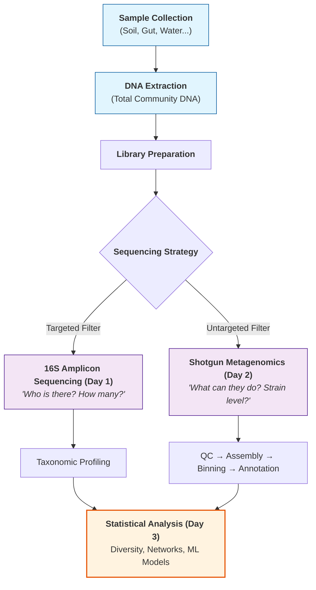

# National Workshop on Computational Metagenomics: Methods and Applications

## NPTEL+ | IIT Madras | 7th - 9th April, 2026

---

### Instructors

| Name | Affiliation |
|------|-------------|
| **Prof. Karthik Raman** | Professor, Dept. of Data Science & AI, Wadhwani School of Data Science & AI (WSAI), IIT Madras |
| **Dr. Aarti Ravindran** | Postdoctoral Researcher, Dept. of Data Science & AI, IIT Madras |
| **Dr. Pratyay Sengupta** | Postdoctoral Researcher, Dept. of Data Science & AI, IIT Madras |

### Venue & Timings
- **Venue:** NAC 2, IIT Madras, Chennai
- **Timings:** 09:00 AM to 06:00 PM IST (all 3 days)

---

## Table of Contents

| Document | Description |
|----------|-------------|
| **00_Workshop_Overview_and_Setup.md** | This file — overview, prerequisites, software setup |
| **Day1_Foundations_and_16S_Amplicon.md** | Metagenomics foundations, 16S rRNA amplicon theory & hands-on |
| **Day2_Shotgun_Metagenomics.md** | Shotgun sequencing, QC, assembly, binning, annotation, networks, ML |
| **Day3_Statistical_Analysis.md** | Data preprocessing, diversity analysis, differential abundance, hands-on |
| **Commands_CheatSheet.md** | Quick-reference commands for every tool used in the workshop |
| **Glossary_and_References.md** | Key terms, landmark papers, databases, and further reading |

---

## Workshop Learning Objectives

By the end of this 3-day workshop, participants will be able to:

1. **Explain** the fundamental principles of metagenomics and its distinction from traditional genomics
2. **Design** a metagenomic experiment — from sample collection strategy to sequencing platform selection
3. **Execute** a complete 16S rRNA amplicon analysis pipeline from raw reads to taxonomic profiles
4. **Perform** shotgun metagenomic analysis including quality control, assembly, binning, and annotation
5. **Apply** statistical methods for alpha/beta diversity and differential abundance testing
6. **Interpret** results in clinical, environmental, and industrial contexts
7. **Use** machine learning approaches for microbiome data analysis
8. **Construct** and analyze microbial co-occurrence networks

---

## Who Is This Workshop For?

- Researchers / Faculty / UG students (3rd year and above)
- Background or interest in biology
- Desire to work with metagenomic data
- **No prior bioinformatics experience required** — we start from scratch

---

## Pre-Workshop Preparation

### 1. Conceptual Background (Recommended Reading)

Before arriving, familiarize yourself with these concepts at a high level:

| Concept | What to Know | Why It Matters |
|---------|-------------|----------------|
| **DNA & Genes** | DNA is the hereditary molecule; genes encode proteins | Metagenomics analyzes DNA from entire communities |
| **Microbiome** | The collection of all microorganisms in an environment | This is what we study |
| **Sequencing** | The process of reading DNA nucleotide sequences | Raw data for all our analyses |
| **16S rRNA gene** | A conserved gene used as a "barcode" for bacteria | Enables taxonomic identification |
| **FASTA/FASTQ formats** | Standard file formats for sequence data | Every tool reads/writes these |

### 2. Software & Tools to Install

> [!NOTE]
> If you are using a workshop-provided computer, all tools will be pre-installed. This section is for participants using their own laptops.

#### Operating System Requirements
- **Recommended:** Ubuntu 20.04+ or any Linux distribution
- **macOS:** Works with most tools via Homebrew/Conda
- **Windows:** Use WSL2 (Windows Subsystem for Linux) — see instructions below

#### Setting Up WSL2 on Windows

```bash
# Open PowerShell as Administrator and run:
wsl --install

# Restart your computer, then open Ubuntu from Start menu
# Set up your username and password when prompted

# Update packages:
sudo apt update && sudo apt upgrade -y
```

#### Install Conda (Package Manager)

Conda is the backbone of bioinformatics tool management. It handles dependencies so you don't have to.

```bash
# Download Miniconda installer
wget https://repo.anaconda.com/miniconda/Miniconda3-latest-Linux-x86_64.sh

# Run installer
bash Miniconda3-latest-Linux-x86_64.sh

# Follow prompts (accept license, choose install location)
# Restart terminal or run:
source ~/.bashrc

# Verify installation
conda --version
```

#### Create the Workshop Conda Environment

```bash
# Add bioinformatics channels
conda config --add channels defaults
conda config --add channels bioconda
conda config --add channels conda-forge
conda config --set channel_priority strict

# Create a dedicated environment for the workshop
conda create -n metagenomics python=3.10 -y
conda activate metagenomics

# ──────────────────────────────────────────
# DAY 1 TOOLS (16S Amplicon Analysis)
# ──────────────────────────────────────────
conda install -c bioconda qiime2 -y
# Or install QIIME2 via their official method:
# See: https://docs.qiime2.org for latest install instructions

# ──────────────────────────────────────────
# DAY 2 TOOLS (Shotgun Metagenomics)
# ──────────────────────────────────────────
conda install -c bioconda fastqc trimmomatic kraken2 bracken megahit metabat2 maxbin2 checkm-genome gtdbtk prokka -y

# ──────────────────────────────────────────
# DAY 3 TOOLS (Statistical Analysis)
# ──────────────────────────────────────────
conda install -c conda-forge r-base r-vegan r-phyloseq bioconductor-deseq2 scikit-learn pandas matplotlib seaborn -y
```

#### Verify Installations

```bash
# Quick check that key tools are working
fastqc --version
trimmomatic -version
kraken2 --version
megahit --version
checkm -h
prokka --version
R --version
python --version
```

### 3. Download Workshop Datasets

```bash
# Create workshop directory structure
mkdir -p ~/metagenomics_workshop/{day1,day2,day3,results,scripts}
cd ~/metagenomics_workshop

# Datasets will be provided by instructors on Day 1
# Typical dataset sizes:
#   - 16S amplicon data:    ~200 MB
#   - Shotgun metagenomics: ~1-5 GB
#   - Demo statistical data: ~50 MB
```

### 4. Command Line Basics (Self-Assessment)

If these commands look unfamiliar, review a basic Linux tutorial before the workshop:

```bash
# Navigation
pwd                     # Print working directory
ls -la                  # List files with details
cd ~/metagenomics_workshop  # Change directory

# File operations
cp file1.txt file2.txt  # Copy
mv file1.txt newdir/    # Move
rm file.txt             # Delete (careful!)
mkdir new_folder        # Create directory

# Viewing files
head -n 20 file.fastq   # First 20 lines
tail -n 20 file.fastq   # Last 20 lines
less file.fastq         # Scroll through file (q to quit)
wc -l file.fastq        # Count lines

# Pipes and redirection
cat file.txt | grep "pattern"     # Search within output
command > output.txt              # Save output to file
command >> output.txt             # Append output to file
command 2> error.log              # Redirect errors

# Process management
command &                # Run in background
jobs                     # List background jobs
top                      # Monitor system resources
```

---

## 3-Day Workshop Schedule at a Glance

### Day 1: April 7th — Foundations & 16S Amplicon Analysis

```
 09:00 - 10:00  Registration
 10:00 - 10:15  Opening Remarks & Workshop Vision
 10:15 - 11:00  Foundations of Metagenomics
 11:00 - 11:15  ── Tea Break ──
 11:15 - 12:15  16S Amplicon: Theory & Discussion
 12:15 - 13:00  Installation & Getting Started (CLI + Tools)
 13:00 - 14:30  ── Lunch ──
 14:30 - 16:00  Data in Action (Part I): Guided Hands-on Practicals
 16:00 - 16:15  ── Tea Break ──
 16:15 - 17:00  Data in Action (Part II): Workflow Completion
 17:00 - 17:15  Troubleshooting & Wrap-up
 17:15 - 17:45  Beyond the Bench: Applications & Future Perspectives
```

### Day 2: April 8th — Shotgun Metagenomics Pipeline

```
 09:00 - 09:45  Introduction to Shotgun Sequencing Technologies
 09:45 - 11:00  Data Quality Checks & Preprocessing (FastQC, Trimmomatic, Kraken2, Bracken)
 11:00 - 11:15  ── Tea Break ──
 11:15 - 12:15  Contig Assembly, Binning & Bin Refinement
 12:15 - 13:45  ── Lunch ──
 13:45 - 14:15  Quality Assessment & Taxonomic Classification (CheckM, GTDBTk)
 14:15 - 15:00  Functional Annotation (Prokka, COGs)
 15:00 - 15:30  Assignment
 15:30 - 15:45  ── Tea Break ──
 15:45 - 16:15  Buffer Zone & Troubleshooting
 16:15 - 16:45  Network Analysis
 16:45 - 17:15  ML in Microbiome
```

### Day 3: April 9th — Statistical Analysis & Closing

```
 09:00 - 10:00  Data Pre-processing for Statistical Analysis
 10:00 - 10:15  ── Tea Break ──
 10:15 - 12:00  Diversity & Differential Abundance Testing
 12:00 - 13:30  ── Lunch ──
 13:30 - 14:30  Hands-on: Applying Statistical Methods to Demo Data
 14:30 - 15:00  Assignment
 15:00 - 15:45  Guest Lecture
 15:45 - 16:30  ── High Tea ──
 16:30 - 17:15  Guest Lecture
 17:15 - 17:30  Valedictory
```

---

## File Formats You Will Encounter

### FASTA Format
```
>sequence_id description
ATCGATCGATCGATCGATCG
ATCGATCGATCGATCGATCG
```
- Header line starts with `>`
- Followed by sequence on one or more lines
- **Used for:** reference genomes, assembled contigs, protein sequences

### FASTQ Format
```
@sequence_id
ATCGATCGATCGATCGATCG
+
IIIIIIIIIIIIIIIIIIIII
```
- 4 lines per read: header, sequence, separator, quality scores
- Quality scores are ASCII-encoded Phred scores
- **Used for:** raw sequencing reads (this is your primary input data)

### Understanding Quality Scores

| Phred Score | Error Probability | Accuracy |
|-------------|-------------------|----------|
| 10 | 1 in 10 | 90% |
| 20 | 1 in 100 | 99% |
| 30 | 1 in 1,000 | 99.9% |
| 40 | 1 in 10,000 | 99.99% |

> [!TIP]
> **Rule of thumb:** Q20 is the minimum acceptable; Q30+ is considered high quality.

### Other Formats

| Format | Extension | Description |
|--------|-----------|-------------|
| SAM/BAM | .sam/.bam | Sequence alignment data |
| BIOM | .biom | Biological observation matrix (OTU/ASV tables) |
| NEWICK | .nwk/.tre | Phylogenetic tree format |
| GFF/GFF3 | .gff | Gene annotation format |
| TSV/CSV | .tsv/.csv | Tabular data (taxonomy, abundance) |

---

## The Big Picture: What Is a Metagenomics Workflow?



> [!TIP]
> **Choosing the right approach:** If you're on a budget and only need to know "Who is there?", 16S is excellent. If you need functionality (genes/pathways) or have the budget for deep discovery, go with Shotgun!

---

## Tips for Workshop Success

> [!IMPORTANT]
> **1. Type commands yourself:** Don't just copy-paste. Muscle memory is a key part of learning bioinformatics!
> **2. Read error messages:** They aren't just red text; they usually tell you exactly what went wrong.
> **3. Ask questions early:** If you're stuck for more than 2 minutes, raise your hand.
> **4. Take notes on the "why":** Tools change (FASTX to DADA2), but principles (denoising, compositionality) last forever.

---

*Next: Open [Day1_Foundations_and_16S_Amplicon.md](file:///d:/Computational%20Metagenomics/Day1_Foundations_and_16S_Amplicon.md) to begin →*
