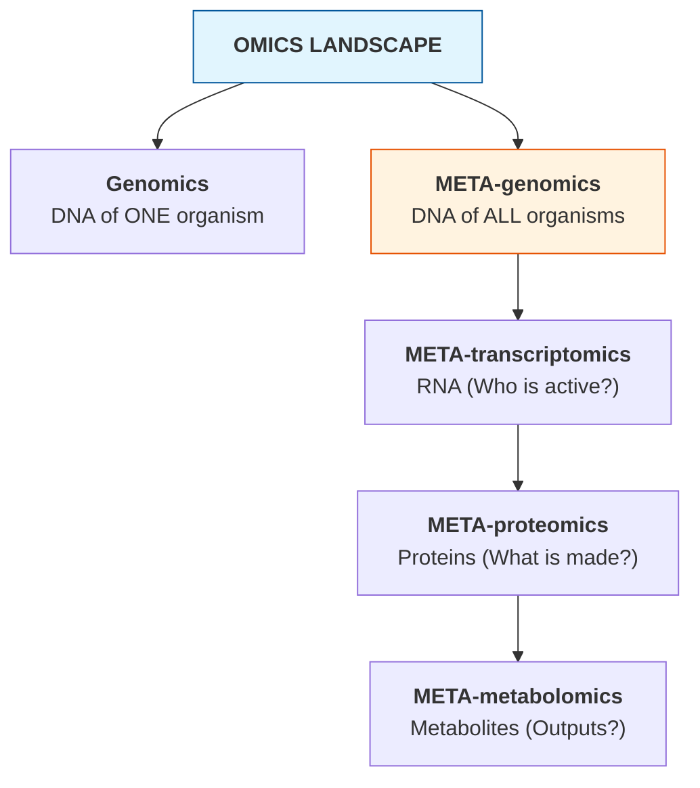
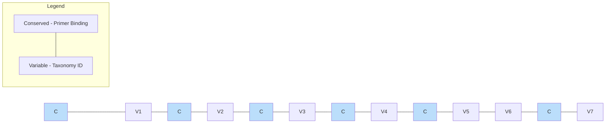
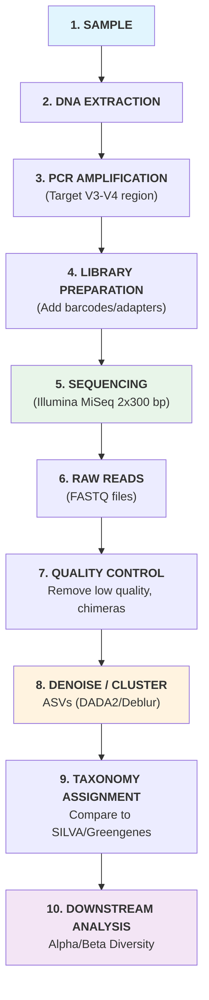
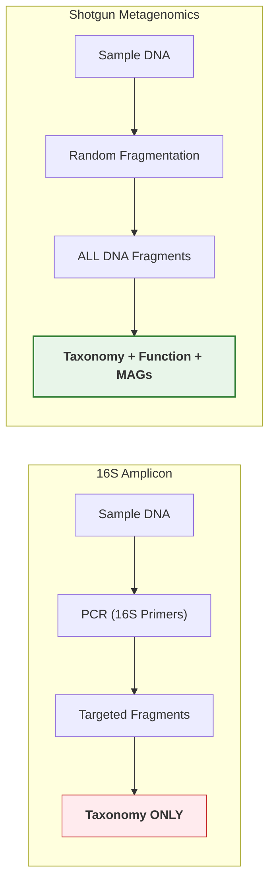
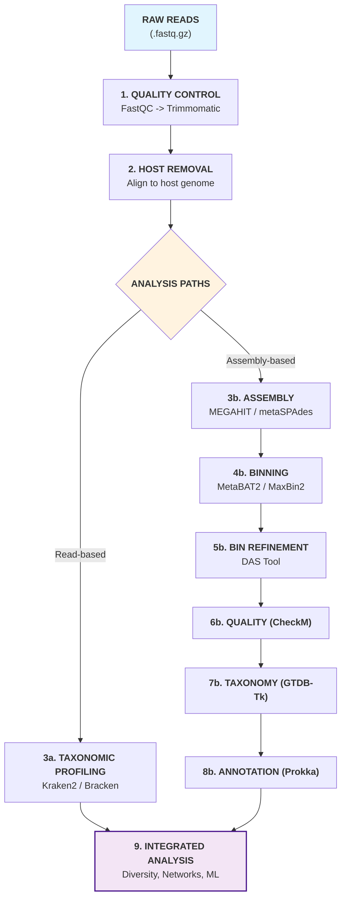
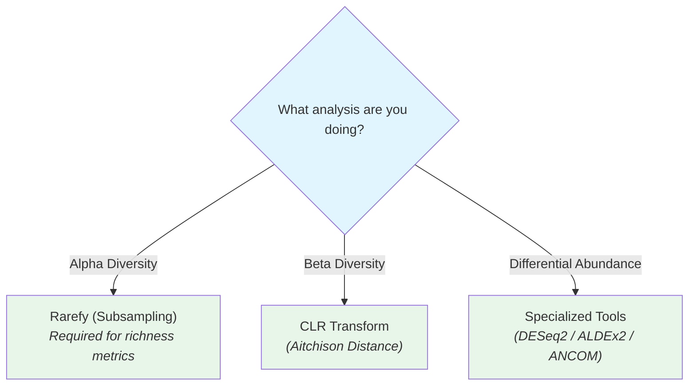
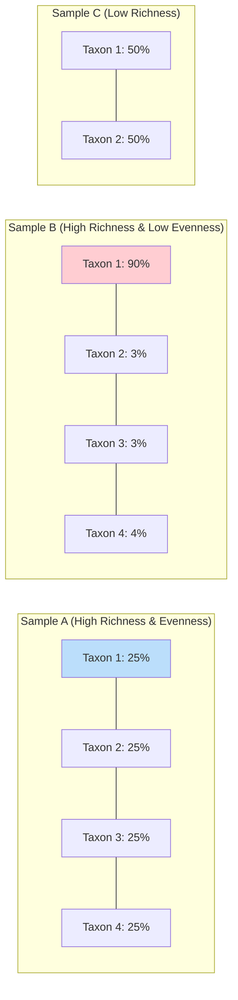

# Computational Metagenomics and Modern Biomedical Omics

## A Practical Handbook from 16S Analysis to Spatial and Multiomic Interpretation

**Author:** Dr Siddalingaiah H S  
Professor, Community Medicine, Shridevi Institute of Medical Sciences and Research Hospital, Tumkur, India  
ORCID: 0000-0002-4771-8285  
Email: hssling@yahoo.com

**Edition:** First professional edition  
**Prepared:** 1 April 2026

This book synthesizes the workshop material, tutorial reviews, and integrative computational frameworks developed in the present project into a single professional-grade handbook.

# Copyright

Copyright 2026 Dr Siddalingaiah H S.

All rights reserved. No part of this manuscript may be reproduced, stored in a retrieval system, or transmitted in any form or by any means without prior written permission of the author, except for brief quotations used in scholarly review or citation.

This book is an educational and methodological synthesis. It does not constitute patient-specific clinical advice, laboratory certification guidance, or regulatory approval documentation. Example workflows and command lines are intended to support training and publication planning and should be validated against the reader's own computational environment, datasets, and institutional requirements before operational use.

# Preface

Computational metagenomics has matured from a niche sequencing specialty into a broader analytical gateway to modern biomedical omics. Investigators now move between amplicon sequencing, shotgun metagenomics, host-associated microbiome analysis, genomics, transcriptomics, multiomics integration, single-cell methods, spatial biology, and increasingly dynamic tissue-resolved assays. Yet the training pathway for these domains often remains fragmented. Readers may learn a sequencing workflow in one place, a statistical method in another, and an interpretation framework somewhere else, without seeing how the pieces fit into a defensible analytical whole.

This handbook was developed to close that gap. It unifies the workshop material and review manuscripts created in this project into a single book-length reference designed for researchers, clinicians, trainees, and instructors who need practical computational guidance rather than tool catalogs. The central argument is simple: good omics analysis begins long before software execution and remains inseparable from study design, metadata discipline, uncertainty handling, and publication-quality reporting.

The book therefore follows a deliberately layered structure. It begins with core metagenomics, then moves through statistical inference and human host-associated analysis before expanding into genomics, transcriptomics, multiomics, single-cell and spatial approaches, spatiotemporal analysis, and emerging omics technologies. The later chapters are not included to widen scope for its own sake, but to show how the same methodological questions recur across different data types: What is actually observed? What is inferred? Which preprocessing decisions control the result? What level of claim is justified?

Readers do not need to master every chapter before using the book. A microbiome researcher may focus on the metagenomics and statistics chapters first, while a translational scientist may move directly to the human, multiomics, or spatial chapters. What matters is that the book provides one coherent framework for deciding when added analytical complexity is necessary, when it is premature, and how to report both choices professionally.

# How to Use This Book

This handbook is organized as a professional working reference rather than a narrative textbook alone.

1. Read Chapters 1 to 4 if you need a strong foundation in metagenomics, shotgun sequencing, and microbiome statistics.
2. Use Chapter 5 if your primary interest is host-associated or clinically framed metagenomics.
3. Read Chapters 6 to 11 when your work extends into broader biomedical omics, cross-modal integration, cellular resolution, or dynamic tissue analysis.
4. Use the appendices for environment setup, command-line practice, terminology, landmark references, and follow-up learning.

The book is intentionally pragmatic. It emphasizes decision logic, failure modes, reproducibility, and publication discipline. It is best used alongside real datasets, notebooks, and method papers rather than as a substitute for them.

# Chapter 1. Orientation and Study Design

This opening chapter frames computational metagenomics as a practical decision discipline rather than a loose collection of tools. It establishes the logic of good study design, clarifies who this handbook is for, and introduces the sample-to-inference workflow that recurs throughout the rest of the book.

## Learning Objectives

By the end of this handbook, readers should be able to:

1. **Explain** the fundamental principles of metagenomics and its distinction from traditional genomics
2. **Design** a metagenomic experiment - from sample collection strategy to sequencing platform selection
3. **Execute** a complete 16S rRNA amplicon analysis pipeline from raw reads to taxonomic profiles
4. **Perform** shotgun metagenomic analysis including quality control, assembly, binning, and annotation
5. **Apply** statistical methods for alpha/beta diversity and differential abundance testing
6. **Interpret** results in clinical, environmental, and industrial contexts
7. **Use** machine learning approaches for microbiome data analysis
8. **Construct** and analyze microbial co-occurrence networks

---

## Intended Audience

- Researchers / Faculty / UG students (3rd year and above)
- Background or interest in biology
- Desire to work with metagenomic data
- **No prior bioinformatics experience required** - we start from scratch

---

## The Big Picture: What Is a Metagenomics Workflow?

A metagenomics workflow can be read as a sequence of linked decisions: sample collection leads to DNA extraction and library preparation; library preparation leads to selection of either targeted amplicon sequencing or untargeted shotgun sequencing; both pathways eventually feed into statistical analysis, interpretation, and reporting. Amplicon analysis is best suited to broad taxonomic profiling, while shotgun workflows open the door to functional inference, strain resolution, and genome-resolved reconstruction.

As a practical rule, targeted amplicon sequencing is often sufficient when the main question is taxonomic composition, whereas shotgun metagenomics is more appropriate when the study requires functional characterization, strain-level distinction, or genome recovery.
---

# Chapter 2. Foundations of Metagenomics

This chapter introduces the conceptual basis of metagenomics, differentiates amplicon and shotgun approaches, and outlines the experimental logic required before any sequence file is processed.

---

---

## 1.1 What Is Metagenomics?

### The Core Idea

**Traditional microbiology** works like this: isolate one organism -> grow it in a lab -> study it.

**Problem:** Over 99% of microorganisms cannot be cultured in a laboratory.

**Metagenomics** solves this by skipping the culture step entirely:

```
Traditional:  Environment -> Isolate -> Culture -> Sequence -> Study ONE organism
Metagenomics: Environment -> Extract ALL DNA -> Sequence -> Study ENTIRE community
```

### Formal Definition

> **Metagenomics** is the culture-independent study of the collective genomes of microorganisms from an environmental sample, using high-throughput sequencing and computational analysis.

The term was coined by **Jo Handelsman** in 1998, combining "meta" (beyond) + "genomics" (study of genomes).

### Why Does It Matter?

| Domain | Application | Impact |
|--------|-------------|--------|
| **Human Health** | Gut microbiome linked to obesity, IBD, depression, cancer | Personalized medicine, probiotic design |
| **Agriculture** | Soil microbiome affects crop yield and disease resistance | Sustainable farming, biocontrol agents |
| **Environment** | Ocean microbes produce ~50% of Earth's oxygen | Climate modeling, bioremediation |
| **Industry** | Novel enzymes from extreme environments | Biofuels, detergents, pharmaceuticals |
| **Forensics** | Microbial signatures unique to locations/individuals | Crime scene analysis |

### Real-World Example: The Human Gut

Your gut contains approximately:
- **38 trillion** bacterial cells (roughly equal to your human cells)
- **~1,000 different species**
- **~3 million unique genes** (150x more than the human genome)

This "organ" weighs about 2 kg and influences digestion, immunity, mood, and disease susceptibility.

---

## 1.2 Metagenomic vs. Related Fields



| Approach | What It Measures | Question Answered |
|----------|-----------------|-------------------|
| **Metagenomics** | Total DNA | Who is there? What could they do? |
| **Metatranscriptomics** | mRNA | Who is active right now? |
| **Metaproteomics** | Proteins | What proteins are being made? |
| **Metabarcoding** | Single marker gene (e.g., 16S) | Who is there? (taxonomy only) |

---

## 1.3 Two Approaches to Metagenomics

### Approach 1: Amplicon Sequencing (16S/ITS)

- Targets a **single marker gene** (e.g., 16S rRNA for bacteria)
- Cheaper, faster, well-established
- Answers: **"Who is there and in what proportions?"**
- Cannot tell you about functional potential

### Approach 2: Shotgun Metagenomics

- Sequences **all DNA** in the sample (randomly fragmented)
- More expensive, computationally intensive
- Answers: **"Who is there AND what can they do?"**
- Provides functional and taxonomic information

### Head-to-Head Comparison

| Feature | 16S Amplicon | Shotgun |
|---------|-------------|---------|
| Cost per sample | $50-150 | $200-1000+ |
| Sequencing depth | Lower | Higher needed |
| Taxonomic resolution | Genus/Species | Species/Strain |
| Functional information | No | Yes |
| Host DNA contamination | Minimal (specific primers) | Can be major issue |
| PCR bias | Yes (primer mismatch) | No PCR bias |
| Database dependency | 16S databases | Large reference DBs |
| Computational need | Moderate | High |
| Best for | Community surveys, large sample sizes | Functional studies, discovery |

---

## 1.4 The Metagenomic Experimental Design

### Key Decisions Before You Start

#### 1. Research Question

Your question determines everything:
- "What bacteria are in my soil?" -> 16S amplicon
- "What metabolic pathways are enriched in diseased gut?" -> Shotgun
- "How does the microbiome change over time?" -> Longitudinal design + either

#### 2. Sample Collection

| Factor | Consideration |
|--------|---------------|
| **Sample type** | Stool, soil, water, swab, tissue |
| **Preservation** | Snap-freeze (-80°C), RNAlater, ethanol |
| **Replicates** | Minimum 3 biological replicates per group (ideally 5+) |
| **Controls** | Negative (extraction blank), positive (mock community) |
| **Metadata** | Record EVERYTHING: time, location, pH, temperature, diet, medications |

> **Critical Lesson:** Poor experimental design cannot be rescued by sophisticated analysis. The best bioinformatics in the world cannot fix a badly designed experiment.

#### 3. DNA Extraction

- **Method matters enormously** - different kits give different results
- Use the **same kit and protocol** for all samples in a study
- Common kits: QIAGEN DNeasy PowerSoil, MO BIO PowerFecal
- Include **extraction blanks** to detect contamination

#### 4. Sequencing Platform Selection

| Platform | Read Length | Throughput | Error Rate | Best For |
|----------|-----------|------------|------------|----------|
| **Illumina MiSeq** | 2×300 bp | ~25 million reads | ~0.1% | 16S amplicon |
| **Illumina NovaSeq** | 2×150 bp | ~20 billion reads | ~0.1% | Shotgun metagenomics |
| **Oxford Nanopore** | >10,000 bp | Variable | ~5-15% | Long-range contiguity, real-time |
| **PacBio HiFi** | ~15,000 bp | ~4 million reads | <1% | High-quality long reads |

---

---

## 2.1 The 16S rRNA Gene: Nature's Bacterial Barcode

### What Is the 16S rRNA Gene?

The **16S ribosomal RNA** gene (~1,542 bp) is present in all bacteria and archaea. It encodes part of the small ribosomal subunit (30S) used in protein synthesis.

### Why 16S?

It has a unique property - **alternating conserved and variable regions**:



> [!NOTE]
> **Conserved regions (C):** Same across all bacteria. We design "universal" primers to bind here.
> **Variable regions (V):** Different between species. We use the sequence here to identify who is present.

- **Conserved regions** -> Universal primers bind here (target ALL bacteria)
- **Variable regions (V1-V9)** -> Sequence differs between species (identification)

### Which Region to Target?

| Region | Primer Pair | Length | Best For |
|--------|-------------|--------|----------|
| **V1-V3** | 27F/534R | ~500 bp | Skin, oral microbiome |
| **V3-V4** | 341F/805R | ~460 bp | Most popular, gut studies |
| **V4** | 515F/806R | ~253 bp | Earth Microbiome Project standard |
| **V4-V5** | 515F/926R | ~400 bp | Environmental samples |

> **Most common choice:** V3-V4 region - good balance of taxonomic resolution and read length compatibility with Illumina MiSeq (2×300 bp).

### For Fungi: The ITS Region

- **ITS** (Internal Transcribed Spacer) is the equivalent "barcode" for fungi
- ITS1 and ITS2 are variable; 5.8S rRNA in between is conserved
- Primers: ITS1F/ITS2R or ITS3/ITS4

---

## 2.2 The 16S Amplicon Workflow



---

## 2.3 OTUs vs. ASVs: A Critical Distinction

### OTUs (Operational Taxonomic Units) - The Old Way

- Cluster sequences at **97% similarity** threshold
- Pick a "representative sequence" for each cluster
- Problem: arbitrary threshold loses real biological variation

### ASVs (Amplicon Sequence Variants) - The Modern Way

- Use statistical denoising to identify **exact biological sequences**
- No arbitrary clustering threshold
- Can detect single-nucleotide differences between organisms
- **Reproducible** across studies (same sequence = same ASV anywhere)

| Feature | OTUs | ASVs |
|---------|------|------|
| Resolution | Genus/Species | Species/Strain |
| Reproducibility | Low (depends on dataset) | High (exact sequences) |
| Sensitivity | Misses fine variation | Captures real variants |
| Recommended | Legacy studies | **All new studies** |
| Tools | UPARSE, CD-HIT | **DADA2**, Deblur |

> **Take-home message:** Always use ASVs for new studies. OTUs are legacy.

---

## 2.4 Taxonomy Assignment

### How Does It Work?

Your ASV sequences are compared against curated reference databases:

```
Your ASV:       ATCGATCG...TTAACGGT (query)
                     ↓ compare
Database entry: ATCGATCG...TTAACGGT -> Bacteroides fragilis (99.5% match)
```

### Major Reference Databases

| Database | Description | Best For |
|----------|-------------|----------|
| **SILVA** | Comprehensive, regularly updated, all rRNA | Most studies (recommended) |
| **Greengenes2** | Updated version with genome-based taxonomy | Phylogenetic analyses |
| **RDP** | Ribosomal Database Project | Quick classification |
| **UNITE** | Fungal ITS database | Mycobiome studies |

### Classification Methods

| Method | Approach | Speed | Accuracy |
|--------|----------|-------|----------|
| **Naive Bayes** (QIIME2 default) | Machine learning classifier | Fast | High |
| **VSEARCH** | Global alignment | Moderate | High |
| **BLAST** | Local alignment | Slow | Variable |

---

## 2.5 Common Challenges & Pitfalls in 16S Analysis

### 1. Primer Bias
- Not all bacteria amplify equally with the same primers
- Some taxa are systematically under/over-represented
- **Mitigation:** Report primer choice; consider multiple primer sets

### 2. Copy Number Variation
- Different bacteria have **1 to 15+ copies** of the 16S gene
- A bacterium with 10 copies appears 10x more abundant
- **Mitigation:** Use copy-number correction tools (PICRUSt2, rrnDB)

### 3. Chimeric Sequences
- During PCR, incomplete extensions can join two different templates
- Creates artificial "hybrid" sequences
- **Mitigation:** DADA2 handles this; also use UCHIME for additional filtering

### 4. Contamination
- Reagents contain trace microbial DNA ("kit-ome")
- Low-biomass samples are especially vulnerable
- **Mitigation:** Always include negative controls; use decontam package in R

### 5. Compositional Data
- Relative abundances sum to 100% (or 1.0)
- If one taxon increases, others must decrease (even if their absolute abundance didn't change)
- **Mitigation:** Use compositional data analysis methods (CLR transform, ALDEx2)

---

---

## 3.1 Command Line Interface (CLI) Essentials

### Why the Command Line?

Most bioinformatics tools are command-line only. GUIs exist for some, but they:
- Limit reproducibility (can't easily record clicks)
- Don't scale to large datasets
- Often have fewer features than the CLI version

### Essential CLI Skills for This Workshop

#### Navigating the File System

```bash
# Where am I?
pwd
# Output: /home/student/metagenomics_workshop

# What's here?
ls -lh
# Output shows files with human-readable sizes

# Go to workshop directory
cd ~/metagenomics_workshop/day1

# Go back up one level
cd ..

# Go to home directory
cd ~
```

#### Working with Sequence Files

```bash
# How many reads in a FASTQ file?
# (FASTQ has 4 lines per read)
echo $(( $(wc -l < sample_R1.fastq) / 4 ))

# Look at first read
head -4 sample_R1.fastq

# Count sequences in a FASTA file
grep -c "^>" sequences.fasta

# Search for a specific sequence ID
grep "SEQUENCE_ID_123" sample_R1.fastq
```

#### Compressed Files

```bash
# Most sequencing data comes compressed (.gz)
# View without decompressing:
zcat sample_R1.fastq.gz | head -4

# Decompress:
gunzip sample_R1.fastq.gz

# Compress:
gzip sample_R1.fastq

# Count reads in compressed FASTQ:
echo $(( $(zcat sample_R1.fastq.gz | wc -l) / 4 ))
```

#### Running Bioinformatics Tools

```bash
# General pattern:
tool_name [options] -i input_file -o output_file

# Getting help:
tool_name --help
tool_name -h
man tool_name          # Manual page (if available)
```

---

## 3.2 Setting Up the 16S Analysis Environment

### QIIME2: The Swiss Army Knife of Amplicon Analysis

**QIIME2** (Quantitative Insights Into Microbial Ecology) is the most widely used amplicon analysis platform. It provides:
- Data import/export
- Quality control
- Denoising (DADA2/Deblur)
- Taxonomy classification
- Diversity analysis
- Beautiful visualizations

```bash
# Activate QIIME2 environment
conda activate qiime2

# Verify QIIME2 is working
qiime --version
# Expected: qiime2 version 2024.x.x (or later)

# See available plugins
qiime info
```

### QIIME2 Key Concepts

#### Artifacts (.qza files)
- QIIME2 wraps data in "artifacts" - zip files containing data + metadata
- Extension: `.qza` (QIIME2 Artifact)
- Contains provenance tracking (records every step applied to the data)

#### Visualizations (.qzv files)
- Interactive visualizations
- Extension: `.qzv` (QIIME2 Visualization)
- View at https://view.qiime2.org (drag and drop)

#### Metadata (.tsv files)
- Tab-separated file describing your samples
- **Must** include `sample-id` as the first column

Example metadata file (`sample-metadata.tsv`):
```
sample-id	body-site	subject	reported-antibiotic-usage	days-since-experiment-start
#q2:types	categorical	categorical	categorical	numeric
sample-1	gut	subject-1	Yes	0
sample-2	gut	subject-1	Yes	7
sample-3	skin	subject-2	No	0
sample-4	skin	subject-2	No	7
sample-5	tongue	subject-1	Yes	0
```

---

## 3.3 Data Import into QIIME2

### Understanding Your Raw Data

Before importing, know your data format:

| Format | Description |
|--------|-------------|
| **Paired-end** | Forward (R1) and Reverse (R2) reads in separate files |
| **Single-end** | Only one read direction |
| **Multiplexed** | Multiple samples in one file, separated by barcodes |
| **Demultiplexed** | Already separated into per-sample files |

### Import Demultiplexed Paired-End Reads

```bash
# Your data directory should look like:
# raw_reads/
# ├-- sample1_R1.fastq.gz
# ├-- sample1_R2.fastq.gz
# ├-- sample2_R1.fastq.gz
# ├-- sample2_R2.fastq.gz
# └-- ...

# Import into QIIME2
qiime tools import \
  --type 'SampleData[PairedEndSequencesWithQuality]' \
  --input-path raw_reads/ \
  --input-format CasavaOneEightSingleLanePerSampleDirFmt \
  --output-path demux-paired-end.qza
```

### Visualize Imported Data

```bash
# Create quality summary visualization
qiime demux summarize \
  --i-data demux-paired-end.qza \
  --o-visualization demux-summary.qzv

# View the visualization
# Option 1: Drag demux-summary.qzv to https://view.qiime2.org
# Option 2: qiime tools view demux-summary.qzv
```

**What to look for in the quality plot:**
- Where does quality drop below Q20?
- Are forward reads generally better than reverse? (usually yes)
- These observations will determine your trimming parameters

---

---

## 4.1 Quality Control with DADA2

### What DADA2 Does (All in One Step)

1. **Filters** low-quality reads
2. **Trims** to specified lengths
3. **Learns error model** from the data itself
4. **Denoises** - infers true biological sequences (ASVs)
5. **Merges** paired-end reads
6. **Removes chimeras**

### Running DADA2 in QIIME2

```bash
# Key parameters you need to decide:
#   --p-trunc-len-f : Where to truncate forward reads
#   --p-trunc-len-r : Where to truncate reverse reads
#   --p-trim-left-f : Bases to trim from start of forward reads (primer removal)
#   --p-trim-left-r : Bases to trim from start of reverse reads (primer removal)

# Run DADA2 denoising
qiime dada2 denoise-paired \
  --i-demultiplexed-seqs demux-paired-end.qza \
  --p-trunc-len-f 280 \
  --p-trunc-len-r 250 \
  --p-trim-left-f 17 \
  --p-trim-left-r 21 \
  --p-n-threads 4 \
  --o-table feature-table.qza \
  --o-representative-sequences rep-seqs.qza \
  --o-denoising-stats denoising-stats.qza \
  --verbose
```

**How to choose truncation lengths:**
1. Look at the quality plot from `demux-summary.qzv`
2. Find where median quality drops below Q20-Q25
3. Truncate there - but ensure enough overlap remains for merging

```
Forward read (300 bp):  |============================|---- (truncate at 280)
Reverse read (300 bp):  |========================|-------- (truncate at 250)

V3-V4 amplicon (~460 bp):
|<----------- 460 bp -------------->|
|<---- 280 bp ---->|
                   |<---- 250 bp ----|  (note: reverse complement)
                   |<- overlap ~70 bp->|

Overlap = (280 + 250) - 460 = 70 bp  ← Must be ≥ 20 bp for reliable merging
```

### Examine Denoising Statistics

```bash
# Visualize denoising stats
qiime metadata tabulate \
  --m-input-file denoising-stats.qza \
  --o-visualization denoising-stats.qzv
```

**Key metrics to check:**

| Metric | What It Means | Acceptable Range |
|--------|---------------|-----------------|
| **input** | Total reads entering DADA2 | - |
| **filtered** | Reads passing quality filter | >70% of input |
| **denoised** | Reads successfully denoised | >90% of filtered |
| **merged** | Forward + reverse successfully joined | >70% of denoised |
| **non-chimeric** | Final reads after chimera removal | >70% of merged |

> **Warning sign:** If merged reads are very low, your truncation lengths don't leave enough overlap. Increase truncation lengths (accept slightly lower quality bases).

---

## 4.2 Feature Table Summary

```bash
# Summarize the feature (ASV) table
qiime feature-table summarize \
  --i-table feature-table.qza \
  --o-visualization feature-table-summary.qzv \
  --m-sample-metadata-file sample-metadata.tsv

# Summarize representative sequences
qiime feature-table tabulate-seqs \
  --i-data rep-seqs.qza \
  --o-visualization rep-seqs-summary.qzv
```

**What to look for:**
- How many ASVs were detected?
- What is the read count distribution across samples?
- Are any samples drastically underrepresented? (may need to exclude)
- Minimum sample depth -> determines rarefaction depth later

---

## 4.3 Taxonomy Assignment

```bash
# Option 1: Use a pre-trained classifier (recommended for speed)
# Download a pre-trained SILVA classifier for your region (V3-V4)
# These are available from the QIIME2 data resources page

# Classify your ASVs
qiime feature-classifier classify-sklearn \
  --i-classifier silva-138-99-nb-classifier.qza \
  --i-reads rep-seqs.qza \
  --o-classification taxonomy.qza \
  --p-n-jobs 4

# Visualize taxonomy
qiime metadata tabulate \
  --m-input-file taxonomy.qza \
  --o-visualization taxonomy.qzv
```

### Create Taxonomy Bar Plots

```bash
qiime taxa barplot \
  --i-table feature-table.qza \
  --i-taxonomy taxonomy.qza \
  --m-metadata-file sample-metadata.tsv \
  --o-visualization taxa-bar-plots.qzv
```

> This creates an interactive stacked bar chart. You can switch between taxonomic levels (Phylum, Class, Order, Family, Genus) and sort/color by metadata.

---

## 4.4 Filtering

### Remove Unwanted Taxa

```bash
# Remove mitochondria and chloroplast sequences
# (These are host-derived, not part of the microbiome)
qiime taxa filter-table \
  --i-table feature-table.qza \
  --i-taxonomy taxonomy.qza \
  --p-exclude "mitochondria,chloroplast" \
  --o-filtered-table filtered-table.qza

# Remove unassigned sequences
qiime taxa filter-table \
  --i-table filtered-table.qza \
  --i-taxonomy taxonomy.qza \
  --p-include "d__Bacteria" \
  --o-filtered-table bacteria-only-table.qza
```

### Remove Low-Frequency Features

```bash
# Remove ASVs present in fewer than 2 samples
# (likely sequencing artifacts)
qiime feature-table filter-features \
  --i-table bacteria-only-table.qza \
  --p-min-samples 2 \
  --o-filtered-table final-table.qza
```

---

## 4.5 Phylogenetic Tree Construction

Many diversity metrics require a phylogenetic tree showing evolutionary relationships between ASVs.

```bash
# Align sequences
qiime alignment mafft \
  --i-sequences rep-seqs.qza \
  --o-alignment aligned-rep-seqs.qza

# Mask highly variable positions (improves tree quality)
qiime alignment mask \
  --i-alignment aligned-rep-seqs.qza \
  --o-masked-alignment masked-aligned-rep-seqs.qza

# Build tree with FastTree
qiime phylogeny fasttree \
  --i-alignment masked-aligned-rep-seqs.qza \
  --o-tree unrooted-tree.qza

# Root the tree (required for UniFrac)
qiime phylogeny midpoint-root \
  --i-tree unrooted-tree.qza \
  --o-rooted-tree rooted-tree.qza
```

---

## 4.6 Diversity Analysis

### Alpha Diversity (Within-Sample Diversity)

"How diverse is each sample?"

| Metric | What It Measures | Considers Phylogeny? |
|--------|-----------------|---------------------|
| **Observed Features** | Count of unique ASVs | No |
| **Shannon Index** | Richness + Evenness | No |
| **Simpson Index** | Probability two random sequences are different | No |
| **Faith's PD** | Total branch length in phylogenetic tree | Yes |
| **Pielou's Evenness** | How evenly organisms are distributed | No |

### Beta Diversity (Between-Sample Diversity)

"How different are samples from each other?"

| Metric | What It Measures | Considers Phylogeny? | Considers Abundance? |
|--------|-----------------|---------------------|---------------------|
| **Jaccard** | Shared/unshared ASVs | No | No |
| **Bray-Curtis** | Abundance-weighted similarity | No | Yes |
| **Unweighted UniFrac** | Shared phylogenetic branches | Yes | No |
| **Weighted UniFrac** | Abundance-weighted phylogenetic similarity | Yes | Yes |

### Running Core Diversity Analysis

```bash
# The core-metrics-phylogenetic command runs EVERYTHING at once:
# - Rarefies to even depth
# - Computes alpha diversity (4 metrics)
# - Computes beta diversity (4 metrics)
# - Generates PCoA plots

qiime diversity core-metrics-phylogenetic \
  --i-phylogeny rooted-tree.qza \
  --i-table final-table.qza \
  --p-sampling-depth 10000 \
  --m-metadata-file sample-metadata.tsv \
  --output-dir core-metrics-results
```

**Choosing sampling depth (`--p-sampling-depth`):**
- Look at `feature-table-summary.qzv` for minimum read count
- Choose a depth that retains most samples while being as high as possible
- Samples below this threshold are **excluded**
- Trade-off: lower depth = keep more samples but lose rare taxa

### Statistical Tests on Diversity

```bash
# Alpha diversity: Is diversity different between groups?
qiime diversity alpha-group-significance \
  --i-alpha-diversity core-metrics-results/shannon_vector.qza \
  --m-metadata-file sample-metadata.tsv \
  --o-visualization shannon-group-significance.qzv

qiime diversity alpha-group-significance \
  --i-alpha-diversity core-metrics-results/faith_pd_vector.qza \
  --m-metadata-file sample-metadata.tsv \
  --o-visualization faith-pd-group-significance.qzv

# Beta diversity: Do groups cluster differently? (PERMANOVA test)
qiime diversity beta-group-significance \
  --i-distance-matrix core-metrics-results/bray_curtis_distance_matrix.qza \
  --m-metadata-file sample-metadata.tsv \
  --m-metadata-column body-site \
  --p-method permanova \
  --o-visualization bray-curtis-body-site-significance.qzv

qiime diversity beta-group-significance \
  --i-distance-matrix core-metrics-results/weighted_unifrac_distance_matrix.qza \
  --m-metadata-file sample-metadata.tsv \
  --m-metadata-column body-site \
  --p-method permanova \
  --o-visualization weighted-unifrac-body-site-significance.qzv
```

---

## 4.7 Exporting Results for External Analysis

```bash
# Export feature table as BIOM
qiime tools export \
  --input-path final-table.qza \
  --output-path exported/

# Convert BIOM to TSV (human-readable)
biom convert \
  -i exported/feature-table.biom \
  -o exported/feature-table.tsv \
  --to-tsv

# Export taxonomy
qiime tools export \
  --input-path taxonomy.qza \
  --output-path exported/

# Export tree
qiime tools export \
  --input-path rooted-tree.qza \
  --output-path exported/
```

---

---

## 5.1 Clinical Applications

### Fecal Microbiota Transplantation (FMT)
- Transfer of stool from healthy donor to patient
- **95% cure rate** for recurrent *Clostridioides difficile* infection
- Metagenomics monitors donor screening and engraftment success

### Cancer Immunotherapy Response
- Gut microbiome composition predicts response to checkpoint inhibitors
- *Faecalibacterium prausnitzii* and *Akkermansia muciniphila* associated with better outcomes
- Clinical trials combining immunotherapy with microbiome modulation underway

### Diagnostic Biomarkers
- Colorectal cancer: elevated *Fusobacterium nucleatum*
- IBD: reduced diversity + specific taxa shifts
- Liver cirrhosis: oral bacteria invading the gut

## 5.2 Environmental Applications

- **Bioremediation:** Identifying microbes that degrade oil spills, plastics, pesticides
- **Agriculture:** Optimizing soil microbiome for crop productivity
- **Water quality:** Monitoring pathogens in drinking water using eDNA

## 5.3 Industrial Applications

- **Enzyme discovery:** Metagenomes from hot springs -> thermostable enzymes for industry
- **Food fermentation:** Understanding microbial communities in cheese, yogurt, kimchi, kombucha
- **Biofuel production:** Cellulose-degrading enzymes from termite gut microbiome

## 5.4 Emerging Trends

1. **Long-read metagenomics** - Complete genomes from metagenomes (Oxford Nanopore, PacBio)
2. **Spatial metagenomics** - Where exactly are microbes located in tissue?
3. **Single-cell metagenomics** - Genome of individual uncultured cells
4. **AI/ML in metagenomics** - Deep learning for taxonomy, function prediction, drug discovery
5. **Multi-omics integration** - Combining metagenomics + metabolomics + transcriptomics

---

# Chapter 3. Shotgun Metagenomics and Functional Interpretation

Shotgun metagenomics expands the analytic field from broad community profiling to strain-level, gene-level, and genome-resolved inference. This chapter follows the read-processing, assembly, taxonomic, functional, and machine-learning logic needed to turn raw reads into biological insight.

---

---

## 1.1 What Is Shotgun Metagenomics?

In shotgun metagenomics, **all DNA** in a sample is randomly fragmented ("shotgunned") and sequenced - no PCR targeting of a specific gene.



### Why Shotgun?

1. **No PCR bias** - every piece of DNA has a chance to be sequenced
2. **Functional information** - discover what organisms CAN do, not just who they are
3. **Strain-level resolution** - distinguish closely related organisms
4. **Metagenome-Assembled Genomes (MAGs)** - reconstruct near-complete genomes of uncultured organisms
5. **Detect viruses, plasmids, ARGs** - anything with DNA

---

## 1.2 Sequencing Technologies Deep Dive

### Short-Read Sequencing (Illumina)

**How it works: Sequencing by Synthesis (SBS)**

```
1. DNA fragments attach to flow cell surface
2. Bridge amplification creates clusters (~1000 copies each)
3. Fluorescent nucleotides added one at a time
4. Camera captures color after each incorporation
5. Color -> base call (A=green, C=blue, G=black, T=red)
6. Repeat for 150-300 cycles -> 150-300 bp reads
```

| Platform | Read Length | Output | Run Time | Cost/Gb |
|----------|-----------|--------|----------|---------|
| MiSeq | 2×300 bp | ~15 Gb | 56 hrs | ~$100 |
| NextSeq 2000 | 2×150 bp | ~360 Gb | 48 hrs | ~$20 |
| NovaSeq X | 2×150 bp | ~16 Tb | 48 hrs | ~$2 |

**Strengths:** High accuracy (~99.9%), high throughput, low cost per base
**Weaknesses:** Short reads -> repetitive regions unresolvable, GC bias

### Long-Read Sequencing (Oxford Nanopore)

**How it works: Nanopore Sequencing**

```
1. DNA strand threaded through a protein nanopore
2. Each base disrupts ionic current differently
3. Current changes -> base calls in real-time
4. No length limit - reads can be 100+ kb
```

| Platform | Read Length | Output | Run Time | Cost/Gb |
|----------|-----------|--------|----------|---------|
| MinION | Up to 2 Mb | ~50 Gb | 72 hrs | ~$45 |
| PromethION | Up to 2 Mb | ~7 Tb | 72 hrs | ~$6 |

**Strengths:** Ultra-long reads, real-time, portable (MinION fits in your pocket), detects modifications
**Weaknesses:** Higher error rate (~5-15% raw), lower throughput

### Long-Read Sequencing (PacBio HiFi)

**How it works: Single Molecule Real-Time (SMRT)**

```
1. DNA circularized with adapters
2. Polymerase reads the circle multiple times
3. Consensus of passes -> HiFi read (~99.9% accuracy)
4. Typical read: 10-25 kb at Q30+
```

| Platform | Read Length | Output | Run Time | Cost/Gb |
|----------|-----------|--------|----------|---------|
| Revio | ~15 kb HiFi | ~90 Gb | 24 hrs | ~$10 |

**Strengths:** Long AND accurate, resolves complex regions
**Weaknesses:** Higher cost per sample, lower throughput than Illumina

### When to Use What?

| Goal | Recommended Platform |
|------|---------------------|
| Large-scale community profiling | Illumina NovaSeq |
| High-quality MAG recovery | Illumina + Nanopore hybrid |
| Complete genome assembly | PacBio HiFi |
| Field/clinical rapid diagnostics | Oxford Nanopore MinION |
| Strain-level tracking | PacBio HiFi or Illumina deep sequencing |
| Budget-limited survey | Illumina MiSeq/NextSeq |

---

## 1.3 The Complete Shotgun Metagenomics Pipeline



> [!NOTE]
> **Read-based analysis** is fast and gives a broad overview of the community.
> **Assembly-based analysis** is computationally intensive but allows you to reconstruct genomes (MAGs) and discover specific genes and pathways.

---

---

## 2.1 FastQC - Quality Assessment

### What FastQC Does

FastQC provides a visual summary of raw sequencing data quality. Think of it as a "health check" for your FASTQ files.

### Running FastQC

```bash
# Navigate to your data directory
cd ~/metagenomics_workshop/day2

# Run FastQC on all FASTQ files
fastqc raw_reads/*.fastq.gz \
  --outdir fastqc_results/ \
  --threads 4

# This creates:
# fastqc_results/
# ├-- sample1_R1_fastqc.html   ← Open in browser
# ├-- sample1_R1_fastqc.zip    ← Raw data
# ├-- sample1_R2_fastqc.html
# └-- ...
```

### Interpreting FastQC Results

FastQC produces 12 analysis modules. Here's what matters most:

#### Module 1: Per Base Sequence Quality (CRITICAL)

```
Quality │  ████████████████████████████████████████░░░░░░▒▒▒▒▒▒▒▒
Score   │  ██████████████████████████████████████░░░░░░░░▒▒▒▒▒▒▒▒
(Phred) │  ████████████████████████████████████░░░░░░░░░░▒▒▒▒▒▒▒▒
   40   │  ------------------------------------------------------
   30   │  -------------------------------------░░░░░░░░---------
   20   │  ----------------------------------------------▒▒▒▒▒▒▒▒
   10   │  ------------------------------------------------------
        └------------------------------------------------------
         Position 1                                        150

█ = Good (Q30+)    ░ = Acceptable (Q20-30)    ▒ = Poor (<Q20)
```

**What to do:**
- Q30+ throughout -> excellent, minimal trimming needed
- Quality drops at end -> trim to the position where Q drops below 20
- Quality drops at beginning -> might be adapter contamination

#### Module 2: Per Sequence Quality Scores

- Should show a single peak at Q30-Q40
- A secondary peak at low quality = subset of bad reads

#### Module 3: Per Base Sequence Content

- Should show roughly equal A/T and G/C proportions
- **Deviation at the start** is normal for metagenomics (random hexamer priming)
- Severe bias throughout -> contamination or library problem

#### Module 4: Adapter Content

- Shows if adapter sequences are present in reads
- Rising adapter content at read ends = reads longer than inserts
- Must be removed before analysis

#### Module 5: Overrepresented Sequences

- If >0.1% of reads are identical -> possible contamination or adapter dimers
- PhiX spike-in is normal

### Aggregate Report with MultiQC

```bash
# Install MultiQC (aggregates FastQC results)
pip install multiqc

# Run MultiQC on FastQC results
multiqc fastqc_results/ -o multiqc_report/

# Open multiqc_report/multiqc_report.html in browser
# Shows all samples side-by-side - instantly spot problematic samples
```

---

## 2.2 Trimmomatic - Adapter Removal & Quality Trimming

### What Trimmomatic Does

Trimmomatic removes:
1. **Adapter sequences** (technical artifacts, not biological)
2. **Low-quality bases** from read ends
3. **Short reads** that become too short after trimming

### Understanding Trimmomatic Parameters

```bash
trimmomatic PE \
  -phred33 \
  -threads 4 \
  raw_reads/sample1_R1.fastq.gz \        # Input forward
  raw_reads/sample1_R2.fastq.gz \        # Input reverse
  trimmed/sample1_R1_paired.fastq.gz \   # Output: forward, paired
  trimmed/sample1_R1_unpaired.fastq.gz \ # Output: forward, orphaned
  trimmed/sample1_R2_paired.fastq.gz \   # Output: reverse, paired
  trimmed/sample1_R2_unpaired.fastq.gz \ # Output: reverse, orphaned
  ILLUMINACLIP:TruSeq3-PE.fa:2:30:10:2:True \
  LEADING:3 \
  TRAILING:3 \
  SLIDINGWINDOW:4:20 \
  MINLEN:50
```

### Parameter Explanation

| Parameter | What It Does | Recommended Value |
|-----------|-------------|-------------------|
| `PE` | Paired-end mode | - |
| `-phred33` | Quality encoding (standard for modern Illumina) | -phred33 |
| `ILLUMINACLIP:file:2:30:10:2:True` | Remove adapters; seed mismatches:2, palindrome threshold:30, simple threshold:10 | As shown |
| `LEADING:3` | Remove bases from start if quality < 3 | 3 |
| `TRAILING:3` | Remove bases from end if quality < 3 | 3 |
| `SLIDINGWINDOW:4:20` | Scan with 4-base window, cut when average quality < 20 | 4:20 |
| `MINLEN:50` | Drop reads shorter than 50 bp after trimming | 50-75 |

### Batch Processing All Samples

```bash
#!/bin/bash
# Script: trim_all_samples.sh

mkdir -p trimmed

for R1 in raw_reads/*_R1.fastq.gz; do
    # Extract sample name
    SAMPLE=$(basename "$R1" _R1.fastq.gz)
    R2="raw_reads/${SAMPLE}_R2.fastq.gz"
    
    echo "Processing: $SAMPLE"
    
    trimmomatic PE -phred33 -threads 4 \
        "$R1" "$R2" \
        "trimmed/${SAMPLE}_R1_paired.fastq.gz" \
        "trimmed/${SAMPLE}_R1_unpaired.fastq.gz" \
        "trimmed/${SAMPLE}_R2_paired.fastq.gz" \
        "trimmed/${SAMPLE}_R2_unpaired.fastq.gz" \
        ILLUMINACLIP:TruSeq3-PE.fa:2:30:10:2:True \
        LEADING:3 TRAILING:3 SLIDINGWINDOW:4:20 MINLEN:50
    
    echo "$SAMPLE done!"
done

echo "All samples trimmed."
```

### Verify Trimming Worked

```bash
# Run FastQC on trimmed reads
fastqc trimmed/*_paired.fastq.gz --outdir fastqc_trimmed/ --threads 4

# Compare before/after
multiqc fastqc_results/ fastqc_trimmed/ -o multiqc_comparison/
```

**Expected improvements:**
- Adapter content -> 0%
- Quality scores -> consistent Q20+ throughout
- Some reads lost (typically 5-15%)

---

## 2.3 Kraken2 - Taxonomic Classification

### What Is Kraken2?

Kraken2 is an ultrafast taxonomic classifier. It uses exact k-mer matches against a reference database.

### How Kraken2 Works

```
1. Break each read into k-mers (default k=35)
2. Look up each k-mer in a prebuilt hash table
3. Map k-mers to their Lowest Common Ancestor (LCA) in taxonomy
4. Classify the read to the most specific taxon supported by the majority of k-mers

Read:  ATCGATCGATCGATCGATCGATCGATCGATCGATCGATCG...
       |---k-mer-1---|
        |---k-mer-2---|
         |---k-mer-3---|
         
k-mer-1 -> Escherichia coli
k-mer-2 -> Escherichia coli
k-mer-3 -> Escherichia (genus level only)

Classification: Escherichia coli (species level)
```

### Setting Up Kraken2 Database

```bash
# Option 1: Download pre-built database (recommended for workshop)
# Standard database (~50 GB) - bacteria, archaea, viruses, human
mkdir -p ~/kraken2_db
cd ~/kraken2_db

# Download pre-built standard database
kraken2-build --download-library bacteria --db standard_db
kraken2-build --download-library archaea --db standard_db
kraken2-build --download-library viral --db standard_db
kraken2-build --download-taxonomy --db standard_db
kraken2-build --build --db standard_db --threads 8

# Option 2: Use a smaller pre-built database for limited resources
# MiniKraken2 (~8 GB) - good for training
wget https://genome-idx.s3.amazonaws.com/kraken/k2_standard_08gb_20231009.tar.gz
mkdir -p minikraken2_db
tar -xzf k2_standard_08gb_20231009.tar.gz -C minikraken2_db/
```

### Running Kraken2

```bash
# Classify paired-end reads
kraken2 \
  --db ~/kraken2_db/standard_db \
  --paired \
  --threads 8 \
  --output kraken2_output/sample1.kraken \
  --report kraken2_output/sample1.kreport \
  --gzip-compressed \
  trimmed/sample1_R1_paired.fastq.gz \
  trimmed/sample1_R2_paired.fastq.gz
```

### Understanding the Kraken2 Report

```bash
# View the report
head -30 kraken2_output/sample1.kreport
```

The report columns:
```
 % reads  | reads at  | reads at | rank | taxID  | name
 at/below | this level| clade    | code |        |
----------┼-----------┼----------┼------┼--------┼-------------
  45.23   |  2310     |  452300  |  D   | 2      | Bacteria
  22.11   |  1500     |  221100  |  P   | 1224   |   Proteobacteria
  15.34   |  800      |  153400  |  C   | 28211  |     Alphaproteobacteria
   8.56   |  600      |   85600  |  O   | 356    |       Rhizobiales
```

| Column | Meaning |
|--------|---------|
| % reads | Percentage of reads classified at or below this taxon |
| Reads at level | Reads classified exactly at this level |
| Reads in clade | Reads classified at this level + all children |
| Rank code | D=Domain, P=Phylum, C=Class, O=Order, F=Family, G=Genus, S=Species |
| TaxID | NCBI Taxonomy ID |
| Name | Scientific name (indented to show hierarchy) |

---

## 2.4 Bracken - Bayesian Re-estimation of Abundance

### Why Bracken After Kraken2?

Kraken2 often classifies reads to higher taxonomic levels (genus/family) when k-mers are shared between species. Bracken **redistributes** these ambiguous reads down to species level using a Bayesian model.

```
Kraken2 output:               Bracken corrected:
  Escherichia (genus): 1000     -> E. coli: 750
  E. coli (species):   500     -> E. fergusonii: 250
  E. fergusonii:       200     -> (ambiguous reads redistributed
                                   proportionally)
```

### Running Bracken

```bash
# Build Bracken database (one-time, uses Kraken2 DB)
bracken-build -d ~/kraken2_db/standard_db -t 8 -k 35 -l 150

# Run Bracken at species level
bracken \
  -d ~/kraken2_db/standard_db \
  -i kraken2_output/sample1.kreport \
  -o bracken_output/sample1.bracken \
  -w bracken_output/sample1.breport \
  -r 150 \
  -l S \
  -t 10
```

### Bracken Parameters

| Parameter | Meaning | Recommended |
|-----------|---------|-------------|
| `-d` | Kraken2 database path | Same as Kraken2 |
| `-i` | Input Kraken2 report | .kreport file |
| `-o` | Output Bracken abundances | - |
| `-w` | Output corrected Kraken report | - |
| `-r` | Read length | Match your actual read length |
| `-l` | Taxonomic level (S/G/F/O/C/P/D) | S (species) |
| `-t` | Minimum reads threshold | 10 |

---

---

## 3.1 Metagenome Assembly

### Why Assemble?

Individual reads are 150 bp fragments. Assembly **stitches overlapping reads** into longer contiguous sequences ("contigs"), providing:
- Longer sequences for better gene prediction
- Context for gene neighborhoods (operons)
- Foundation for recovering genomes (MAGs)

### How Assembly Works (de Bruijn Graph)

```
Reads:   ATCGATCG    TCGATCGAA    CGATCGAATT

Break into k-mers (k=5):
  ATCGA -> TCGAT -> CGATC -> GATCG -> ATCGA -> TCGAA -> CGAAT -> GAATT

Build graph:
  ATCGA -> TCGAT -> CGATC -> GATCG
                                 ↘
                            ATCGA -> TCGAA -> CGAAT -> GAATT

Traverse graph -> Contig: ATCGATCGAATT
```

### MEGAHIT - Memory-Efficient Metagenome Assembler

```bash
# Assemble metagenome with MEGAHIT
megahit \
  -1 trimmed/sample1_R1_paired.fastq.gz \
  -2 trimmed/sample1_R2_paired.fastq.gz \
  -o assembly/sample1_megahit \
  --min-contig-len 1000 \
  --k-min 21 \
  --k-max 141 \
  --k-step 12 \
  -t 8 \
  -m 0.5

# Output: assembly/sample1_megahit/final.contigs.fa
```

### MEGAHIT Parameters

| Parameter | Meaning | Recommended |
|-----------|---------|-------------|
| `-1`, `-2` | Paired-end input files | Your trimmed reads |
| `-o` | Output directory | - |
| `--min-contig-len` | Minimum contig length to report | 1000 bp |
| `--k-min`, `--k-max`, `--k-step` | K-mer range for iterative assembly | 21, 141, 12 |
| `-t` | CPU threads | 8 |
| `-m` | Max memory fraction | 0.5 (50% of RAM) |

### Co-Assembly vs. Individual Assembly

| Strategy | When to Use | Pros | Cons |
|----------|-------------|------|------|
| **Individual** | Each sample assembled alone | Preserves sample-specific variation | Lower depth for rare organisms |
| **Co-assembly** | Pool all samples together | Higher depth -> better assembly | Loses sample info; chimeric contigs |

```bash
# Co-assembly (if desired - combine all samples)
megahit \
  -1 trimmed/sample1_R1.fq.gz,trimmed/sample2_R1.fq.gz \
  -2 trimmed/sample1_R2.fq.gz,trimmed/sample2_R2.fq.gz \
  -o assembly/coassembly \
  --min-contig-len 1000 \
  -t 16
```

### Evaluate Assembly Quality

```bash
# Basic statistics with a simple script
# Count contigs, total length, N50
grep -c ">" assembly/sample1_megahit/final.contigs.fa
# Or use QUAST for detailed statistics:
# quast assembly/sample1_megahit/final.contigs.fa -o quast_output/
```

**Key assembly metrics:**

| Metric | What It Means | Good Value |
|--------|---------------|------------|
| **Total contigs** | Number of assembled sequences | Fewer is often better |
| **Total length** | Sum of all contig lengths | - |
| **N50** | 50% of assembly is in contigs ≥ this size | >10 kb is good |
| **Largest contig** | Length of longest assembled sequence | >100 kb is excellent |
| **GC content** | Overall GC% (sanity check) | Depends on community |

---

## 3.2 Binning - Recovering Genomes from Metagenomes

### What Is Binning?

Binning groups contigs that likely came from the **same organism** into "bins" - these become **Metagenome-Assembled Genomes (MAGs)**.

### How Binning Works

Two signals are used to group contigs:

```
Signal 1: SEQUENCE COMPOSITION (tetranucleotide frequency)
---------------------------------------------------------
Each species has a characteristic "DNA signature" - the frequency 
of 4-mer combinations (256 possible) is species-specific.

Contig A: AAAA=2.1%, AAAT=1.8%, AAAC=1.5% ... -> Profile X
Contig B: AAAA=2.0%, AAAT=1.9%, AAAC=1.4% ... -> Profile X (similar!)
Contig C: AAAA=0.5%, AAAT=3.2%, AAAC=0.3% ... -> Profile Y (different!)

-> Contigs A and B likely from same organism

Signal 2: COVERAGE CO-VARIATION (across samples)
-------------------------------------------------
If contigs are from the same organism, their abundance 
(= read coverage) will correlate across multiple samples.

             Sample1  Sample2  Sample3
Contig A:     100x     50x     200x    ← Same pattern
Contig B:      95x     48x     190x    ← Same pattern -> same bin
Contig C:      10x    150x      20x    ← Different pattern -> different bin
```

### Read Mapping (Required Before Binning)

```bash
# Map reads back to assembly to get coverage information
# Step 1: Index the assembly
bowtie2-build assembly/sample1_megahit/final.contigs.fa \
  assembly/sample1_megahit/contigs_index

# Step 2: Map reads
bowtie2 \
  -x assembly/sample1_megahit/contigs_index \
  -1 trimmed/sample1_R1_paired.fastq.gz \
  -2 trimmed/sample1_R2_paired.fastq.gz \
  --threads 8 \
  -S mapping/sample1.sam

# Step 3: Convert SAM -> sorted BAM
samtools sort -@ 8 -o mapping/sample1.sorted.bam mapping/sample1.sam
samtools index mapping/sample1.sorted.bam

# Clean up SAM (large file, no longer needed)
rm mapping/sample1.sam
```

### MetaBAT2 - Binning Tool #1

```bash
# Generate depth file from BAM
jgi_summarize_bam_contig_depths \
  --outputDepth depth/sample1_depth.txt \
  mapping/sample1.sorted.bam

# Run MetaBAT2
metabat2 \
  -i assembly/sample1_megahit/final.contigs.fa \
  -a depth/sample1_depth.txt \
  -o bins_metabat2/sample1_bin \
  -m 1500 \
  --minClsSize 200000 \
  -t 8
```

### MaxBin2 - Binning Tool #2

```bash
# MaxBin2 uses a different algorithm (Expectation-Maximization)
run_MaxBin.pl \
  -contig assembly/sample1_megahit/final.contigs.fa \
  -reads trimmed/sample1_R1_paired.fastq.gz \
  -reads2 trimmed/sample1_R2_paired.fastq.gz \
  -out bins_maxbin2/sample1_bin \
  -thread 8
```

### Why Use Multiple Binners?

Different algorithms have different strengths:
- **MetaBAT2:** Fast, good for complex communities
- **MaxBin2:** Better for low-abundance organisms
- **CONCOCT:** Good with many samples (co-variation)

### Bin Refinement with DAS Tool

DAS Tool **combines results from multiple binners** and selects the best non-redundant set of bins.

```bash
# Convert bin outputs to DAS Tool format
# (Create tab-separated: contig_id <tab> bin_id)

# For MetaBAT2:
Fasta_to_Contig2Bin.sh \
  -i bins_metabat2/ \
  -e fa > metabat2_contigs2bin.tsv

# For MaxBin2:
Fasta_to_Contig2Bin.sh \
  -i bins_maxbin2/ \
  -e fasta > maxbin2_contigs2bin.tsv

# Run DAS Tool
DAS_Tool \
  -i metabat2_contigs2bin.tsv,maxbin2_contigs2bin.tsv \
  -l MetaBAT2,MaxBin2 \
  -c assembly/sample1_megahit/final.contigs.fa \
  -o das_tool_output/sample1 \
  --search_engine diamond \
  --write_bins 1 \
  -t 8
```

---

---

## 4.1 CheckM - Assessing MAG Quality

### What CheckM Does

CheckM evaluates the **completeness** and **contamination** of your MAGs using single-copy marker genes.

```
Logic:
  - Bacteria have ~100-150 genes that appear exactly ONCE in every genome
  - If your bin has 95/100 markers -> 95% complete
  - If your bin has duplicated markers -> contamination (mixed organisms)
```

### Running CheckM

```bash
# Run CheckM on all bins
checkm lineage_wf \
  das_tool_output/sample1_DASTool_bins/ \
  checkm_output/ \
  -x fa \
  -t 8 \
  --pplacer_threads 4 \
  --tab_table \
  -f checkm_output/checkm_results.tsv
```

### Interpreting CheckM Results

```
Bin ID          Completeness  Contamination  Strain Het.  Quality Score
------------------------------------------------------------------------
bin.1           98.5%         1.2%           0.0%         93.5
bin.2           85.3%         3.5%           25.0%        67.8
bin.3           45.2%         0.5%           0.0%         42.7
bin.4           12.1%         0.0%           0.0%         12.1
```

### MAG Quality Standards (MIMAG)

The **Minimum Information about a Metagenome-Assembled Genome** standard:

| Quality Level | Completeness | Contamination | Additional |
|---------------|-------------|---------------|------------|
| **High quality** | >90% | <5% | 23S, 16S, 5S rRNA + ≥18 tRNAs |
| **Medium quality** | ≥50% | <10% | - |
| **Low quality** | <50% | <10% | - |

**Quality Score Formula:**
```
Quality Score = Completeness - (5 × Contamination)
```

> **Rule of thumb:** Keep bins with Quality Score ≥ 50 for downstream analysis.

### CheckM2 - Newer, Faster Alternative

```bash
# CheckM2 uses machine learning - faster and more accurate
checkm2 predict \
  --input das_tool_output/sample1_DASTool_bins/ \
  --output-directory checkm2_output/ \
  --extension fa \
  --threads 8
```

---

## 4.2 GTDBTk - Genome-Based Taxonomic Classification

### What Is GTDB?

The **Genome Taxonomy Database** provides a standardized taxonomy based on genome phylogeny, not 16S alone. It corrects many historical misclassifications.

```
Example of GTDB correction:
  NCBI:  Clostridium difficile
  GTDB:  Clostridioides difficile  (reclassified based on genomics)
```

### Running GTDBTk

```bash
# Set GTDB-Tk reference data path
export GTDBTK_DATA_PATH=~/gtdbtk_data/release214/

# Classify MAGs
gtdbtk classify_wf \
  --genome_dir das_tool_output/sample1_DASTool_bins/ \
  --out_dir gtdbtk_output/ \
  --extension fa \
  --cpus 8 \
  --pplacer_cpus 4
```

### Understanding GTDBTk Output

```
user_genome    classification
--------------------------------------------------------------
bin.1          d__Bacteria;p__Firmicutes;c__Bacilli;
               o__Lactobacillales;f__Lactobacillaceae;
               g__Lactobacillus;s__Lactobacillus rhamnosus

bin.2          d__Bacteria;p__Bacteroidota;c__Bacteroidia;
               o__Bacteroidales;f__Bacteroidaceae;
               g__Bacteroides;s__Bacteroides fragilis
```

The taxonomy follows the format: `d__Domain;p__Phylum;c__Class;o__Order;f__Family;g__Genus;s__Species`

---

---

## 5.1 Prokka - Rapid Prokaryotic Genome Annotation

### What Prokka Does

Prokka predicts and annotates **genes** in your MAGs:
- Open Reading Frames (ORFs) -> protein-coding genes
- rRNA genes
- tRNA genes
- Signal peptides
- CRISPR arrays

### Running Prokka

```bash
# Annotate a single MAG
prokka \
  das_tool_output/sample1_DASTool_bins/bin.1.fa \
  --outdir prokka_output/bin1 \
  --prefix bin1 \
  --kingdom Bacteria \
  --cpus 8 \
  --metagenome \
  --force

# Batch annotate all bins
for BIN in das_tool_output/sample1_DASTool_bins/*.fa; do
    NAME=$(basename "$BIN" .fa)
    prokka "$BIN" \
      --outdir "prokka_output/${NAME}" \
      --prefix "$NAME" \
      --kingdom Bacteria \
      --cpus 8 \
      --metagenome \
      --force
done
```

### Prokka Output Files

| File | Extension | Content |
|------|-----------|---------|
| `bin1.gff` | GFF3 | Gene annotations with coordinates |
| `bin1.faa` | FASTA | Predicted protein sequences |
| `bin1.ffn` | FASTA | Predicted gene nucleotide sequences |
| `bin1.fna` | FASTA | Input contigs (renamed) |
| `bin1.gbk` | GenBank | Rich annotation format |
| `bin1.tsv` | TSV | Summary table of all features |
| `bin1.txt` | TXT | Statistics summary |

### Examining Annotation Results

```bash
# View annotation statistics
cat prokka_output/bin1/bin1.txt

# Expected output:
# organism: Genus species strain
# contigs: 45
# bases: 3450000
# CDS: 3200
# rRNA: 3
# tRNA: 42
# tmRNA: 1

# View the GFF annotation file
head -20 prokka_output/bin1/bin1.gff

# Count predicted genes
grep -c "CDS" prokka_output/bin1/bin1.gff
```

---

## 5.2 COGs - Clusters of Orthologous Groups

### What Are COGs?

COGs classify proteins into **functional categories** based on evolutionary relationships. They tell you the functional repertoire of an organism.

### COG Functional Categories

| Code | Category | Description |
|------|----------|-------------|
| **J** | Translation | Ribosomal structure, translation |
| **K** | Transcription | DNA-dependent RNA polymerase, transcription factors |
| **L** | Replication | DNA replication, recombination, repair |
| **C** | Energy | Energy production and conversion |
| **E** | Amino acids | Amino acid transport and metabolism |
| **G** | Carbohydrates | Carbohydrate transport and metabolism |
| **P** | Inorganic ion | Inorganic ion transport and metabolism |
| **H** | Coenzymes | Coenzyme transport and metabolism |
| **M** | Cell wall | Cell wall/membrane biogenesis |
| **N** | Motility | Cell motility |
| **O** | PTM | Post-translational modification, chaperones |
| **T** | Signaling | Signal transduction mechanisms |
| **S** | Unknown | Function unknown |
| **V** | Defense | Defense mechanisms |
| **X** | Mobilome | Mobilome: prophages, transposons |

### Assigning COGs with eggNOG-mapper

```bash
# Install eggNOG-mapper
conda install -c bioconda eggnog-mapper

# Download eggNOG database (one-time, ~40 GB)
download_eggnog_data.py --data_dir ~/eggnog_data/

# Run annotation on predicted proteins
emapper.py \
  -i prokka_output/bin1/bin1.faa \
  --output cog_output/bin1 \
  --data_dir ~/eggnog_data/ \
  --cpu 8 \
  -m diamond
```

### Interpreting COG Annotations

```bash
# View results
head -5 cog_output/bin1.emapper.annotations

# Count genes per COG category
awk -F'\t' 'NR>3 && $7!="" {print $7}' cog_output/bin1.emapper.annotations | \
  fold -w1 | sort | uniq -c | sort -rn

# Expected output:
#   350 S   (Unknown function - normal to be largest)
#   280 E   (Amino acid metabolism)
#   250 G   (Carbohydrate metabolism)
#   230 K   (Transcription)
#   ...
```

### KEGG Pathway Mapping

eggNOG-mapper also outputs KEGG Orthology (KO) numbers, enabling pathway reconstruction:

```bash
# Extract KEGG KO numbers
awk -F'\t' 'NR>3 && $12!="" {print $12}' cog_output/bin1.emapper.annotations | \
  tr ',' '\n' | sort | uniq -c | sort -rn > kegg_counts.txt

# These KO numbers can be:
# - Mapped to KEGG pathways (https://www.kegg.jp)
# - Used with tools like MinPath for pathway reconstruction
# - Compared across samples for functional differences
```

---

---

## 6.1 Microbial Co-occurrence Networks

### What Are Co-occurrence Networks?

Networks show **which microbes tend to co-occur** (or exclude each other) across samples.

```
Nodes = Taxa (species/genera)
Edges = Statistical co-occurrence relationships

    Bacteroides ●--------● Prevotella
                          │  (negative: tend not to co-occur)
                          │
    Faecalibacterium ●----● Roseburia
                 (positive: tend to co-occur together)
```

### Why Build Networks?

1. **Identify microbial guilds** - groups that function together
2. **Find keystone species** - highly connected taxa whose removal disrupts the community
3. **Detect competition** - negative correlations suggest niche overlap
4. **Generate hypotheses** - which interactions to test experimentally

### Building a Network with SparCC (in Python)

```python
import pandas as pd
import numpy as np
from scipy import stats

# Load abundance table (taxa as rows, samples as columns)
abundance = pd.read_csv("species_abundance.tsv", sep="\t", index_col=0)

# Filter: keep taxa present in at least 20% of samples
min_prevalence = 0.2
prevalence = (abundance > 0).sum(axis=1) / abundance.shape[1]
filtered = abundance[prevalence >= min_prevalence]

# CLR (Centered Log-Ratio) transformation for compositionality
from scipy.stats import gmean
def clr_transform(df):
    """Centered Log-Ratio transformation to handle compositionality."""
    gm = gmean(df.replace(0, np.nan), axis=0)
    return np.log(df / gm)

clr_data = clr_transform(filtered + 0.5)  # pseudocount for zeros

# Calculate Spearman correlations
corr_matrix, p_matrix = stats.spearmanr(clr_data.T)
corr_df = pd.DataFrame(corr_matrix, 
                        index=filtered.index, 
                        columns=filtered.index)
p_df = pd.DataFrame(p_matrix, 
                     index=filtered.index, 
                     columns=filtered.index)

# Filter significant edges (|r| > 0.6, p < 0.01)
import networkx as nx

G = nx.Graph()
for i in range(len(corr_df)):
    for j in range(i+1, len(corr_df)):
        r = corr_df.iloc[i, j]
        p = p_df.iloc[i, j]
        if abs(r) > 0.6 and p < 0.01:
            G.add_edge(
                corr_df.index[i], 
                corr_df.columns[j],
                weight=r,
                correlation_type="positive" if r > 0 else "negative"
            )

# Network statistics
print(f"Nodes: {G.number_of_nodes()}")
print(f"Edges: {G.number_of_edges()}")
print(f"Density: {nx.density(G):.3f}")

# Find hub taxa (highest degree centrality)
degree_centrality = nx.degree_centrality(G)
hubs = sorted(degree_centrality.items(), key=lambda x: x[1], reverse=True)[:10]
print("\nTop 10 Hub Taxa:")
for taxon, centrality in hubs:
    print(f"  {taxon}: {centrality:.3f}")
```

### Visualizing the Network

```python
import matplotlib.pyplot as plt

# Color edges by correlation type
edge_colors = ['green' if G[u][v]['weight'] > 0 else 'red' 
               for u, v in G.edges()]

# Size nodes by degree
node_sizes = [300 * G.degree(n) for n in G.nodes()]

# Layout
pos = nx.spring_layout(G, k=2, iterations=50, seed=42)

plt.figure(figsize=(14, 10))
nx.draw_networkx(
    G, pos,
    node_size=node_sizes,
    edge_color=edge_colors,
    node_color='lightblue',
    font_size=7,
    width=0.5,
    alpha=0.8
)
plt.title("Microbial Co-occurrence Network")
plt.tight_layout()
plt.savefig("network.png", dpi=300)
plt.show()
```

---

---

## 7.1 Why ML for Microbiome Data?

Microbiome data is:
- **High-dimensional** (hundreds of taxa, thousands of genes)
- **Compositional** (relative abundances sum to 1)
- **Sparse** (many zeros)
- **Noisy** (technical and biological variation)

ML can:
1. **Classify** disease states from microbiome profiles
2. **Predict** clinical outcomes
3. **Identify** biomarker taxa
4. **Cluster** samples into microbiome "types" (enterotypes)

## 7.2 Common ML Tasks in Microbiome Research

### Task 1: Classification (Supervised)

"Can we predict disease status from microbiome composition?"

```python
import pandas as pd
import numpy as np
from sklearn.ensemble import RandomForestClassifier
from sklearn.model_selection import StratifiedKFold, cross_val_score
from sklearn.preprocessing import StandardScaler
from sklearn.metrics import classification_report, roc_auc_score

# Load data
abundance = pd.read_csv("species_abundance.tsv", sep="\t", index_col=0).T
metadata = pd.read_csv("metadata.tsv", sep="\t", index_col=0)

# Align samples
common_samples = abundance.index.intersection(metadata.index)
X = abundance.loc[common_samples]
y = metadata.loc[common_samples, 'disease_status']  # "healthy" or "disease"

# CLR transform (handles compositionality)
from scipy.stats import gmean
X_clr = np.log(X + 0.5) - np.log(gmean(X + 0.5, axis=1)).reshape(-1, 1)

# Random Forest with cross-validation
rf = RandomForestClassifier(n_estimators=500, random_state=42, n_jobs=-1)
cv = StratifiedKFold(n_splits=5, shuffle=True, random_state=42)

scores = cross_val_score(rf, X_clr, y, cv=cv, scoring='roc_auc')
print(f"AUC-ROC: {scores.mean():.3f} ± {scores.std():.3f}")

# Fit on all data to get feature importances
rf.fit(X_clr, y)

# Top 15 most important taxa
importances = pd.Series(rf.feature_importances_, index=X.columns)
top_taxa = importances.nlargest(15)
print("\nTop 15 Biomarker Taxa:")
print(top_taxa)

# Visualization
import matplotlib.pyplot as plt
top_taxa.sort_values().plot(kind='barh', figsize=(10, 6))
plt.xlabel("Feature Importance (Gini)")
plt.title("Top 15 Microbial Biomarkers")
plt.tight_layout()
plt.savefig("biomarkers.png", dpi=300)
```

### Task 2: Dimensionality Reduction (Unsupervised)

"Are there natural groupings in the data?"

```python
from sklearn.decomposition import PCA
from sklearn.manifold import TSNE
import umap

# PCA - linear, interpretable
pca = PCA(n_components=2)
X_pca = pca.fit_transform(X_clr)
print(f"PC1 explains {pca.explained_variance_ratio_[0]*100:.1f}% variance")
print(f"PC2 explains {pca.explained_variance_ratio_[1]*100:.1f}% variance")

# t-SNE - non-linear, good for visualization
tsne = TSNE(n_components=2, perplexity=30, random_state=42)
X_tsne = tsne.fit_transform(X_clr)

# UMAP - non-linear, preserves global structure better
reducer = umap.UMAP(n_components=2, random_state=42)
X_umap = reducer.fit_transform(X_clr)

# Plot all three
fig, axes = plt.subplots(1, 3, figsize=(18, 5))

for ax, data, title in zip(axes, 
                             [X_pca, X_tsne, X_umap],
                             ['PCA', 't-SNE', 'UMAP']):
    for label in y.unique():
        mask = y == label
        ax.scatter(data[mask, 0], data[mask, 1], label=label, alpha=0.7)
    ax.set_title(title)
    ax.legend()

plt.tight_layout()
plt.savefig("dimensionality_reduction.png", dpi=300)
```

### Task 3: Feature Selection - Which Taxa Matter?

```python
from sklearn.feature_selection import SelectKBest, f_classif
from sklearn.linear_model import LogisticRegressionCV

# Method 1: ANOVA F-test
selector = SelectKBest(f_classif, k=20)
selector.fit(X_clr, y)
selected_taxa = X.columns[selector.get_support()]
print("ANOVA-selected taxa:", list(selected_taxa))

# Method 2: L1 regularization (Lasso) - built-in feature selection
lasso = LogisticRegressionCV(
    penalty='l1', 
    solver='saga', 
    cv=5, 
    random_state=42,
    max_iter=5000
)
lasso.fit(X_clr, y)

# Non-zero coefficients = selected features
coefs = pd.Series(lasso.coef_[0], index=X.columns)
selected_lasso = coefs[coefs != 0].sort_values()
print(f"\nLasso selected {len(selected_lasso)} taxa")
print(selected_lasso)
```

## 7.3 Common Pitfalls in Microbiome ML

| Pitfall | Problem | Solution |
|---------|---------|----------|
| **Data leakage** | Including test data in preprocessing (e.g., normalization) | Use pipelines; transform within CV folds |
| **Class imbalance** | Many more healthy than disease samples | SMOTE, class weights, stratified CV |
| **Compositionality** | Standard methods assume independence | CLR/ILR transform before analysis |
| **Small n, large p** | 50 samples, 500 features -> overfitting | Regularization, feature selection, nested CV |
| **Batch effects** | Technical variation masks biology | Include batch in model; use ComBat |
| **Not reporting variance** | Single train/test split misleads | Always use k-fold CV; report mean ± SD |

---

# Chapter 4. Statistical Analysis and Reproducible Inference

Microbiome datasets are compositional, sparse, and often confounded by uneven sampling and metadata complexity. This chapter consolidates the normalization, diversity, ordination, and differential-abundance methods required for defensible inference.

---

---

## 1.1 Why Pre-processing Matters

Metagenomic data has unique statistical properties that standard methods cannot handle directly:

```
Challenge 1: COMPOSITIONALITY
----------------------------
   Relative abundances always sum to 1 (or 100%)
   If Taxon A increases, others MUST decrease - even if they didn't change
   
   Sample 1: [A=50%, B=30%, C=20%]  ← Actual: A=500, B=300, C=200
   Sample 2: [A=25%, B=37.5%, C=37.5%]  ← Actual: A=500, B=750, C=750
   
   A looks like it DECREASED (50%->25%), but its absolute count didn't change!

Challenge 2: ZERO INFLATION
----------------------------
   Most taxa are absent from most samples
   Typical dataset: 50-90% zeros
   Are zeros "truly absent" or "below detection limit"?

Challenge 3: HIGH DIMENSIONALITY
--------------------------------
   Hundreds to thousands of taxa
   But only tens to hundreds of samples
   More variables than observations -> overfitting risk

Challenge 4: UNEVEN LIBRARY SIZES
----------------------------------
   Sample A: 100,000 reads
   Sample B:  10,000 reads
   Sample B appears less diverse simply due to fewer reads
```

---

## 1.2 Normalization Methods

### Method 1: Rarefaction (Subsampling)

Randomly subsample all samples to the **same read count** (the minimum across samples).

```python
import numpy as np
import pandas as pd

def rarefy(counts, depth):
    """Rarefy a count vector to a given depth."""
    if counts.sum() < depth:
        return None  # Sample too shallow
    reads = np.repeat(np.arange(len(counts)), counts)
    subsample = np.random.choice(reads, size=depth, replace=False)
    rarefied = np.bincount(subsample, minlength=len(counts))
    return rarefied

# Example
counts = pd.read_csv("feature_table.tsv", sep="\t", index_col=0)

# Choose rarefaction depth
sample_depths = counts.sum(axis=1)
print(f"Min depth: {sample_depths.min()}")
print(f"Median depth: {sample_depths.median():.0f}")
print(f"Max depth: {sample_depths.max()}")

# Rarefy to minimum depth
depth = int(sample_depths.min())
rarefied = counts.apply(lambda x: pd.Series(rarefy(x.values, depth), 
                                             index=x.index), axis=1)
```

| Pros | Cons |
|------|------|
| Simple and intuitive | Discards data (wasteful) |
| Controls for unequal sequencing depth | Non-deterministic (random) |
| Well-established in ecology | Reduces statistical power |
| Required for some diversity metrics | Loses rare taxa |

> **When to use:** Alpha diversity calculations, initial exploratory analyses

### Method 2: Total Sum Scaling (TSS) / Relative Abundance

Simply divide by total reads per sample.

```python
# TSS normalization
relative_abundance = counts.div(counts.sum(axis=1), axis=0)
# Each row now sums to 1.0
```

| Pros | Cons |
|------|------|
| Simplest transformation | Doesn't address compositionality |
| Preserves all data | Affected by dominant taxa |
| Intuitive interpretation | Not suitable for parametric tests |

### Method 3: Centered Log-Ratio (CLR) Transform

The **gold standard** for compositional data. Projects data from the simplex into real Euclidean space.

```python
from scipy.stats import gmean

def clr_transform(counts_df, pseudocount=0.5):
    """
    Centered Log-Ratio transformation.
    Handles compositionality by log-transforming relative to geometric mean.
    """
    # Add pseudocount for zeros
    data = counts_df + pseudocount
    
    # Calculate geometric mean per sample
    gm = gmean(data, axis=1)
    
    # CLR = log(value / geometric_mean)
    clr = np.log(data.div(gm, axis=0))
    
    return clr

clr_data = clr_transform(counts)
```

**Mathematical explanation:**
```
For a composition x = [x₁, x₂, ..., xₙ]:

  CLR(xᵢ) = log(xᵢ / g(x))

  where g(x) = (x₁ × x₂ × ... × xₙ)^(1/n) is the geometric mean

This makes the data:
  ✓ Symmetric (no directional bias)
  ✓ Scale-invariant (not affected by total reads)
  ✓ Suitable for standard statistical methods (PCA, t-test, etc.)
```

| Pros | Cons |
|------|------|
| Mathematically correct for compositional data | Requires pseudocount for zeros |
| Compatible with standard statistics | Choice of pseudocount affects results |
| Preserves relationships between taxa | Harder to interpret than proportions |

### Method 4: CSS (Cumulative Sum Scaling) - metagenomeSeq

```R
# In R using metagenomeSeq
library(metagenomeSeq)

# Create MRexperiment object
mr_obj <- newMRexperiment(counts_matrix)

# Estimate normalization percentile
p <- cumNormStatFast(mr_obj)

# Normalize
mr_obj <- cumNorm(mr_obj, p = p)

# Extract normalized counts
normalized <- MRcounts(mr_obj, norm = TRUE, log = TRUE)
```

### Method 5: DESeq2 Variance Stabilizing Transformation (VST)

```R
library(DESeq2)

# Create DESeq2 object
dds <- DESeqDataSetFromMatrix(
  countData = counts_matrix,
  colData = metadata,
  design = ~ condition
)

# Variance stabilizing transformation
vsd <- varianceStabilizingTransformation(dds, blind = TRUE)
normalized <- assay(vsd)
```

### Choosing the Right Normalization



---

## 1.3 Handling Zeros

### Types of Zeros

| Type | Meaning | Treatment |
|------|---------|-----------|
| **Structural zeros** | Taxon truly absent (different environment) | Leave as zero |
| **Sampling zeros** | Taxon present but not detected (insufficient depth) | Impute or pseudocount |
| **Rounding zeros** | Present below detection limit | Impute or pseudocount |

### Zero Replacement Strategies

```python
# Strategy 1: Simple pseudocount (most common)
data_pseudo = counts + 0.5  # or +1

# Strategy 2: Multiplicative replacement (Aitchison)
from skbio.stats.composition import multiplicative_replacement
data_replaced = multiplicative_replacement(counts.values)

# Strategy 3: Bayesian-multiplicative (cmultRepl in R)
# Best for compositional data analysis
```

---

## 1.4 Filtering Low-Prevalence and Low-Abundance Taxa

Before analysis, remove taxa that:
1. Appear in too few samples (likely noise)
2. Have very low counts (unreliable)

```python
# Filter: keep taxa present in at least 10% of samples with at least 5 reads
min_prevalence = 0.10
min_count = 5

prevalence = (counts >= min_count).sum(axis=0) / counts.shape[0]
filtered_counts = counts.loc[:, prevalence >= min_prevalence]

print(f"Before filtering: {counts.shape[1]} taxa")
print(f"After filtering:  {filtered_counts.shape[1]} taxa")
# Typical: removes 30-60% of taxa (mostly rare/noisy)
```

```R
# In R with phyloseq
library(phyloseq)

# Filter taxa present in at least 10% of samples
ps_filtered <- filter_taxa(physeq, function(x) {
  sum(x > 5) >= (0.10 * nsamples(physeq))
}, prune = TRUE)
```

---

---

## 2.1 Alpha Diversity - Within-Sample Diversity

### Concept

Alpha diversity measures how diverse a **single sample** is. Three key aspects:

```
RICHNESS:  How many different species?    ← Observed Features
EVENNESS:  How equally are they spread?   ← Pielou's E
BOTH:      Combined richness + evenness   ← Shannon, Simpson
```

### Visual Example



> [!NOTE]
> **Shannon Index:** High in Sample A (~1.39), Low in Sample B (~0.51).
> **Observed Features:** Same for A and B (4), but lower for C (2).

### Alpha Diversity Metrics Deep Dive

#### Observed Features (Richness)
```
Simply: count of unique taxa present
Observed = number of taxa with count > 0
```

#### Shannon Index (H')
```
H' = -Σ pᵢ × ln(pᵢ)

where pᵢ = relative abundance of taxon i

Properties:
  - Ranges from 0 (one taxon) to ln(S) where S = number of taxa
  - Sensitive to both richness and evenness
  - Most commonly reported metric
  - Typical gut microbiome: H' ≈ 2.5-4.5
```

#### Simpson Index (1-D)
```
1-D = 1 - Σ pᵢ²

Properties:
  - Ranges from 0 (one taxon dominates) to 1 (even community)
  - Gives more weight to abundant species
  - Less sensitive to rare taxa than Shannon
```

#### Faith's Phylogenetic Diversity (PD)
```
PD = sum of branch lengths connecting all observed taxa in phylogenetic tree

Properties:
  - Incorporates evolutionary relationships
  - Two distantly-related taxa contribute more than two closely-related
  - Requires a phylogenetic tree
```

#### Pielou's Evenness (J')
```
J' = H' / ln(S)

where H' = Shannon index, S = number of observed taxa

Properties:
  - Ranges from 0 (completely uneven) to 1 (perfectly even)
  - Separates the evenness component from Shannon
```

### Calculating Alpha Diversity in R (phyloseq)

```R
library(phyloseq)
library(ggplot2)
library(vegan)

# Load data into phyloseq
otu_table <- read.csv("feature_table.tsv", sep="\t", row.names=1)
tax_table <- read.csv("taxonomy.tsv", sep="\t", row.names=1)
metadata  <- read.csv("metadata.tsv", sep="\t", row.names=1)

ps <- phyloseq(
  otu_table(as.matrix(otu_table), taxa_are_rows = TRUE),
  tax_table(as.matrix(tax_table)),
  sample_data(metadata)
)

# Rarefy to even depth
set.seed(42)
ps_rarefied <- rarefy_even_depth(ps, sample.size = min(sample_sums(ps)))

# Calculate alpha diversity
alpha_div <- estimate_richness(ps_rarefied, 
                                measures = c("Observed", "Shannon", "Simpson"))

# Add metadata
alpha_div$SampleID <- rownames(alpha_div)
alpha_div <- merge(alpha_div, metadata, by.x = "SampleID", by.y = "row.names")

# Plot
p <- plot_richness(ps_rarefied, x = "condition", 
                    measures = c("Observed", "Shannon", "Simpson"),
                    color = "condition") +
  geom_boxplot(alpha = 0.6) +
  theme_bw() +
  theme(axis.text.x = element_text(angle = 45, hjust = 1))

ggsave("alpha_diversity.png", p, width = 10, height = 6, dpi = 300)
```

### Statistical Testing for Alpha Diversity

```R
# Test: Is Shannon diversity different between groups?

# Check normality first
shapiro.test(alpha_div$Shannon[alpha_div$condition == "healthy"])
shapiro.test(alpha_div$Shannon[alpha_div$condition == "disease"])

# If normal -> t-test (2 groups) or ANOVA (>2 groups)
t.test(Shannon ~ condition, data = alpha_div)

# If NOT normal -> Wilcoxon/Mann-Whitney (2 groups) or Kruskal-Wallis (>2)
wilcox.test(Shannon ~ condition, data = alpha_div)

# For >2 groups:
kruskal.test(Shannon ~ condition, data = alpha_div)
# If significant, do pairwise Wilcoxon tests:
pairwise.wilcox.test(alpha_div$Shannon, alpha_div$condition, 
                      p.adjust.method = "BH")
```

---

## 2.2 Beta Diversity - Between-Sample Diversity

### Concept

Beta diversity measures how **different** two samples are from each other. The result is a **distance matrix** (samples × samples).

```
                Sample1  Sample2  Sample3  Sample4
    Sample1      0.00     0.35     0.72     0.68
    Sample2      0.35     0.00     0.81     0.75
    Sample3      0.72     0.81     0.00     0.15
    Sample4      0.68     0.75     0.15     0.00

Reading: Sample3 and Sample4 are very similar (0.15)
         Sample2 and Sample3 are very different (0.81)
```

### Beta Diversity Metrics

#### Bray-Curtis Dissimilarity
```
BC(A,B) = 1 - (2 × Σ min(Aᵢ, Bᵢ)) / (Σ Aᵢ + Σ Bᵢ)

- Uses abundances (not just presence/absence)
- Ranges from 0 (identical) to 1 (completely different)
- Does NOT consider phylogeny
- Most commonly used metric
```

#### Jaccard Distance
```
J(A,B) = 1 - |A ∩ B| / |A ∪ B|

- Presence/absence only (ignores abundance)
- Ranges from 0 (identical) to 1 (no shared taxa)
```

#### UniFrac Distances (Require Phylogenetic Tree)

```
Unweighted UniFrac:
  Fraction of phylogenetic tree NOT shared between samples
  = (unique branch length) / (total branch length)
  -> Sensitive to rare/unique taxa (presence/absence)

Weighted UniFrac:
  Branch lengths weighted by abundance differences
  -> Sensitive to dominant taxa abundance shifts
```

### Calculating Beta Diversity in R

```R
library(vegan)
library(phyloseq)

# Calculate distance matrices
bc_dist <- distance(ps_rarefied, method = "bray")
jaccard_dist <- distance(ps_rarefied, method = "jaccard", binary = TRUE)
unifrac_dist <- UniFrac(ps_rarefied, weighted = FALSE)
wunifrac_dist <- UniFrac(ps_rarefied, weighted = TRUE)
```

### Ordination (Dimensionality Reduction for Visualization)

```R
# PCoA (Principal Coordinates Analysis) - most common for microbiome
pcoa_bc <- ordinate(ps_rarefied, method = "PCoA", distance = bc_dist)

# Plot
plot_ordination(ps_rarefied, pcoa_bc, color = "condition", shape = "body_site") +
  geom_point(size = 3, alpha = 0.7) +
  stat_ellipse(level = 0.95) +
  theme_bw() +
  ggtitle("PCoA of Bray-Curtis Distances")

ggsave("pcoa_bray_curtis.png", width = 8, height = 6, dpi = 300)

# NMDS (Non-Metric Multidimensional Scaling) - preserves rank order
nmds_bc <- ordinate(ps_rarefied, method = "NMDS", distance = bc_dist)
# Stress < 0.2 is acceptable; < 0.1 is good

plot_ordination(ps_rarefied, nmds_bc, color = "condition") +
  geom_point(size = 3) +
  theme_bw() +
  annotate("text", x = Inf, y = Inf, hjust = 1, vjust = 1,
           label = paste("Stress:", round(nmds_bc$stress, 3)))
```

### Statistical Testing for Beta Diversity

#### PERMANOVA (adonis2) - The Primary Test

"Do groups differ in their overall community composition?"

```R
# PERMANOVA - tests whether group centroids differ
# This is the MOST IMPORTANT statistical test in microbiome studies

result <- adonis2(bc_dist ~ condition + sex + age, 
                   data = as(sample_data(ps_rarefied), "data.frame"),
                   permutations = 999)

print(result)

# Output interpretation:
#            Df SumsOfSqs MeanSqs F.Model R2      Pr(>F)
# condition   1   2.345    2.345   5.67   0.15    0.001 ***
# sex         1   0.456    0.456   1.10   0.03    0.312
# age         1   0.789    0.789   1.91   0.05    0.045 *
# Residual   46  19.012    0.413         0.77
# Total      49  22.602                  1.00

# R² = proportion of variance explained
# Pr(>F) = p-value (significant if < 0.05)
# Condition explains 15% of community variation (p=0.001) ← significant!
```

#### PERMDISP - Test for Homogeneity of Dispersions

**Critical companion to PERMANOVA.** PERMANOVA can be significant due to:
1. Different group locations (what we want) OR
2. Different group dispersions (unequal spread)

```R
# Test if groups have equal dispersion
bd <- betadisper(bc_dist, sample_data(ps_rarefied)$condition)
permutest(bd, permutations = 999)

# If significant -> groups have unequal dispersion
# -> PERMANOVA results should be interpreted with caution
# If not significant -> PERMANOVA result is reliable

# Visualize dispersions
plot(bd, main = "Dispersion by Condition")
boxplot(bd, main = "Distance to Centroid")
```

#### ANOSIM - Analysis of Similarities

```R
anosim_result <- anosim(bc_dist, sample_data(ps_rarefied)$condition,
                         permutations = 999)
print(anosim_result)
# R statistic: ranges from -1 to 1
# R close to 1 = strong separation between groups
# R close to 0 = no difference
```

---

## 2.3 Differential Abundance Testing

"Which specific taxa are more or less abundant between conditions?"

### Why Not Just Use t-Tests?

```
Problem: If you test 500 taxa with t-tests at p < 0.05:
  Expected false positives = 500 × 0.05 = 25 taxa!
  
Solution: Multiple testing correction AND specialized methods
```

### Method 1: DESeq2 (Recommended for Most Studies)

DESeq2 was developed for RNA-seq but works excellently for microbiome data. It handles:
- Library size differences
- Zero inflation
- Overdispersion

```R
library(DESeq2)

# Convert phyloseq to DESeq2
dds <- phyloseq_to_deseq2(ps, ~ condition)

# Run DESeq2
dds <- DESeq(dds, test = "Wald", fitType = "parametric")

# Extract results
res <- results(dds, contrast = c("condition", "disease", "healthy"),
               alpha = 0.05)

# Summary
summary(res)

# Convert to data frame and add taxonomy
res_df <- as.data.frame(res) %>%
  mutate(taxon = rownames(.)) %>%
  filter(!is.na(padj)) %>%
  arrange(padj)

# Merge with taxonomy
tax <- as.data.frame(tax_table(ps))
res_df <- merge(res_df, tax, by.x = "taxon", by.y = "row.names")

# Significant taxa (adjusted p < 0.05)
sig_taxa <- res_df %>% filter(padj < 0.05)
print(paste("Significant taxa:", nrow(sig_taxa)))

# Enriched in disease
enriched <- sig_taxa %>% filter(log2FoldChange > 0)
# Depleted in disease  
depleted <- sig_taxa %>% filter(log2FoldChange < 0)
```

### Volcano Plot

```R
library(ggplot2)
library(ggrepel)

# Prepare data
res_df$significance <- ifelse(res_df$padj < 0.05 & abs(res_df$log2FoldChange) > 1,
                               ifelse(res_df$log2FoldChange > 0, "Enriched", "Depleted"),
                               "Not significant")

# Volcano plot
ggplot(res_df, aes(x = log2FoldChange, y = -log10(padj), color = significance)) +
  geom_point(alpha = 0.6, size = 2) +
  scale_color_manual(values = c("Enriched" = "red", 
                                 "Depleted" = "blue",
                                 "Not significant" = "grey")) +
  geom_hline(yintercept = -log10(0.05), linetype = "dashed", color = "grey40") +
  geom_vline(xintercept = c(-1, 1), linetype = "dashed", color = "grey40") +
  geom_text_repel(data = subset(res_df, padj < 0.01 & abs(log2FoldChange) > 2),
                  aes(label = Genus), size = 3, max.overlaps = 15) +
  theme_bw() +
  labs(x = "log2 Fold Change (Disease vs Healthy)",
       y = "-log10(adjusted p-value)",
       title = "Differential Abundance: Disease vs Healthy") +
  theme(legend.position = "bottom")

ggsave("volcano_plot.png", width = 10, height = 8, dpi = 300)
```

### Method 2: ALDEx2 (Designed for Compositional Data)

ALDEx2 is specifically designed for compositional microbiome data. It uses CLR transformation internally.

```R
library(ALDEx2)

# Run ALDEx2
# Input: raw counts (taxa × samples)
aldex_result <- aldex(
  reads = as.data.frame(otu_table(ps)),
  conditions = as.character(sample_data(ps)$condition),
  mc.samples = 128,        # Monte Carlo instances
  test = "t",              # Welch's t-test
  effect = TRUE,           # Calculate effect sizes
  include.sample.summary = FALSE,
  denom = "all"            # CLR denominator
)

# Filter significant results
# Use 'wi.eBH' (Welch's t-test, BH-corrected) and effect size
aldex_sig <- aldex_result %>%
  filter(wi.eBH < 0.05, abs(effect) > 1)

# ALDEx2 MA plot
aldex.plot(aldex_result, type = "MW", test = "welch",
           main = "ALDEx2 Differential Abundance")
```

### Method 3: ANCOM-BC (Composition-Aware)

```R
library(ANCOMBC)

# Run ANCOM-BC2
ancom_result <- ancombc2(
  data = ps,
  fix_formula = "condition",
  p_adj_method = "BH",
  alpha = 0.05,
  group = "condition"
)

# Extract results
ancom_res <- ancom_result$res

# Significant taxa
sig <- ancom_res %>% filter(q_conditiondisease < 0.05)
```

### Comparing Methods

| Method | Handles Compositionality | Zero Handling | Best For |
|--------|-------------------------|---------------|----------|
| **DESeq2** | Partial (GLM) | Built-in | Standard differential abundance |
| **ALDEx2** | Yes (CLR) | Monte Carlo | Conservative, fewer false positives |
| **ANCOM-BC** | Yes (bias correction) | Structural zeros | Rigorous compositional analysis |
| **MaAsLin2** | Yes (various) | Built-in | Multivariable models |
| **LEfSe** | No | None | Quick exploratory (not for publication) |

> **Best practice:** Use at least two methods and report taxa significant in both (consensus approach).

---

## 2.4 Putting It All Together: Complete Analysis Workflow in R

```R
# ════════════════════════════════════════════════════════════
# COMPLETE STATISTICAL ANALYSIS WORKFLOW
# ════════════════════════════════════════════════════════════

library(phyloseq)
library(vegan)
library(DESeq2)
library(ggplot2)
library(dplyr)

# -- Step 1: Load Data --------------------------------------
otu <- read.csv("feature_table.tsv", sep="\t", row.names=1, check.names=FALSE)
tax <- read.csv("taxonomy.tsv", sep="\t", row.names=1)
meta <- read.csv("metadata.tsv", sep="\t", row.names=1)
tree <- read_tree("rooted_tree.nwk")

ps <- phyloseq(
  otu_table(as.matrix(otu), taxa_are_rows = TRUE),
  tax_table(as.matrix(tax)),
  sample_data(meta),
  phy_tree(tree)
)
cat("Loaded:", ntaxa(ps), "taxa,", nsamples(ps), "samples\n")

# -- Step 2: Filter -----------------------------------------
# Remove taxa with < 10 total reads or present in < 10% of samples
ps_filt <- filter_taxa(ps, function(x) sum(x) >= 10, prune = TRUE)
ps_filt <- filter_taxa(ps_filt, function(x) {
  sum(x > 0) >= 0.1 * nsamples(ps_filt)
}, prune = TRUE)
cat("After filtering:", ntaxa(ps_filt), "taxa remain\n")

# -- Step 3: Alpha Diversity --------------------------------
ps_rare <- rarefy_even_depth(ps_filt, sample.size = min(sample_sums(ps_filt)),
                              rngseed = 42)

alpha <- estimate_richness(ps_rare, measures = c("Observed","Shannon","Simpson"))
alpha$condition <- sample_data(ps_rare)$condition

# Statistical tests
cat("\n=== ALPHA DIVERSITY TESTS ===\n")
for(metric in c("Observed", "Shannon", "Simpson")) {
  test <- wilcox.test(as.formula(paste(metric, "~ condition")), data = alpha)
  cat(sprintf("%s: W=%.0f, p=%.4f %s\n", 
              metric, test$statistic, test$p.value,
              ifelse(test$p.value < 0.05, "*", "ns")))
}

# -- Step 4: Beta Diversity ---------------------------------
bc_dist <- distance(ps_rare, method = "bray")
wuf_dist <- UniFrac(ps_rare, weighted = TRUE)

# PERMANOVA
cat("\n=== PERMANOVA (Bray-Curtis) ===\n")
perm_result <- adonis2(bc_dist ~ condition, 
                        data = as(sample_data(ps_rare), "data.frame"),
                        permutations = 999)
print(perm_result)

# PERMDISP
cat("\n=== PERMDISP ===\n")
bd <- betadisper(bc_dist, sample_data(ps_rare)$condition)
print(permutest(bd))

# PCoA ordination
pcoa <- ordinate(ps_rare, "PCoA", bc_dist)
p_pcoa <- plot_ordination(ps_rare, pcoa, color = "condition") +
  geom_point(size = 3) +
  stat_ellipse(level = 0.95) +
  theme_bw() +
  ggtitle(sprintf("PCoA Bray-Curtis (PERMANOVA R²=%.2f, p=%.3f)",
                  perm_result$R2[1], perm_result$`Pr(>F)`[1]))
ggsave("pcoa.png", p_pcoa, width = 8, height = 6, dpi = 300)

# -- Step 5: Differential Abundance (DESeq2) ----------------
dds <- phyloseq_to_deseq2(ps_filt, ~ condition)
dds <- DESeq(dds)
res <- results(dds, contrast = c("condition", "disease", "healthy"), alpha = 0.05)

sig <- as.data.frame(res) %>%
  filter(!is.na(padj), padj < 0.05) %>%
  arrange(padj)

cat(sprintf("\n=== DESeq2: %d significant taxa (padj < 0.05) ===\n", nrow(sig)))
cat(sprintf("  Enriched in disease: %d\n", sum(sig$log2FoldChange > 0)))
cat(sprintf("  Depleted in disease: %d\n", sum(sig$log2FoldChange < 0)))

# -- Step 6: Save All Results -------------------------------
write.csv(alpha, "results/alpha_diversity.csv")
write.csv(as.data.frame(res), "results/deseq2_results.csv")
cat("\nAnalysis complete! Results saved to results/ directory.\n")
```

---

---

## 3.1 Guided Exercise: Human Gut Microbiome Case Study

### Scenario

You have 16S amplicon data from a study comparing the gut microbiome of:
- **30 healthy controls**
- **30 patients with inflammatory bowel disease (IBD)**

Metadata includes: age, sex, BMI, diet type, medication use

### Step-by-Step Guided Analysis

```R
# ══════════════════════════════════════════════════
# GUIDED EXERCISE: IBD vs Healthy Gut Microbiome
# ══════════════════════════════════════════════════

# Load the demo dataset (provided by instructors)
load("demo_data/ibd_phyloseq.RData")  # loads object 'ps_ibd'

# -- EXERCISE 1: Explore the data (5 min) ----------
cat("Samples:", nsamples(ps_ibd), "\n")
cat("Taxa:", ntaxa(ps_ibd), "\n")
cat("Sample variables:", sample_variables(ps_ibd), "\n")

# Check the distribution of samples
table(sample_data(ps_ibd)$diagnosis)
# Expected: Healthy=30, IBD=30

# Check sequencing depth
summary(sample_sums(ps_ibd))

# -- EXERCISE 2: Alpha Diversity (10 min) ----------
# Question: Is the IBD gut less diverse than healthy?

ps_rare <- rarefy_even_depth(ps_ibd, rngseed = 42)

p_alpha <- plot_richness(ps_rare, x = "diagnosis",
                          measures = c("Observed", "Shannon"),
                          color = "diagnosis") +
  geom_boxplot(alpha = 0.3) +
  theme_bw() +
  scale_color_manual(values = c("Healthy" = "forestgreen", "IBD" = "firebrick"))

# YOUR TURN: Run the Wilcoxon test
# wilcox.test(Shannon ~ diagnosis, data = ???)

# -- EXERCISE 3: Beta Diversity (10 min) -----------
# Question: Do IBD and healthy samples form distinct clusters?

bc <- distance(ps_rare, "bray")
pcoa_res <- ordinate(ps_rare, "PCoA", bc)

p_beta <- plot_ordination(ps_rare, pcoa_res, color = "diagnosis") +
  geom_point(size = 3) +
  stat_ellipse(level = 0.95) +
  theme_bw()

# YOUR TURN: Run PERMANOVA
# adonis2(bc ~ diagnosis, data = ???)

# -- EXERCISE 4: Find differentially abundant taxa (10 min) --
# Question: Which taxa drive the IBD-healthy difference?

dds <- phyloseq_to_deseq2(ps_ibd, ~ diagnosis)
dds <- DESeq(dds)
res <- results(dds, contrast = c("diagnosis", "IBD", "Healthy"))

# YOUR TURN: Filter significant results and identify top taxa
# What genera are most enriched in IBD?
# What genera are most depleted in IBD?

# -- EXERCISE 5: Interpretation (10 min) -----------
# Based on your results, write 3-5 sentences answering:
# 1. Is alpha diversity different between IBD and healthy?
# 2. Do IBD samples cluster separately in beta diversity?
# 3. Which taxa are the strongest biomarkers?
# 4. Do your findings align with known IBD literature?
```

### Expected Findings (Discussion Points)

| Finding | Typical Result | Biological Explanation |
|---------|---------------|----------------------|
| Alpha diversity | **Lower in IBD** | Inflammation reduces microbial niches |
| Beta diversity | **IBD clusters separately** (p < 0.001) | Dysbiosis restructures the community |
| Enriched in IBD | *Escherichia*, *Fusobacterium*, *Ruminococcus gnavus* | Inflammation-tolerant, pathobionts |
| Depleted in IBD | *Faecalibacterium*, *Roseburia*, *Bacteroides* | Butyrate producers, anti-inflammatory |

---

# Chapter 5. Human Computational Metagenomics

Host-associated metagenomics introduces a different level of technical and interpretive difficulty. Clinical sampling, host-read subtraction, contamination control, privacy, and translational framing all become central.

## 1. Introduction
Human microbiome studies have expanded rapidly across gastroenterology, oncology, infectious disease, obstetrics, dermatology, respiratory medicine, and public health. Sequencing now makes it possible to characterize host-associated microbial communities in stool, oral rinse, saliva, skin swabs, vaginal specimens, bronchoalveolar fluid, tissue biopsies, and other clinical materials. However, the computational interpretation of these datasets is often substantially more difficult than the initial generation of sequence data.

The reason is straightforward: human-associated metagenomics is not merely environmental metagenomics applied to a different sample source. In host-associated samples, microbial signal is often mixed with host DNA, uneven biomass, medication effects, diet effects, clinical heterogeneity, and privacy-relevant sequence carryover. As a result, analytical decisions that are optional or secondary in other contexts become central here. Host-read depletion, contamination control, metadata audit, and clinically appropriate interpretation are not peripheral technical details; they directly determine whether conclusions are credible.

This tutorial review is designed as a practical roadmap for human computational metagenomics. It builds from the logic of general microbiome workflows, but gives specific emphasis to host-associated challenges: human read removal, low-biomass contamination, clinical covariates, repeated measurements, translational framing, and ethical governance. The manuscript is intended for clinicians, public health investigators, microbiome researchers, and trainees who need a coherent guide from raw reads to publication-ready inference.

## 2. What Makes Human Computational Metagenomics Distinct
The defining feature of human computational metagenomics is that the specimen is human-derived even when the biological target is microbial. That single fact changes both the bioinformatics and the interpretation.

| Dimension | General metagenomics | Human-associated metagenomics |
| --- | --- | --- |
| Sample source | Soil, water, industrial, animal, mixed environments | Human stool, saliva, oral swabs, skin, vaginal, respiratory, blood, tissue |
| Host DNA burden | Variable, often low or absent | Often high and sometimes dominant |
| Privacy implications | Usually limited | Potential incidental recovery of human genomic information |
| Metadata complexity | Environmental variables, site descriptors | Clinical phenotype, medication, diet, age, sex, disease stage, procedures, batch |
| Contamination sensitivity | Important | Especially critical in low-biomass samples |
| Interpretation goal | Ecological structure and function | Clinical association, biomarkers, mechanism, prognosis, intervention response |
| Common analytical pitfall | Overinterpreting relative abundance | Ignoring host background, confounding, and contamination |

Human-associated microbiome studies therefore require a more integrated pipeline. Read processing, host-read management, negative controls, statistical modeling, and reporting standards need to be specified in a way that is compatible with clinical research expectations rather than only bioinformatics convenience.

## 3. Study Design for Human Metagenomics
Many computational failures in human microbiome research originate in study design rather than software. The computational pipeline can only be as strong as the sampling framework and metadata structure behind it.

### 3.1 Choosing the right sample type
Different human body sites impose different constraints. Stool typically yields high microbial biomass and supports both amplicon and shotgun strategies well. Oral and vaginal samples can also produce strong microbial signal, although contamination and collection consistency matter. Skin, lung, blood, and tissue-associated samples often have lower biomass and higher host background, requiring more aggressive quality control and more cautious interpretation.

### 3.2 Control structure and metadata depth
Human cohort studies should include a metadata plan before sequencing begins. Important variables may include age, sex, body mass index, geography, smoking, antibiotic exposure, proton pump inhibitor use, immunosuppression, diet, bowel preparation, hospitalization, disease activity, menstrual phase, and collection-to-freezer time. In intervention studies, treatment timing and repeated sampling need to be explicit in the analysis plan.

At minimum, investigators should define:

1. the primary comparison and clinical endpoint;
2. key exclusion criteria;
3. expected confounders and effect modifiers;
4. positive and negative controls;
5. whether repeated measures or matched designs will be used.

### 3.3 Sequencing strategy by clinical question
Amplicon sequencing remains useful for cohort-scale screening and broad ecological comparison, particularly when budget limits sample size. Whole-metagenome shotgun sequencing is more appropriate when the goal involves species-level resolution, pathway analysis, antimicrobial resistance, virulence factors, strain inference, or genome recovery. The selection should be justified in the manuscript in relation to the clinical question rather than only cost or familiarity.

## 4. Pre-analytical Factors That Shape the Computational Signal
Computational metagenomics begins before the first command-line step. Collection method, storage conditions, extraction protocol, depletion strategy, and library preparation all influence what the sequencing platform records.

In human studies, variability in extraction chemistry can shift the balance between Gram-positive and Gram-negative organisms, and delayed freezing can alter community composition before sequencing. Host depletion protocols may improve microbial yield, but can also distort representation if they preferentially lose fragile organisms. These effects should be acknowledged when discussing limitations because they can resemble biological signal in downstream analyses.

## 5. Sequence Preprocessing and Human Read Removal
Human computational metagenomics requires a preprocessing stage that explicitly separates host and non-host sequence content.

### 5.1 Initial quality control
Raw FASTQ files should be checked for read quality decay, adapter contamination, low-complexity sequence, duplication patterns, and sample-to-sample irregularities. Tools such as FastQC and MultiQC remain appropriate for this stage. Read-retention summaries before and after trimming should be retained for publication reporting.

### 5.2 Host-read subtraction
In many human shotgun datasets, especially tissue, respiratory, and blood-adjacent samples, host-derived reads can account for a large majority of raw data. Alignment-based depletion against the appropriate human reference genome is therefore usually mandatory. Investigators should report:

1. the reference build used for host subtraction;
2. the aligner and filtering thresholds;
3. the proportion of reads removed per sample;
4. whether host-depleted reads alone were carried into taxonomic and functional analysis.

This step is not only computationally necessary but ethically relevant. Human reads may contain identifiable genomic information, which affects storage, sharing, and controlled-access decisions.

### 5.3 Special note on low-biomass samples
In low-biomass human samples, the proportion of host DNA can be so high that sequencing depth becomes a decisive analytical variable. A sample with apparently low microbial diversity may in reality represent poor microbial recovery rather than a true biological depletion. This is why read-level audit tables should accompany any interpretation of low-biomass cohorts.

## 6. Taxonomic and Functional Profiling in Human Microbiome Studies
Once high-quality non-host reads have been isolated, the analysis path depends on the scientific aim.

### 6.1 Amplicon-based human microbiome profiling
For 16S rRNA amplicon studies, modern practice favors ASV inference using denoising methods such as DADA2 within QIIME 2 workflows. The major outputs are feature tables, representative sequences, taxonomy assignments, denoising summaries, and diversity-ready objects. In human cohorts, common downstream analyses include case-control diversity comparison, body-site stratification, temporal response to treatment, and microbiome association with clinical endpoints.

Amplicon results should be interpreted carefully. Functional inference from 16S data is indirect, and species-level claims are often uncertain. These limitations should be explicit in manuscripts intended for clinical audiences.

### 6.2 Shotgun read-based profiling
Read-based taxonomic profiling is useful for rapid human cohort analysis. Kraken2 and Bracken remain widely used because they are scalable and straightforward to interpret when the reference database is appropriate. For human-associated analyses, taxonomic reports should be reviewed in the context of likely contaminants, impossible body-site assignments, and organisms that are common reagent or laboratory background taxa.

### 6.3 Functional profiling and clinical relevance
Human studies often seek not only community composition but also pathways related to metabolism, inflammation, colonization resistance, virulence, or antimicrobial resistance. Functional inference can be derived from read-based pathway tools or from assembly and annotation. The inferential level should remain clear: pathway abundance in a community does not imply pathway activity in vivo, and detection of a resistance gene does not by itself prove phenotypic resistance.

## 7. Genome-Resolved Human Metagenomics
Assembly-based analysis is often underused in human metagenomics because it is computationally demanding, but it can be highly informative when the microbial biomass is sufficient and the study question justifies it.

### 7.1 Assembly and binning
Assemblers such as MEGAHIT or metaSPAdes can reconstruct contigs from host-depleted reads. Coverage-informed binning with tools such as MetaBAT2 and MaxBin2 may then recover draft genomes, which can be refined with DAS Tool and evaluated with CheckM or CheckM2. Human stool samples often support this workflow better than low-biomass tissue or respiratory materials.

### 7.2 When MAG recovery is realistic
MAG recovery should not be presented as routine in all human studies. It is generally more realistic in high-biomass specimens, longitudinal studies with deep sequencing, or projects explicitly designed for genome-resolved analysis. In host-rich or low-biomass settings, read-based profiling may be more defensible and cost-effective.

| Analytical objective | Preferred strategy | Typical tools | Main caution |
| --- | --- | --- | --- |
| Broad cohort profiling | Read-based shotgun analysis | Kraken2, Bracken | Sensitive to database choice and contamination |
| Functional overview | Read-based or contig-based annotation | HUMAnN, eggNOG-mapper, KEGG or COG mapping | Pathway potential is not direct expression |
| Genome recovery | Assembly plus binning | MEGAHIT, MetaBAT2, MaxBin2, DAS Tool, CheckM | Often unrealistic in low-biomass samples |
| Strain-level comparison | Deep shotgun sequencing with specialized tools | Marker-based or SNP-based methods | Requires higher depth and stricter QC |

## 8. Statistical Analysis for Clinical and Epidemiological Microbiome Data
Statistical analysis in human microbiome studies must account for both the mathematical structure of sequencing counts and the design structure of clinical datasets.

### 8.1 Compositionality, zeros, and filtering
Human microbiome count tables are compositional: each sample contains relative information constrained by library size. Sparse features and excess zeros are common, particularly after body-site stratification or stringent host depletion. Filtering low-prevalence taxa before formal modeling can reduce noise, but the filtering rule should be predefined or at least transparently reported.

Centered log-ratio transformation remains a useful route for exploratory compositional analysis and Aitchison geometry. Rarefaction remains acceptable for alpha-diversity workflows when the aim is standardized depth comparison, although it should not be treated as a universal normalization method for every inferential task.

### 8.2 Alpha and beta diversity in human cohorts
Alpha diversity analysis is often used to compare disease and control groups, but the biological interpretation should be modest: diversity metrics are summaries, not diagnoses. Beta diversity is more informative for overall community difference, especially when combined with ordination and PERMANOVA.

PERMANOVA should be paired with a dispersion test because apparent group separation can arise from unequal heterogeneity rather than true centroid shift. In human datasets, multivariable models often need to include age, sex, medication, body site, sequencing batch, and other clinical covariates.

### 8.3 Differential abundance in clinical datasets
Differential abundance testing in human microbiome studies should be covariate-aware and matched to study design. DESeq2 remains common because it is familiar and flexible. ALDEx2 and ANCOM-BC offer composition-aware alternatives that may be preferable where false-positive control is a priority. Repeated-measures and matched case-control studies need formulas that reflect within-subject correlation rather than treating all samples as independent.

### 8.4 Integrating clinical metadata
A common weakness in human microbiome papers is separating sequence analysis from clinical metadata analysis. This leads to simplistic statements such as "the microbiome differed by disease state" when medication, procedure, or diet may explain the observed pattern. A publication-quality analysis should therefore describe the metadata audit, missingness assessment, variable coding, and the rationale for included covariates.

## 9. Contamination Control and Analytical Audit
Contamination is a general problem in microbiome studies, but it is disproportionately important in low-biomass human samples. Skin-associated, respiratory, placental, blood, and tissue studies have repeatedly shown how reagent signal and laboratory background can masquerade as biology when controls are insufficient.

Best practice in human metagenomics should therefore include:

1. extraction blanks and no-template controls where feasible;
2. sequencing of negative controls through the same workflow;
3. review of taxa enriched in controls;
4. documentation of kit lots, runs, and laboratory batches;
5. cautious interpretation of unexpected taxa in low-biomass specimens.

This audit step is not optional in clinically sensitive settings. Without it, highly visible but low-abundance findings can be misleading.

## 10. Ethics, Privacy, and Data Governance
Human computational metagenomics raises governance questions that do not arise in the same way for purely environmental microbiome studies. Host-derived reads may reveal personal genomic information, ancestry-related features, sex-chromosome content, or other potentially identifying information. Even after host depletion, residual human reads may persist in downstream files.

Researchers should therefore define:

1. whether raw data will be open, controlled-access, or partially filtered before deposition;
2. whether the consent process covers incidental human sequence recovery;
3. how host-containing intermediate files will be stored and who can access them;
4. whether institutional ethics review imposes additional handling restrictions.

These issues are especially important when human metagenomics intersects with clinical records, longitudinal surveillance, or public health reporting.

## 11. Translational Applications
Human computational metagenomics is increasingly used in settings where the output is expected to support biological explanation, prognosis, or intervention design. Common examples include inflammatory bowel disease, colorectal cancer, antibiotic-associated dysbiosis, intensive care infections, maternal-child microbiome studies, and antimicrobial resistance surveillance. The translational value of metagenomics is real, but the threshold for methodological rigor should rise with the strength of the clinical claim.

| Domain | Minimum reporting expectation |
| --- | --- |
| Study design | Body site, inclusion criteria, controls, metadata variables, timepoints |
| Sequencing | Assay type, depth target, platform, extraction protocol, depletion strategy |
| Preprocessing | Quality filters, host-read removal method, read-retention summaries |
| Taxonomy and function | Database version, taxonomic rank, annotation pipeline |
| Statistics | Filtering rules, transformations, covariates, multiple-testing method |
| Contamination audit | Negative controls, contaminant review strategy, low-biomass caution |
| Ethics and governance | Consent, ethics approval, data-sharing restrictions, host-read handling |
| Reproducibility | Software versions, code availability, workflow documentation |

## 12. Conclusion
Human computational metagenomics requires more than a standard microbiome pipeline with the word "human" added to the title. The core analytical logic must account for host-read burden, clinical confounding, contamination risk, privacy implications, and translational interpretation. When those elements are explicitly built into study design, preprocessing, statistical modeling, and reporting, host-associated microbiome studies become more reproducible and more credible. A strong human metagenomics workflow therefore combines microbiome bioinformatics with clinical research discipline.

# Chapter 6. Genomics and Transcriptomics in Biomedical Practice

Computational biology now routinely moves beyond microbiome profiling into human genomics and transcriptomics. This chapter extends the workflow logic to variant discovery, transcript quantification, interpretation, and clinical reporting.

## 1. Introduction
Human genomics and transcriptomics are mature analytical disciplines, but publication-quality work still depends more on design and interpretive discipline than on software novelty. A strong review in this area should connect sequencing, annotation, statistics, and clinical reasoning into one coherent workflow. Human sequencing studies are often described as mature, yet the path from FASTQ files to clinically credible interpretation remains full of judgment calls. Read mapping, variant calling, transcript quantification, annotation, phenotype linkage, and disease-specific evidence synthesis each introduce assumptions that can alter the final conclusion. A review in this domain therefore needs to connect laboratory output to clinical reasoning, not just describe software.

The genomics-transcriptomics combination is especially powerful because it links inherited or acquired sequence change with functional consequence. A rare coding variant may gain plausibility when expression or splicing is abnormal in a relevant tissue, while an RNA-seq outlier may become interpretable when anchored to a structural variant or copy-number event. The computational challenge is to integrate these lines of evidence without overstating causality.

This manuscript is strongest when it treats clinical interpretation as an endpoint of disciplined evidence handling. That means tracking reference genome choice, transcript models, ancestry-aware population frequency resources, somatic versus germline context, and the difference between research-grade prioritization and formal clinical classification.

It also helps to signal early what kinds of validation or external evidence will matter later, so readers understand from the outset which claims in introduction are meant to be descriptive and which are expected to support stronger inference.

The practical takeaway from introduction is that readers should finish the first section knowing exactly what problem the manuscript will solve and what kinds of conclusions it will deliberately avoid.

## 2. Study design and assay selection
The study question determines whether whole-genome sequencing, whole-exome sequencing, targeted sequencing, bulk RNA-seq, total RNA-seq, or long-read approaches are appropriate. Germline studies require ancestry-aware interpretation and segregation logic; somatic studies need purity, copy-number context, and matched normal design where feasible. Assay choice should follow the disease model and the expected class of genomic variation. Whole-genome sequencing is more appropriate when structural variants, noncoding regulation, repeat expansions, or complex rearrangements matter; exome sequencing remains efficient for coding rare disease studies; targeted panels may be sufficient for defined hereditary syndromes or hotspot-driven cancers. Bulk RNA-seq or total RNA-seq becomes most valuable when splicing, fusion detection, or expression outliers are central to the question.

Clinical context changes design requirements. Germline studies benefit from trios, extended pedigrees, or ancestry-matched controls because segregation and allele-frequency interpretation are central. Tumor studies introduce purity, ploidy, copy-number background, subclonality, and the availability of matched normal tissue. These design features should be explicit because they determine what classes of calls are interpretable later.

The study should also define whether the primary endpoint is diagnosis, gene discovery, biomarker development, therapeutic stratification, or mechanistic follow-up. That choice affects acceptable false-positive rates, the depth of validation needed, and whether the analysis prioritizes sensitivity, specificity, or interpretability.

Validation expectations should be tied directly to study design and assay selection, because cohort structure, reference choice, and assay pairing determine whether replication, orthogonal assays, or sensitivity analysis will be the decisive credibility check.

The practical takeaway from study design and assay selection is to choose the minimum analytical complexity that truly serves the biological question, then document the tradeoffs before downstream results make those compromises harder to see.

## 3. Core genomic preprocessing
A defensible genomic workflow includes quality assessment, read alignment, duplicate handling when appropriate, calibration or analogous correction, variant calling, filtering, and annotation against declared reference resources. Cancer analyses should clearly distinguish single-nucleotide variants, indels, structural alterations, copy-number changes, and fusions. The foundation of genomic analysis is still careful handling of raw reads, reference alignment, duplicate marking where appropriate, base-quality recalibration or analogous correction, and calibrated variant calling. Yet high-quality pipelines also need to state which reference build, decoy or alt-aware resources, and transcript annotations were used, because these choices affect comparability and downstream annotation.

In cancer sequencing, preprocessing must separate distinct signal types rather than collapsing everything into a single variant list. Single-nucleotide variants and indels are only one layer; copy-number alterations, structural variants, mutational signatures, and fusion events often drive the clinically relevant biology. A full-length review should therefore explain why these classes require different callers, quality filters, and evidentiary standards.

Quality control is not a clerical step. Coverage uniformity, contamination estimates, insert-size behavior, strand bias, mapping quality, and sample identity checks determine whether negative results are meaningful and whether apparent rare variants are believable. Publication-ready methods sections should state these metrics, not merely claim that standard QC was performed.

Robustness in core genomic preprocessing is best demonstrated through explicit quality metrics, versioned resources, and sensitivity to reasonable threshold changes rather than by asserting that standard pipelines were followed.

The practical takeaway from core genomic preprocessing is that reproducibility usually fails at the level of quiet preprocessing decisions, so explicit thresholds and references are more valuable than long software lists.

## 4. Variant annotation and prioritization
Annotation is not interpretation. Publication-ready studies separate computational consequence assignment from biological and clinical classification, and explain prioritization using allele frequency, predicted effect, conservation, phenotype match, transcript relevance, and external evidence. Annotation pipelines assign predicted consequence, gene context, transcript context, and population frequency, but interpretation begins only after those labels are connected to phenotype and disease mechanism. In rare disease, prioritization often depends on inheritance model, gene-disease validity, tissue relevance, and whether the candidate transcript is actually expressed in the affected organ. In oncology, therapeutic and prognostic interpretation depends on tumor type, clonality, co-mutation context, and evidence tiering.

Population resources such as gnomAD are powerful, but they are not neutral filters. Frequency thresholds must be calibrated to disease prevalence, penetrance, ancestry composition, and the expected inheritance model. Overly simple frequency cutoffs can eliminate real candidates in underrepresented populations or retain implausible variants when ancestry is mismatched.

Predictive scores and in silico tools should be presented as supporting evidence rather than adjudicators of truth. SIFT, PolyPhen, SpliceAI, CADD, conservation measures, and similar tools can help prioritize, but they are not substitutes for segregation, orthogonal assays, transcript evidence, or curated clinical databases.

Robustness in variant annotation and prioritization is best demonstrated through explicit quality metrics, versioned resources, and sensitivity to reasonable threshold changes rather than by asserting that standard pipelines were followed.

The practical takeaway from variant annotation and prioritization is that reproducibility usually fails at the level of quiet preprocessing decisions, so explicit thresholds and references are more valuable than long software lists.

## 5. Transcriptomic quantification and differential expression
RNA-seq analysis requires quality control, quantification, normalization, exploratory analysis, differential expression, and pathway interpretation. Strong manuscripts report filtering rules, normalization strategy, design formula, hidden-batch handling, and multiple-testing correction, with effect-size interpretation alongside significance. RNA-seq analysis begins with read quality control, alignment or pseudoalignment strategy, transcriptome reference choice, and expression summarization, but the inferential quality of the study depends on normalization and design specification. Low-count filtering, batch effects, tissue heterogeneity, repeated measures, and unwanted variation can all dominate the signal if ignored.

Differential expression tables are often overinterpreted because they are visually persuasive. A publication-quality manuscript should therefore pair statistical significance with effect size, mean expression context, and pathway-level synthesis. For clinically oriented studies, it is also important to distinguish broad expression shifts from interpretable outliers, aberrant splicing, fusion-driven signals, or allele-specific effects that directly inform mechanism.

RNA-seq contributes most when it is treated as evidence with structure, not as a generic list of upregulated and downregulated genes. Pathway analysis, gene-set enrichment, and network context can be useful, but they should be anchored to the study design and phenotype rather than used as after-the-fact narrative decoration.

A strong section on transcriptomic quantification and differential expression should also link method choice to downstream validation and reporting, stating which results are primarily descriptive and what additional evidence would be required for stronger claims.

The practical takeaway from transcriptomic quantification and differential expression is to state what should be done by default, what should be justified explicitly, and which shortcuts most often weaken the final claim.

## 6. Integrative interpretation
Genomics and transcriptomics are most powerful together when variant evidence is linked to expression change, aberrant splicing, allele-specific expression, pathway activity, or treatment response. Analysts should distinguish corroboration from causation and avoid overclaiming functional validation from a single molecular layer. Joint interpretation becomes powerful when different data types address different uncertainty. A putative pathogenic splice-site variant gains credibility if RNA-seq shows aberrant exon usage; a somatic amplification becomes more compelling when linked to increased transcript abundance; a candidate fusion is strengthened by matching structural and expression evidence. These are the kinds of cross-modal links that make genomics and transcriptomics complementary rather than redundant.

Even so, corroboration is not causation. Expression change may reflect treatment, inflammation, cell-type mixture, or a broad stress program rather than direct consequence of a specific variant. Analysts should therefore differentiate between evidence that supports plausibility, evidence that narrows alternatives, and evidence that functionally validates a mechanism.

The most defensible integrative studies are explicit about biological context. Tissue relevance, developmental timing, tumor purity, and the availability of matched controls all influence whether DNA-RNA concordance can be interpreted strongly. That context should be part of the main narrative, not hidden in supplementary material.

A strong section on integrative interpretation should also link method choice to downstream validation and reporting, stating which results are primarily descriptive and what additional evidence would be required for stronger claims.

The practical takeaway from integrative interpretation is to state what should be done by default, what should be justified explicitly, and which shortcuts most often weaken the final claim.

## 7. Common analytical failures
Frequent failures include outdated reference resources, weak ancestry-aware filtering, overuse of in silico prediction scores, unstable volcano-plot storytelling, and clinical overreach from variants of uncertain significance. These issues directly affect translational credibility. One recurrent failure is reference drift: using outdated genome builds, transcript models, or annotation databases that materially affect variant consequence and gene prioritization. Another is overreliance on generic pathogenicity scores without matching them to phenotype, inheritance model, or transcript relevance. These shortcuts often produce long candidate lists with weak clinical value.

In transcriptomics, a common failure is volcano-plot storytelling, where the visual prominence of a gene outruns the evidentiary basis for its interpretation. Hidden batch effects, sample swaps, tissue heterogeneity, and low replicate counts can all create persuasive but fragile findings. Studies should show how these risks were checked before major claims are made.

Clinical overreach remains the most important caution. Variants of uncertain significance, borderline expression signatures, and exploratory pathway enrichments should not be narrated as actionable findings without appropriate evidence tiers and validation. Review articles should be firm on that point because translational credibility depends on it.

A useful review does not only list problems in common analytical failures; it also shows what checks, controls, or external comparisons would reveal that those problems are distorting the result.

The practical takeaway from common analytical failures is to treat these errors as expected analytical hazards, not as rare exceptions, and to build manuscript structure around showing they were checked.

## 8. Translational applications
These workflows support rare disease diagnosis, hereditary cancer assessment, tumor classification, treatment-response stratification, pharmacogenomics, and biomarker discovery. The strongest studies connect computational outputs back to phenotype, orthogonal evidence, or disease mechanism. In rare disease, combined sequencing and transcript analysis can support molecular diagnosis, resolve variants that alter splicing, and reduce the search space when phenotype alone is nonspecific. In oncology, integrated DNA and RNA profiling can refine tumor classification, identify actionable fusions, characterize pathway activation, and inform resistance mechanisms. In pharmacogenomics and hereditary risk assessment, the value lies in connecting sequence findings to clinically interpretable evidence.

The strongest translational manuscripts do not stop at reporting hits. They show how computational outputs affect classification confidence, management decisions, or biological understanding relative to standard practice. Even when the work remains research-oriented, there should be a clear line between exploratory findings and those with near-term clinical implications.

Validation strategy should match the claim. Orthogonal sequencing, targeted assays, pathology correlation, family segregation, functional experiments, or external cohorts each serve different purposes. The manuscript should specify which type of validation is relevant rather than invoking validation as a generic aspiration.

The evidentiary bar in translational applications should rise with the ambition of the claim: exploratory biological framing may tolerate internal consistency, whereas biomarker or clinical language requires external validation and much tighter calibration.

The practical takeaway from translational applications is to match the language of impact to the strength of evidence, resisting clinical or mechanistic overstatement when the workflow is still best viewed as discovery-oriented.

## 9. Conclusion
The most defensible genomics and transcriptomics studies make every major decision, threshold, and inferential step transparent. That discipline is what turns sequencing output into credible publication-quality evidence. The most useful takeaway is that sequence analysis becomes clinically persuasive only when the computational chain is transparent from raw data to final interpretation. Reference choice, filtering, annotation, statistical modeling, and phenotype linkage are not background details; they are the basis of credibility.

A strong genomics-transcriptomics workflow also resists false certainty. Many findings will remain suggestive rather than definitive, and that is acceptable if the evidentiary status is stated clearly. Readers benefit more from a review that distinguishes plausible, likely, and clinically actionable findings than from one that implies all integrated signals are equally informative.

Future improvements in this area will come from better harmonized annotation resources, broader ancestry representation, richer transcript-level interpretation, and cleaner integration between research pipelines and clinical reporting frameworks. Those advances will matter more than small gains from swapping one caller or differential expression package for another.

A strong closing section should also remind readers that validation is not interchangeable across studies: the right confirmatory step depends on whether the manuscript's main claim is descriptive, predictive, mechanistic, or translational.

The practical takeaway from conclusion is that a good manuscript leaves the reader with a usable decision framework, not just an impression that the field is complex.

| Question type | Preferred analytical emphasis | Key reporting requirement |
| --- | --- | --- |
| Discovery-oriented | Broad exploratory analysis | Clear filtering and exploratory limits |
| Comparative cohort study | Statistical testing and covariate handling | Design formula and confounder reporting |
| Translational or clinical | Robust interpretation and validation | Explicit limitations and reproducibility |
| Atlas-building or systems analysis | Integration and uncertainty quantification | Transparent preprocessing and annotation logic |

| Domain | Minimum expectation |
| --- | --- |
| Study design | Primary question, inclusion logic, metadata plan |
| Data processing | Quality control, reference versions, filtering thresholds |
| Statistics | Normalization, model choice, covariates, multiple-testing approach |
| Validation | Sensitivity analysis, external support, or orthogonal evidence |
| Reproducibility | Software versions, code or workflow trace, figure provenance |

# Chapter 7. Multiomics Integration

Once multiple molecular layers are collected, the main challenge is no longer assay generation but coherent integration. This chapter covers study design, preprocessing, latent representations, missing data, and translational overclaim in multiomics work.

## 1. Introduction
Multiomics is attractive because biology is distributed across molecular layers, but collecting more assays does not automatically produce stronger insight. A publication-competitive multiomics study depends on careful sample matching, preprocessing, and interpretability rather than assay count alone. In practice, the attraction of multiomics is that no single molecular layer fully captures disease biology, treatment response, or host-environment interaction. Genomic variation may define predisposition, transcription may reflect active programs, methylation may encode regulatory state, and proteomic or metabolomic measurements may track nearer-term physiology. The promise of integration is therefore real, but it only materializes when these layers are measured on a coherent study backbone.

The main practical difficulty is that different assays do not fail in the same way. RNA-seq data are count-based and sensitive to library composition, proteomics data often contain missing values linked to detection limits, methylation arrays or sequencing generate platform-specific biases, and metabolomics features may remain only partially annotated. A strong tutorial review must therefore show readers how to respect modality-specific data structure before attempting any integrative model.

This review is most useful when it frames multiomics as a sequence of design and inference problems: selecting modalities, preserving biospecimen comparability, handling incomplete sample overlap, choosing an integration level, and deciding what kind of biological statement can be defended at the end. That framing is what separates a full-length manuscript from a catalog of integration software.

It also helps to signal early what kinds of validation or external evidence will matter later, so readers understand from the outset which claims in introduction are meant to be descriptive and which are expected to support stronger inference.

The practical takeaway from introduction is that readers should finish the first section knowing exactly what problem the manuscript will solve and what kinds of conclusions it will deliberately avoid.

## 2. Designing multiomics studies
The main design task is to choose the minimum set of modalities necessary to answer the biological question. Cohort overlap, temporal synchrony, storage compatibility, platform-specific batch variables, and expected missingness all determine whether integration will be robust or fragile. The first decision is whether the study really requires multiple layers or whether one well-powered assay would answer the question more cleanly. In oncology, for example, combining DNA, RNA, methylation, and proteomics may clarify subtype structure or treatment resistance, but only if the same biological specimens or tightly matched aliquots are available. If sample provenance diverges across layers, integration becomes a technical exercise rather than a biological one.

Design quality in multiomics depends heavily on synchrony. The interval between biopsy, preservation, extraction, and assay generation can introduce modal discordance that later appears as biology. Researchers therefore need explicit metadata on specimen handling, platform batches, repeated measures, and whether each modality was generated for all individuals or only a nested subset. Those choices determine if the analytic target is a fully paired cohort, a partially overlapping cohort, or a reference-plus-validation design.

Power considerations are also different from single-modality studies. A cohort that is adequate for differential expression may be weak for latent-factor learning across five assays. Investigators should therefore define the primary integration objective in advance: supervised prediction, subtype discovery, cross-modal association, mechanistic hypothesis generation, or patient stratification. The answer drives sample size expectations and the degree of acceptable missingness.

Validation expectations should be tied directly to designing multiomics studies, because cohort structure, reference choice, and assay pairing determine whether replication, orthogonal assays, or sensitivity analysis will be the decisive credibility check.

The practical takeaway from designing multiomics studies is to choose the minimum analytical complexity that truly serves the biological question, then document the tradeoffs before downstream results make those compromises harder to see.

## 3. Modality-specific preprocessing
Each layer has its own data model: variant calls, counts, intensities, peaks, methylation states, metabolic features, or compositional abundance tables. Strong studies preserve modality-specific preprocessing and only harmonize after quality control, identifier mapping, and explicit feature filtering. Good integration starts with disciplined preprocessing within each modality. Variant calls need reference-aware filtering and annotation; transcriptomic counts need normalization and low-count handling; proteomic intensities need missingness assessment, peptide-to-protein summarization, and batch correction; metabolomic features need peak alignment, drift correction, and annotation confidence tracking. Collapsing these steps into a generic 'preprocessed matrix' hides where the strongest biases arise.

Identifier harmonization is another underappreciated step. Genes, proteins, pathways, CpG sites, metabolites, and microbial features occupy different abstraction levels, and mapping them too early can destroy useful structure. Many strong studies keep the original feature space long enough to perform modality-native quality checks, then connect layers through curated identifiers, pathway databases, networks, or latent variables instead of forcing one-to-one feature equivalence.

The main reporting obligation here is to state exactly what was filtered, transformed, imputed, or batch-corrected in each assay. Without that clarity, downstream integration is difficult to interpret because observed concordance might reflect biology, common preprocessing artifacts, or information leakage from overly aggressive harmonization.

Robustness in modality-specific preprocessing is best demonstrated through explicit quality metrics, versioned resources, and sensitivity to reasonable threshold changes rather than by asserting that standard pipelines were followed.

The practical takeaway from modality-specific preprocessing is that reproducibility usually fails at the level of quiet preprocessing decisions, so explicit thresholds and references are more valuable than long software lists.

## 4. Integration strategies
Integration can be early, intermediate, or late. Early integration concatenates features, intermediate approaches learn latent factors or shared manifolds, and late integration combines modality-specific models or summary signals. The strategy should be justified by sample size, missingness, interpretability needs, and the inferential goal. Early integration by simple feature concatenation is tempting because it is easy to implement, but it usually works only when sample size is generous, feature selection is disciplined, and all layers are measured on the same individuals. Otherwise, high-dimensional noise from one modality can dominate the combined representation. This is why many multiomics studies now favor intermediate approaches that learn latent factors or shared embeddings while preserving modality-specific variance.

Intermediate integration can be attractive when the goal is subtype discovery or shared biological programs. Methods such as matrix factorization, variational latent models, or graph-based manifold learning can reveal cross-modal structure, but only if investigators assess factor stability and biological interpretability. An unstable factor that changes with modest preprocessing adjustments should not be narrated as a disease mechanism.

Late integration is often more defensible in translational settings. Separate models can be built within each layer and then combined at the prediction or evidence level, which makes performance attribution clearer and reduces pressure to force heterogeneous data into one space. The best choice therefore depends on whether the study emphasizes biological explanation, prediction, missing-data tolerance, or regulatory interpretability.

Results from integration strategies should therefore be accompanied by stability checks, alternative parameterizations, or orthogonal evidence whenever the output is being used to support mechanism, subtype definition, or clinical relevance.

The practical takeaway from integration strategies is to treat elegant models as aids to reasoning rather than substitutes for evidence, especially when interpretation begins to outrun what the data directly support.

## 5. Statistical learning and networks
Common approaches include correlation analysis, canonical correlation, matrix factorization, Bayesian integration, graph learning, network propagation, and multimodal machine learning. These tools are useful only when paired with strong validation logic and realistic claims about what the model actually learned. Cross-modal correlation maps and network analyses are common starting points because they provide intuitive summaries of coordinated biology. However, correlation alone is vulnerable to confounding by cell composition, tumor purity, inflammation, treatment exposure, and hidden batch structure. Network edges should therefore be interpreted as statistical associations unless supported by perturbational or orthogonal evidence.

More formal learning methods such as canonical correlation analysis, partial least squares, Bayesian integration, graph neural models, or multimodal classifiers can capture higher-order structure, but they substantially raise the bar for validation. Investigators need to show that performance or discovered factors persist across resampling, external cohorts, or modality dropout experiments. Otherwise, the model may be learning platform-specific artifacts rather than cross-modal biology.

Interpretability matters especially when the output is meant to guide clinical or mechanistic conclusions. Factor loadings, pathway enrichments, and feature-importance summaries should be linked back to recognizable biology, not treated as self-validating because the mathematics is sophisticated. A technically complex model that cannot support a transparent biological explanation often adds less value than a simpler integrative analysis.

Results from statistical learning and networks should therefore be accompanied by stability checks, alternative parameterizations, or orthogonal evidence whenever the output is being used to support mechanism, subtype definition, or clinical relevance.

The practical takeaway from statistical learning and networks is to treat elegant models as aids to reasoning rather than substitutes for evidence, especially when interpretation begins to outrun what the data directly support.

## 6. Missing data and confounding
Missingness is a defining feature of real multiomics cohorts. Samples may be absent from one or more layers, and batch structures may differ by modality. Publication-ready work should explain the anchoring sample set, missing-data strategy, and whether conclusions remain stable under sensitivity analysis. Multiomics cohorts almost never have complete data for every participant and every assay. Tissue may be exhausted, some analytes may fail quality control, and certain modalities may be generated only for a nested discovery set. Analysts should therefore define the anchoring cohort explicitly and distinguish complete-case analyses from analyses that tolerate partial overlap.

Imputation can be useful, but its meaning differs across layers. In proteomics, missingness may reflect abundance below detection; in methylation or transcriptomics, missingness may arise from technical failure or low-quality samples; in clinical metadata, absence may reflect workflow limitations. Treating all missing values as exchangeable can distort downstream integration. Sensitivity analyses that compare complete-case, imputed, and reduced-modality models are often more informative than a single optimized pipeline.

Confounding is equally important. Age, sex, ancestry, medication, sampling site, storage batch, and tissue composition can induce coordinated changes across modalities that look like elegant integrative biology. Publication-ready manuscripts therefore need to show how these variables were measured, where they entered the design or model, and whether the main conclusions remain after adjustment.

A strong section on missing data and confounding should also link method choice to downstream validation and reporting, stating which results are primarily descriptive and what additional evidence would be required for stronger claims.

The practical takeaway from missing data and confounding is to state what should be done by default, what should be justified explicitly, and which shortcuts most often weaken the final claim.

## 7. Translational applications
Multiomics integration is now used in oncology, immunology, cardiometabolic disease, systems epidemiology, and host-microbiome studies. The strongest manuscripts show what integration adds beyond the strongest single-layer analysis. In oncology, integration of DNA, RNA, methylation, proteomics, and immune features can refine subtype definitions and identify resistance mechanisms that are invisible within one assay alone. In immunology, combined transcriptomic, epigenomic, and proteomic readouts can distinguish activation state from lineage commitment. In cardiometabolic or inflammatory disease, integrative models may connect inherited risk with dynamic physiology and treatment response.

The key translational question is what the integrated analysis adds. A manuscript is stronger when it can show that multi-layer evidence changes classification confidence, narrows a candidate mechanism, or improves predictive performance in a way that is clinically meaningful. Simply demonstrating that several assays correlate with the same phenotype is not enough to justify the additional complexity and cost.

Clinical ambition should also determine evidentiary standards. If the study aims at biomarker development, external validation and calibration are essential. If the study aims at mechanistic interpretation, targeted experiments or independent cohorts are more important than marginal improvements in internal model fit.

The evidentiary bar in translational applications should rise with the ambition of the claim: exploratory biological framing may tolerate internal consistency, whereas biomarker or clinical language requires external validation and much tighter calibration.

The practical takeaway from translational applications is to match the language of impact to the strength of evidence, resisting clinical or mechanistic overstatement when the workflow is still best viewed as discovery-oriented.

## 8. Common overclaims
Frequent overclaims include asserting mechanism from correlation, presenting unstable clusters as biological subtypes, and overfitting small cohorts with high-dimensional models. These errors are common reasons why integrative studies fail to generalize. A common overclaim is to present concordant signals across assays as proof of causal mechanism. In reality, several layers can move together because of a shared confounder such as cell composition or treatment exposure. Another recurrent problem is narrating unstable clusters or factors as novel subtypes without showing reproducibility across preprocessing choices or cohorts.

Small-sample machine learning is another major source of inflated claims. Multiomics datasets are high dimensional, and aggressive feature selection performed before cross-validation can create misleadingly strong performance. Manuscripts should clarify where feature selection occurred, how leakage was prevented, and whether class imbalance or nested resampling was handled correctly.

Review articles in this field should also caution against novelty bias. A multiomics analysis is not automatically better because it is technologically ambitious. The decisive question is whether integration materially improves explanation, prediction, or intervention design beyond what the strongest single-modality analysis already achieved.

A useful review does not only list problems in common overclaims; it also shows what checks, controls, or external comparisons would reveal that those problems are distorting the result.

The practical takeaway from common overclaims is to treat these errors as expected analytical hazards, not as rare exceptions, and to build manuscript structure around showing they were checked.

## 9. Conclusion
The best multiomics studies are not those with the most assays, but those in which integration clarifies biology in a way simpler analyses could not. The main practical lesson from multiomics is that integration is a design problem before it is a machine-learning problem. Studies succeed when specimen matching, assay quality, missing-data logic, and inferential goals are coherent before modeling begins. Without that foundation, even elegant latent-factor methods produce fragile stories.

A strong conclusion should also leave the reader with a realistic standard for success. The goal is not to use every available assay, but to combine the minimum set of modalities that answer the biological question more convincingly than any single layer could. That is the threshold that makes integration defensible in publication and practice.

For future work, the most credible direction is not maximal complexity but better calibration: benchmark datasets with partial overlap, transparent reporting of preprocessing decisions, and clearer links between integrated signals and actionable biology. Those elements will matter more than any single new integration algorithm.

A strong closing section should also remind readers that validation is not interchangeable across studies: the right confirmatory step depends on whether the manuscript's main claim is descriptive, predictive, mechanistic, or translational.

The practical takeaway from conclusion is that a good manuscript leaves the reader with a usable decision framework, not just an impression that the field is complex.

| Question type | Preferred analytical emphasis | Key reporting requirement |
| --- | --- | --- |
| Discovery-oriented | Broad exploratory analysis | Clear filtering and exploratory limits |
| Comparative cohort study | Statistical testing and covariate handling | Design formula and confounder reporting |
| Translational or clinical | Robust interpretation and validation | Explicit limitations and reproducibility |
| Atlas-building or systems analysis | Integration and uncertainty quantification | Transparent preprocessing and annotation logic |

| Domain | Minimum expectation |
| --- | --- |
| Study design | Primary question, inclusion logic, metadata plan |
| Data processing | Quality control, reference versions, filtering thresholds |
| Statistics | Normalization, model choice, covariates, multiple-testing approach |
| Validation | Sensitivity analysis, external support, or orthogonal evidence |
| Reproducibility | Software versions, code or workflow trace, figure provenance |

# Chapter 8. Single-Cell and Spatial Omics

Single-cell and spatial approaches bring cellular heterogeneity and tissue architecture into the computational workflow. The analytical burden now includes annotation, mapping, segmentation, local interaction analysis, and pathology-grounded interpretation.

## 1. Introduction
Single-cell and spatial methods move biology beyond population averages toward cell states, neighborhoods, and tissue ecosystems. Their value lies not only in higher resolution, but in connecting molecular state to anatomy, microenvironment, and disease context. These technologies matter because tissue biology is organized at the level of cells, neighborhoods, and anatomical context, not only at the level of averaged molecular profiles. Single-cell assays resolve heterogeneity, while spatial assays preserve location and morphology. Together they allow investigators to ask which cells are present, where they sit, and how local environment reshapes state.

The computational difficulty is that cellular resolution does not guarantee interpretive clarity. Dissociation bias, ambient RNA, doublets, segmentation errors, sparse counts, and uncertain annotation all influence the final map. Attractive UMAPs or tissue overlays can conceal these issues unless the workflow is described with enough discipline.

A full-length review in this area should therefore connect wet-lab constraints, matrix-level preprocessing, image-aware spatial analysis, and the biological limits of inferred trajectories or communication networks. That integration is what readers need when moving from atlas generation to defensible inference.

It also helps to signal early what kinds of validation or external evidence will matter later, so readers understand from the outset which claims in introduction are meant to be descriptive and which are expected to support stronger inference.

The practical takeaway from introduction is that readers should finish the first section knowing exactly what problem the manuscript will solve and what kinds of conclusions it will deliberately avoid.

## 2. Technology choice and study design
Key decisions include whether the study requires dissociated cells, nuclei, intact tissue, targeted markers, transcriptome-wide profiling, chromatin accessibility, or multimodal measurement. Tissue handling, dissociation bias, fixation, throughput, and image compatibility strongly shape downstream analysis. Technology selection starts with the biological question and the specimen. Some studies need dissociated single cells to resolve immune or stromal diversity, others benefit from nuclei because frozen tissues or fragile cell types are involved, and others require intact sections because architecture itself is the primary signal. Throughput, panel size, transcriptome breadth, imaging compatibility, and tissue availability all influence the right choice.

Sample handling is particularly important. Dissociation can deplete fragile populations and induce stress-response transcription, while fixation and embedding strategies affect spatial signal preservation. If paired single-cell and spatial assays are planned, investigators should decide early whether one modality will serve as the reference and the other as the localization layer, because that choice shapes both sampling and downstream integration.

Study design should also specify whether the aim is discovery atlas building, group comparison, intervention response, developmental mapping, or pathology-linked interpretation. These goals impose different expectations for replicate structure, covariate modeling, and how much annotation uncertainty is acceptable.

Validation expectations should be tied directly to technology choice and study design, because cohort structure, reference choice, and assay pairing determine whether replication, orthogonal assays, or sensitivity analysis will be the decisive credibility check.

The practical takeaway from technology choice and study design is to choose the minimum analytical complexity that truly serves the biological question, then document the tradeoffs before downstream results make those compromises harder to see.

## 3. Single-cell workflow
A publication-ready single-cell pipeline includes matrix generation, quality filtering, doublet detection, ambient RNA assessment, normalization, dimensionality reduction, graph construction, clustering, marker-based annotation, and differential state analysis. The rationale for filtering and clustering resolution should be reported explicitly. The main single-cell pipeline begins with count matrix generation and proceeds through cell-level quality filtering, empty-droplet handling where relevant, doublet detection, normalization, variable feature selection, dimensionality reduction, graph construction, clustering, and marker-based annotation. Each of these steps is familiar, but each can materially change downstream biological labels.

Quality thresholds deserve explicit justification because they are tissue and platform dependent. Mitochondrial content, total counts, detected features, and ribosomal fraction can reflect true biology as well as poor-quality cells. Overly rigid filtering may remove activated or metabolically extreme states, whereas lax filtering can produce artifactual clusters driven by damaged cells or ambient RNA contamination.

Annotation is the most interpretively sensitive step. Marker panels, reference mapping, hierarchical labels, and manual curation should be aligned with tissue context and not treated as interchangeable. A publication-ready review should emphasize that cell types, cell states, and transient programs require different evidentiary standards.

Robustness in single-cell workflow is best demonstrated through explicit quality metrics, versioned resources, and sensitivity to reasonable threshold changes rather than by asserting that standard pipelines were followed.

The practical takeaway from single-cell workflow is that reproducibility usually fails at the level of quiet preprocessing decisions, so explicit thresholds and references are more valuable than long software lists.

## 4. Spatial workflow
Spatial omics adds image processing, segmentation or spot geometry, coordinate handling, neighborhood analysis, and spatially variable feature detection. Analysts should report image-processing logic and avoid letting visualization alone drive biological claims. Spatial analysis adds a second layer of complexity because expression must be interpreted together with coordinates, histology, and in many platforms imperfect spatial resolution. Depending on the technology, the analytical unit may be a segmented cell, a multi-cell spot, or a multiplexed imaging pixel neighborhood. Those units are not interchangeable and should be described explicitly.

Image preprocessing and segmentation are central. Tissue folds, staining variability, autofluorescence, nuclei segmentation errors, and misregistration between imaging channels can all produce false spatial patterns. Analysts should therefore document image QC, segmentation strategy, and any manual correction steps before presenting neighborhood maps or spatially variable features.

Statistical interpretation also needs restraint. Spatial autocorrelation, uneven tissue composition, and region-size imbalance can create convincing visual gradients that are not specific biological programs. Robust studies combine formal spatial testing with pathology-aware interpretation and sensitivity to segmentation or spot-resolution assumptions.

Robustness in spatial workflow is best demonstrated through explicit quality metrics, versioned resources, and sensitivity to reasonable threshold changes rather than by asserting that standard pipelines were followed.

The practical takeaway from spatial workflow is that reproducibility usually fails at the level of quiet preprocessing decisions, so explicit thresholds and references are more valuable than long software lists.

## 5. Integration of single-cell and spatial data
Single-cell references are often mapped back into spatial coordinates to estimate tissue composition and localize cell states. This is powerful but uncertain; different mapping algorithms and annotation schemes can change the conclusion materially. Integration typically treats single-cell profiles as the high-resolution reference and spatial data as the anatomical scaffold. Deconvolution, label transfer, and probabilistic mapping can estimate which cell states occupy each region, but the answer depends heavily on annotation quality, platform compatibility, and whether the reference captures all relevant states present in the tissue.

This becomes especially important in diseased tissues where dissociation bias may remove fragile populations or where treatment alters states not present in a healthy reference atlas. Analysts should therefore test alternative annotation granularities and, where possible, compare mapping results across methods rather than presenting one transferred label set as definitive.

The most convincing integrative studies use mapping to support focused biological questions, such as localizing an inflammatory program, explaining a tumor border niche, or relating neuronal states to cortical layers. Broad claims about complete tissue organization are much harder to support and require more extensive validation.

Results from integration of single-cell and spatial data should therefore be accompanied by stability checks, alternative parameterizations, or orthogonal evidence whenever the output is being used to support mechanism, subtype definition, or clinical relevance.

The practical takeaway from integration of single-cell and spatial data is to treat elegant models as aids to reasoning rather than substitutes for evidence, especially when interpretation begins to outrun what the data directly support.

## 6. Trajectories and interactions
Trajectory inference and ligand-receptor analyses can support biological narratives, but they are often inferential rather than directly observed. Manuscripts should explain these limits and avoid presenting inferred communication as proven signaling. Trajectory inference can be useful for developmental systems, regeneration, immune activation, or treatment response, but it often reconstructs plausible order rather than directly observed lineage history. Pseudotime should therefore be described as a computational ordering unless true temporal labels or lineage tracing are available.

Cell-cell communication analyses face similar limits. Ligand-receptor frameworks can highlight candidate interactions between neighboring or co-occurring states, yet transcript presence alone does not prove secretion, receptor occupancy, or functional signaling. Spatial context can narrow the hypothesis, but it does not automatically validate it.

The best manuscripts use trajectories and interaction analyses to generate mechanistic leads that are then compared with orthogonal data, perturbation experiments, or established biology. That stance is more credible than treating inferred arrows or communication networks as direct observations.

Results from trajectories and interactions should therefore be accompanied by stability checks, alternative parameterizations, or orthogonal evidence whenever the output is being used to support mechanism, subtype definition, or clinical relevance.

The practical takeaway from trajectories and interactions is to treat elegant models as aids to reasoning rather than substitutes for evidence, especially when interpretation begins to outrun what the data directly support.

## 7. Common pitfalls
Frequent errors include overclustering, assigning labels from too few markers, mistaking UMAP geometry for formal distance, ignoring dissociation artifacts, and treating poor-quality spatial spots as microenvironments. Overclustering is one of the most common errors because it converts gradual variation, cell cycle effects, or technical artifacts into apparently novel states. Another is assigning labels from a small number of familiar markers without considering alternative lineages, tissue context, or transitional programs.

Visual embeddings create additional traps. UMAP proximity is not a formal metric of lineage distance, and a visually distinct island may reflect parameter choice more than biology. In spatial datasets, low-quality spots or segmentation artifacts can likewise masquerade as microenvironments if image QC is weak.

Review articles should also warn about dissociation artifacts, batch-driven clusters, and the temptation to equate atlas scale with analytical quality. Bigger cell counts do not compensate for unclear design or unstable annotation.

A useful review does not only list problems in common pitfalls; it also shows what checks, controls, or external comparisons would reveal that those problems are distorting the result.

The practical takeaway from common pitfalls is to treat these errors as expected analytical hazards, not as rare exceptions, and to build manuscript structure around showing they were checked.

## 8. Translational applications
These methods are increasingly important in cancer, immunology, developmental biology, neuroscience, and pathology. Their strength lies in relating molecular state to location and context within tissue. In cancer, these methods can delineate tumor-immune neighborhoods, treatment-resistant compartments, and stromal programs that are invisible in bulk assays. In immunology and infection, they can map local activation states and tissue-specific immune organization. In neuroscience and developmental biology, they can relate molecular programs to anatomical layers and temporal progression.

Their translational value comes from contextual interpretation. A biomarker defined by a cell state may behave differently depending on spatial niche, surrounding immune composition, or tissue architecture. That is why these assays can be more informative than bulk profiles for pathology-linked questions, provided the study remains focused.

Still, translational use demands conservative claims. Small tissue cohorts, limited pathology diversity, and uncertain spatial label transfer can easily produce elegant but non-generalizable narratives. External cohorts, orthogonal staining, and pathology review remain critical.

The evidentiary bar in translational applications should rise with the ambition of the claim: exploratory biological framing may tolerate internal consistency, whereas biomarker or clinical language requires external validation and much tighter calibration.

The practical takeaway from translational applications is to match the language of impact to the strength of evidence, resisting clinical or mechanistic overstatement when the workflow is still best viewed as discovery-oriented.

## 9. Conclusion
Single-cell and spatial omics become publication-competitive when they address focused tissue questions with reproducible preprocessing, careful annotation, and controlled interpretation rather than only generating attractive atlases. The practical strength of single-cell and spatial omics is not resolution for its own sake, but the ability to connect molecular state, cellular identity, and tissue organization within the same study. That advantage becomes real only when preprocessing, annotation, and spatial interpretation are handled with unusual care.

A strong closing message is that these assays are most convincing when applied to focused tissue questions with replicate-aware design and pathology-grounded interpretation. They are least convincing when used only to produce large atlases with minimal control over uncertainty.

Future progress will depend on better benchmark tissues, improved segmentation and mapping standards, stronger integration with histopathology, and clearer reporting of annotation confidence. Those developments will make the field more useful than simply adding more cells or more colorful embeddings.

A strong closing section should also remind readers that validation is not interchangeable across studies: the right confirmatory step depends on whether the manuscript's main claim is descriptive, predictive, mechanistic, or translational.

The practical takeaway from conclusion is that a good manuscript leaves the reader with a usable decision framework, not just an impression that the field is complex.

| Question type | Preferred analytical emphasis | Key reporting requirement |
| --- | --- | --- |
| Discovery-oriented | Broad exploratory analysis | Clear filtering and exploratory limits |
| Comparative cohort study | Statistical testing and covariate handling | Design formula and confounder reporting |
| Translational or clinical | Robust interpretation and validation | Explicit limitations and reproducibility |
| Atlas-building or systems analysis | Integration and uncertainty quantification | Transparent preprocessing and annotation logic |

| Domain | Minimum expectation |
| --- | --- |
| Study design | Primary question, inclusion logic, metadata plan |
| Data processing | Quality control, reference versions, filtering thresholds |
| Statistics | Normalization, model choice, covariates, multiple-testing approach |
| Validation | Sensitivity analysis, external support, or orthogonal evidence |
| Reproducibility | Software versions, code or workflow trace, figure provenance |

# Chapter 9. Spatiotemporal Omics

Static tissue maps are often insufficient when the biological question concerns progression, development, treatment response, or repair. This chapter addresses dynamic tissue-resolved analysis, including registration, temporal alignment, trajectory logic, and uncertainty.

## 1. Introduction
Many important biological questions concern change rather than static state: development, repair, progression, relapse, and treatment response. Spatiotemporal omics addresses these questions by combining molecular state, tissue location, and temporal structure in one analytical framework. Unlike static spatial biology, the aim is not only to describe tissue architecture at one moment, but to reconstruct how states emerge, move, and resolve across time. That shift from snapshot to process makes the computational problem fundamentally harder than describing a single well-annotated section.

Spatiotemporal studies combine at least three sources of complexity: spatial registration, temporal alignment, and molecular interpretation. Each can fail independently. A false correspondence between sections can create an apparent trajectory, and a strong pseudotime model can still be misleading if the spatial alignment or sampling scheme is weak.

A practical review must therefore emphasize what kind of time is actually available in the data. Some studies observe time directly through serial sampling, some reconstruct it from developmental stage collections, and others infer it computationally from state similarity. Those are not equivalent evidentiary situations, and they should not be written as though they support the same strength of claim. A strong introduction makes this boundary explicit before the methods section begins.

This distinction matters because the main scientific appeal of spatiotemporal omics is causal-looking narrative. Readers naturally want to see progression, transition, emergence, and response. Yet those interpretations become trustworthy only when the manuscript is explicit about where the temporal axis came from, how much of the ordering is empirical, and where biological plausibility is doing more work than direct observation. In other words, the field is powerful precisely because it invites dynamic explanation, and that is also why it requires unusually careful framing.

## 2. Study design for dynamic tissues
The key design question is whether time is observed directly, reconstructed from serial sections, inferred computationally, or integrated across cohorts. Sampling interval, intervention timing, section provenance, and longitudinal metadata determine what temporal claims are defensible. Repeated sampling from the same organism, aligned serial sections, synchronized perturbation experiments, and cross-sectional cohorts arranged by stage all support different kinds of claims, and the manuscript should make that distinction explicit because it determines how strongly progression can be interpreted.

Sampling interval is also central. Fast processes such as immune infiltration after therapy or wound healing may require dense timepoints, whereas developmental atlases may tolerate broader staging if morphology is stable and stage assignment is reliable. Sparse sampling can still be valuable, but only if the analysis avoids implying fine-grained kinetics that the data cannot actually resolve.

Metadata matters here more than in static studies. Intervention timing, tissue orientation, section depth, anatomical landmarks, and specimen-level covariates all influence alignment and interpretation. Without them, differences across timepoints can reflect collection artifacts rather than biology. Strong study-design sections therefore do more than justify assay choice; they define the observational backbone on which every later dynamic claim will rest.

Another design issue is whether the same biological unit is being followed through time or whether different specimens are being assembled into a common timeline. Longitudinal sampling from the same system usually supports stronger claims about progression, but it may be difficult or invasive. Cross-sectional reconstruction across staged specimens can still be valuable, especially in development, but it increases dependence on stage assignment and between-sample comparability. Manuscripts should say clearly which situation applies, because it changes how confidently one can talk about continuity, transition rates, and tissue reorganization.

## 3. Registration and temporal alignment
Reliable spatiotemporal inference depends on coordinate alignment across sections or timepoints. Registration error can create false gradients or false movement, so studies should describe their reference frame, alignment method, and uncertainty handling explicitly. Whether alignment is performed through image landmarks, morphology-informed warping, atlas-based coordinates, or molecular similarity, the chosen reference frame controls every later claim about movement, persistence, or regional transition.

Registration error is not merely a nuisance variable. Small misalignments can create artificial gradients, suggest migration that did not occur, or obscure true boundaries between compartments. Review articles should therefore discuss quality metrics for alignment, uncertainty visualization, and how conclusions change when the reference frame is perturbed.

Temporal alignment has its own hazards. When timepoints are unequally sampled or pooled across individuals, computational smoothing may imply continuity that is not directly observed. Analysts should clarify where interpolation was used and where the results remain anchored only to discrete observations. Publication-ready papers should also show how strongly the main spatial conclusions depend on the chosen registration strategy rather than implying that alignment is a solved preprocessing detail.

One practical issue is that registration quality is rarely uniform across an entire specimen. Border regions, damaged tissue, necrotic areas, and morphologically unstable compartments may align much less reliably than the core architecture. Manuscripts are therefore stronger when they distinguish globally aligned tissue from regions where dynamic inference is only weakly supported. That distinction helps readers see whether a striking spatial trend reflects broad biological structure or a fragile local correspondence.

## 4. Dynamic modeling strategies
Spatiotemporal datasets often use trajectory inference, pseudotime, graph methods, tensor approaches, or dynamical models. The manuscript should always clarify whether results reflect observed change or computationally inferred progression. Dynamic modeling in this field ranges from simple stage-wise comparisons to pseudotime reconstruction, graph diffusion, optimal transport, tensor decomposition, and mechanistic dynamical systems. The correct choice depends on whether the goal is descriptive ordering, transition probability estimation, lineage coupling, or explicit state dynamics.

Pseudotime is useful when direct temporal labels are incomplete, but it should not be narrated as measured time. Likewise, optimal transport or graph-based trajectory models can reveal plausible flows between states, yet they depend strongly on neighborhood construction, regularization, and how the state space was defined. These assumptions deserve main-text discussion because they shape the biological narrative.

Model outputs should also be linked back to tissue structure. A compelling dynamic result is one that explains where transitions occur, which compartments are stable, and how state change relates to morphology or intervention timing. Models that remain only in latent space are harder to interpret biologically. For that reason, strong manuscripts present these models as disciplined aids to reasoning, supported by stability checks and orthogonal evidence where possible, rather than as self-validating engines of discovery.

It is also useful to compare sophisticated dynamic models against simpler alternatives. In some datasets, a careful sequence of pairwise timepoint comparisons plus spatial neighborhood summaries may explain the biology almost as well as an elaborate trajectory framework. When that happens, the simpler representation may actually be preferable because the assumptions are easier to audit. Full-length reviews should make clear that model complexity is justified only when it adds explanatory value that simpler summaries cannot provide.

## 5. Integration with references
Many analyses depend on single-cell references to identify states and infer transitions. These references add value but also impose assumptions, so robust studies assess whether conclusions change under alternative annotations or reference sets. Reference datasets can substantially improve interpretability, especially when the spatiotemporal assay has limited feature depth, but they also import assumptions about annotation, stage definition, and the completeness of known cell states.

A strong analysis therefore tests whether conclusions persist under alternative references or coarser annotation schemes. This matters especially in regeneration and disease settings, where transitional or treatment-induced states may not exist in the canonical atlas. Overconfident label transfer can erase exactly the novel biology the study hopes to capture.

Reference integration works best when it is used to bound uncertainty rather than to eliminate it. The manuscript should describe how much of the signal is directly observed in the target data and how much is inferred by borrowing structure from external resources. Readers should be able to tell whether a claimed transition is supported primarily by the spatiotemporal dataset itself or by consistency with an external atlas.

## 6. Common inferential errors
The most common mistakes are treating pseudotime as literal time, ignoring section effects, failing to separate abundance change from rearrangement in space, and overinterpreting spatial gradients without robust alignment. Treating pseudotime as literal time is the most frequent conceptual error, but it is not the only one. Another is failing to distinguish changes in abundance from changes in location. A cell type may appear to move across tissue simply because one region expands or contracts, not because individual cells migrate.

Section effects are another major risk. Differences in section thickness, orientation, staining, or imaging quality can create temporal-looking patterns that disappear once alignment uncertainty is considered. Analysts should show that major trends are not driven by one problematic slice or one poorly matched timepoint.

Overinterpretation of gradients is also common. Spatially smooth trends can be visually compelling, yet they may reflect averaging, tissue composition, or registration artifacts. Review articles should encourage formal checks before assigning developmental or disease-progression meaning to these patterns. In practice, this means showing the negative controls, alternative alignments, and simpler competing explanations that were ruled out before a dynamic narrative was accepted.

## 7. Biological applications
This framework is relevant to embryology, tissue regeneration, neurodevelopment, wound healing, tumor evolution, and therapy response. Its practical strength lies in identifying where and when key transitions occur. Developmental systems are an obvious application because cell-state transitions unfold in defined anatomical space. Embryology, organogenesis, and neural patterning all benefit from models that link lineage progression to tissue compartments. Regeneration and wound healing pose similar questions, but with intervention timing and inflammatory context layered on top.

In cancer and chronic disease, spatiotemporal approaches can illuminate clonal expansion, immune remodeling, stromal adaptation, and therapy response. These settings are especially challenging because repeated sampling may be sparse and treatment itself changes tissue architecture, making alignment and interpretation more difficult than in developmental atlases.

The most compelling application papers answer focused questions about when and where key transitions occur. Broad claims about total tissue dynamics are harder to defend unless the sampling design, alignment quality, and validation burden are exceptionally strong. The language of application should therefore stay tightly matched to evidence: exploratory biological framing may be appropriate for internally coherent dynamic patterns, whereas biomarker or clinical claims require external validation and much tighter calibration.

Therapy-response studies illustrate this point especially well. A pre-treatment and post-treatment comparison may reveal dramatic tissue remodeling, but without dense intermediate sampling it can still be unclear whether the apparent transition was gradual, abrupt, or driven by selective survival of one compartment. Spatiotemporal analysis is most convincing when it acknowledges such ambiguity and states exactly which parts of the response were directly observed versus computationally reconstructed.

Similarly, developmental applications gain strength when temporal interpretation is anchored to anatomical landmarks or known lineage relationships rather than to trajectory geometry alone. A manuscript that links state progression to recognizable compartments, morphologic milestones, or experimentally defined stages will usually be more persuasive than one that relies mainly on an elegant but weakly grounded latent-time map.

## 8. Reporting standards
Publication-ready studies should report temporal logic, coordinate systems, registration strategy, modality integration assumptions, and sensitivity analysis for alternative alignments or trajectory settings. Reporting needs to be more explicit here than in static spatial studies because the reader must understand both the coordinate system and the temporal logic. Manuscripts should specify how time was observed or inferred, what anatomical reference was used, how sections were registered, and how uncertainty was represented.

It is also important to state which parts of the workflow are descriptive and which are model-based. Interpolated maps, smoothed trajectories, and borrowed annotations can be highly informative, but they should be labeled as such. Without that transparency, readers may mistake inferred continuity for direct observation.

Sensitivity analysis should be treated as standard rather than optional. Alternative alignments, trajectory parameters, stage definitions, or reference atlases can materially change conclusions. A publication-ready spatiotemporal paper should show at least the main robustness checks in the core manuscript. More generally, reporting should help readers separate what was directly observed, what was modeled, and what remains uncertain after modeling.

A practical reporting structure is to separate the study into four layers: observed sampling design, spatial preprocessing, dynamic inference, and biological interpretation. This makes it easier for reviewers and readers to locate where uncertainty enters the workflow and to decide whether the conclusions are limited mainly by sampling, by alignment, by modeling, or by interpretation. In a field this complex, structure itself becomes part of methodological rigor.

## 9. Conclusion
Dynamic spatial biology is a promising frontier, but it requires stronger computational discipline than static atlas generation because both spatial and temporal claims can fail if alignment and inference are weak. Spatiotemporal omics is valuable because it lets investigators ask dynamic questions in their anatomical setting, but that advantage comes with a much higher inferential burden than static atlas work. Claims about progression, movement, or response are only as strong as the registration, sampling design, and uncertainty handling that support them.

The strongest closing message is therefore one of disciplined ambition. These methods are worth using when the biological question genuinely concerns change over time in tissue context, not merely because four-dimensional plots look modern or comprehensive.

As the field matures, better alignment benchmarks, standardized uncertainty reporting, and richer multimodal reference atlases will likely matter more than incremental increases in modeling complexity. Those advances will make dynamic tissue biology more reproducible and more clinically credible. The main value of a strong spatiotemporal review is therefore not to make the field sound more futuristic, but to leave readers with a usable decision framework for when dynamic tissue-resolved analysis is warranted and how it should be reported when undertaken.

That decision framework should be conservative in one specific way: it should help researchers recognize when a simpler spatial or longitudinal design would answer the question well enough. Not every biological problem requires full spatiotemporal modeling, and not every dataset benefits from being narrated as a dynamic continuum. The strongest contribution of this field will come from studies that use its additional complexity only when it changes the biological conclusion in a meaningful and testable way.

| Question type | Preferred analytical emphasis | Key reporting requirement |
| --- | --- | --- |
| Discovery-oriented | Broad exploratory analysis | Clear filtering and exploratory limits |
| Comparative cohort study | Statistical testing and covariate handling | Design formula and confounder reporting |
| Translational or clinical | Robust interpretation and validation | Explicit limitations and reproducibility |
| Atlas-building or systems analysis | Integration and uncertainty quantification | Transparent preprocessing and annotation logic |

| Domain | Minimum expectation |
| --- | --- |
| Study design | Primary question, inclusion logic, metadata plan |
| Data processing | Quality control, reference versions, filtering thresholds |
| Statistics | Normalization, model choice, covariates, multiple-testing approach |
| Validation | Sensitivity analysis, external support, or orthogonal evidence |
| Reproducibility | Software versions, code or workflow trace, figure provenance |

# Chapter 10. Emerging Omics Technologies

The omics field continues to expand into spatial proteomics, perturb-omics, epitranscriptomics, exposomics, and liquid biopsy multiomics. This chapter evaluates those platforms through the lens of computational maturity, fit-for-purpose design, and publication realism.

## 1. Introduction
The term omics now covers a much broader methodological landscape than the classical genome-transcriptome-proteome-metabolome sequence. Several fast-moving domains have recently gained importance because of progress in multiplexed imaging, perturbation readouts, RNA modification profiling, environmental exposure characterization, and minimally invasive clinical sampling. What unifies these newer domains is not a common assay chemistry but a shared problem: each promises access to biology that was previously hard to observe, yet each arrives before standards, benchmarks, and mature computational pipelines are fully settled. That makes emerging omics especially attractive and especially vulnerable to overinterpretation.

Spatial proteomics, perturb-omics, epitranscriptomics, exposomics, and liquid biopsy multiomics generate very different data objects, but they all strain conventional workflows. Analysts must manage unusual measurement error, sparse or ambiguous annotations, evolving reference resources, and an evidence base that may still be uneven across diseases and specimen types.

A useful review in this space therefore needs to be explicitly practical. It should ask which technologies are analytically mature enough for publication-grade inference, which are best used for hypothesis generation, and what extra safeguards are needed before novelty is translated into biomedical claims.

It also helps to signal early what kinds of validation or external evidence will matter later, so readers understand from the outset which claims in introduction are meant to be descriptive and which are expected to support stronger inference.

The practical takeaway from introduction is that readers should finish the first section knowing exactly what problem the manuscript will solve and what kinds of conclusions it will deliberately avoid.

## 2. Spatial proteomics
Spatial proteomics has become prominent because it combines protein-level information with tissue architecture. Its computational challenges include image normalization, segmentation, marker harmonization, signal spillover, neighborhood analysis, and integration with pathology context. Spatial proteomics is powerful because proteins sit closer to phenotype than transcripts and because tissue architecture often determines biological interpretation. Imaging mass cytometry, multiplexed immunofluorescence, CODEX-like platforms, and related methods can identify cell states, tissue neighborhoods, and immune organization, but only after careful segmentation, channel normalization, spillover control, and marker-panel harmonization.

Unlike bulk proteomics, the signal here is inseparable from image quality and morphology. Poor segmentation can create false cell types, signal bleed can simulate marker co-expression, and tissue damage or fixation artifacts can distort neighborhood analysis. Review articles should therefore explain that image-processing decisions are part of the core analytical pipeline, not a cosmetic prelude to downstream statistics.

The strongest studies combine protein-level spatial signals with pathology review, orthogonal staining, or matched transcriptomic information. That triangulation is important because biological narratives about immune niches, tumor borders, or stromal programs are easy to overstate when derived from one imaging panel alone.

A strong section on spatial proteomics should also link method choice to downstream validation and reporting, stating which results are primarily descriptive and what additional evidence would be required for stronger claims.

The practical takeaway from spatial proteomics is to state what should be done by default, what should be justified explicitly, and which shortcuts most often weaken the final claim.

## 3. Perturb-omics
Perturb-omics couples directed perturbation, often CRISPR-based, with high-dimensional readout such as single-cell expression. It is especially attractive because it moves from association to perturbation-informed inference, but guide assignment, perturbation efficiency, and indirect effects must be handled carefully. Perturb-omics is attractive because it moves beyond passive observation and links molecular readout to experimentally imposed change. CRISPR screens coupled to single-cell transcriptomics, chromatin accessibility, or multimodal profiling can reveal regulatory programs and genetic dependencies at high resolution, but they also introduce specific technical risks.

Guide assignment, multiplicity of infection, editing efficiency, cell-state selection effects, and indirect downstream responses all complicate interpretation. A differential expression signature after perturbation does not automatically identify the direct target pathway, particularly when knockout efficiency varies or when the perturbation alters cell viability. These issues should be central in any computational roadmap for the field.

Strong analyses therefore model guide-level variability, include appropriate controls, and distinguish reproducible perturbation effects from assay noise or clonal bottlenecks. The value of perturb-omics lies in causal leverage, but that leverage depends on careful experimental accounting and conservative downstream inference.

A strong section on perturb-omics should also link method choice to downstream validation and reporting, stating which results are primarily descriptive and what additional evidence would be required for stronger claims.

The practical takeaway from perturb-omics is to state what should be done by default, what should be justified explicitly, and which shortcuts most often weaken the final claim.

## 4. Epitranscriptomics
Epitranscriptomic assays study RNA modifications such as m6A and related marks. Their computational difficulty lies in distinguishing genuine modification biology from assay-specific bias and from ordinary changes in transcript abundance or isoform structure. Epitranscriptomic assays attempt to measure RNA modifications such as m6A, m5C, pseudouridine, and related marks, often with antibody-based enrichment, direct RNA sequencing, or specialized chemical approaches. The computational challenge is to separate genuine modification signatures from changes caused by transcript abundance, isoform structure, sequence context, or platform bias.

This field is especially sensitive to reference annotation quality because modifications are often interpreted relative to transcript position, isoform usage, and motif context. Peak calling, site resolution, replicate handling, and normalization across transcripts with very different expression levels can all alter the apparent biology. A review in this area should make clear that many pipelines still infer more than they directly observe.

Interpretation is strongest when modification evidence is integrated with independent expression, splicing, ribosome profiling, or perturbation data. Without that context, it is easy to narrate broad RNA modification maps as regulatory mechanisms even when the assay mainly captures correlated transcript abundance patterns.

A strong section on epitranscriptomics should also link method choice to downstream validation and reporting, stating which results are primarily descriptive and what additional evidence would be required for stronger claims.

The practical takeaway from epitranscriptomics is to state what should be done by default, what should be justified explicitly, and which shortcuts most often weaken the final claim.

## 5. Exposomics
Exposomics aims to characterize cumulative environmental and chemical exposures affecting health. It overlaps with metabolomics, adductomics, and systems epidemiology, and is defined by challenging feature annotation, strong batch sensitivity, and complex links to phenotype. Exposomics aims to characterize the environmental, dietary, occupational, and chemical exposures that shape disease risk across the life course. Computationally, it resembles a difficult mixture of untargeted metabolomics, biomarker discovery, longitudinal epidemiology, and annotation science. Large numbers of features may be detected, while only a fraction can be identified with high confidence.

Batch effects, instrument drift, seasonality, biospecimen timing, and co-exposure structure complicate nearly every analysis. Association testing is therefore only one part of the problem; feature filtering, annotation confidence, adduct handling, and replication are equally important. Reviews should be explicit that the exposure signal can be technically unstable even before phenotype modeling begins.

Because exposomics sits close to public health interpretation, confounding control matters enormously. Diet, geography, occupation, medication, and socioeconomic structure can all create broad correlations. The best studies align exposure feature processing with rigorous epidemiologic design rather than treating high-dimensional feature tables as self-explanatory.

A strong section on exposomics should also link method choice to downstream validation and reporting, stating which results are primarily descriptive and what additional evidence would be required for stronger claims.

The practical takeaway from exposomics is to state what should be done by default, what should be justified explicitly, and which shortcuts most often weaken the final claim.

## 6. Liquid biopsy multiomics
Liquid biopsy multiomics integrates cell-free DNA, cell-free RNA, methylation, fragmentomics, proteins, and other analytes from minimally invasive samples. The analytical challenge is balancing sensitivity and specificity when signal fraction is low and analyte behavior differs across platforms. Liquid biopsy multiomics combines cell-free DNA, methylation patterns, fragmentomics, cell-free RNA, circulating proteins, and other analytes from blood or related minimally invasive samples. The attraction is obvious: repeated sampling, lower procedural burden, and potential early detection or response monitoring. The computational burden is equally obvious because the signal fraction is often small and analytes behave very differently.

Low tumor fraction, clonal hematopoiesis, preanalytical handling differences, and platform-specific background noise can all erode specificity. Analysts need to model signal detection limits, error suppression, and modality agreement carefully. A positive result in one analyte layer does not automatically validate another, particularly when each has different sensitivity to tumor burden or inflammatory context.

The best liquid biopsy studies are careful about intended use. Early detection, minimal residual disease monitoring, and therapy-response tracking impose different tolerances for false positives and false negatives. Manuscripts should show how that intended use shaped the choice of analytes, thresholds, and validation cohort design.

A strong section on liquid biopsy multiomics should also link method choice to downstream validation and reporting, stating which results are primarily descriptive and what additional evidence would be required for stronger claims.

The practical takeaway from liquid biopsy multiomics is to state what should be done by default, what should be justified explicitly, and which shortcuts most often weaken the final claim.

## 7. Readiness and fit-for-purpose
Emerging technologies should be judged by assay maturity, reproducibility, cohort-size demands, software support, and translational realism rather than novelty alone. Not every method is ready for every biomedical question. A central practical question is not whether a technology is exciting, but whether it is mature enough for the specific biomedical claim being made. Some platforms are already reliable for exploratory profiling or tissue mapping, whereas others remain best suited for focused hypothesis generation or benchmark development. Review articles should help readers make that distinction instead of treating all emerging assays as equally deployable.

Fit-for-purpose evaluation should include reproducibility across sites, availability of reference datasets, annotation maturity, throughput, cost, and the existence of software that can be defended in a publication setting. A method with impressive biological resolution may still be a weak choice for a clinical or population-scale study if the preprocessing pipeline is unstable or the evidence base is thin.

This is also where novelty bias should be addressed directly. A newer assay is not automatically the right assay. In many projects, the best computational decision is to pair one emerging modality with a well-established companion assay rather than relying entirely on an immature platform.

Validation expectations should be tied directly to readiness and fit-for-purpose, because cohort structure, reference choice, and assay pairing determine whether replication, orthogonal assays, or sensitivity analysis will be the decisive credibility check.

The practical takeaway from readiness and fit-for-purpose is to choose the minimum analytical complexity that truly serves the biological question, then document the tradeoffs before downstream results make those compromises harder to see.

## 8. Common computational risks
Frequent risks include weak benchmarking, unstable preprocessing, immature reference resources, underdeveloped annotation pipelines, and translational overstatement. These issues are common in fast-moving fields and should be addressed explicitly in publication-oriented reviews. Benchmark weakness is one of the defining risks in emerging omics. Many methods are first evaluated on highly curated showcase datasets, leaving uncertain how they behave across laboratories, tissue types, disease contexts, and sample quality gradients. As a result, published performance claims may be more optimistic than real-world use warrants.

Annotation immaturity is another recurring problem. Proteomic markers may lack harmonized panels, exposomic features may remain putative, RNA modification sites may depend on evolving transcript models, and liquid biopsy signatures may be trained on narrow cohorts. Reviews should therefore encourage authors to communicate uncertainty in labels and feature identities rather than presenting every detected signal as settled biology.

Translational overstatement is the final major risk. Emerging assays often enter the literature with language of precision medicine or early diagnosis before the computational robustness is proven. Full-length manuscripts in this area should insist on external validation, realistic intended-use framing, and explicit discussion of failure modes.

A useful review does not only list problems in common computational risks; it also shows what checks, controls, or external comparisons would reveal that those problems are distorting the result.

The practical takeaway from common computational risks is to treat these errors as expected analytical hazards, not as rare exceptions, and to build manuscript structure around showing they were checked.

## 9. Conclusion
Emerging omics methods are expanding what can be measured in biomedicine, but publication-quality work still depends on coherent design, transparent computation, realistic claims, and strong reporting discipline. The common lesson across emerging omics is that novelty increases both opportunity and interpretive risk. New assays can open biologically important windows, but they require unusually careful attention to preprocessing, reference resources, benchmarking, and claim calibration.

A strong conclusion should leave readers with a fit-for-purpose mindset. The right question is not whether an assay is fashionable, but whether its data structure, analytical maturity, and validation ecosystem are adequate for the study objective. That principle is what turns a fast-moving technology review into a useful computational guide.

As these fields mature, the most valuable advances will likely be shared standards, open benchmark datasets, clearer annotation confidence frameworks, and better integration with established modalities. Those infrastructure gains will determine whether emerging omics becomes routine science or remains a collection of impressive but fragile demonstrations.

A strong closing section should also remind readers that validation is not interchangeable across studies: the right confirmatory step depends on whether the manuscript's main claim is descriptive, predictive, mechanistic, or translational.

The practical takeaway from conclusion is that a good manuscript leaves the reader with a usable decision framework, not just an impression that the field is complex.

| Question type | Preferred analytical emphasis | Key reporting requirement |
| --- | --- | --- |
| Discovery-oriented | Broad exploratory analysis | Clear filtering and exploratory limits |
| Comparative cohort study | Statistical testing and covariate handling | Design formula and confounder reporting |
| Translational or clinical | Robust interpretation and validation | Explicit limitations and reproducibility |
| Atlas-building or systems analysis | Integration and uncertainty quantification | Transparent preprocessing and annotation logic |

| Domain | Minimum expectation |
| --- | --- |
| Study design | Primary question, inclusion logic, metadata plan |
| Data processing | Quality control, reference versions, filtering thresholds |
| Statistics | Normalization, model choice, covariates, multiple-testing approach |
| Validation | Sensitivity analysis, external support, or orthogonal evidence |
| Reproducibility | Software versions, code or workflow trace, figure provenance |

# Chapter 11. Integrated Biomedical Omics

This chapter provides the umbrella view: how genomics, transcriptomics, multiomics, single-cell, spatial, and spatiotemporal assays fit into a single decision hierarchy. The emphasis is on choosing the minimum complexity that answers the biological question without inflating uncertainty.

## 1. Introduction
Modern omics is no longer a set of isolated specialties. Genomics, transcriptomics, multiomics, single-cell, spatial, and spatiotemporal methods now form an analytical continuum in which each modality adds a different level of biological resolution and interpretive complexity. The practical challenge for modern investigators is no longer access to one omics workflow, but deciding how far along the resolution ladder a given question needs to go. Sequence variation, expression, multimodal coupling, single-cell heterogeneity, spatial structure, and time-resolved tissue dynamics all offer different kinds of evidence. More resolution can reveal more biology, but it also increases preprocessing burden, model complexity, and failure modes.

An umbrella review is useful only if it clarifies what each layer contributes and where the additional complexity becomes justified. That means comparing modalities not as a prestige hierarchy, but as a set of tools with different inferential targets. Readers should come away knowing when a bulk RNA-seq study is enough, when a multiomics design adds decisive value, and when single-cell or spatial resolution changes the biological answer.

The article is strongest when it treats modern omics as a continuum of decisions rather than a menu of technologies. Assay choice, preprocessing transparency, interpretation limits, and translational caution recur across all domains even though the data objects differ. By the end of the introduction, the reader should understand not only which modalities will be compared, but also what kinds of claims each modality can realistically support and where later sections will ask for restraint rather than escalation.

## 2. The resolution hierarchy
Genomics defines sequence variation, transcriptomics captures expression, multiomics links molecular layers, single-cell methods resolve heterogeneity, spatial methods preserve anatomy, and spatiotemporal methods add change across time. Each increase in resolution brings additional modeling burden and different failure modes. Genomics provides the most stable view of inherited or acquired sequence change, transcriptomics adds dynamic regulation, multiomics links layers, single-cell assays resolve cellular heterogeneity, spatial methods preserve tissue architecture, and spatiotemporal approaches attempt to model change within that architecture. Each step upward adds biological specificity, but also new uncertainty and greater dependence on preprocessing choices.

This hierarchy is useful because it exposes the tradeoff between breadth and interpretability. Bulk assays often support larger cohorts and cleaner statistical models, whereas high-resolution assays produce richer local insight but usually on smaller and more technically complex datasets. A strong umbrella review should make that tradeoff explicit rather than implying that later technologies automatically supersede earlier ones.

The hierarchy also helps separate inferential targets. Variant classification, differential expression, latent-factor discovery, cell-state annotation, neighborhood analysis, and dynamic trajectory modeling are fundamentally different outputs. Confusing them leads to overclaiming, especially when visually rich downstream methods are treated as stronger evidence than simpler upstream assays. A useful umbrella review should therefore keep asking the same question at each level: what exactly became more measurable, and what new uncertainty was introduced in exchange?

## 3. Shared design principles
Across all omics domains the same high-level discipline applies: start with the biological question, select the minimum assay complexity needed, preserve design metadata, define the inferential target clearly, and make preprocessing decisions transparent. Across all omics domains, the first principle is to define the biological question before choosing the assay. The second is to preserve the metadata needed to support that question: cohort structure, covariates, specimen handling, timing, anatomical context, and batch variables. The third is to define the inferential target clearly so that preprocessing and modeling decisions remain aligned with the objective.

These principles sound obvious, but they are where many studies fail. Investigators often inherit data generated for one purpose and then impose a more ambitious analytical story later. When design and question are mismatched, the resulting workflow may be technically sophisticated yet conceptually weak. That is true whether the assay is whole-genome sequencing or spatial transcriptomics.

An umbrella review should therefore emphasize decision discipline over tool novelty. Readers need to understand how to choose the minimum complexity necessary for the question, because unnecessary assay escalation usually increases uncertainty faster than it improves insight. Across modalities, the most credible studies are usually those in which design logic stays visible all the way into the results section rather than disappearing behind a technically impressive workflow.

This principle matters particularly in collaborative biomedical projects, where data are often generated before the analytical question is fully stabilized. Umbrella reviews are useful because they remind readers that not every available modality needs to be pushed into the final story. Sometimes the strongest paper is the one that explicitly centers one assay, uses a second modality only to contextualize it, and declines a broader integrative narrative that the dataset cannot support cleanly.

## 4. Data processing across modalities
Although each assay has modality-specific preprocessing, all rely on explicit reference resources, quality control, filtering logic, normalization or transformation, and careful treatment of metadata before inference. These steps should not be hidden in supplementary methods because they often determine the main story. Although each modality has its own specialized pipeline, they all depend on the same foundational tasks: quality control, reference management, filtering, normalization or transformation, and careful joining with metadata. What differs is the object being processed, whether it is reads, variant calls, count matrices, protein intensities, segmented cells, or aligned tissue sections.

This cross-domain view is valuable because it shows where failures recur under different names. A bad genome build, an outdated transcript annotation, an unstable integration reference, poor segmentation, or weak registration all play the same role: they distort the data before the interpretive step begins. Review articles should highlight those parallels because they help readers transfer good habits across domains.

The most publication-relevant message is that preprocessing choices deserve main-text visibility. In nearly every omics field, the dominant analytical errors arise before formal statistics. Hiding those decisions in supplementary methods weakens both reproducibility and trust. Across modalities, robustness is demonstrated less by claiming adherence to standard pipelines than by showing the concrete references, thresholds, and quality checks that made the processed data believable.

This cross-domain view also helps explain why manuscripts with very different technologies can fail in surprisingly similar ways. A poor genome build, an unstable spatial segmentation workflow, an overaggressive batch-correction strategy, or weak handling of missing multiomic data all produce the same downstream problem: a polished interpretive layer built on uncertain intermediate objects. Framing preprocessing as the common structural foundation across omics domains is therefore one of the main educational values of an umbrella review.

## 5. Interpretation and integration
The field now generates many different types of outputs: variant calls, differential expression lists, latent factors, clusters, spatial neighborhoods, and inferred trajectories. Publication-quality work makes clear what kind of evidence each output represents and what it does not prove. Modern omics studies increasingly combine outputs from different levels of resolution, but interpretation depends on knowing what each output actually represents. A variant call reflects sequence evidence, a differential expression list reflects modeled abundance change, a latent factor reflects shared statistical structure, and a spatial neighborhood reflects coordinate-informed association. These are not interchangeable kinds of biological proof.

Integration is most useful when it narrows uncertainty by combining complementary evidence. For example, genomics and transcriptomics may connect variant effect to expression or splicing, while single-cell and spatial data may connect state to anatomical niche. Problems arise when integration is used rhetorically, with each additional layer treated as automatic validation regardless of its own uncertainty.

A good umbrella review should therefore teach interpretive hierarchy. Some outputs are descriptive, some are inferential, and some are mechanistic only when supported by orthogonal validation. That distinction matters more than any specific software brand. When integration is central to the manuscript, readers should also be shown how stable the integrated signal remains under alternative parameterizations, because elegant multimodal summaries can become rhetorically stronger than the evidence that supports them.

This is especially important for readers moving between subfields. A researcher trained in bulk genomics may intuitively overvalue visually rich single-cell or spatial outputs, while a researcher trained in atlas-style methods may underappreciate how much stronger some lower-dimensional but well-controlled genomic signals can be. An integrated review should help recalibrate those instincts by making the hierarchy of evidence explicit rather than leaving readers to infer it from the sophistication of the graphics or the novelty of the assay.

## 6. Common cross-domain failures
Frequent problems include weak cohort design, underreported filtering, batch effects, visually persuasive but statistically weak plots, and confusion between association and mechanism. These errors recur because assay innovation often outpaces reporting discipline. Weak design, underreported filtering, unresolved batch effects, and association-mechanism confusion are not isolated problems of one field; they recur across nearly every omics domain. The forms differ, but the logic is the same: visually impressive outputs can outrun the quality of the underlying data and study design.

Another recurring failure is assay overreach. Investigators sometimes use a high-resolution modality simply because it is available, then make claims that the cohort size, annotation confidence, or preprocessing stability cannot sustain. In other cases, simpler assays are treated as inherently inferior even when they would have supported stronger statistical inference.

An umbrella review is useful when it names these patterns explicitly. Doing so helps readers recognize that many failures are structural rather than modality-specific, and that good analytical habits can transfer across very different datasets. The most useful papers in this category do not stop at warning about errors; they show what checks, controls, or competing explanations should be visible before readers accept a complex omics narrative as robust.

## 7. Clinical and translational outlook
Omics methods are increasingly linked to diagnosis, prognosis, therapy selection, and disease mechanism. The more clinically ambitious the claim, the more conservative the computational interpretation should be. Clinical translation is now a realistic goal across multiple omics domains, but the route to translation differs by assay. Genomics already supports diagnosis and therapeutic stratification in defined settings, transcriptomics contributes molecular classification and pathway interpretation, and higher-resolution modalities promise better tissue-contextualized biomarkers. The more complex the modality, the more rigorous the validation burden becomes.

This section should therefore compare not only technical capability but readiness for use. Some assays are already embedded in clinical workflows, while others remain strongest as discovery tools or trial-enrichment strategies. Translational writing is most persuasive when it separates those categories clearly instead of implying that all omics outputs are equally close to implementation.

Clinical ambition also sharpens the need for conservative interpretation. A finding that is acceptable as a hypothesis in exploratory biology may be inappropriate as a biomarker claim. That distinction should anchor any roadmap that spans multiple omics technologies, because translational language is often where methodological caution is lost first.

The comparison across modalities is especially useful here. Genomics can already support highly standardized diagnostic interpretations in certain contexts, whereas spatial, single-cell, or spatiotemporal assays may currently contribute richer mechanistic context than validated clinical endpoints. A clear umbrella review should say this plainly. Doing so does not diminish the newer methods; it simply places them at the right point on the translational maturity curve.

## 8. Future directions
The field is moving toward more integrated, more spatial, and more multimodal assays with closer links to imaging and clinical records. This direction is promising but will require better benchmarks, stronger reproducibility standards, and more realistic treatment of uncertainty. The field is moving toward multimodal, image-linked, and longitudinal designs in which previously separate assays are measured or modeled together. This trend is scientifically productive because biological systems are layered, contextual, and dynamic. It is also analytically demanding because each new layer adds preprocessing complexity and widens the space of plausible overclaims.

The most important future advances may therefore be infrastructural rather than glamorous: benchmark datasets spanning modalities, better shared ontologies, interoperable file formats, stronger provenance tracking, and clearer uncertainty reporting. These elements make it possible to compare methods and carry results across studies.

An umbrella review should also caution that the future is not automatically more complex. In many settings, smarter assay selection and better study design will yield more robust science than maximal multimodal measurement. Progress depends on choosing complexity where it is justified and resisting the tendency to describe every additional layer as a universal improvement.

The most plausible near-term future is therefore selective integration, not indiscriminate accumulation. Successful studies will increasingly combine assays that answer genuinely different parts of the same biological question, while leaving out modalities that add cost and interpretive burden without clarifying the result. That is a healthier direction for the field than treating every project as a race toward maximal dimensionality.

## 9. Conclusion
A unified computational roadmap helps researchers avoid modality-specific tunnel vision and choose when added analytical complexity is justified by the biological question. The central lesson across omics domains is that added analytical resolution is worthwhile only when it sharpens the answer to a real biological or clinical question. More layers, more cells, more spatial detail, or more timepoints are not goals in themselves; they are tools with specific evidentiary strengths and limits.

A useful integrated roadmap therefore teaches readers how to choose among modalities, how to recognize shared failure modes, and how to communicate uncertainty honestly. That perspective is more durable than any single pipeline because technologies will keep changing while the underlying logic of defensible analysis remains stable.

For future work, the best outcome is a field that becomes both more integrated and more disciplined. Better benchmarks, clearer reporting, and fit-for-purpose assay selection will make modern omics more reproducible and more useful than simply layering on additional technical complexity. A successful umbrella review should therefore leave the reader with a usable framework for choosing among modalities, recognizing when complexity is justified, and describing uncertainty before it becomes overclaiming.

In that sense, the real contribution of an integrated computational roadmap is not just comparative description. It is methodological triage. It helps investigators decide when a simple, well-powered assay is enough, when a second modality meaningfully sharpens interpretation, and when high-resolution multimodal designs are worth their analytical cost. A manuscript that makes those decisions clearer has practical value even for readers who never use every modality covered in the review.

| Question type | Preferred analytical emphasis | Key reporting requirement |
| --- | --- | --- |
| Discovery-oriented | Broad exploratory analysis | Clear filtering and exploratory limits |
| Comparative cohort study | Statistical testing and covariate handling | Design formula and confounder reporting |
| Translational or clinical | Robust interpretation and validation | Explicit limitations and reproducibility |
| Atlas-building or systems analysis | Integration and uncertainty quantification | Transparent preprocessing and annotation logic |

| Domain | Minimum expectation |
| --- | --- |
| Study design | Primary question, inclusion logic, metadata plan |
| Data processing | Quality control, reference versions, filtering thresholds |
| Statistics | Normalization, model choice, covariates, multiple-testing approach |
| Validation | Sensitivity analysis, external support, or orthogonal evidence |
| Reproducibility | Software versions, code or workflow trace, figure provenance |

# Chapter 12. Appendix A. Environment Setup and Command-Line Practice

The command line remains the operating environment for a large fraction of computational omics. This appendix preserves the practical setup and shell guidance developed for the workshop material.

## Environment Preparation

### 1. Conceptual Background (Recommended Reading)

Before arriving, familiarize yourself with these concepts at a high level:

| Concept | What to Know | Why It Matters |
|---------|-------------|----------------|
| **DNA & Genes** | DNA is the hereditary molecule; genes encode proteins | Metagenomics analyzes DNA from entire communities |
| **Microbiome** | The collection of all microorganisms in an environment | This is what we study |
| **Sequencing** | The process of reading DNA nucleotide sequences | Raw data for all our analyses |
| **16S rRNA gene** | A conserved gene used as a "barcode" for bacteria | Enables taxonomic identification |
| **FASTA/FASTQ formats** | Standard file formats for sequence data | Every tool reads/writes these |

### 2. Software & Tools to Install

> [!NOTE]
> These setup notes assume the reader is preparing an independent workstation for training and manuscript development.

#### Operating System Requirements
- **Recommended:** Ubuntu 20.04+ or any Linux distribution
- **macOS:** Works with most tools via Homebrew/Conda
- **Windows:** Use WSL2 (Windows Subsystem for Linux) - see instructions below

#### Setting Up WSL2 on Windows

```bash
# Open PowerShell as Administrator and run:
wsl --install

# Restart your computer, then open Ubuntu from Start menu
# Set up your username and password when prompted

# Update packages:
sudo apt update && sudo apt upgrade -y
```

#### Install Conda (Package Manager)

Conda is the backbone of bioinformatics tool management. It handles dependencies so you don't have to.

```bash
# Download Miniconda installer
wget https://repo.anaconda.com/miniconda/Miniconda3-latest-Linux-x86_64.sh

# Run installer
bash Miniconda3-latest-Linux-x86_64.sh

# Follow prompts (accept license, choose install location)
# Restart terminal or run:
source ~/.bashrc

# Verify installation
conda --version
```

#### Create the Working Conda Environment

```bash
# Add bioinformatics channels
conda config --add channels defaults
conda config --add channels bioconda
conda config --add channels conda-forge
conda config --set channel_priority strict

# Create a dedicated environment for the workshop
conda create -n metagenomics python=3.10 -y
conda activate metagenomics

# ------------------------------------------
# DAY 1 TOOLS (16S Amplicon Analysis)
# ------------------------------------------
conda install -c bioconda qiime2 -y
# Or install QIIME2 via their official method:
# See: https://docs.qiime2.org for latest install instructions

# ------------------------------------------
# DAY 2 TOOLS (Shotgun Metagenomics)
# ------------------------------------------
conda install -c bioconda fastqc trimmomatic kraken2 bracken megahit metabat2 maxbin2 checkm-genome gtdbtk prokka -y

# ------------------------------------------
# DAY 3 TOOLS (Statistical Analysis)
# ------------------------------------------
conda install -c conda-forge r-base r-vegan r-phyloseq bioconductor-deseq2 scikit-learn pandas matplotlib seaborn -y
```

#### Verify Installations

```bash
# Quick check that key tools are working
fastqc --version
trimmomatic -version
kraken2 --version
megahit --version
checkm -h
prokka --version
R --version
python --version
```

### 3. Download Workshop Datasets

```bash
# Create workshop directory structure
mkdir -p ~/metagenomics_workshop/{day1,day2,day3,results,scripts}
cd ~/metagenomics_workshop

# Datasets will be provided by instructors on Day 1
# Typical dataset sizes:
#   - 16S amplicon data:    ~200 MB
#   - Shotgun metagenomics: ~1-5 GB
#   - Demo statistical data: ~50 MB
```

### 4. Command-Line Basics

If these commands look unfamiliar, review a basic Linux tutorial before the workshop:

```bash
# Navigation
pwd                     # Print working directory
ls -la                  # List files with details
cd ~/metagenomics_workshop  # Change directory

# File operations
cp file1.txt file2.txt  # Copy
mv file1.txt newdir/    # Move
rm file.txt             # Delete (careful!)
mkdir new_folder        # Create directory

# Viewing files
head -n 20 file.fastq   # First 20 lines
tail -n 20 file.fastq   # Last 20 lines
less file.fastq         # Scroll through file (q to quit)
wc -l file.fastq        # Count lines

# Pipes and redirection
cat file.txt | grep "pattern"     # Search within output
command > output.txt              # Save output to file
command >> output.txt             # Append output to file
command 2> error.log              # Redirect errors

# Process management
command &                # Run in background
jobs                     # List background jobs
top                      # Monitor system resources
```

---

## File Formats You Will Encounter

### FASTA Format
```
>sequence_id description
ATCGATCGATCGATCGATCG
ATCGATCGATCGATCGATCG
```
- Header line starts with `>`
- Followed by sequence on one or more lines
- **Used for:** reference genomes, assembled contigs, protein sequences

### FASTQ Format
```
@sequence_id
ATCGATCGATCGATCGATCG
+
IIIIIIIIIIIIIIIIIIIII
```
- 4 lines per read: header, sequence, separator, quality scores
- Quality scores are ASCII-encoded Phred scores
- **Used for:** raw sequencing reads (this is your primary input data)

### Understanding Quality Scores

| Phred Score | Error Probability | Accuracy |
|-------------|-------------------|----------|
| 10 | 1 in 10 | 90% |
| 20 | 1 in 100 | 99% |
| 30 | 1 in 1,000 | 99.9% |
| 40 | 1 in 10,000 | 99.99% |

> [!TIP]
> **Rule of thumb:** Q20 is the minimum acceptable; Q30+ is considered high quality.

### Other Formats

| Format | Extension | Description |
|--------|-----------|-------------|
| SAM/BAM | .sam/.bam | Sequence alignment data |
| BIOM | .biom | Biological observation matrix (OTU/ASV tables) |
| NEWICK | .nwk/.tre | Phylogenetic tree format |
| GFF/GFF3 | .gff | Gene annotation format |
| TSV/CSV | .tsv/.csv | Tabular data (taxonomy, abundance) |

---

## Quick Reference for Every Tool

---

## Linux Essentials

```bash
# -- Navigation --
pwd                          # Where am I?
ls -lh                       # List files (human-readable sizes)
cd /path/to/dir              # Change directory
cd ..                        # Go up one level
cd ~                         # Go to home

# -- File Operations --
cp source dest               # Copy file
mv source dest               # Move/rename
rm file                      # Delete (irreversible!)
rm -r directory/             # Delete directory
mkdir -p path/to/new/dir     # Create nested directories

# -- Viewing Files --
head -n 20 file              # First 20 lines
tail -n 20 file              # Last 20 lines
less file                    # Scroll (q to quit)
wc -l file                   # Count lines
cat file                     # Print entire file

# -- Compressed Files --
gzip file                    # Compress
gunzip file.gz               # Decompress
zcat file.gz | head          # View without decompressing

# -- Searching --
grep "pattern" file          # Search in file
grep -c "^>" file.fasta      # Count FASTA sequences
grep -r "pattern" directory/ # Search recursively

# -- FASTQ Utilities --
echo $(( $(wc -l < file.fastq) / 4 ))         # Count reads
echo $(( $(zcat file.fastq.gz | wc -l) / 4 )) # Count reads (compressed)
head -4 file.fastq                              # View first read

# -- System --
top                          # Monitor CPU/memory
df -h                        # Disk space
du -sh directory/            # Directory size
nproc                        # Number of CPU cores
free -h                      # Available memory
```

---

## Conda Environment Management

```bash
conda create -n metagenomics python=3.10 -y   # Create environment
conda activate metagenomics                     # Activate
conda deactivate                                # Deactivate
conda env list                                  # List all environments
conda list                                      # List installed packages
conda install -c bioconda tool_name -y          # Install from bioconda
conda remove -n env_name --all                  # Delete environment
```

---

## Day 1: 16S Amplicon (QIIME2)

```bash
# -- Import Data --
qiime tools import \
  --type 'SampleData[PairedEndSequencesWithQuality]' \
  --input-path raw_reads/ \
  --input-format CasavaOneEightSingleLanePerSampleDirFmt \
  --output-path demux.qza

# -- Visualize Quality --
qiime demux summarize \
  --i-data demux.qza \
  --o-visualization demux.qzv

# -- Denoise with DADA2 --
qiime dada2 denoise-paired \
  --i-demultiplexed-seqs demux.qza \
  --p-trunc-len-f 280 --p-trunc-len-r 250 \
  --p-trim-left-f 17 --p-trim-left-r 21 \
  --p-n-threads 4 \
  --o-table table.qza \
  --o-representative-sequences rep-seqs.qza \
  --o-denoising-stats stats.qza

# -- Summarize --
qiime feature-table summarize --i-table table.qza --o-visualization table.qzv --m-sample-metadata-file metadata.tsv
qiime feature-table tabulate-seqs --i-data rep-seqs.qza --o-visualization rep-seqs.qzv

# -- Taxonomy --
qiime feature-classifier classify-sklearn \
  --i-classifier silva-138-99-nb-classifier.qza \
  --i-reads rep-seqs.qza \
  --o-classification taxonomy.qza

qiime taxa barplot --i-table table.qza --i-taxonomy taxonomy.qza --m-metadata-file metadata.tsv --o-visualization taxa-barplot.qzv

# -- Filter --
qiime taxa filter-table --i-table table.qza --i-taxonomy taxonomy.qza --p-exclude "mitochondria,chloroplast" --o-filtered-table filtered-table.qza

# -- Phylogenetic Tree --
qiime alignment mafft --i-sequences rep-seqs.qza --o-alignment aligned.qza
qiime alignment mask --i-alignment aligned.qza --o-masked-alignment masked.qza
qiime phylogeny fasttree --i-alignment masked.qza --o-tree unrooted-tree.qza
qiime phylogeny midpoint-root --i-tree unrooted-tree.qza --o-rooted-tree rooted-tree.qza

# -- Diversity --
qiime diversity core-metrics-phylogenetic \
  --i-phylogeny rooted-tree.qza \
  --i-table filtered-table.qza \
  --p-sampling-depth 10000 \
  --m-metadata-file metadata.tsv \
  --output-dir diversity-results/

# -- Alpha Significance --
qiime diversity alpha-group-significance --i-alpha-diversity diversity-results/shannon_vector.qza --m-metadata-file metadata.tsv --o-visualization shannon-sig.qzv

# -- Beta Significance (PERMANOVA) --
qiime diversity beta-group-significance --i-distance-matrix diversity-results/bray_curtis_distance_matrix.qza --m-metadata-file metadata.tsv --m-metadata-column condition --p-method permanova --o-visualization permanova.qzv

# -- Export --
qiime tools export --input-path table.qza --output-path exported/
biom convert -i exported/feature-table.biom -o exported/feature-table.tsv --to-tsv
```

---

## Day 2: Shotgun Metagenomics

### FastQC
```bash
fastqc raw_reads/*.fastq.gz --outdir fastqc_out/ --threads 4
multiqc fastqc_out/ -o multiqc_report/
```

### Trimmomatic
```bash
trimmomatic PE -phred33 -threads 4 \
  R1.fastq.gz R2.fastq.gz \
  R1_paired.fq.gz R1_unpaired.fq.gz \
  R2_paired.fq.gz R2_unpaired.fq.gz \
  ILLUMINACLIP:TruSeq3-PE.fa:2:30:10:2:True \
  LEADING:3 TRAILING:3 SLIDINGWINDOW:4:20 MINLEN:50
```

### Kraken2
```bash
kraken2 --db /path/to/db --paired --threads 8 \
  --output sample.kraken --report sample.kreport \
  --gzip-compressed R1_paired.fq.gz R2_paired.fq.gz
```

### Bracken
```bash
bracken -d /path/to/db -i sample.kreport -o sample.bracken \
  -w sample.breport -r 150 -l S -t 10
```

### MEGAHIT (Assembly)
```bash
megahit -1 R1_paired.fq.gz -2 R2_paired.fq.gz \
  -o assembly_out --min-contig-len 1000 -t 8
```

### Read Mapping (for Binning)
```bash
bowtie2-build assembly_out/final.contigs.fa contigs_index
bowtie2 -x contigs_index -1 R1.fq.gz -2 R2.fq.gz -S mapped.sam -p 8
samtools sort -@ 8 -o mapped.sorted.bam mapped.sam
samtools index mapped.sorted.bam
```

### MetaBAT2 (Binning)
```bash
jgi_summarize_bam_contig_depths --outputDepth depth.txt mapped.sorted.bam
metabat2 -i assembly_out/final.contigs.fa -a depth.txt -o bins/bin -m 1500 -t 8
```

### MaxBin2 (Binning)
```bash
run_MaxBin.pl -contig assembly_out/final.contigs.fa \
  -reads R1_paired.fq.gz -reads2 R2_paired.fq.gz \
  -out maxbin_bins/bin -thread 8
```

### DAS Tool (Bin Refinement)
```bash
Fasta_to_Contig2Bin.sh -i bins_metabat2/ -e fa > metabat2_c2b.tsv
Fasta_to_Contig2Bin.sh -i bins_maxbin2/ -e fasta > maxbin2_c2b.tsv
DAS_Tool -i metabat2_c2b.tsv,maxbin2_c2b.tsv -l MetaBAT2,MaxBin2 \
  -c final.contigs.fa -o das_tool_out --search_engine diamond --write_bins 1 -t 8
```

### CheckM (Quality)
```bash
checkm lineage_wf bins_dir/ checkm_out/ -x fa -t 8 --tab_table -f checkm_results.tsv
# Or CheckM2:
checkm2 predict --input bins_dir/ --output-directory checkm2_out/ -x fa --threads 8
```

### GTDBTk (Taxonomy)
```bash
export GTDBTK_DATA_PATH=/path/to/gtdbtk_data/
gtdbtk classify_wf --genome_dir bins_dir/ --out_dir gtdbtk_out/ -x fa --cpus 8
```

### Prokka (Annotation)
```bash
prokka bin.fa --outdir prokka_out --prefix bin_name --kingdom Bacteria --cpus 8 --metagenome
```

### eggNOG-mapper (COGs/KEGG)
```bash
emapper.py -i proteins.faa --output cog_out -m diamond --cpu 8 --data_dir /path/to/eggnog_data/
```

---

## Day 3: Statistical Analysis (R)

### Load Data into phyloseq
```R
library(phyloseq)
ps <- phyloseq(
  otu_table(as.matrix(otu), taxa_are_rows=TRUE),
  tax_table(as.matrix(tax)),
  sample_data(meta),
  phy_tree(tree)
)
```

### Filter
```R
ps <- filter_taxa(ps, function(x) sum(x > 0) >= 0.1 * nsamples(ps), prune=TRUE)
```

### Alpha Diversity
```R
ps_rare <- rarefy_even_depth(ps, rngseed=42)
plot_richness(ps_rare, x="condition", measures=c("Observed","Shannon"))
wilcox.test(Shannon ~ condition, data=alpha_df)
```

### Beta Diversity
```R
bc <- distance(ps_rare, "bray")
pcoa <- ordinate(ps_rare, "PCoA", bc)
plot_ordination(ps_rare, pcoa, color="condition") + stat_ellipse()
adonis2(bc ~ condition, data=as(sample_data(ps_rare),"data.frame"), permutations=999)
betadisper(bc, sample_data(ps_rare)$condition) |> permutest()
```

### DESeq2 Differential Abundance
```R
library(DESeq2)
dds <- phyloseq_to_deseq2(ps, ~ condition)
dds <- DESeq(dds)
res <- results(dds, contrast=c("condition","disease","healthy"), alpha=0.05)
sig <- subset(as.data.frame(res), padj < 0.05)
```

### ALDEx2 Differential Abundance
```R
library(ALDEx2)
aldex_res <- aldex(counts, conditions, mc.samples=128, test="t", effect=TRUE)
sig <- subset(aldex_res, wi.eBH < 0.05 & abs(effect) > 1)
```

---

## File Format Quick Reference

| What | Extension | Description |
|------|-----------|-------------|
| Raw reads | `.fastq.gz` | Sequences + quality scores (compressed) |
| Reference sequences | `.fasta` / `.fa` | Sequences only |
| Alignment | `.sam` / `.bam` | Read-to-reference mappings |
| QIIME2 artifact | `.qza` | Data + provenance |
| QIIME2 viz | `.qzv` | Interactive visualization |
| OTU table | `.biom` | Biological observation matrix |
| Annotation | `.gff` | Gene features + coordinates |
| Tree | `.nwk` / `.tre` | Phylogenetic tree (Newick format) |
| Kraken report | `.kreport` | Taxonomic classification summary |
| Tabular | `.tsv` / `.csv` | General data tables |

---

## Troubleshooting Quick Fixes

| Problem | Likely Cause | Fix |
|---------|-------------|-----|
| `command not found` | Tool not installed or env not activated | `conda activate metagenomics` |
| `Permission denied` | No execute permission | `chmod +x script.sh` |
| `No space left on device` | Disk full | `df -h` to check; clear temp files |
| `Killed` or `MemoryError` | Out of RAM | Reduce threads; use smaller dataset |
| QIIME2 import fails | Wrong file format or naming | Check Casava format: `SampleID_S1_L001_R1_001.fastq.gz` |
| DADA2 low merge rate | Truncation too aggressive | Increase `--p-trunc-len` values |
| CheckM very slow | Large database loading | Increase `--pplacer_threads`; use CheckM2 |
| GTDBTk fails | Reference data not found | Check `$GTDBTK_DATA_PATH` is set correctly |
| R package missing | Not installed | `install.packages("name")` or `BiocManager::install("name")` |
| DESeq2 fails | Zero-only rows or single sample groups | Filter low-count taxa; ensure ≥2 samples/group |

---

*This cheat sheet is your quick reference during and after the workshop. Print it!*

# Chapter 13. Appendix B. Glossary and Further Reading

This appendix consolidates terminology, landmark papers, software references, and further learning resources to support continued study.

---

## A-Z Glossary of Key Terms

### A
- **Adapter:** Short synthetic DNA sequences ligated to fragments during library prep; must be removed before analysis
- **Alpha diversity:** Diversity within a single sample (richness, evenness, phylogenetic diversity)
- **Amplicon:** A targeted PCR-amplified DNA fragment (e.g., 16S rRNA V3-V4 region)
- **ANCOM/ANCOM-BC:** Analysis of Composition of Microbiomes - compositional-aware differential abundance method
- **ASV (Amplicon Sequence Variant):** Exact biological sequence resolved by denoising; replaces OTU as the standard unit

### B
- **BAM:** Binary Alignment Map - compressed binary version of SAM format
- **Barcode (Index):** Short unique DNA sequence added to each sample for multiplexing; allows pooled sequencing
- **Beta diversity:** Diversity between samples; quantified as a distance/dissimilarity matrix
- **Binning:** Grouping contigs into genome bins based on composition and coverage patterns
- **BIOM:** Biological Observation Matrix - standard format for OTU/ASV abundance tables
- **Bracken:** Bayesian Reestimation of Abundance with KrakEN - refines Kraken2 species-level estimates
- **Bray-Curtis dissimilarity:** Abundance-weighted beta diversity metric (0 = identical, 1 = completely different)

### C
- **CheckM/CheckM2:** Tool assessing MAG completeness and contamination using single-copy marker genes
- **Chimera:** Artificial sequence formed during PCR when an incomplete extension serves as primer for a different template
- **CLR (Centered Log-Ratio):** Transformation for compositional data: log(value/geometric mean)
- **COGs (Clusters of Orthologous Groups):** Functional classification system for proteins based on evolutionary relationships
- **Compositional data:** Data where values represent proportions summing to a constant (e.g., relative abundances sum to 1)
- **Contig:** Contiguous sequence assembled from overlapping reads
- **Coverage (Depth):** Average number of times each base position is sequenced (e.g., 30x coverage)

### D
- **DADA2:** Divisive Amplicon Denoising Algorithm - infers exact ASVs by modeling sequencing errors
- **DAS Tool:** Meta-binner that combines results from multiple binning algorithms
- **de Bruijn graph:** Graph-based data structure used by most assemblers; nodes are k-mers, edges are overlaps
- **Denoising:** Statistical process to distinguish true biological sequences from sequencing errors
- **DESeq2:** Differential expression/abundance tool using negative binomial GLM with shrinkage estimation
- **Dysbiosis:** Imbalance in microbial community composition, often associated with disease

### E
- **eggNOG-mapper:** Tool for functional annotation using orthologous groups
- **Enterotype:** Proposed classification of human gut microbiomes into discrete community types (Bacteroides, Prevotella, Ruminococcus-dominated)

### F
- **Faith's PD (Phylogenetic Diversity):** Alpha diversity metric = sum of branch lengths connecting observed taxa
- **FASTA:** File format for sequences (>header followed by sequence)
- **FASTQ:** File format for sequences + quality scores (4 lines per read)
- **FastQC:** Quality control tool producing visual reports of sequencing data quality
- **FMT (Fecal Microbiota Transplant):** Transfer of stool from healthy donor to patient

### G
- **GFF (General Feature Format):** File format for genomic annotations (gene locations, types)
- **GTDB (Genome Taxonomy Database):** Standardized taxonomy based on genome phylogeny
- **GTDBTk:** GTDB Toolkit - classifies genomes using GTDB reference tree

### H
- **HiFi reads:** PacBio high-fidelity reads (>Q20 accuracy from circular consensus sequencing)
- **Holobiont:** Host organism + its entire microbiome considered as a single biological entity
- **Host depletion:** Removal of host DNA sequences from metagenomic data before analysis

### I
- **ITS (Internal Transcribed Spacer):** Fungal barcode region between rRNA genes
- **Illumina:** Dominant short-read sequencing platform using sequencing-by-synthesis chemistry

### K
- **KEGG (Kyoto Encyclopedia of Genes and Genomes):** Database of metabolic pathways and biological functions
- **k-mer:** Substring of length k from a DNA sequence (e.g., k=35 means all 35-bp substrings)
- **Kraken2:** Ultrafast taxonomic classifier using exact k-mer matching against reference database

### L
- **LCA (Lowest Common Ancestor):** Taxonomic classification strategy - when a k-mer matches multiple taxa, assign to their common ancestor
- **Library preparation:** Process of preparing DNA for sequencing (fragmentation, adapter ligation, amplification)
- **Long-read sequencing:** Platforms producing reads >10 kb (Oxford Nanopore, PacBio)

### M
- **MAG (Metagenome-Assembled Genome):** Near-complete genome reconstructed from metagenomic data through assembly + binning
- **Marker gene:** Conserved gene used for taxonomic identification (e.g., 16S rRNA, ITS)
- **Metadata:** Information about samples (patient age, collection site, pH, temperature, etc.)
- **MetaBAT2:** Metagenome Binning with Abundance and Tetra-nucleotide frequencies
- **MEGAHIT:** Memory-efficient metagenome assembler using succinct de Bruijn graphs
- **Metagenome:** The collective genomes of all microorganisms in an environmental sample
- **Microbiome:** The community of microorganisms (bacteria, archaea, fungi, viruses) in a given environment
- **MIMAG:** Minimum Information about a Metagenome-Assembled Genome (quality standards)
- **Mock community:** Known mixture of microorganisms used as a positive control
- **Multiplexing:** Pooling multiple barcoded samples in a single sequencing run

### N
- **N50:** Assembly quality metric - 50% of the total assembly length is contained in contigs of this size or larger
- **Nanopore sequencing:** Long-read technology measuring electrical current changes as DNA passes through a protein pore
- **Negative control:** Sample processed identically but without biological input (detects contamination)
- **NMDS (Non-metric Multidimensional Scaling):** Ordination method preserving rank-order distances

### O
- **OTU (Operational Taxonomic Unit):** Cluster of sequences at 97% similarity threshold (legacy method, replaced by ASVs)
- **Ordination:** Dimensionality reduction technique for visualizing sample relationships (PCoA, NMDS, PCA)

### P
- **Paired-end sequencing:** Sequencing both ends of a DNA fragment, producing R1 (forward) and R2 (reverse) reads
- **PCoA (Principal Coordinates Analysis):** Ordination method that preserves distance relationships between samples
- **PERMANOVA (adonis2):** Permutational ANOVA - tests whether groups differ in community composition
- **PERMDISP:** Tests homogeneity of group dispersions (companion to PERMANOVA)
- **Phred score (Q-score):** Quality score: Q = -10 × log₁₀(error probability); Q30 = 1 in 1000 error rate
- **Phyloseq:** R package for microbiome data analysis and visualization
- **Prokka:** Rapid prokaryotic genome annotation tool (identifies genes, rRNA, tRNA)

### Q
- **QIIME2:** Quantitative Insights Into Microbial Ecology - comprehensive amplicon analysis platform
- **Quality trimming:** Removing low-quality bases from read ends to improve downstream analysis

### R
- **Rarefaction:** Random subsampling to equalize sequencing depth across samples
- **Read:** A single sequenced DNA fragment (typically 150-300 bp for Illumina)
- **Relative abundance:** Proportion of a taxon in a sample (sums to 1.0 across all taxa)

### S
- **SAM (Sequence Alignment Map):** Text format storing read alignments against a reference
- **Scaffold:** Ordered and oriented contigs connected by paired-end information (with gaps)
- **Shannon index (H'):** Alpha diversity metric combining richness and evenness: H' = -Σ pᵢ ln(pᵢ)
- **Shotgun metagenomics:** Untargeted sequencing of all DNA in a sample (no PCR targeting)
- **SILVA:** Comprehensive ribosomal RNA database for taxonomy assignment
- **Simpson index (1-D):** Alpha diversity: probability that two random reads come from different taxa
- **SparCC:** Sparse Correlations for Compositional data - correlation method for compositional microbiome data

### T
- **Taxonomic profiling:** Identifying and quantifying the organisms present in a sample
- **Tetranucleotide frequency:** Frequency of all 4-bp combinations in a sequence - species-specific "DNA signature" used in binning
- **Trimmomatic:** Tool for adapter removal and quality trimming of Illumina reads

### U
- **UniFrac:** Phylogeny-based beta diversity metric; unweighted (presence/absence) or weighted (abundance)

### V
- **V-regions (V1-V9):** Variable regions of the 16S rRNA gene used for taxonomic identification
- **Volcano plot:** Scatterplot of log2 fold change vs. -log10 p-value for differential abundance visualization

---

## Landmark Papers (Must-Read)

### Foundational

| Year | Paper | Citation | Key Contribution |
|------|-------|----------|-----------------|
| 1998 | Metagenomics coined | Handelsman et al., *Chem Biol* | First use of "metagenomics" term |
| 2007 | Human Microbiome Project | Turnbaugh et al., *Nature* | Launched systematic study of human microbiome |
| 2010 | MetaHIT consortium | Qin et al., *Nature* | Catalogued 3.3 million microbial genes in human gut |
| 2011 | Enterotypes | Arumugam et al., *Nature* | Proposed gut microbiome community types |
| 2012 | HMP Phase 1 results | Human Microbiome Project Consortium, *Nature* | Characterized healthy human microbiome |

### Methods

| Year | Paper | Key Contribution |
|------|-------|-----------------|
| 2016 | DADA2 | Callahan et al., *Nature Methods* - ASV denoising algorithm |
| 2019 | QIIME2 | Bolyen et al., *Nature Biotechnology* - Comprehensive amplicon platform |
| 2014 | Kraken | Wood & Salzberg, *Genome Biology* - Ultrafast taxonomic classification |
| 2015 | MetaBAT | Kang et al., *PeerJ* - Metagenome binning |
| 2019 | GTDB | Parks et al., *Nature Biotechnology* - Genome-based taxonomy |
| 2018 | CheckM | Parks et al., *Genome Research* - MAG quality assessment |
| 2014 | DESeq2 | Love et al., *Genome Biology* - Differential expression/abundance |
| 2014 | ALDEx2 | Fernandes et al., *Microbiome* - Compositional differential abundance |

### Clinical Impact

| Year | Paper | Key Finding |
|------|-------|-------------|
| 2013 | FMT for C. difficile | van Nood et al., *NEJM* - 94% cure rate with FMT |
| 2018 | Microbiome & immunotherapy | Routy et al., *Science* - Gut bacteria predict cancer therapy response |
| 2019 | Microbiome & depression | Valles-Colomer et al., *Nature Microbiology* - Gut-brain axis mechanisms |

---

## Key Databases & Web Resources

### Sequence & Taxonomy Databases

| Resource | URL | Purpose |
|----------|-----|---------|
| **SILVA** | silva.de | 16S/18S/23S rRNA reference database |
| **Greengenes2** | greengenes2.ucsd.edu | 16S rRNA database (genome-informed) |
| **GTDB** | gtdb.ecogenomic.org | Genome-based taxonomy |
| **NCBI GenBank** | ncbi.nlm.nih.gov/genbank | General nucleotide database |
| **UNITE** | unite.ut.ee | Fungal ITS database |
| **RDP** | rdp.cme.msu.edu | Ribosomal Database Project |

### Functional Databases

| Resource | URL | Purpose |
|----------|-----|---------|
| **KEGG** | kegg.jp | Metabolic pathways and functions |
| **COG/eggNOG** | eggnog-mapper.embl.de | Orthologous group annotation |
| **Pfam** | pfam.xfam.org | Protein family database |
| **UniProt** | uniprot.org | Protein sequences and functions |
| **CAZy** | cazy.org | Carbohydrate-active enzymes |
| **CARD** | card.mcmaster.ca | Antimicrobial resistance genes |
| **VFDB** | mgc.ac.cn/VFs | Virulence factors database |

### Analysis Platforms & Tools

| Resource | URL | Purpose |
|----------|-----|---------|
| **QIIME2 View** | view.qiime2.org | View QIIME2 visualizations online |
| **Galaxy** | usegalaxy.org | Web-based analysis platform |
| **MG-RAST** | metagenomics.anl.gov | Metagenome annotation server |
| **KBase** | kbase.us | DOE Systems Biology Platform |
| **iVikodak** | web.rniapps.net/iVikodak | Functional metagenomics |

### Microbiome-Specific Repositories

| Resource | URL | Purpose |
|----------|-----|---------|
| **EBI MGnify** | ebi.ac.uk/metagenomics | Metagenome data analysis & archiving |
| **GMrepo** | gmrepo.humangut.info | Curated human gut microbiome data |
| **curatedMetagenomicData** | bioconductor.org | Standardized human metagenomes (R) |
| **MicrobiomeDB** | microbiomedb.org | Microbiome data discovery |
| **QIITA** | qiita.ucsd.edu | Microbiome multi-study platform |

---

## Recommended Books

| Book | Authors | Best For |
|------|---------|----------|
| **Metagenomics: Methods and Protocols** | Streit & Daniel (eds.) | Comprehensive lab + computational methods |
| **Bioinformatics and Functional Genomics** | Pevsner | General bioinformatics foundation |
| **Statistical Analysis of Microbiome Data with R** | Xia, Sun & Chen | R-based statistical methods |
| **The Human Superorganism** | Dietert | Accessible introduction to the microbiome |
| **I Contain Multitudes** | Ed Yong | Popular science - engaging microbiome overview |
| **An Introduction to Systems Biology** | Karthik Raman | Systems-level thinking for biology (by workshop instructor!) |

---

## Online Courses & Tutorials

### Free Courses
1. **QIIME2 Tutorials** - docs.qiime2.org - Official step-by-step tutorials
2. **Bioinformatics Workbook** - bioinformaticsworkbook.org - ISU metagenomics tutorial
3. **Happy Belly Bioinformatics** - astrobiomike.github.io - Beginner-friendly metagenomics
4. **Microbiome Helper** - github.com/LangilleLab/microbiome_helper - Workflow tutorials
5. **EDAMAME course** - edamame-course.org - Environmental genomics workshop materials

### YouTube Channels
- **StatQuest** (Josh Starmer) - Statistical concepts explained visually
- **Riffomonas Project** (Pat Schloss) - R for microbiome analysis
- **iBiology** - Research talks including metagenomics

---

## Software Version Reference

*Versions current as of workshop date (April 2026). Always check for updates.*

| Tool | Category | Typical Version |
|------|----------|-----------------|
| QIIME2 | Amplicon platform | 2024.10+ |
| DADA2 | ASV denoising | 1.28+ |
| FastQC | Quality check | 0.12+ |
| MultiQC | QC aggregation | 1.21+ |
| Trimmomatic | Read trimming | 0.39+ |
| Kraken2 | Taxonomic classification | 2.1.3+ |
| Bracken | Abundance estimation | 2.9+ |
| MEGAHIT | Metagenome assembly | 1.2.9+ |
| MetaBAT2 | Binning | 2.15+ |
| MaxBin2 | Binning | 2.2.7+ |
| DAS Tool | Bin refinement | 1.1.6+ |
| CheckM/CheckM2 | MAG quality | 1.2.2+ / 1.0+ |
| GTDBTk | Genome taxonomy | 2.3+ |
| Prokka | Gene annotation | 1.14+ |
| eggNOG-mapper | Functional annotation | 2.1+ |
| phyloseq (R) | Microbiome analysis | 1.44+ |
| vegan (R) | Ecological statistics | 2.6+ |
| DESeq2 (R) | Differential abundance | 1.40+ |
| ALDEx2 (R) | Compositional DA | 1.32+ |

---

## Post-Workshop: What to Do Next

### Immediate (Week 1)
- [ ] Practice the complete pipeline on workshop demo data
- [ ] Try running the pipeline on a publicly available dataset (e.g., from MGnify)
- [ ] Review your notes and fill in any gaps using this material

### Short-Term (Month 1)
- [ ] Apply skills to your own research data
- [ ] Read 2-3 landmark papers relevant to your field
- [ ] Join the QIIME2 Forum (forum.qiime2.org) for community support
- [ ] Explore the Bioconductor microbiome packages in R

### Long-Term (Months 2-6)
- [ ] Learn shell scripting to automate your workflows
- [ ] Explore additional tools (HUMAnN3 for functional profiling, PhyloPhlAn, etc.)
- [ ] Consider multi-omics integration (metatranscriptomics, metabolomics)
- [ ] Attend conferences: ISME, ASM Microbe, ISMB
- [ ] Consider contributing to open-source bioinformatics tools

---

*"The microbiome is an ecosystem. To understand it, you need both biology and computation. This workshop gave you the computational tools - now go explore the biology."*

---

*End of Workshop Materials*
