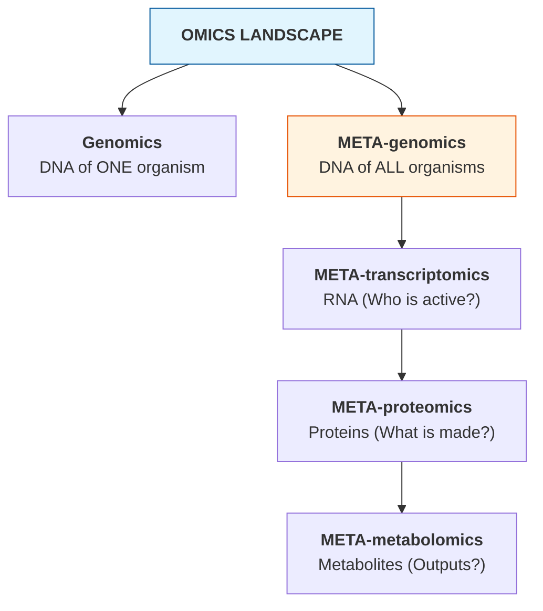
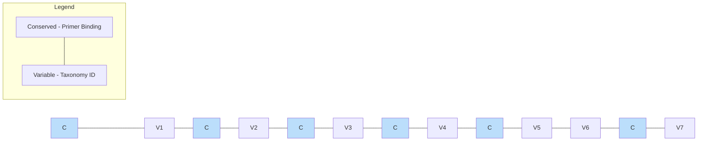
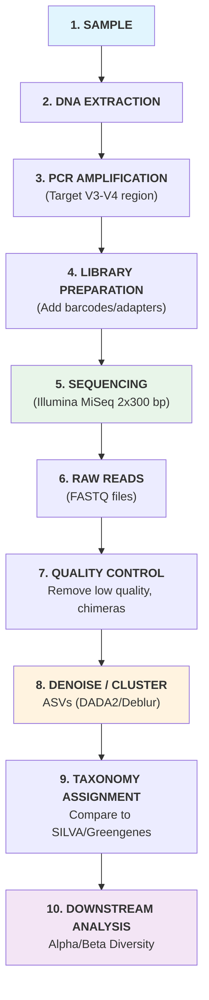

# DAY 1: Foundations of Metagenomics & 16S Amplicon Analysis

## April 7th, 2026 | 09:00 AM - 17:45 PM

---

# SESSION 1: Opening Remarks & Foundations of Metagenomics (10:00 - 11:00)

---

## 1.1 What Is Metagenomics?

### The Core Idea

**Traditional microbiology** works like this: isolate one organism → grow it in a lab → study it.

**Problem:** Over 99% of microorganisms cannot be cultured in a laboratory.

**Metagenomics** solves this by skipping the culture step entirely:

```
Traditional:  Environment → Isolate → Culture → Sequence → Study ONE organism
Metagenomics: Environment → Extract ALL DNA → Sequence → Study ENTIRE community
```

### Formal Definition

> **Metagenomics** is the culture-independent study of the collective genomes of microorganisms from an environmental sample, using high-throughput sequencing and computational analysis.

The term was coined by **Jo Handelsman** in 1998, combining "meta" (beyond) + "genomics" (study of genomes).

### Why Does It Matter?

| Domain | Application | Impact |
|--------|-------------|--------|
| **Human Health** | Gut microbiome linked to obesity, IBD, depression, cancer | Personalized medicine, probiotic design |
| **Agriculture** | Soil microbiome affects crop yield and disease resistance | Sustainable farming, biocontrol agents |
| **Environment** | Ocean microbes produce ~50% of Earth's oxygen | Climate modeling, bioremediation |
| **Industry** | Novel enzymes from extreme environments | Biofuels, detergents, pharmaceuticals |
| **Forensics** | Microbial signatures unique to locations/individuals | Crime scene analysis |

### Real-World Example: The Human Gut

Your gut contains approximately:
- **38 trillion** bacterial cells (roughly equal to your human cells)
- **~1,000 different species**
- **~3 million unique genes** (150x more than the human genome)

This "organ" weighs about 2 kg and influences digestion, immunity, mood, and disease susceptibility.

---

## 1.2 Metagenomic vs. Related Fields



| Approach | What It Measures | Question Answered |
|----------|-----------------|-------------------|
| **Metagenomics** | Total DNA | Who is there? What could they do? |
| **Metatranscriptomics** | mRNA | Who is active right now? |
| **Metaproteomics** | Proteins | What proteins are being made? |
| **Metabarcoding** | Single marker gene (e.g., 16S) | Who is there? (taxonomy only) |

---

## 1.3 Two Approaches to Metagenomics

### Approach 1: Amplicon Sequencing (16S/ITS)

- Targets a **single marker gene** (e.g., 16S rRNA for bacteria)
- Cheaper, faster, well-established
- Answers: **"Who is there and in what proportions?"**
- Cannot tell you about functional potential

### Approach 2: Shotgun Metagenomics

- Sequences **all DNA** in the sample (randomly fragmented)
- More expensive, computationally intensive
- Answers: **"Who is there AND what can they do?"**
- Provides functional and taxonomic information

### Head-to-Head Comparison

| Feature | 16S Amplicon | Shotgun |
|---------|-------------|---------|
| Cost per sample | $50-150 | $200-1000+ |
| Sequencing depth | Lower | Higher needed |
| Taxonomic resolution | Genus/Species | Species/Strain |
| Functional information | No | Yes |
| Host DNA contamination | Minimal (specific primers) | Can be major issue |
| PCR bias | Yes (primer mismatch) | No PCR bias |
| Database dependency | 16S databases | Large reference DBs |
| Computational need | Moderate | High |
| Best for | Community surveys, large sample sizes | Functional studies, discovery |

---

## 1.4 The Metagenomic Experimental Design

### Key Decisions Before You Start

#### 1. Research Question

Your question determines everything:
- "What bacteria are in my soil?" → 16S amplicon
- "What metabolic pathways are enriched in diseased gut?" → Shotgun
- "How does the microbiome change over time?" → Longitudinal design + either

#### 2. Sample Collection

| Factor | Consideration |
|--------|---------------|
| **Sample type** | Stool, soil, water, swab, tissue |
| **Preservation** | Snap-freeze (-80°C), RNAlater, ethanol |
| **Replicates** | Minimum 3 biological replicates per group (ideally 5+) |
| **Controls** | Negative (extraction blank), positive (mock community) |
| **Metadata** | Record EVERYTHING: time, location, pH, temperature, diet, medications |

> **Critical Lesson:** Poor experimental design cannot be rescued by sophisticated analysis. The best bioinformatics in the world cannot fix a badly designed experiment.

#### 3. DNA Extraction

- **Method matters enormously** — different kits give different results
- Use the **same kit and protocol** for all samples in a study
- Common kits: QIAGEN DNeasy PowerSoil, MO BIO PowerFecal
- Include **extraction blanks** to detect contamination

#### 4. Sequencing Platform Selection

| Platform | Read Length | Throughput | Error Rate | Best For |
|----------|-----------|------------|------------|----------|
| **Illumina MiSeq** | 2×300 bp | ~25 million reads | ~0.1% | 16S amplicon |
| **Illumina NovaSeq** | 2×150 bp | ~20 billion reads | ~0.1% | Shotgun metagenomics |
| **Oxford Nanopore** | >10,000 bp | Variable | ~5-15% | Long-range contiguity, real-time |
| **PacBio HiFi** | ~15,000 bp | ~4 million reads | <1% | High-quality long reads |

---

# SESSION 2: Introduction to 16S Amplicon — Theory & Discussion (11:15 - 12:15)

---

## 2.1 The 16S rRNA Gene: Nature's Bacterial Barcode

### What Is the 16S rRNA Gene?

The **16S ribosomal RNA** gene (~1,542 bp) is present in all bacteria and archaea. It encodes part of the small ribosomal subunit (30S) used in protein synthesis.

### Why 16S?

It has a unique property — **alternating conserved and variable regions**:



> [!NOTE]
> **Conserved regions (C):** Same across all bacteria. We design "universal" primers to bind here.
> **Variable regions (V):** Different between species. We use the sequence here to identify who is present.

- **Conserved regions** → Universal primers bind here (target ALL bacteria)
- **Variable regions (V1-V9)** → Sequence differs between species (identification)

### Which Region to Target?

| Region | Primer Pair | Length | Best For |
|--------|-------------|--------|----------|
| **V1-V3** | 27F/534R | ~500 bp | Skin, oral microbiome |
| **V3-V4** | 341F/805R | ~460 bp | Most popular, gut studies |
| **V4** | 515F/806R | ~253 bp | Earth Microbiome Project standard |
| **V4-V5** | 515F/926R | ~400 bp | Environmental samples |

> **Most common choice:** V3-V4 region — good balance of taxonomic resolution and read length compatibility with Illumina MiSeq (2×300 bp).

### For Fungi: The ITS Region

- **ITS** (Internal Transcribed Spacer) is the equivalent "barcode" for fungi
- ITS1 and ITS2 are variable; 5.8S rRNA in between is conserved
- Primers: ITS1F/ITS2R or ITS3/ITS4

---

## 2.2 The 16S Amplicon Workflow



---

## 2.3 OTUs vs. ASVs: A Critical Distinction

### OTUs (Operational Taxonomic Units) — The Old Way

- Cluster sequences at **97% similarity** threshold
- Pick a "representative sequence" for each cluster
- Problem: arbitrary threshold loses real biological variation

### ASVs (Amplicon Sequence Variants) — The Modern Way

- Use statistical denoising to identify **exact biological sequences**
- No arbitrary clustering threshold
- Can detect single-nucleotide differences between organisms
- **Reproducible** across studies (same sequence = same ASV anywhere)

| Feature | OTUs | ASVs |
|---------|------|------|
| Resolution | Genus/Species | Species/Strain |
| Reproducibility | Low (depends on dataset) | High (exact sequences) |
| Sensitivity | Misses fine variation | Captures real variants |
| Recommended | Legacy studies | **All new studies** |
| Tools | UPARSE, CD-HIT | **DADA2**, Deblur |

> **Take-home message:** Always use ASVs for new studies. OTUs are legacy.

---

## 2.4 Taxonomy Assignment

### How Does It Work?

Your ASV sequences are compared against curated reference databases:

```
Your ASV:       ATCGATCG...TTAACGGT (query)
                     ↓ compare
Database entry: ATCGATCG...TTAACGGT → Bacteroides fragilis (99.5% match)
```

### Major Reference Databases

| Database | Description | Best For |
|----------|-------------|----------|
| **SILVA** | Comprehensive, regularly updated, all rRNA | Most studies (recommended) |
| **Greengenes2** | Updated version with genome-based taxonomy | Phylogenetic analyses |
| **RDP** | Ribosomal Database Project | Quick classification |
| **UNITE** | Fungal ITS database | Mycobiome studies |

### Classification Methods

| Method | Approach | Speed | Accuracy |
|--------|----------|-------|----------|
| **Naive Bayes** (QIIME2 default) | Machine learning classifier | Fast | High |
| **VSEARCH** | Global alignment | Moderate | High |
| **BLAST** | Local alignment | Slow | Variable |

---

## 2.5 Common Challenges & Pitfalls in 16S Analysis

### 1. Primer Bias
- Not all bacteria amplify equally with the same primers
- Some taxa are systematically under/over-represented
- **Mitigation:** Report primer choice; consider multiple primer sets

### 2. Copy Number Variation
- Different bacteria have **1 to 15+ copies** of the 16S gene
- A bacterium with 10 copies appears 10x more abundant
- **Mitigation:** Use copy-number correction tools (PICRUSt2, rrnDB)

### 3. Chimeric Sequences
- During PCR, incomplete extensions can join two different templates
- Creates artificial "hybrid" sequences
- **Mitigation:** DADA2 handles this; also use UCHIME for additional filtering

### 4. Contamination
- Reagents contain trace microbial DNA ("kit-ome")
- Low-biomass samples are especially vulnerable
- **Mitigation:** Always include negative controls; use decontam package in R

### 5. Compositional Data
- Relative abundances sum to 100% (or 1.0)
- If one taxon increases, others must decrease (even if their absolute abundance didn't change)
- **Mitigation:** Use compositional data analysis methods (CLR transform, ALDEx2)

---

# SESSION 3: Installation & Getting Started (12:15 - 13:00)

---

## 3.1 Command Line Interface (CLI) Essentials

### Why the Command Line?

Most bioinformatics tools are command-line only. GUIs exist for some, but they:
- Limit reproducibility (can't easily record clicks)
- Don't scale to large datasets
- Often have fewer features than the CLI version

### Essential CLI Skills for This Workshop

#### Navigating the File System

```bash
# Where am I?
pwd
# Output: /home/student/metagenomics_workshop

# What's here?
ls -lh
# Output shows files with human-readable sizes

# Go to workshop directory
cd ~/metagenomics_workshop/day1

# Go back up one level
cd ..

# Go to home directory
cd ~
```

#### Working with Sequence Files

```bash
# How many reads in a FASTQ file?
# (FASTQ has 4 lines per read)
echo $(( $(wc -l < sample_R1.fastq) / 4 ))

# Look at first read
head -4 sample_R1.fastq

# Count sequences in a FASTA file
grep -c "^>" sequences.fasta

# Search for a specific sequence ID
grep "SEQUENCE_ID_123" sample_R1.fastq
```

#### Compressed Files

```bash
# Most sequencing data comes compressed (.gz)
# View without decompressing:
zcat sample_R1.fastq.gz | head -4

# Decompress:
gunzip sample_R1.fastq.gz

# Compress:
gzip sample_R1.fastq

# Count reads in compressed FASTQ:
echo $(( $(zcat sample_R1.fastq.gz | wc -l) / 4 ))
```

#### Running Bioinformatics Tools

```bash
# General pattern:
tool_name [options] -i input_file -o output_file

# Getting help:
tool_name --help
tool_name -h
man tool_name          # Manual page (if available)
```

---

## 3.2 Setting Up the 16S Analysis Environment

### QIIME2: The Swiss Army Knife of Amplicon Analysis

**QIIME2** (Quantitative Insights Into Microbial Ecology) is the most widely used amplicon analysis platform. It provides:
- Data import/export
- Quality control
- Denoising (DADA2/Deblur)
- Taxonomy classification
- Diversity analysis
- Beautiful visualizations

```bash
# Activate QIIME2 environment
conda activate qiime2

# Verify QIIME2 is working
qiime --version
# Expected: qiime2 version 2024.x.x (or later)

# See available plugins
qiime info
```

### QIIME2 Key Concepts

#### Artifacts (.qza files)
- QIIME2 wraps data in "artifacts" — zip files containing data + metadata
- Extension: `.qza` (QIIME2 Artifact)
- Contains provenance tracking (records every step applied to the data)

#### Visualizations (.qzv files)
- Interactive visualizations
- Extension: `.qzv` (QIIME2 Visualization)
- View at https://view.qiime2.org (drag and drop)

#### Metadata (.tsv files)
- Tab-separated file describing your samples
- **Must** include `sample-id` as the first column

Example metadata file (`sample-metadata.tsv`):
```
sample-id	body-site	subject	reported-antibiotic-usage	days-since-experiment-start
#q2:types	categorical	categorical	categorical	numeric
sample-1	gut	subject-1	Yes	0
sample-2	gut	subject-1	Yes	7
sample-3	skin	subject-2	No	0
sample-4	skin	subject-2	No	7
sample-5	tongue	subject-1	Yes	0
```

---

## 3.3 Data Import into QIIME2

### Understanding Your Raw Data

Before importing, know your data format:

| Format | Description |
|--------|-------------|
| **Paired-end** | Forward (R1) and Reverse (R2) reads in separate files |
| **Single-end** | Only one read direction |
| **Multiplexed** | Multiple samples in one file, separated by barcodes |
| **Demultiplexed** | Already separated into per-sample files |

### Import Demultiplexed Paired-End Reads

```bash
# Your data directory should look like:
# raw_reads/
# ├── sample1_R1.fastq.gz
# ├── sample1_R2.fastq.gz
# ├── sample2_R1.fastq.gz
# ├── sample2_R2.fastq.gz
# └── ...

# Import into QIIME2
qiime tools import \
  --type 'SampleData[PairedEndSequencesWithQuality]' \
  --input-path raw_reads/ \
  --input-format CasavaOneEightSingleLanePerSampleDirFmt \
  --output-path demux-paired-end.qza
```

### Visualize Imported Data

```bash
# Create quality summary visualization
qiime demux summarize \
  --i-data demux-paired-end.qza \
  --o-visualization demux-summary.qzv

# View the visualization
# Option 1: Drag demux-summary.qzv to https://view.qiime2.org
# Option 2: qiime tools view demux-summary.qzv
```

**What to look for in the quality plot:**
- Where does quality drop below Q20?
- Are forward reads generally better than reverse? (usually yes)
- These observations will determine your trimming parameters

---

# SESSION 4: Data in Action — Guided Hands-on Practicals (14:30 - 17:00)

---

## 4.1 Quality Control with DADA2

### What DADA2 Does (All in One Step)

1. **Filters** low-quality reads
2. **Trims** to specified lengths
3. **Learns error model** from the data itself
4. **Denoises** — infers true biological sequences (ASVs)
5. **Merges** paired-end reads
6. **Removes chimeras**

### Running DADA2 in QIIME2

```bash
# Key parameters you need to decide:
#   --p-trunc-len-f : Where to truncate forward reads
#   --p-trunc-len-r : Where to truncate reverse reads
#   --p-trim-left-f : Bases to trim from start of forward reads (primer removal)
#   --p-trim-left-r : Bases to trim from start of reverse reads (primer removal)

# Run DADA2 denoising
qiime dada2 denoise-paired \
  --i-demultiplexed-seqs demux-paired-end.qza \
  --p-trunc-len-f 280 \
  --p-trunc-len-r 250 \
  --p-trim-left-f 17 \
  --p-trim-left-r 21 \
  --p-n-threads 4 \
  --o-table feature-table.qza \
  --o-representative-sequences rep-seqs.qza \
  --o-denoising-stats denoising-stats.qza \
  --verbose
```

**How to choose truncation lengths:**
1. Look at the quality plot from `demux-summary.qzv`
2. Find where median quality drops below Q20-Q25
3. Truncate there — but ensure enough overlap remains for merging

```
Forward read (300 bp):  |============================|---- (truncate at 280)
Reverse read (300 bp):  |========================|-------- (truncate at 250)

V3-V4 amplicon (~460 bp):
|<─────────── 460 bp ──────────────>|
|<──── 280 bp ────>|
                   |<──── 250 bp ────|  (note: reverse complement)
                   |<─ overlap ~70 bp─>|

Overlap = (280 + 250) - 460 = 70 bp  ← Must be ≥ 20 bp for reliable merging
```

### Examine Denoising Statistics

```bash
# Visualize denoising stats
qiime metadata tabulate \
  --m-input-file denoising-stats.qza \
  --o-visualization denoising-stats.qzv
```

**Key metrics to check:**

| Metric | What It Means | Acceptable Range |
|--------|---------------|-----------------|
| **input** | Total reads entering DADA2 | — |
| **filtered** | Reads passing quality filter | >70% of input |
| **denoised** | Reads successfully denoised | >90% of filtered |
| **merged** | Forward + reverse successfully joined | >70% of denoised |
| **non-chimeric** | Final reads after chimera removal | >70% of merged |

> **Warning sign:** If merged reads are very low, your truncation lengths don't leave enough overlap. Increase truncation lengths (accept slightly lower quality bases).

---

## 4.2 Feature Table Summary

```bash
# Summarize the feature (ASV) table
qiime feature-table summarize \
  --i-table feature-table.qza \
  --o-visualization feature-table-summary.qzv \
  --m-sample-metadata-file sample-metadata.tsv

# Summarize representative sequences
qiime feature-table tabulate-seqs \
  --i-data rep-seqs.qza \
  --o-visualization rep-seqs-summary.qzv
```

**What to look for:**
- How many ASVs were detected?
- What is the read count distribution across samples?
- Are any samples drastically underrepresented? (may need to exclude)
- Minimum sample depth → determines rarefaction depth later

---

## 4.3 Taxonomy Assignment

```bash
# Option 1: Use a pre-trained classifier (recommended for speed)
# Download a pre-trained SILVA classifier for your region (V3-V4)
# These are available from the QIIME2 data resources page

# Classify your ASVs
qiime feature-classifier classify-sklearn \
  --i-classifier silva-138-99-nb-classifier.qza \
  --i-reads rep-seqs.qza \
  --o-classification taxonomy.qza \
  --p-n-jobs 4

# Visualize taxonomy
qiime metadata tabulate \
  --m-input-file taxonomy.qza \
  --o-visualization taxonomy.qzv
```

### Create Taxonomy Bar Plots

```bash
qiime taxa barplot \
  --i-table feature-table.qza \
  --i-taxonomy taxonomy.qza \
  --m-metadata-file sample-metadata.tsv \
  --o-visualization taxa-bar-plots.qzv
```

> This creates an interactive stacked bar chart. You can switch between taxonomic levels (Phylum, Class, Order, Family, Genus) and sort/color by metadata.

---

## 4.4 Filtering

### Remove Unwanted Taxa

```bash
# Remove mitochondria and chloroplast sequences
# (These are host-derived, not part of the microbiome)
qiime taxa filter-table \
  --i-table feature-table.qza \
  --i-taxonomy taxonomy.qza \
  --p-exclude "mitochondria,chloroplast" \
  --o-filtered-table filtered-table.qza

# Remove unassigned sequences
qiime taxa filter-table \
  --i-table filtered-table.qza \
  --i-taxonomy taxonomy.qza \
  --p-include "d__Bacteria" \
  --o-filtered-table bacteria-only-table.qza
```

### Remove Low-Frequency Features

```bash
# Remove ASVs present in fewer than 2 samples
# (likely sequencing artifacts)
qiime feature-table filter-features \
  --i-table bacteria-only-table.qza \
  --p-min-samples 2 \
  --o-filtered-table final-table.qza
```

---

## 4.5 Phylogenetic Tree Construction

Many diversity metrics require a phylogenetic tree showing evolutionary relationships between ASVs.

```bash
# Align sequences
qiime alignment mafft \
  --i-sequences rep-seqs.qza \
  --o-alignment aligned-rep-seqs.qza

# Mask highly variable positions (improves tree quality)
qiime alignment mask \
  --i-alignment aligned-rep-seqs.qza \
  --o-masked-alignment masked-aligned-rep-seqs.qza

# Build tree with FastTree
qiime phylogeny fasttree \
  --i-alignment masked-aligned-rep-seqs.qza \
  --o-tree unrooted-tree.qza

# Root the tree (required for UniFrac)
qiime phylogeny midpoint-root \
  --i-tree unrooted-tree.qza \
  --o-rooted-tree rooted-tree.qza
```

---

## 4.6 Diversity Analysis

### Alpha Diversity (Within-Sample Diversity)

"How diverse is each sample?"

| Metric | What It Measures | Considers Phylogeny? |
|--------|-----------------|---------------------|
| **Observed Features** | Count of unique ASVs | No |
| **Shannon Index** | Richness + Evenness | No |
| **Simpson Index** | Probability two random sequences are different | No |
| **Faith's PD** | Total branch length in phylogenetic tree | Yes |
| **Pielou's Evenness** | How evenly organisms are distributed | No |

### Beta Diversity (Between-Sample Diversity)

"How different are samples from each other?"

| Metric | What It Measures | Considers Phylogeny? | Considers Abundance? |
|--------|-----------------|---------------------|---------------------|
| **Jaccard** | Shared/unshared ASVs | No | No |
| **Bray-Curtis** | Abundance-weighted similarity | No | Yes |
| **Unweighted UniFrac** | Shared phylogenetic branches | Yes | No |
| **Weighted UniFrac** | Abundance-weighted phylogenetic similarity | Yes | Yes |

### Running Core Diversity Analysis

```bash
# The core-metrics-phylogenetic command runs EVERYTHING at once:
# - Rarefies to even depth
# - Computes alpha diversity (4 metrics)
# - Computes beta diversity (4 metrics)
# - Generates PCoA plots

qiime diversity core-metrics-phylogenetic \
  --i-phylogeny rooted-tree.qza \
  --i-table final-table.qza \
  --p-sampling-depth 10000 \
  --m-metadata-file sample-metadata.tsv \
  --output-dir core-metrics-results
```

**Choosing sampling depth (`--p-sampling-depth`):**
- Look at `feature-table-summary.qzv` for minimum read count
- Choose a depth that retains most samples while being as high as possible
- Samples below this threshold are **excluded**
- Trade-off: lower depth = keep more samples but lose rare taxa

### Statistical Tests on Diversity

```bash
# Alpha diversity: Is diversity different between groups?
qiime diversity alpha-group-significance \
  --i-alpha-diversity core-metrics-results/shannon_vector.qza \
  --m-metadata-file sample-metadata.tsv \
  --o-visualization shannon-group-significance.qzv

qiime diversity alpha-group-significance \
  --i-alpha-diversity core-metrics-results/faith_pd_vector.qza \
  --m-metadata-file sample-metadata.tsv \
  --o-visualization faith-pd-group-significance.qzv

# Beta diversity: Do groups cluster differently? (PERMANOVA test)
qiime diversity beta-group-significance \
  --i-distance-matrix core-metrics-results/bray_curtis_distance_matrix.qza \
  --m-metadata-file sample-metadata.tsv \
  --m-metadata-column body-site \
  --p-method permanova \
  --o-visualization bray-curtis-body-site-significance.qzv

qiime diversity beta-group-significance \
  --i-distance-matrix core-metrics-results/weighted_unifrac_distance_matrix.qza \
  --m-metadata-file sample-metadata.tsv \
  --m-metadata-column body-site \
  --p-method permanova \
  --o-visualization weighted-unifrac-body-site-significance.qzv
```

---

## 4.7 Exporting Results for External Analysis

```bash
# Export feature table as BIOM
qiime tools export \
  --input-path final-table.qza \
  --output-path exported/

# Convert BIOM to TSV (human-readable)
biom convert \
  -i exported/feature-table.biom \
  -o exported/feature-table.tsv \
  --to-tsv

# Export taxonomy
qiime tools export \
  --input-path taxonomy.qza \
  --output-path exported/

# Export tree
qiime tools export \
  --input-path rooted-tree.qza \
  --output-path exported/
```

---

# SESSION 5: Beyond the Bench — Applications & Future Perspectives (17:15 - 17:45)

---

## 5.1 Clinical Applications

### Fecal Microbiota Transplantation (FMT)
- Transfer of stool from healthy donor to patient
- **95% cure rate** for recurrent *Clostridioides difficile* infection
- Metagenomics monitors donor screening and engraftment success

### Cancer Immunotherapy Response
- Gut microbiome composition predicts response to checkpoint inhibitors
- *Faecalibacterium prausnitzii* and *Akkermansia muciniphila* associated with better outcomes
- Clinical trials combining immunotherapy with microbiome modulation underway

### Diagnostic Biomarkers
- Colorectal cancer: elevated *Fusobacterium nucleatum*
- IBD: reduced diversity + specific taxa shifts
- Liver cirrhosis: oral bacteria invading the gut

## 5.2 Environmental Applications

- **Bioremediation:** Identifying microbes that degrade oil spills, plastics, pesticides
- **Agriculture:** Optimizing soil microbiome for crop productivity
- **Water quality:** Monitoring pathogens in drinking water using eDNA

## 5.3 Industrial Applications

- **Enzyme discovery:** Metagenomes from hot springs → thermostable enzymes for industry
- **Food fermentation:** Understanding microbial communities in cheese, yogurt, kimchi, kombucha
- **Biofuel production:** Cellulose-degrading enzymes from termite gut microbiome

## 5.4 Emerging Trends

1. **Long-read metagenomics** — Complete genomes from metagenomes (Oxford Nanopore, PacBio)
2. **Spatial metagenomics** — Where exactly are microbes located in tissue?
3. **Single-cell metagenomics** — Genome of individual uncultured cells
4. **AI/ML in metagenomics** — Deep learning for taxonomy, function prediction, drug discovery
5. **Multi-omics integration** — Combining metagenomics + metabolomics + transcriptomics

---

## Day 1 Assignment

### Task: Complete 16S Analysis Pipeline

Using the provided demo dataset:
1. Import paired-end reads into QIIME2
2. Run DADA2 with appropriate parameters (justify your parameter choices)
3. Assign taxonomy using SILVA classifier
4. Generate taxonomy bar plots
5. Run alpha and beta diversity analyses
6. Answer: Which body site has the highest microbial diversity?

**Deliverable:** A short report with:
- Commands used (with explanations)
- Key statistics (number of ASVs, read counts)
- One taxonomy bar plot
- One PCoA plot
- A 2-3 sentence interpretation of results

---

## Day 1 Key Takeaways

```
┌─────────────────────────────────────────────────────────────────┐
│                        DAY 1 SUMMARY                            │
├─────────────────────────────────────────────────────────────────┤
│                                                                 │
│  1. Metagenomics = study ALL genomes in an environment          │
│                                                                 │
│  2. Two approaches: 16S amplicon (who?) vs shotgun (who+what?)  │
│                                                                 │
│  3. 16S gene has conserved + variable regions = natural barcode │
│                                                                 │
│  4. ASVs > OTUs for modern studies                              │
│                                                                 │
│  5. QIIME2 pipeline: import → denoise → classify → diversity   │
│                                                                 │
│  6. Always include controls & record metadata                   │
│                                                                 │
│  7. Applications span health, environment, and industry         │
│                                                                 │
└─────────────────────────────────────────────────────────────────┘
```

---

*Next: Open `Day2_Shotgun_Metagenomics.md` for Day 2 →*
