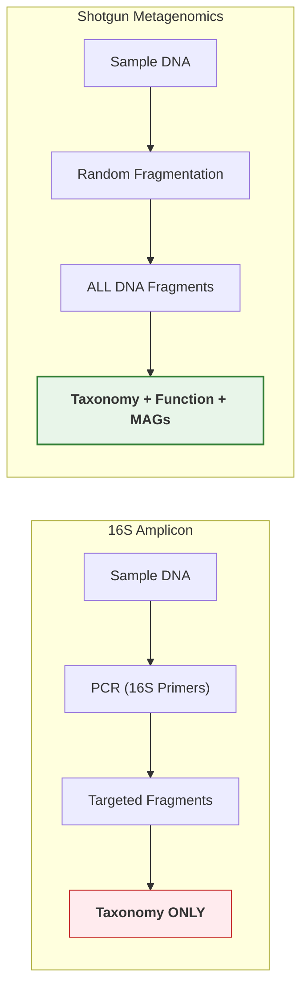
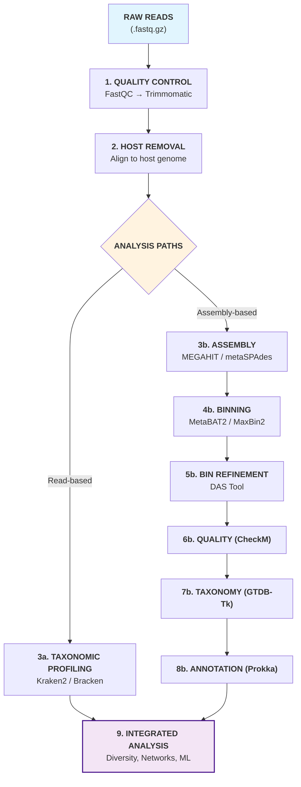

# DAY 2: Shotgun Metagenomics — From Raw Reads to Biological Insights

## April 8th, 2026 | 09:00 AM - 17:15 PM

---

# SESSION 1: Introduction to Shotgun Sequencing (09:00 - 09:45)

---

## 1.1 What Is Shotgun Metagenomics?

In shotgun metagenomics, **all DNA** in a sample is randomly fragmented ("shotgunned") and sequenced — no PCR targeting of a specific gene.



### Why Shotgun?

1. **No PCR bias** — every piece of DNA has a chance to be sequenced
2. **Functional information** — discover what organisms CAN do, not just who they are
3. **Strain-level resolution** — distinguish closely related organisms
4. **Metagenome-Assembled Genomes (MAGs)** — reconstruct near-complete genomes of uncultured organisms
5. **Detect viruses, plasmids, ARGs** — anything with DNA

---

## 1.2 Sequencing Technologies Deep Dive

### Short-Read Sequencing (Illumina)

**How it works: Sequencing by Synthesis (SBS)**

```
1. DNA fragments attach to flow cell surface
2. Bridge amplification creates clusters (~1000 copies each)
3. Fluorescent nucleotides added one at a time
4. Camera captures color after each incorporation
5. Color → base call (A=green, C=blue, G=black, T=red)
6. Repeat for 150-300 cycles → 150-300 bp reads
```

| Platform | Read Length | Output | Run Time | Cost/Gb |
|----------|-----------|--------|----------|---------|
| MiSeq | 2×300 bp | ~15 Gb | 56 hrs | ~$100 |
| NextSeq 2000 | 2×150 bp | ~360 Gb | 48 hrs | ~$20 |
| NovaSeq X | 2×150 bp | ~16 Tb | 48 hrs | ~$2 |

**Strengths:** High accuracy (~99.9%), high throughput, low cost per base
**Weaknesses:** Short reads → repetitive regions unresolvable, GC bias

### Long-Read Sequencing (Oxford Nanopore)

**How it works: Nanopore Sequencing**

```
1. DNA strand threaded through a protein nanopore
2. Each base disrupts ionic current differently
3. Current changes → base calls in real-time
4. No length limit — reads can be 100+ kb
```

| Platform | Read Length | Output | Run Time | Cost/Gb |
|----------|-----------|--------|----------|---------|
| MinION | Up to 2 Mb | ~50 Gb | 72 hrs | ~$45 |
| PromethION | Up to 2 Mb | ~7 Tb | 72 hrs | ~$6 |

**Strengths:** Ultra-long reads, real-time, portable (MinION fits in your pocket), detects modifications
**Weaknesses:** Higher error rate (~5-15% raw), lower throughput

### Long-Read Sequencing (PacBio HiFi)

**How it works: Single Molecule Real-Time (SMRT)**

```
1. DNA circularized with adapters
2. Polymerase reads the circle multiple times
3. Consensus of passes → HiFi read (~99.9% accuracy)
4. Typical read: 10-25 kb at Q30+
```

| Platform | Read Length | Output | Run Time | Cost/Gb |
|----------|-----------|--------|----------|---------|
| Revio | ~15 kb HiFi | ~90 Gb | 24 hrs | ~$10 |

**Strengths:** Long AND accurate, resolves complex regions
**Weaknesses:** Higher cost per sample, lower throughput than Illumina

### When to Use What?

| Goal | Recommended Platform |
|------|---------------------|
| Large-scale community profiling | Illumina NovaSeq |
| High-quality MAG recovery | Illumina + Nanopore hybrid |
| Complete genome assembly | PacBio HiFi |
| Field/clinical rapid diagnostics | Oxford Nanopore MinION |
| Strain-level tracking | PacBio HiFi or Illumina deep sequencing |
| Budget-limited survey | Illumina MiSeq/NextSeq |

---

## 1.3 The Complete Shotgun Metagenomics Pipeline



> [!NOTE]
> **Read-based analysis** is fast and gives a broad overview of the community.
> **Assembly-based analysis** is computationally intensive but allows you to reconstruct genomes (MAGs) and discover specific genes and pathways.

---

# SESSION 2: Data Quality Checks & Preprocessing (09:45 - 11:00)

---

## 2.1 FastQC — Quality Assessment

### What FastQC Does

FastQC provides a visual summary of raw sequencing data quality. Think of it as a "health check" for your FASTQ files.

### Running FastQC

```bash
# Navigate to your data directory
cd ~/metagenomics_workshop/day2

# Run FastQC on all FASTQ files
fastqc raw_reads/*.fastq.gz \
  --outdir fastqc_results/ \
  --threads 4

# This creates:
# fastqc_results/
# ├── sample1_R1_fastqc.html   ← Open in browser
# ├── sample1_R1_fastqc.zip    ← Raw data
# ├── sample1_R2_fastqc.html
# └── ...
```

### Interpreting FastQC Results

FastQC produces 12 analysis modules. Here's what matters most:

#### Module 1: Per Base Sequence Quality (CRITICAL)

```
Quality │  ████████████████████████████████████████░░░░░░▒▒▒▒▒▒▒▒
Score   │  ██████████████████████████████████████░░░░░░░░▒▒▒▒▒▒▒▒
(Phred) │  ████████████████████████████████████░░░░░░░░░░▒▒▒▒▒▒▒▒
   40   │  ──────────────────────────────────────────────────────
   30   │  ─────────────────────────────────────░░░░░░░░─────────
   20   │  ──────────────────────────────────────────────▒▒▒▒▒▒▒▒
   10   │  ──────────────────────────────────────────────────────
        └──────────────────────────────────────────────────────
         Position 1                                        150

█ = Good (Q30+)    ░ = Acceptable (Q20-30)    ▒ = Poor (<Q20)
```

**What to do:**
- Q30+ throughout → excellent, minimal trimming needed
- Quality drops at end → trim to the position where Q drops below 20
- Quality drops at beginning → might be adapter contamination

#### Module 2: Per Sequence Quality Scores

- Should show a single peak at Q30-Q40
- A secondary peak at low quality = subset of bad reads

#### Module 3: Per Base Sequence Content

- Should show roughly equal A/T and G/C proportions
- **Deviation at the start** is normal for metagenomics (random hexamer priming)
- Severe bias throughout → contamination or library problem

#### Module 4: Adapter Content

- Shows if adapter sequences are present in reads
- Rising adapter content at read ends = reads longer than inserts
- Must be removed before analysis

#### Module 5: Overrepresented Sequences

- If >0.1% of reads are identical → possible contamination or adapter dimers
- PhiX spike-in is normal

### Aggregate Report with MultiQC

```bash
# Install MultiQC (aggregates FastQC results)
pip install multiqc

# Run MultiQC on FastQC results
multiqc fastqc_results/ -o multiqc_report/

# Open multiqc_report/multiqc_report.html in browser
# Shows all samples side-by-side — instantly spot problematic samples
```

---

## 2.2 Trimmomatic — Adapter Removal & Quality Trimming

### What Trimmomatic Does

Trimmomatic removes:
1. **Adapter sequences** (technical artifacts, not biological)
2. **Low-quality bases** from read ends
3. **Short reads** that become too short after trimming

### Understanding Trimmomatic Parameters

```bash
trimmomatic PE \
  -phred33 \
  -threads 4 \
  raw_reads/sample1_R1.fastq.gz \        # Input forward
  raw_reads/sample1_R2.fastq.gz \        # Input reverse
  trimmed/sample1_R1_paired.fastq.gz \   # Output: forward, paired
  trimmed/sample1_R1_unpaired.fastq.gz \ # Output: forward, orphaned
  trimmed/sample1_R2_paired.fastq.gz \   # Output: reverse, paired
  trimmed/sample1_R2_unpaired.fastq.gz \ # Output: reverse, orphaned
  ILLUMINACLIP:TruSeq3-PE.fa:2:30:10:2:True \
  LEADING:3 \
  TRAILING:3 \
  SLIDINGWINDOW:4:20 \
  MINLEN:50
```

### Parameter Explanation

| Parameter | What It Does | Recommended Value |
|-----------|-------------|-------------------|
| `PE` | Paired-end mode | — |
| `-phred33` | Quality encoding (standard for modern Illumina) | -phred33 |
| `ILLUMINACLIP:file:2:30:10:2:True` | Remove adapters; seed mismatches:2, palindrome threshold:30, simple threshold:10 | As shown |
| `LEADING:3` | Remove bases from start if quality < 3 | 3 |
| `TRAILING:3` | Remove bases from end if quality < 3 | 3 |
| `SLIDINGWINDOW:4:20` | Scan with 4-base window, cut when average quality < 20 | 4:20 |
| `MINLEN:50` | Drop reads shorter than 50 bp after trimming | 50-75 |

### Batch Processing All Samples

```bash
#!/bin/bash
# Script: trim_all_samples.sh

mkdir -p trimmed

for R1 in raw_reads/*_R1.fastq.gz; do
    # Extract sample name
    SAMPLE=$(basename "$R1" _R1.fastq.gz)
    R2="raw_reads/${SAMPLE}_R2.fastq.gz"
    
    echo "Processing: $SAMPLE"
    
    trimmomatic PE -phred33 -threads 4 \
        "$R1" "$R2" \
        "trimmed/${SAMPLE}_R1_paired.fastq.gz" \
        "trimmed/${SAMPLE}_R1_unpaired.fastq.gz" \
        "trimmed/${SAMPLE}_R2_paired.fastq.gz" \
        "trimmed/${SAMPLE}_R2_unpaired.fastq.gz" \
        ILLUMINACLIP:TruSeq3-PE.fa:2:30:10:2:True \
        LEADING:3 TRAILING:3 SLIDINGWINDOW:4:20 MINLEN:50
    
    echo "$SAMPLE done!"
done

echo "All samples trimmed."
```

### Verify Trimming Worked

```bash
# Run FastQC on trimmed reads
fastqc trimmed/*_paired.fastq.gz --outdir fastqc_trimmed/ --threads 4

# Compare before/after
multiqc fastqc_results/ fastqc_trimmed/ -o multiqc_comparison/
```

**Expected improvements:**
- Adapter content → 0%
- Quality scores → consistent Q20+ throughout
- Some reads lost (typically 5-15%)

---

## 2.3 Kraken2 — Taxonomic Classification

### What Is Kraken2?

Kraken2 is an ultrafast taxonomic classifier. It uses exact k-mer matches against a reference database.

### How Kraken2 Works

```
1. Break each read into k-mers (default k=35)
2. Look up each k-mer in a prebuilt hash table
3. Map k-mers to their Lowest Common Ancestor (LCA) in taxonomy
4. Classify the read to the most specific taxon supported by the majority of k-mers

Read:  ATCGATCGATCGATCGATCGATCGATCGATCGATCGATCG...
       |---k-mer-1---|
        |---k-mer-2---|
         |---k-mer-3---|
         
k-mer-1 → Escherichia coli
k-mer-2 → Escherichia coli
k-mer-3 → Escherichia (genus level only)

Classification: Escherichia coli (species level)
```

### Setting Up Kraken2 Database

```bash
# Option 1: Download pre-built database (recommended for workshop)
# Standard database (~50 GB) — bacteria, archaea, viruses, human
mkdir -p ~/kraken2_db
cd ~/kraken2_db

# Download pre-built standard database
kraken2-build --download-library bacteria --db standard_db
kraken2-build --download-library archaea --db standard_db
kraken2-build --download-library viral --db standard_db
kraken2-build --download-taxonomy --db standard_db
kraken2-build --build --db standard_db --threads 8

# Option 2: Use a smaller pre-built database for limited resources
# MiniKraken2 (~8 GB) — good for training
wget https://genome-idx.s3.amazonaws.com/kraken/k2_standard_08gb_20231009.tar.gz
mkdir -p minikraken2_db
tar -xzf k2_standard_08gb_20231009.tar.gz -C minikraken2_db/
```

### Running Kraken2

```bash
# Classify paired-end reads
kraken2 \
  --db ~/kraken2_db/standard_db \
  --paired \
  --threads 8 \
  --output kraken2_output/sample1.kraken \
  --report kraken2_output/sample1.kreport \
  --gzip-compressed \
  trimmed/sample1_R1_paired.fastq.gz \
  trimmed/sample1_R2_paired.fastq.gz
```

### Understanding the Kraken2 Report

```bash
# View the report
head -30 kraken2_output/sample1.kreport
```

The report columns:
```
 % reads  | reads at  | reads at | rank | taxID  | name
 at/below | this level| clade    | code |        |
──────────┼───────────┼──────────┼──────┼────────┼─────────────
  45.23   |  2310     |  452300  |  D   | 2      | Bacteria
  22.11   |  1500     |  221100  |  P   | 1224   |   Proteobacteria
  15.34   |  800      |  153400  |  C   | 28211  |     Alphaproteobacteria
   8.56   |  600      |   85600  |  O   | 356    |       Rhizobiales
```

| Column | Meaning |
|--------|---------|
| % reads | Percentage of reads classified at or below this taxon |
| Reads at level | Reads classified exactly at this level |
| Reads in clade | Reads classified at this level + all children |
| Rank code | D=Domain, P=Phylum, C=Class, O=Order, F=Family, G=Genus, S=Species |
| TaxID | NCBI Taxonomy ID |
| Name | Scientific name (indented to show hierarchy) |

---

## 2.4 Bracken — Bayesian Re-estimation of Abundance

### Why Bracken After Kraken2?

Kraken2 often classifies reads to higher taxonomic levels (genus/family) when k-mers are shared between species. Bracken **redistributes** these ambiguous reads down to species level using a Bayesian model.

```
Kraken2 output:               Bracken corrected:
  Escherichia (genus): 1000     → E. coli: 750
  E. coli (species):   500     → E. fergusonii: 250
  E. fergusonii:       200     → (ambiguous reads redistributed
                                   proportionally)
```

### Running Bracken

```bash
# Build Bracken database (one-time, uses Kraken2 DB)
bracken-build -d ~/kraken2_db/standard_db -t 8 -k 35 -l 150

# Run Bracken at species level
bracken \
  -d ~/kraken2_db/standard_db \
  -i kraken2_output/sample1.kreport \
  -o bracken_output/sample1.bracken \
  -w bracken_output/sample1.breport \
  -r 150 \
  -l S \
  -t 10
```

### Bracken Parameters

| Parameter | Meaning | Recommended |
|-----------|---------|-------------|
| `-d` | Kraken2 database path | Same as Kraken2 |
| `-i` | Input Kraken2 report | .kreport file |
| `-o` | Output Bracken abundances | — |
| `-w` | Output corrected Kraken report | — |
| `-r` | Read length | Match your actual read length |
| `-l` | Taxonomic level (S/G/F/O/C/P/D) | S (species) |
| `-t` | Minimum reads threshold | 10 |

---

# SESSION 3: Contig Assembly, Binning & Bin Refinement (11:15 - 12:15)

---

## 3.1 Metagenome Assembly

### Why Assemble?

Individual reads are 150 bp fragments. Assembly **stitches overlapping reads** into longer contiguous sequences ("contigs"), providing:
- Longer sequences for better gene prediction
- Context for gene neighborhoods (operons)
- Foundation for recovering genomes (MAGs)

### How Assembly Works (de Bruijn Graph)

```
Reads:   ATCGATCG    TCGATCGAA    CGATCGAATT

Break into k-mers (k=5):
  ATCGA → TCGAT → CGATC → GATCG → ATCGA → TCGAA → CGAAT → GAATT

Build graph:
  ATCGA → TCGAT → CGATC → GATCG
                                 ↘
                            ATCGA → TCGAA → CGAAT → GAATT

Traverse graph → Contig: ATCGATCGAATT
```

### MEGAHIT — Memory-Efficient Metagenome Assembler

```bash
# Assemble metagenome with MEGAHIT
megahit \
  -1 trimmed/sample1_R1_paired.fastq.gz \
  -2 trimmed/sample1_R2_paired.fastq.gz \
  -o assembly/sample1_megahit \
  --min-contig-len 1000 \
  --k-min 21 \
  --k-max 141 \
  --k-step 12 \
  -t 8 \
  -m 0.5

# Output: assembly/sample1_megahit/final.contigs.fa
```

### MEGAHIT Parameters

| Parameter | Meaning | Recommended |
|-----------|---------|-------------|
| `-1`, `-2` | Paired-end input files | Your trimmed reads |
| `-o` | Output directory | — |
| `--min-contig-len` | Minimum contig length to report | 1000 bp |
| `--k-min`, `--k-max`, `--k-step` | K-mer range for iterative assembly | 21, 141, 12 |
| `-t` | CPU threads | 8 |
| `-m` | Max memory fraction | 0.5 (50% of RAM) |

### Co-Assembly vs. Individual Assembly

| Strategy | When to Use | Pros | Cons |
|----------|-------------|------|------|
| **Individual** | Each sample assembled alone | Preserves sample-specific variation | Lower depth for rare organisms |
| **Co-assembly** | Pool all samples together | Higher depth → better assembly | Loses sample info; chimeric contigs |

```bash
# Co-assembly (if desired — combine all samples)
megahit \
  -1 trimmed/sample1_R1.fq.gz,trimmed/sample2_R1.fq.gz \
  -2 trimmed/sample1_R2.fq.gz,trimmed/sample2_R2.fq.gz \
  -o assembly/coassembly \
  --min-contig-len 1000 \
  -t 16
```

### Evaluate Assembly Quality

```bash
# Basic statistics with a simple script
# Count contigs, total length, N50
grep -c ">" assembly/sample1_megahit/final.contigs.fa
# Or use QUAST for detailed statistics:
# quast assembly/sample1_megahit/final.contigs.fa -o quast_output/
```

**Key assembly metrics:**

| Metric | What It Means | Good Value |
|--------|---------------|------------|
| **Total contigs** | Number of assembled sequences | Fewer is often better |
| **Total length** | Sum of all contig lengths | — |
| **N50** | 50% of assembly is in contigs ≥ this size | >10 kb is good |
| **Largest contig** | Length of longest assembled sequence | >100 kb is excellent |
| **GC content** | Overall GC% (sanity check) | Depends on community |

---

## 3.2 Binning — Recovering Genomes from Metagenomes

### What Is Binning?

Binning groups contigs that likely came from the **same organism** into "bins" — these become **Metagenome-Assembled Genomes (MAGs)**.

### How Binning Works

Two signals are used to group contigs:

```
Signal 1: SEQUENCE COMPOSITION (tetranucleotide frequency)
─────────────────────────────────────────────────────────
Each species has a characteristic "DNA signature" — the frequency 
of 4-mer combinations (256 possible) is species-specific.

Contig A: AAAA=2.1%, AAAT=1.8%, AAAC=1.5% ... → Profile X
Contig B: AAAA=2.0%, AAAT=1.9%, AAAC=1.4% ... → Profile X (similar!)
Contig C: AAAA=0.5%, AAAT=3.2%, AAAC=0.3% ... → Profile Y (different!)

→ Contigs A and B likely from same organism

Signal 2: COVERAGE CO-VARIATION (across samples)
─────────────────────────────────────────────────
If contigs are from the same organism, their abundance 
(= read coverage) will correlate across multiple samples.

             Sample1  Sample2  Sample3
Contig A:     100x     50x     200x    ← Same pattern
Contig B:      95x     48x     190x    ← Same pattern → same bin
Contig C:      10x    150x      20x    ← Different pattern → different bin
```

### Read Mapping (Required Before Binning)

```bash
# Map reads back to assembly to get coverage information
# Step 1: Index the assembly
bowtie2-build assembly/sample1_megahit/final.contigs.fa \
  assembly/sample1_megahit/contigs_index

# Step 2: Map reads
bowtie2 \
  -x assembly/sample1_megahit/contigs_index \
  -1 trimmed/sample1_R1_paired.fastq.gz \
  -2 trimmed/sample1_R2_paired.fastq.gz \
  --threads 8 \
  -S mapping/sample1.sam

# Step 3: Convert SAM → sorted BAM
samtools sort -@ 8 -o mapping/sample1.sorted.bam mapping/sample1.sam
samtools index mapping/sample1.sorted.bam

# Clean up SAM (large file, no longer needed)
rm mapping/sample1.sam
```

### MetaBAT2 — Binning Tool #1

```bash
# Generate depth file from BAM
jgi_summarize_bam_contig_depths \
  --outputDepth depth/sample1_depth.txt \
  mapping/sample1.sorted.bam

# Run MetaBAT2
metabat2 \
  -i assembly/sample1_megahit/final.contigs.fa \
  -a depth/sample1_depth.txt \
  -o bins_metabat2/sample1_bin \
  -m 1500 \
  --minClsSize 200000 \
  -t 8
```

### MaxBin2 — Binning Tool #2

```bash
# MaxBin2 uses a different algorithm (Expectation-Maximization)
run_MaxBin.pl \
  -contig assembly/sample1_megahit/final.contigs.fa \
  -reads trimmed/sample1_R1_paired.fastq.gz \
  -reads2 trimmed/sample1_R2_paired.fastq.gz \
  -out bins_maxbin2/sample1_bin \
  -thread 8
```

### Why Use Multiple Binners?

Different algorithms have different strengths:
- **MetaBAT2:** Fast, good for complex communities
- **MaxBin2:** Better for low-abundance organisms
- **CONCOCT:** Good with many samples (co-variation)

### Bin Refinement with DAS Tool

DAS Tool **combines results from multiple binners** and selects the best non-redundant set of bins.

```bash
# Convert bin outputs to DAS Tool format
# (Create tab-separated: contig_id <tab> bin_id)

# For MetaBAT2:
Fasta_to_Contig2Bin.sh \
  -i bins_metabat2/ \
  -e fa > metabat2_contigs2bin.tsv

# For MaxBin2:
Fasta_to_Contig2Bin.sh \
  -i bins_maxbin2/ \
  -e fasta > maxbin2_contigs2bin.tsv

# Run DAS Tool
DAS_Tool \
  -i metabat2_contigs2bin.tsv,maxbin2_contigs2bin.tsv \
  -l MetaBAT2,MaxBin2 \
  -c assembly/sample1_megahit/final.contigs.fa \
  -o das_tool_output/sample1 \
  --search_engine diamond \
  --write_bins 1 \
  -t 8
```

---

# SESSION 4: Quality Assessment & Taxonomic Classification (13:45 - 14:15)

---

## 4.1 CheckM — Assessing MAG Quality

### What CheckM Does

CheckM evaluates the **completeness** and **contamination** of your MAGs using single-copy marker genes.

```
Logic:
  - Bacteria have ~100-150 genes that appear exactly ONCE in every genome
  - If your bin has 95/100 markers → 95% complete
  - If your bin has duplicated markers → contamination (mixed organisms)
```

### Running CheckM

```bash
# Run CheckM on all bins
checkm lineage_wf \
  das_tool_output/sample1_DASTool_bins/ \
  checkm_output/ \
  -x fa \
  -t 8 \
  --pplacer_threads 4 \
  --tab_table \
  -f checkm_output/checkm_results.tsv
```

### Interpreting CheckM Results

```
Bin ID          Completeness  Contamination  Strain Het.  Quality Score
────────────────────────────────────────────────────────────────────────
bin.1           98.5%         1.2%           0.0%         93.5
bin.2           85.3%         3.5%           25.0%        67.8
bin.3           45.2%         0.5%           0.0%         42.7
bin.4           12.1%         0.0%           0.0%         12.1
```

### MAG Quality Standards (MIMAG)

The **Minimum Information about a Metagenome-Assembled Genome** standard:

| Quality Level | Completeness | Contamination | Additional |
|---------------|-------------|---------------|------------|
| **High quality** | >90% | <5% | 23S, 16S, 5S rRNA + ≥18 tRNAs |
| **Medium quality** | ≥50% | <10% | — |
| **Low quality** | <50% | <10% | — |

**Quality Score Formula:**
```
Quality Score = Completeness - (5 × Contamination)
```

> **Rule of thumb:** Keep bins with Quality Score ≥ 50 for downstream analysis.

### CheckM2 — Newer, Faster Alternative

```bash
# CheckM2 uses machine learning — faster and more accurate
checkm2 predict \
  --input das_tool_output/sample1_DASTool_bins/ \
  --output-directory checkm2_output/ \
  --extension fa \
  --threads 8
```

---

## 4.2 GTDBTk — Genome-Based Taxonomic Classification

### What Is GTDB?

The **Genome Taxonomy Database** provides a standardized taxonomy based on genome phylogeny, not 16S alone. It corrects many historical misclassifications.

```
Example of GTDB correction:
  NCBI:  Clostridium difficile
  GTDB:  Clostridioides difficile  (reclassified based on genomics)
```

### Running GTDBTk

```bash
# Set GTDB-Tk reference data path
export GTDBTK_DATA_PATH=~/gtdbtk_data/release214/

# Classify MAGs
gtdbtk classify_wf \
  --genome_dir das_tool_output/sample1_DASTool_bins/ \
  --out_dir gtdbtk_output/ \
  --extension fa \
  --cpus 8 \
  --pplacer_cpus 4
```

### Understanding GTDBTk Output

```
user_genome    classification
──────────────────────────────────────────────────────────────
bin.1          d__Bacteria;p__Firmicutes;c__Bacilli;
               o__Lactobacillales;f__Lactobacillaceae;
               g__Lactobacillus;s__Lactobacillus rhamnosus

bin.2          d__Bacteria;p__Bacteroidota;c__Bacteroidia;
               o__Bacteroidales;f__Bacteroidaceae;
               g__Bacteroides;s__Bacteroides fragilis
```

The taxonomy follows the format: `d__Domain;p__Phylum;c__Class;o__Order;f__Family;g__Genus;s__Species`

---

# SESSION 5: Functional Annotation (14:15 - 15:00)

---

## 5.1 Prokka — Rapid Prokaryotic Genome Annotation

### What Prokka Does

Prokka predicts and annotates **genes** in your MAGs:
- Open Reading Frames (ORFs) → protein-coding genes
- rRNA genes
- tRNA genes
- Signal peptides
- CRISPR arrays

### Running Prokka

```bash
# Annotate a single MAG
prokka \
  das_tool_output/sample1_DASTool_bins/bin.1.fa \
  --outdir prokka_output/bin1 \
  --prefix bin1 \
  --kingdom Bacteria \
  --cpus 8 \
  --metagenome \
  --force

# Batch annotate all bins
for BIN in das_tool_output/sample1_DASTool_bins/*.fa; do
    NAME=$(basename "$BIN" .fa)
    prokka "$BIN" \
      --outdir "prokka_output/${NAME}" \
      --prefix "$NAME" \
      --kingdom Bacteria \
      --cpus 8 \
      --metagenome \
      --force
done
```

### Prokka Output Files

| File | Extension | Content |
|------|-----------|---------|
| `bin1.gff` | GFF3 | Gene annotations with coordinates |
| `bin1.faa` | FASTA | Predicted protein sequences |
| `bin1.ffn` | FASTA | Predicted gene nucleotide sequences |
| `bin1.fna` | FASTA | Input contigs (renamed) |
| `bin1.gbk` | GenBank | Rich annotation format |
| `bin1.tsv` | TSV | Summary table of all features |
| `bin1.txt` | TXT | Statistics summary |

### Examining Annotation Results

```bash
# View annotation statistics
cat prokka_output/bin1/bin1.txt

# Expected output:
# organism: Genus species strain
# contigs: 45
# bases: 3450000
# CDS: 3200
# rRNA: 3
# tRNA: 42
# tmRNA: 1

# View the GFF annotation file
head -20 prokka_output/bin1/bin1.gff

# Count predicted genes
grep -c "CDS" prokka_output/bin1/bin1.gff
```

---

## 5.2 COGs — Clusters of Orthologous Groups

### What Are COGs?

COGs classify proteins into **functional categories** based on evolutionary relationships. They tell you the functional repertoire of an organism.

### COG Functional Categories

| Code | Category | Description |
|------|----------|-------------|
| **J** | Translation | Ribosomal structure, translation |
| **K** | Transcription | DNA-dependent RNA polymerase, transcription factors |
| **L** | Replication | DNA replication, recombination, repair |
| **C** | Energy | Energy production and conversion |
| **E** | Amino acids | Amino acid transport and metabolism |
| **G** | Carbohydrates | Carbohydrate transport and metabolism |
| **P** | Inorganic ion | Inorganic ion transport and metabolism |
| **H** | Coenzymes | Coenzyme transport and metabolism |
| **M** | Cell wall | Cell wall/membrane biogenesis |
| **N** | Motility | Cell motility |
| **O** | PTM | Post-translational modification, chaperones |
| **T** | Signaling | Signal transduction mechanisms |
| **S** | Unknown | Function unknown |
| **V** | Defense | Defense mechanisms |
| **X** | Mobilome | Mobilome: prophages, transposons |

### Assigning COGs with eggNOG-mapper

```bash
# Install eggNOG-mapper
conda install -c bioconda eggnog-mapper

# Download eggNOG database (one-time, ~40 GB)
download_eggnog_data.py --data_dir ~/eggnog_data/

# Run annotation on predicted proteins
emapper.py \
  -i prokka_output/bin1/bin1.faa \
  --output cog_output/bin1 \
  --data_dir ~/eggnog_data/ \
  --cpu 8 \
  -m diamond
```

### Interpreting COG Annotations

```bash
# View results
head -5 cog_output/bin1.emapper.annotations

# Count genes per COG category
awk -F'\t' 'NR>3 && $7!="" {print $7}' cog_output/bin1.emapper.annotations | \
  fold -w1 | sort | uniq -c | sort -rn

# Expected output:
#   350 S   (Unknown function — normal to be largest)
#   280 E   (Amino acid metabolism)
#   250 G   (Carbohydrate metabolism)
#   230 K   (Transcription)
#   ...
```

### KEGG Pathway Mapping

eggNOG-mapper also outputs KEGG Orthology (KO) numbers, enabling pathway reconstruction:

```bash
# Extract KEGG KO numbers
awk -F'\t' 'NR>3 && $12!="" {print $12}' cog_output/bin1.emapper.annotations | \
  tr ',' '\n' | sort | uniq -c | sort -rn > kegg_counts.txt

# These KO numbers can be:
# - Mapped to KEGG pathways (https://www.kegg.jp)
# - Used with tools like MinPath for pathway reconstruction
# - Compared across samples for functional differences
```

---

# SESSION 6: Network Analysis (16:15 - 16:45)

---

## 6.1 Microbial Co-occurrence Networks

### What Are Co-occurrence Networks?

Networks show **which microbes tend to co-occur** (or exclude each other) across samples.

```
Nodes = Taxa (species/genera)
Edges = Statistical co-occurrence relationships

    Bacteroides ●────────● Prevotella
                          │  (negative: tend not to co-occur)
                          │
    Faecalibacterium ●────● Roseburia
                 (positive: tend to co-occur together)
```

### Why Build Networks?

1. **Identify microbial guilds** — groups that function together
2. **Find keystone species** — highly connected taxa whose removal disrupts the community
3. **Detect competition** — negative correlations suggest niche overlap
4. **Generate hypotheses** — which interactions to test experimentally

### Building a Network with SparCC (in Python)

```python
import pandas as pd
import numpy as np
from scipy import stats

# Load abundance table (taxa as rows, samples as columns)
abundance = pd.read_csv("species_abundance.tsv", sep="\t", index_col=0)

# Filter: keep taxa present in at least 20% of samples
min_prevalence = 0.2
prevalence = (abundance > 0).sum(axis=1) / abundance.shape[1]
filtered = abundance[prevalence >= min_prevalence]

# CLR (Centered Log-Ratio) transformation for compositionality
from scipy.stats import gmean
def clr_transform(df):
    """Centered Log-Ratio transformation to handle compositionality."""
    gm = gmean(df.replace(0, np.nan), axis=0)
    return np.log(df / gm)

clr_data = clr_transform(filtered + 0.5)  # pseudocount for zeros

# Calculate Spearman correlations
corr_matrix, p_matrix = stats.spearmanr(clr_data.T)
corr_df = pd.DataFrame(corr_matrix, 
                        index=filtered.index, 
                        columns=filtered.index)
p_df = pd.DataFrame(p_matrix, 
                     index=filtered.index, 
                     columns=filtered.index)

# Filter significant edges (|r| > 0.6, p < 0.01)
import networkx as nx

G = nx.Graph()
for i in range(len(corr_df)):
    for j in range(i+1, len(corr_df)):
        r = corr_df.iloc[i, j]
        p = p_df.iloc[i, j]
        if abs(r) > 0.6 and p < 0.01:
            G.add_edge(
                corr_df.index[i], 
                corr_df.columns[j],
                weight=r,
                correlation_type="positive" if r > 0 else "negative"
            )

# Network statistics
print(f"Nodes: {G.number_of_nodes()}")
print(f"Edges: {G.number_of_edges()}")
print(f"Density: {nx.density(G):.3f}")

# Find hub taxa (highest degree centrality)
degree_centrality = nx.degree_centrality(G)
hubs = sorted(degree_centrality.items(), key=lambda x: x[1], reverse=True)[:10]
print("\nTop 10 Hub Taxa:")
for taxon, centrality in hubs:
    print(f"  {taxon}: {centrality:.3f}")
```

### Visualizing the Network

```python
import matplotlib.pyplot as plt

# Color edges by correlation type
edge_colors = ['green' if G[u][v]['weight'] > 0 else 'red' 
               for u, v in G.edges()]

# Size nodes by degree
node_sizes = [300 * G.degree(n) for n in G.nodes()]

# Layout
pos = nx.spring_layout(G, k=2, iterations=50, seed=42)

plt.figure(figsize=(14, 10))
nx.draw_networkx(
    G, pos,
    node_size=node_sizes,
    edge_color=edge_colors,
    node_color='lightblue',
    font_size=7,
    width=0.5,
    alpha=0.8
)
plt.title("Microbial Co-occurrence Network")
plt.tight_layout()
plt.savefig("network.png", dpi=300)
plt.show()
```

---

# SESSION 7: Machine Learning in Microbiome (16:45 - 17:15)

---

## 7.1 Why ML for Microbiome Data?

Microbiome data is:
- **High-dimensional** (hundreds of taxa, thousands of genes)
- **Compositional** (relative abundances sum to 1)
- **Sparse** (many zeros)
- **Noisy** (technical and biological variation)

ML can:
1. **Classify** disease states from microbiome profiles
2. **Predict** clinical outcomes
3. **Identify** biomarker taxa
4. **Cluster** samples into microbiome "types" (enterotypes)

## 7.2 Common ML Tasks in Microbiome Research

### Task 1: Classification (Supervised)

"Can we predict disease status from microbiome composition?"

```python
import pandas as pd
import numpy as np
from sklearn.ensemble import RandomForestClassifier
from sklearn.model_selection import StratifiedKFold, cross_val_score
from sklearn.preprocessing import StandardScaler
from sklearn.metrics import classification_report, roc_auc_score

# Load data
abundance = pd.read_csv("species_abundance.tsv", sep="\t", index_col=0).T
metadata = pd.read_csv("metadata.tsv", sep="\t", index_col=0)

# Align samples
common_samples = abundance.index.intersection(metadata.index)
X = abundance.loc[common_samples]
y = metadata.loc[common_samples, 'disease_status']  # "healthy" or "disease"

# CLR transform (handles compositionality)
from scipy.stats import gmean
X_clr = np.log(X + 0.5) - np.log(gmean(X + 0.5, axis=1)).reshape(-1, 1)

# Random Forest with cross-validation
rf = RandomForestClassifier(n_estimators=500, random_state=42, n_jobs=-1)
cv = StratifiedKFold(n_splits=5, shuffle=True, random_state=42)

scores = cross_val_score(rf, X_clr, y, cv=cv, scoring='roc_auc')
print(f"AUC-ROC: {scores.mean():.3f} ± {scores.std():.3f}")

# Fit on all data to get feature importances
rf.fit(X_clr, y)

# Top 15 most important taxa
importances = pd.Series(rf.feature_importances_, index=X.columns)
top_taxa = importances.nlargest(15)
print("\nTop 15 Biomarker Taxa:")
print(top_taxa)

# Visualization
import matplotlib.pyplot as plt
top_taxa.sort_values().plot(kind='barh', figsize=(10, 6))
plt.xlabel("Feature Importance (Gini)")
plt.title("Top 15 Microbial Biomarkers")
plt.tight_layout()
plt.savefig("biomarkers.png", dpi=300)
```

### Task 2: Dimensionality Reduction (Unsupervised)

"Are there natural groupings in the data?"

```python
from sklearn.decomposition import PCA
from sklearn.manifold import TSNE
import umap

# PCA — linear, interpretable
pca = PCA(n_components=2)
X_pca = pca.fit_transform(X_clr)
print(f"PC1 explains {pca.explained_variance_ratio_[0]*100:.1f}% variance")
print(f"PC2 explains {pca.explained_variance_ratio_[1]*100:.1f}% variance")

# t-SNE — non-linear, good for visualization
tsne = TSNE(n_components=2, perplexity=30, random_state=42)
X_tsne = tsne.fit_transform(X_clr)

# UMAP — non-linear, preserves global structure better
reducer = umap.UMAP(n_components=2, random_state=42)
X_umap = reducer.fit_transform(X_clr)

# Plot all three
fig, axes = plt.subplots(1, 3, figsize=(18, 5))

for ax, data, title in zip(axes, 
                             [X_pca, X_tsne, X_umap],
                             ['PCA', 't-SNE', 'UMAP']):
    for label in y.unique():
        mask = y == label
        ax.scatter(data[mask, 0], data[mask, 1], label=label, alpha=0.7)
    ax.set_title(title)
    ax.legend()

plt.tight_layout()
plt.savefig("dimensionality_reduction.png", dpi=300)
```

### Task 3: Feature Selection — Which Taxa Matter?

```python
from sklearn.feature_selection import SelectKBest, f_classif
from sklearn.linear_model import LogisticRegressionCV

# Method 1: ANOVA F-test
selector = SelectKBest(f_classif, k=20)
selector.fit(X_clr, y)
selected_taxa = X.columns[selector.get_support()]
print("ANOVA-selected taxa:", list(selected_taxa))

# Method 2: L1 regularization (Lasso) — built-in feature selection
lasso = LogisticRegressionCV(
    penalty='l1', 
    solver='saga', 
    cv=5, 
    random_state=42,
    max_iter=5000
)
lasso.fit(X_clr, y)

# Non-zero coefficients = selected features
coefs = pd.Series(lasso.coef_[0], index=X.columns)
selected_lasso = coefs[coefs != 0].sort_values()
print(f"\nLasso selected {len(selected_lasso)} taxa")
print(selected_lasso)
```

## 7.3 Common Pitfalls in Microbiome ML

| Pitfall | Problem | Solution |
|---------|---------|----------|
| **Data leakage** | Including test data in preprocessing (e.g., normalization) | Use pipelines; transform within CV folds |
| **Class imbalance** | Many more healthy than disease samples | SMOTE, class weights, stratified CV |
| **Compositionality** | Standard methods assume independence | CLR/ILR transform before analysis |
| **Small n, large p** | 50 samples, 500 features → overfitting | Regularization, feature selection, nested CV |
| **Batch effects** | Technical variation masks biology | Include batch in model; use ComBat |
| **Not reporting variance** | Single train/test split misleads | Always use k-fold CV; report mean ± SD |

---

## Day 2 Assignment

### Task: Shotgun Analysis Pipeline

Using the provided demo dataset:
1. Run FastQC on raw reads and interpret the quality reports
2. Trim reads with Trimmomatic (justify your parameter choices)
3. Classify reads with Kraken2 → Bracken
4. Assemble with MEGAHIT and report assembly statistics
5. Bin contigs with MetaBAT2
6. Run CheckM on your bins and classify using MIMAG standards
7. Annotate the best bin with Prokka

**Deliverable:** A short report with:
- Before/after quality comparison (FastQC screenshots)
- Top 10 most abundant species (Bracken output)
- Assembly statistics (N50, number of contigs)
- CheckM quality table for all bins
- Number of predicted genes in your best MAG

---

## Day 2 Key Takeaways

```
┌─────────────────────────────────────────────────────────────────┐
│                        DAY 2 SUMMARY                            │
├─────────────────────────────────────────────────────────────────┤
│                                                                 │
│  1. Shotgun metagenomics → taxonomy + function + genomes        │
│                                                                 │
│  2. QC pipeline: FastQC → Trimmomatic → verify improvement      │
│                                                                 │
│  3. Read-based taxonomy: Kraken2 (fast k-mer) → Bracken (refine)│
│                                                                 │
│  4. Assembly (MEGAHIT) → Binning (MetaBAT2) → Refinement (DAS) │
│                                                                 │
│  5. MAG quality: CheckM (completeness/contamination) → MIMAG    │
│                                                                 │
│  6. Taxonomy: GTDBTk uses genome phylogeny (gold standard)      │
│                                                                 │
│  7. Annotation: Prokka (genes) → COGs/KEGG (functions)          │
│                                                                 │
│  8. Networks reveal co-occurrence patterns; ML finds biomarkers │
│                                                                 │
└─────────────────────────────────────────────────────────────────┘
```

---

*Next: Open `Day3_Statistical_Analysis.md` for Day 3 →*
