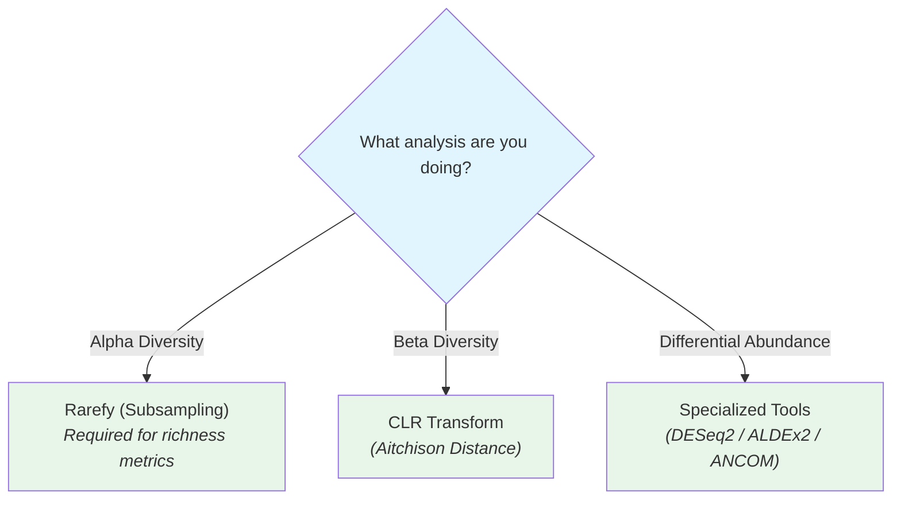
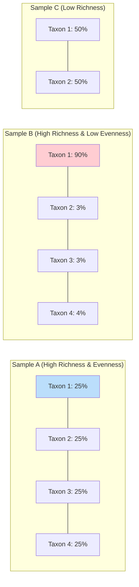

# DAY 3: Statistical Analysis, Diversity & Differential Abundance

## April 9th, 2026 | 09:00 AM - 17:30 PM

---

# SESSION 1: Data Pre-processing for Statistical Analysis (09:00 - 10:00)

---

## 1.1 Why Pre-processing Matters

Metagenomic data has unique statistical properties that standard methods cannot handle directly:

```
Challenge 1: COMPOSITIONALITY
────────────────────────────
   Relative abundances always sum to 1 (or 100%)
   If Taxon A increases, others MUST decrease — even if they didn't change
   
   Sample 1: [A=50%, B=30%, C=20%]  ← Actual: A=500, B=300, C=200
   Sample 2: [A=25%, B=37.5%, C=37.5%]  ← Actual: A=500, B=750, C=750
   
   A looks like it DECREASED (50%→25%), but its absolute count didn't change!

Challenge 2: ZERO INFLATION
────────────────────────────
   Most taxa are absent from most samples
   Typical dataset: 50-90% zeros
   Are zeros "truly absent" or "below detection limit"?

Challenge 3: HIGH DIMENSIONALITY
────────────────────────────────
   Hundreds to thousands of taxa
   But only tens to hundreds of samples
   More variables than observations → overfitting risk

Challenge 4: UNEVEN LIBRARY SIZES
──────────────────────────────────
   Sample A: 100,000 reads
   Sample B:  10,000 reads
   Sample B appears less diverse simply due to fewer reads
```

---

## 1.2 Normalization Methods

### Method 1: Rarefaction (Subsampling)

Randomly subsample all samples to the **same read count** (the minimum across samples).

```python
import numpy as np
import pandas as pd

def rarefy(counts, depth):
    """Rarefy a count vector to a given depth."""
    if counts.sum() < depth:
        return None  # Sample too shallow
    reads = np.repeat(np.arange(len(counts)), counts)
    subsample = np.random.choice(reads, size=depth, replace=False)
    rarefied = np.bincount(subsample, minlength=len(counts))
    return rarefied

# Example
counts = pd.read_csv("feature_table.tsv", sep="\t", index_col=0)

# Choose rarefaction depth
sample_depths = counts.sum(axis=1)
print(f"Min depth: {sample_depths.min()}")
print(f"Median depth: {sample_depths.median():.0f}")
print(f"Max depth: {sample_depths.max()}")

# Rarefy to minimum depth
depth = int(sample_depths.min())
rarefied = counts.apply(lambda x: pd.Series(rarefy(x.values, depth), 
                                             index=x.index), axis=1)
```

| Pros | Cons |
|------|------|
| Simple and intuitive | Discards data (wasteful) |
| Controls for unequal sequencing depth | Non-deterministic (random) |
| Well-established in ecology | Reduces statistical power |
| Required for some diversity metrics | Loses rare taxa |

> **When to use:** Alpha diversity calculations, initial exploratory analyses

### Method 2: Total Sum Scaling (TSS) / Relative Abundance

Simply divide by total reads per sample.

```python
# TSS normalization
relative_abundance = counts.div(counts.sum(axis=1), axis=0)
# Each row now sums to 1.0
```

| Pros | Cons |
|------|------|
| Simplest transformation | Doesn't address compositionality |
| Preserves all data | Affected by dominant taxa |
| Intuitive interpretation | Not suitable for parametric tests |

### Method 3: Centered Log-Ratio (CLR) Transform

The **gold standard** for compositional data. Projects data from the simplex into real Euclidean space.

```python
from scipy.stats import gmean

def clr_transform(counts_df, pseudocount=0.5):
    """
    Centered Log-Ratio transformation.
    Handles compositionality by log-transforming relative to geometric mean.
    """
    # Add pseudocount for zeros
    data = counts_df + pseudocount
    
    # Calculate geometric mean per sample
    gm = gmean(data, axis=1)
    
    # CLR = log(value / geometric_mean)
    clr = np.log(data.div(gm, axis=0))
    
    return clr

clr_data = clr_transform(counts)
```

**Mathematical explanation:**
```
For a composition x = [x₁, x₂, ..., xₙ]:

  CLR(xᵢ) = log(xᵢ / g(x))

  where g(x) = (x₁ × x₂ × ... × xₙ)^(1/n) is the geometric mean

This makes the data:
  ✓ Symmetric (no directional bias)
  ✓ Scale-invariant (not affected by total reads)
  ✓ Suitable for standard statistical methods (PCA, t-test, etc.)
```

| Pros | Cons |
|------|------|
| Mathematically correct for compositional data | Requires pseudocount for zeros |
| Compatible with standard statistics | Choice of pseudocount affects results |
| Preserves relationships between taxa | Harder to interpret than proportions |

### Method 4: CSS (Cumulative Sum Scaling) — metagenomeSeq

```R
# In R using metagenomeSeq
library(metagenomeSeq)

# Create MRexperiment object
mr_obj <- newMRexperiment(counts_matrix)

# Estimate normalization percentile
p <- cumNormStatFast(mr_obj)

# Normalize
mr_obj <- cumNorm(mr_obj, p = p)

# Extract normalized counts
normalized <- MRcounts(mr_obj, norm = TRUE, log = TRUE)
```

### Method 5: DESeq2 Variance Stabilizing Transformation (VST)

```R
library(DESeq2)

# Create DESeq2 object
dds <- DESeqDataSetFromMatrix(
  countData = counts_matrix,
  colData = metadata,
  design = ~ condition
)

# Variance stabilizing transformation
vsd <- varianceStabilizingTransformation(dds, blind = TRUE)
normalized <- assay(vsd)
```

### Choosing the Right Normalization



---

## 1.3 Handling Zeros

### Types of Zeros

| Type | Meaning | Treatment |
|------|---------|-----------|
| **Structural zeros** | Taxon truly absent (different environment) | Leave as zero |
| **Sampling zeros** | Taxon present but not detected (insufficient depth) | Impute or pseudocount |
| **Rounding zeros** | Present below detection limit | Impute or pseudocount |

### Zero Replacement Strategies

```python
# Strategy 1: Simple pseudocount (most common)
data_pseudo = counts + 0.5  # or +1

# Strategy 2: Multiplicative replacement (Aitchison)
from skbio.stats.composition import multiplicative_replacement
data_replaced = multiplicative_replacement(counts.values)

# Strategy 3: Bayesian-multiplicative (cmultRepl in R)
# Best for compositional data analysis
```

---

## 1.4 Filtering Low-Prevalence and Low-Abundance Taxa

Before analysis, remove taxa that:
1. Appear in too few samples (likely noise)
2. Have very low counts (unreliable)

```python
# Filter: keep taxa present in at least 10% of samples with at least 5 reads
min_prevalence = 0.10
min_count = 5

prevalence = (counts >= min_count).sum(axis=0) / counts.shape[0]
filtered_counts = counts.loc[:, prevalence >= min_prevalence]

print(f"Before filtering: {counts.shape[1]} taxa")
print(f"After filtering:  {filtered_counts.shape[1]} taxa")
# Typical: removes 30-60% of taxa (mostly rare/noisy)
```

```R
# In R with phyloseq
library(phyloseq)

# Filter taxa present in at least 10% of samples
ps_filtered <- filter_taxa(physeq, function(x) {
  sum(x > 5) >= (0.10 * nsamples(physeq))
}, prune = TRUE)
```

---

# SESSION 2: Diversity & Differential Abundance Testing (10:15 - 12:00)

---

## 2.1 Alpha Diversity — Within-Sample Diversity

### Concept

Alpha diversity measures how diverse a **single sample** is. Three key aspects:

```
RICHNESS:  How many different species?    ← Observed Features
EVENNESS:  How equally are they spread?   ← Pielou's E
BOTH:      Combined richness + evenness   ← Shannon, Simpson
```

### Visual Example



> [!NOTE]
> **Shannon Index:** High in Sample A (~1.39), Low in Sample B (~0.51).
> **Observed Features:** Same for A and B (4), but lower for C (2).

### Alpha Diversity Metrics Deep Dive

#### Observed Features (Richness)
```
Simply: count of unique taxa present
Observed = number of taxa with count > 0
```

#### Shannon Index (H')
```
H' = -Σ pᵢ × ln(pᵢ)

where pᵢ = relative abundance of taxon i

Properties:
  - Ranges from 0 (one taxon) to ln(S) where S = number of taxa
  - Sensitive to both richness and evenness
  - Most commonly reported metric
  - Typical gut microbiome: H' ≈ 2.5-4.5
```

#### Simpson Index (1-D)
```
1-D = 1 - Σ pᵢ²

Properties:
  - Ranges from 0 (one taxon dominates) to 1 (even community)
  - Gives more weight to abundant species
  - Less sensitive to rare taxa than Shannon
```

#### Faith's Phylogenetic Diversity (PD)
```
PD = sum of branch lengths connecting all observed taxa in phylogenetic tree

Properties:
  - Incorporates evolutionary relationships
  - Two distantly-related taxa contribute more than two closely-related
  - Requires a phylogenetic tree
```

#### Pielou's Evenness (J')
```
J' = H' / ln(S)

where H' = Shannon index, S = number of observed taxa

Properties:
  - Ranges from 0 (completely uneven) to 1 (perfectly even)
  - Separates the evenness component from Shannon
```

### Calculating Alpha Diversity in R (phyloseq)

```R
library(phyloseq)
library(ggplot2)
library(vegan)

# Load data into phyloseq
otu_table <- read.csv("feature_table.tsv", sep="\t", row.names=1)
tax_table <- read.csv("taxonomy.tsv", sep="\t", row.names=1)
metadata  <- read.csv("metadata.tsv", sep="\t", row.names=1)

ps <- phyloseq(
  otu_table(as.matrix(otu_table), taxa_are_rows = TRUE),
  tax_table(as.matrix(tax_table)),
  sample_data(metadata)
)

# Rarefy to even depth
set.seed(42)
ps_rarefied <- rarefy_even_depth(ps, sample.size = min(sample_sums(ps)))

# Calculate alpha diversity
alpha_div <- estimate_richness(ps_rarefied, 
                                measures = c("Observed", "Shannon", "Simpson"))

# Add metadata
alpha_div$SampleID <- rownames(alpha_div)
alpha_div <- merge(alpha_div, metadata, by.x = "SampleID", by.y = "row.names")

# Plot
p <- plot_richness(ps_rarefied, x = "condition", 
                    measures = c("Observed", "Shannon", "Simpson"),
                    color = "condition") +
  geom_boxplot(alpha = 0.6) +
  theme_bw() +
  theme(axis.text.x = element_text(angle = 45, hjust = 1))

ggsave("alpha_diversity.png", p, width = 10, height = 6, dpi = 300)
```

### Statistical Testing for Alpha Diversity

```R
# Test: Is Shannon diversity different between groups?

# Check normality first
shapiro.test(alpha_div$Shannon[alpha_div$condition == "healthy"])
shapiro.test(alpha_div$Shannon[alpha_div$condition == "disease"])

# If normal → t-test (2 groups) or ANOVA (>2 groups)
t.test(Shannon ~ condition, data = alpha_div)

# If NOT normal → Wilcoxon/Mann-Whitney (2 groups) or Kruskal-Wallis (>2)
wilcox.test(Shannon ~ condition, data = alpha_div)

# For >2 groups:
kruskal.test(Shannon ~ condition, data = alpha_div)
# If significant, do pairwise Wilcoxon tests:
pairwise.wilcox.test(alpha_div$Shannon, alpha_div$condition, 
                      p.adjust.method = "BH")
```

---

## 2.2 Beta Diversity — Between-Sample Diversity

### Concept

Beta diversity measures how **different** two samples are from each other. The result is a **distance matrix** (samples × samples).

```
                Sample1  Sample2  Sample3  Sample4
    Sample1      0.00     0.35     0.72     0.68
    Sample2      0.35     0.00     0.81     0.75
    Sample3      0.72     0.81     0.00     0.15
    Sample4      0.68     0.75     0.15     0.00

Reading: Sample3 and Sample4 are very similar (0.15)
         Sample2 and Sample3 are very different (0.81)
```

### Beta Diversity Metrics

#### Bray-Curtis Dissimilarity
```
BC(A,B) = 1 - (2 × Σ min(Aᵢ, Bᵢ)) / (Σ Aᵢ + Σ Bᵢ)

- Uses abundances (not just presence/absence)
- Ranges from 0 (identical) to 1 (completely different)
- Does NOT consider phylogeny
- Most commonly used metric
```

#### Jaccard Distance
```
J(A,B) = 1 - |A ∩ B| / |A ∪ B|

- Presence/absence only (ignores abundance)
- Ranges from 0 (identical) to 1 (no shared taxa)
```

#### UniFrac Distances (Require Phylogenetic Tree)

```
Unweighted UniFrac:
  Fraction of phylogenetic tree NOT shared between samples
  = (unique branch length) / (total branch length)
  → Sensitive to rare/unique taxa (presence/absence)

Weighted UniFrac:
  Branch lengths weighted by abundance differences
  → Sensitive to dominant taxa abundance shifts
```

### Calculating Beta Diversity in R

```R
library(vegan)
library(phyloseq)

# Calculate distance matrices
bc_dist <- distance(ps_rarefied, method = "bray")
jaccard_dist <- distance(ps_rarefied, method = "jaccard", binary = TRUE)
unifrac_dist <- UniFrac(ps_rarefied, weighted = FALSE)
wunifrac_dist <- UniFrac(ps_rarefied, weighted = TRUE)
```

### Ordination (Dimensionality Reduction for Visualization)

```R
# PCoA (Principal Coordinates Analysis) — most common for microbiome
pcoa_bc <- ordinate(ps_rarefied, method = "PCoA", distance = bc_dist)

# Plot
plot_ordination(ps_rarefied, pcoa_bc, color = "condition", shape = "body_site") +
  geom_point(size = 3, alpha = 0.7) +
  stat_ellipse(level = 0.95) +
  theme_bw() +
  ggtitle("PCoA of Bray-Curtis Distances")

ggsave("pcoa_bray_curtis.png", width = 8, height = 6, dpi = 300)

# NMDS (Non-Metric Multidimensional Scaling) — preserves rank order
nmds_bc <- ordinate(ps_rarefied, method = "NMDS", distance = bc_dist)
# Stress < 0.2 is acceptable; < 0.1 is good

plot_ordination(ps_rarefied, nmds_bc, color = "condition") +
  geom_point(size = 3) +
  theme_bw() +
  annotate("text", x = Inf, y = Inf, hjust = 1, vjust = 1,
           label = paste("Stress:", round(nmds_bc$stress, 3)))
```

### Statistical Testing for Beta Diversity

#### PERMANOVA (adonis2) — The Primary Test

"Do groups differ in their overall community composition?"

```R
# PERMANOVA — tests whether group centroids differ
# This is the MOST IMPORTANT statistical test in microbiome studies

result <- adonis2(bc_dist ~ condition + sex + age, 
                   data = as(sample_data(ps_rarefied), "data.frame"),
                   permutations = 999)

print(result)

# Output interpretation:
#            Df SumsOfSqs MeanSqs F.Model R2      Pr(>F)
# condition   1   2.345    2.345   5.67   0.15    0.001 ***
# sex         1   0.456    0.456   1.10   0.03    0.312
# age         1   0.789    0.789   1.91   0.05    0.045 *
# Residual   46  19.012    0.413         0.77
# Total      49  22.602                  1.00

# R² = proportion of variance explained
# Pr(>F) = p-value (significant if < 0.05)
# Condition explains 15% of community variation (p=0.001) ← significant!
```

#### PERMDISP — Test for Homogeneity of Dispersions

**Critical companion to PERMANOVA.** PERMANOVA can be significant due to:
1. Different group locations (what we want) OR
2. Different group dispersions (unequal spread)

```R
# Test if groups have equal dispersion
bd <- betadisper(bc_dist, sample_data(ps_rarefied)$condition)
permutest(bd, permutations = 999)

# If significant → groups have unequal dispersion
# → PERMANOVA results should be interpreted with caution
# If not significant → PERMANOVA result is reliable

# Visualize dispersions
plot(bd, main = "Dispersion by Condition")
boxplot(bd, main = "Distance to Centroid")
```

#### ANOSIM — Analysis of Similarities

```R
anosim_result <- anosim(bc_dist, sample_data(ps_rarefied)$condition,
                         permutations = 999)
print(anosim_result)
# R statistic: ranges from -1 to 1
# R close to 1 = strong separation between groups
# R close to 0 = no difference
```

---

## 2.3 Differential Abundance Testing

"Which specific taxa are more or less abundant between conditions?"

### Why Not Just Use t-Tests?

```
Problem: If you test 500 taxa with t-tests at p < 0.05:
  Expected false positives = 500 × 0.05 = 25 taxa!
  
Solution: Multiple testing correction AND specialized methods
```

### Method 1: DESeq2 (Recommended for Most Studies)

DESeq2 was developed for RNA-seq but works excellently for microbiome data. It handles:
- Library size differences
- Zero inflation
- Overdispersion

```R
library(DESeq2)

# Convert phyloseq to DESeq2
dds <- phyloseq_to_deseq2(ps, ~ condition)

# Run DESeq2
dds <- DESeq(dds, test = "Wald", fitType = "parametric")

# Extract results
res <- results(dds, contrast = c("condition", "disease", "healthy"),
               alpha = 0.05)

# Summary
summary(res)

# Convert to data frame and add taxonomy
res_df <- as.data.frame(res) %>%
  mutate(taxon = rownames(.)) %>%
  filter(!is.na(padj)) %>%
  arrange(padj)

# Merge with taxonomy
tax <- as.data.frame(tax_table(ps))
res_df <- merge(res_df, tax, by.x = "taxon", by.y = "row.names")

# Significant taxa (adjusted p < 0.05)
sig_taxa <- res_df %>% filter(padj < 0.05)
print(paste("Significant taxa:", nrow(sig_taxa)))

# Enriched in disease
enriched <- sig_taxa %>% filter(log2FoldChange > 0)
# Depleted in disease  
depleted <- sig_taxa %>% filter(log2FoldChange < 0)
```

### Volcano Plot

```R
library(ggplot2)
library(ggrepel)

# Prepare data
res_df$significance <- ifelse(res_df$padj < 0.05 & abs(res_df$log2FoldChange) > 1,
                               ifelse(res_df$log2FoldChange > 0, "Enriched", "Depleted"),
                               "Not significant")

# Volcano plot
ggplot(res_df, aes(x = log2FoldChange, y = -log10(padj), color = significance)) +
  geom_point(alpha = 0.6, size = 2) +
  scale_color_manual(values = c("Enriched" = "red", 
                                 "Depleted" = "blue",
                                 "Not significant" = "grey")) +
  geom_hline(yintercept = -log10(0.05), linetype = "dashed", color = "grey40") +
  geom_vline(xintercept = c(-1, 1), linetype = "dashed", color = "grey40") +
  geom_text_repel(data = subset(res_df, padj < 0.01 & abs(log2FoldChange) > 2),
                  aes(label = Genus), size = 3, max.overlaps = 15) +
  theme_bw() +
  labs(x = "log2 Fold Change (Disease vs Healthy)",
       y = "-log10(adjusted p-value)",
       title = "Differential Abundance: Disease vs Healthy") +
  theme(legend.position = "bottom")

ggsave("volcano_plot.png", width = 10, height = 8, dpi = 300)
```

### Method 2: ALDEx2 (Designed for Compositional Data)

ALDEx2 is specifically designed for compositional microbiome data. It uses CLR transformation internally.

```R
library(ALDEx2)

# Run ALDEx2
# Input: raw counts (taxa × samples)
aldex_result <- aldex(
  reads = as.data.frame(otu_table(ps)),
  conditions = as.character(sample_data(ps)$condition),
  mc.samples = 128,        # Monte Carlo instances
  test = "t",              # Welch's t-test
  effect = TRUE,           # Calculate effect sizes
  include.sample.summary = FALSE,
  denom = "all"            # CLR denominator
)

# Filter significant results
# Use 'wi.eBH' (Welch's t-test, BH-corrected) and effect size
aldex_sig <- aldex_result %>%
  filter(wi.eBH < 0.05, abs(effect) > 1)

# ALDEx2 MA plot
aldex.plot(aldex_result, type = "MW", test = "welch",
           main = "ALDEx2 Differential Abundance")
```

### Method 3: ANCOM-BC (Composition-Aware)

```R
library(ANCOMBC)

# Run ANCOM-BC2
ancom_result <- ancombc2(
  data = ps,
  fix_formula = "condition",
  p_adj_method = "BH",
  alpha = 0.05,
  group = "condition"
)

# Extract results
ancom_res <- ancom_result$res

# Significant taxa
sig <- ancom_res %>% filter(q_conditiondisease < 0.05)
```

### Comparing Methods

| Method | Handles Compositionality | Zero Handling | Best For |
|--------|-------------------------|---------------|----------|
| **DESeq2** | Partial (GLM) | Built-in | Standard differential abundance |
| **ALDEx2** | Yes (CLR) | Monte Carlo | Conservative, fewer false positives |
| **ANCOM-BC** | Yes (bias correction) | Structural zeros | Rigorous compositional analysis |
| **MaAsLin2** | Yes (various) | Built-in | Multivariable models |
| **LEfSe** | No | None | Quick exploratory (not for publication) |

> **Best practice:** Use at least two methods and report taxa significant in both (consensus approach).

---

## 2.4 Putting It All Together: Complete Analysis Workflow in R

```R
# ════════════════════════════════════════════════════════════
# COMPLETE STATISTICAL ANALYSIS WORKFLOW
# ════════════════════════════════════════════════════════════

library(phyloseq)
library(vegan)
library(DESeq2)
library(ggplot2)
library(dplyr)

# ── Step 1: Load Data ──────────────────────────────────────
otu <- read.csv("feature_table.tsv", sep="\t", row.names=1, check.names=FALSE)
tax <- read.csv("taxonomy.tsv", sep="\t", row.names=1)
meta <- read.csv("metadata.tsv", sep="\t", row.names=1)
tree <- read_tree("rooted_tree.nwk")

ps <- phyloseq(
  otu_table(as.matrix(otu), taxa_are_rows = TRUE),
  tax_table(as.matrix(tax)),
  sample_data(meta),
  phy_tree(tree)
)
cat("Loaded:", ntaxa(ps), "taxa,", nsamples(ps), "samples\n")

# ── Step 2: Filter ─────────────────────────────────────────
# Remove taxa with < 10 total reads or present in < 10% of samples
ps_filt <- filter_taxa(ps, function(x) sum(x) >= 10, prune = TRUE)
ps_filt <- filter_taxa(ps_filt, function(x) {
  sum(x > 0) >= 0.1 * nsamples(ps_filt)
}, prune = TRUE)
cat("After filtering:", ntaxa(ps_filt), "taxa remain\n")

# ── Step 3: Alpha Diversity ────────────────────────────────
ps_rare <- rarefy_even_depth(ps_filt, sample.size = min(sample_sums(ps_filt)),
                              rngseed = 42)

alpha <- estimate_richness(ps_rare, measures = c("Observed","Shannon","Simpson"))
alpha$condition <- sample_data(ps_rare)$condition

# Statistical tests
cat("\n=== ALPHA DIVERSITY TESTS ===\n")
for(metric in c("Observed", "Shannon", "Simpson")) {
  test <- wilcox.test(as.formula(paste(metric, "~ condition")), data = alpha)
  cat(sprintf("%s: W=%.0f, p=%.4f %s\n", 
              metric, test$statistic, test$p.value,
              ifelse(test$p.value < 0.05, "*", "ns")))
}

# ── Step 4: Beta Diversity ─────────────────────────────────
bc_dist <- distance(ps_rare, method = "bray")
wuf_dist <- UniFrac(ps_rare, weighted = TRUE)

# PERMANOVA
cat("\n=== PERMANOVA (Bray-Curtis) ===\n")
perm_result <- adonis2(bc_dist ~ condition, 
                        data = as(sample_data(ps_rare), "data.frame"),
                        permutations = 999)
print(perm_result)

# PERMDISP
cat("\n=== PERMDISP ===\n")
bd <- betadisper(bc_dist, sample_data(ps_rare)$condition)
print(permutest(bd))

# PCoA ordination
pcoa <- ordinate(ps_rare, "PCoA", bc_dist)
p_pcoa <- plot_ordination(ps_rare, pcoa, color = "condition") +
  geom_point(size = 3) +
  stat_ellipse(level = 0.95) +
  theme_bw() +
  ggtitle(sprintf("PCoA Bray-Curtis (PERMANOVA R²=%.2f, p=%.3f)",
                  perm_result$R2[1], perm_result$`Pr(>F)`[1]))
ggsave("pcoa.png", p_pcoa, width = 8, height = 6, dpi = 300)

# ── Step 5: Differential Abundance (DESeq2) ────────────────
dds <- phyloseq_to_deseq2(ps_filt, ~ condition)
dds <- DESeq(dds)
res <- results(dds, contrast = c("condition", "disease", "healthy"), alpha = 0.05)

sig <- as.data.frame(res) %>%
  filter(!is.na(padj), padj < 0.05) %>%
  arrange(padj)

cat(sprintf("\n=== DESeq2: %d significant taxa (padj < 0.05) ===\n", nrow(sig)))
cat(sprintf("  Enriched in disease: %d\n", sum(sig$log2FoldChange > 0)))
cat(sprintf("  Depleted in disease: %d\n", sum(sig$log2FoldChange < 0)))

# ── Step 6: Save All Results ───────────────────────────────
write.csv(alpha, "results/alpha_diversity.csv")
write.csv(as.data.frame(res), "results/deseq2_results.csv")
cat("\nAnalysis complete! Results saved to results/ directory.\n")
```

---

# SESSION 3: Hands-on — Applying Statistical Methods to Demo Data (13:30 - 14:30)

---

## 3.1 Guided Exercise: Human Gut Microbiome Case Study

### Scenario

You have 16S amplicon data from a study comparing the gut microbiome of:
- **30 healthy controls**
- **30 patients with inflammatory bowel disease (IBD)**

Metadata includes: age, sex, BMI, diet type, medication use

### Step-by-Step Guided Analysis

```R
# ══════════════════════════════════════════════════
# GUIDED EXERCISE: IBD vs Healthy Gut Microbiome
# ══════════════════════════════════════════════════

# Load the demo dataset (provided by instructors)
load("demo_data/ibd_phyloseq.RData")  # loads object 'ps_ibd'

# ── EXERCISE 1: Explore the data (5 min) ──────────
cat("Samples:", nsamples(ps_ibd), "\n")
cat("Taxa:", ntaxa(ps_ibd), "\n")
cat("Sample variables:", sample_variables(ps_ibd), "\n")

# Check the distribution of samples
table(sample_data(ps_ibd)$diagnosis)
# Expected: Healthy=30, IBD=30

# Check sequencing depth
summary(sample_sums(ps_ibd))

# ── EXERCISE 2: Alpha Diversity (10 min) ──────────
# Question: Is the IBD gut less diverse than healthy?

ps_rare <- rarefy_even_depth(ps_ibd, rngseed = 42)

p_alpha <- plot_richness(ps_rare, x = "diagnosis",
                          measures = c("Observed", "Shannon"),
                          color = "diagnosis") +
  geom_boxplot(alpha = 0.3) +
  theme_bw() +
  scale_color_manual(values = c("Healthy" = "forestgreen", "IBD" = "firebrick"))

# YOUR TURN: Run the Wilcoxon test
# wilcox.test(Shannon ~ diagnosis, data = ???)

# ── EXERCISE 3: Beta Diversity (10 min) ───────────
# Question: Do IBD and healthy samples form distinct clusters?

bc <- distance(ps_rare, "bray")
pcoa_res <- ordinate(ps_rare, "PCoA", bc)

p_beta <- plot_ordination(ps_rare, pcoa_res, color = "diagnosis") +
  geom_point(size = 3) +
  stat_ellipse(level = 0.95) +
  theme_bw()

# YOUR TURN: Run PERMANOVA
# adonis2(bc ~ diagnosis, data = ???)

# ── EXERCISE 4: Find differentially abundant taxa (10 min) ──
# Question: Which taxa drive the IBD-healthy difference?

dds <- phyloseq_to_deseq2(ps_ibd, ~ diagnosis)
dds <- DESeq(dds)
res <- results(dds, contrast = c("diagnosis", "IBD", "Healthy"))

# YOUR TURN: Filter significant results and identify top taxa
# What genera are most enriched in IBD?
# What genera are most depleted in IBD?

# ── EXERCISE 5: Interpretation (10 min) ───────────
# Based on your results, write 3-5 sentences answering:
# 1. Is alpha diversity different between IBD and healthy?
# 2. Do IBD samples cluster separately in beta diversity?
# 3. Which taxa are the strongest biomarkers?
# 4. Do your findings align with known IBD literature?
```

### Expected Findings (Discussion Points)

| Finding | Typical Result | Biological Explanation |
|---------|---------------|----------------------|
| Alpha diversity | **Lower in IBD** | Inflammation reduces microbial niches |
| Beta diversity | **IBD clusters separately** (p < 0.001) | Dysbiosis restructures the community |
| Enriched in IBD | *Escherichia*, *Fusobacterium*, *Ruminococcus gnavus* | Inflammation-tolerant, pathobionts |
| Depleted in IBD | *Faecalibacterium*, *Roseburia*, *Bacteroides* | Butyrate producers, anti-inflammatory |

---

## Day 3 Assignment

### Task: Complete Statistical Analysis

Using the provided demo dataset:
1. Pre-process data (filter, normalize)
2. Calculate and compare alpha diversity between groups (at least 2 metrics)
3. Perform beta diversity analysis with ordination plot
4. Run PERMANOVA to test for group differences
5. Identify differentially abundant taxa using DESeq2
6. Create a volcano plot of differential abundance results

**Deliverable:** A short report (1-2 pages) with:
- Alpha diversity boxplots + statistical test results
- PCoA/NMDS ordination plot
- PERMANOVA results table
- Volcano plot
- Top 10 differentially abundant taxa (table)
- 3-5 sentence biological interpretation

---

## Day 3 Key Takeaways

```
┌─────────────────────────────────────────────────────────────────┐
│                        DAY 3 SUMMARY                            │
├─────────────────────────────────────────────────────────────────┤
│                                                                 │
│  1. Microbiome data is COMPOSITIONAL — use appropriate methods  │
│                                                                 │
│  2. Normalization: rarefy for diversity; CLR for statistics      │
│                                                                 │
│  3. Alpha diversity = within-sample (Shannon, Faith's PD)       │
│     Beta diversity = between-sample (Bray-Curtis, UniFrac)      │
│                                                                 │
│  4. PERMANOVA = the primary test for community-level difference │
│     Always pair with PERMDISP to check assumptions              │
│                                                                 │
│  5. Differential abundance: use DESeq2 + ALDEx2 (consensus)    │
│                                                                 │
│  6. Multiple testing correction is NOT optional                 │
│                                                                 │
│  7. Results must be interpreted in biological context           │
│                                                                 │
└─────────────────────────────────────────────────────────────────┘
```

---

*Next: Open `Commands_CheatSheet.md` for quick reference →*
