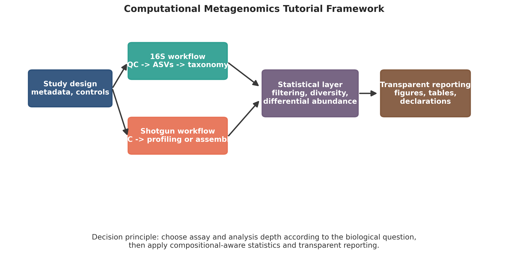
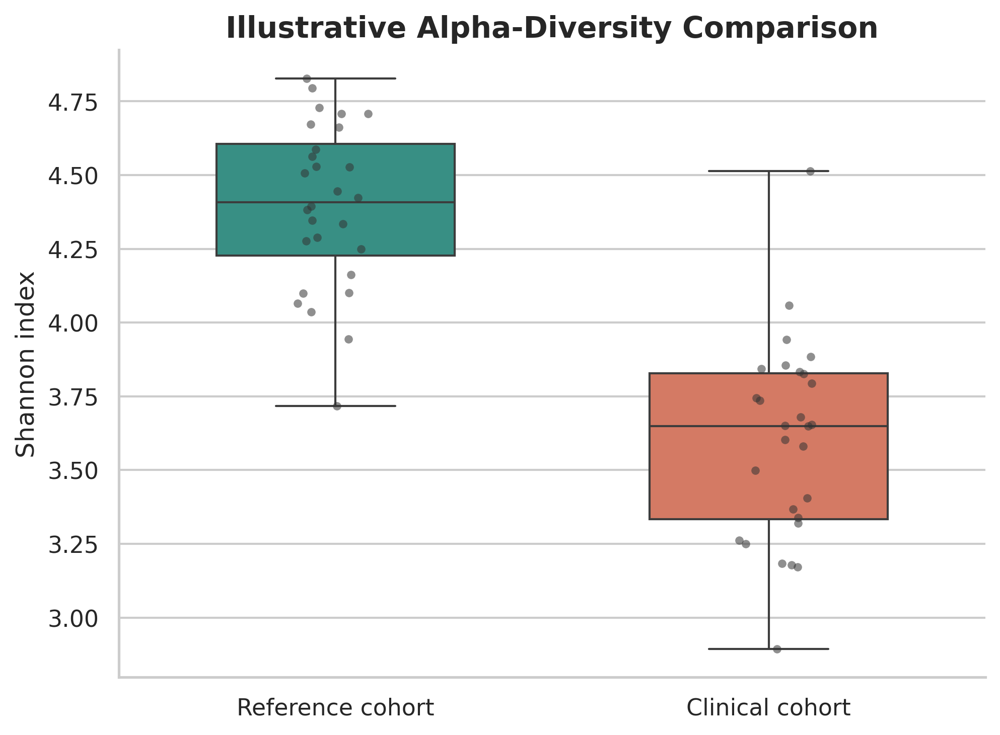
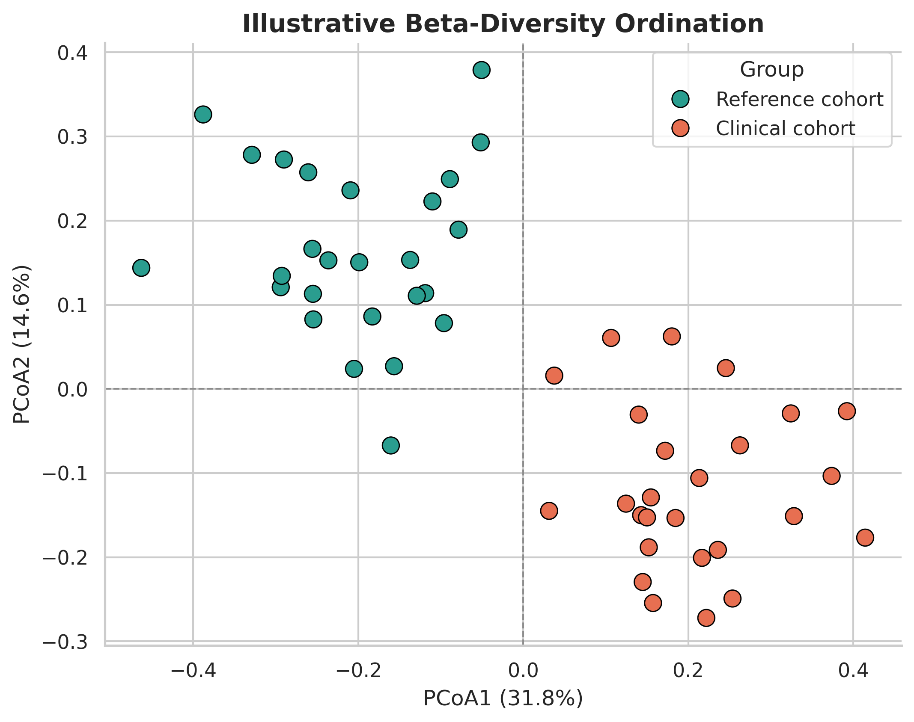
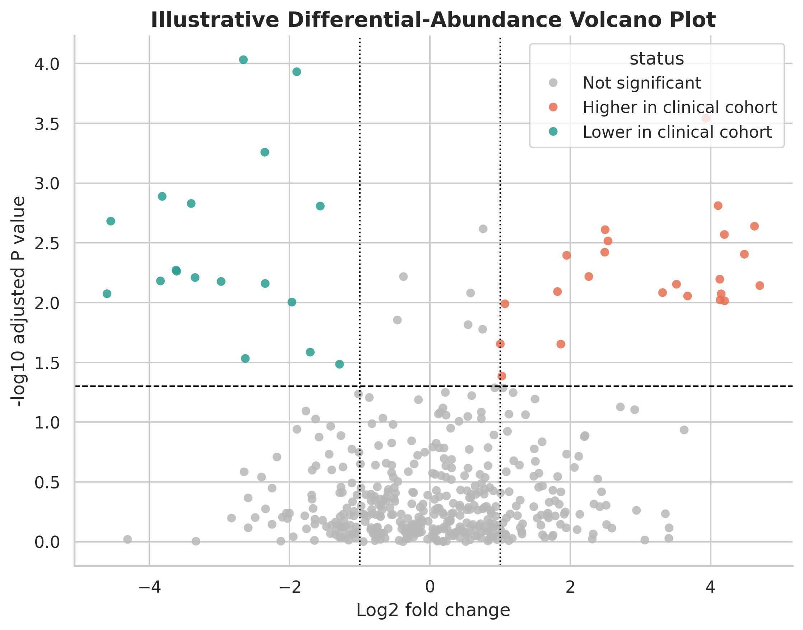

# Computational Metagenomics in Practice: A Tutorial Roadmap from 16S rRNA Amplicon Profiling to Shotgun Sequencing and Compositional Data Analysis

## Abstract
Computational metagenomics has become central to modern microbiome research, but many clinicians, biologists, and early-career investigators still face a fragmented learning path from raw sequencing files to defensible biological interpretation. This tutorial article presents a practical roadmap that connects study design, sequence processing, taxonomic and functional profiling, genome-resolved metagenomics, and statistical analysis in one coherent framework. We distinguish the major use-cases, strengths, and constraints of 16S rRNA amplicon sequencing and whole-metagenome shotgun sequencing, emphasizing that the choice of assay should follow the biological question rather than software availability. For amplicon data, we outline current best practice built around quality assessment, exact amplicon sequence variant inference, taxonomy assignment, contamination filtering, and diversity analysis. For shotgun data, we summarize read-based classification, host-read removal, assembly, binning, refinement, metagenome-assembled genome quality assessment, and functional annotation. We then review the statistical properties that make microbiome data analytically challenging, particularly compositionality, sparsity, uneven library size, and confounding by study design. Practical guidance is provided on when to use rarefaction, centered log-ratio transformation, Bray-Curtis or Aitchison geometry, PERMANOVA with dispersion checks, and differential abundance methods such as DESeq2, ALDEx2, and ANCOM-BC. Throughout, the article highlights common analytical errors, minimum reporting expectations, and reproducibility safeguards suitable for workshop-based training and manuscript preparation. The goal is not to prescribe a single pipeline, but to provide a defensible decision framework that helps researchers select appropriate methods and report them transparently.

## Keywords
Computational metagenomics; microbiome; 16S rRNA; shotgun metagenomics; QIIME 2; metagenome-assembled genomes; compositional data analysis; differential abundance

## 1. Introduction
Metagenomics was developed to study microbial communities without the need to isolate organisms in pure culture, thereby overcoming a major limitation of classical microbiology [1,2]. In practice, however, access to sequencing has grown faster than access to analytical training. Many investigators can generate FASTQ files, but remain uncertain about which sequencing strategy to choose, how to structure a bioinformatics workflow, and how to analyze count data without introducing avoidable bias.

The result is a recurrent pattern in the literature: methods are assembled from disconnected tutorials, software defaults are adopted without reference to the study question, and statistical outputs are reported without adequate discussion of compositionality, dispersion, contamination, or batch effects. These problems are especially visible in translational and teaching environments, where learners need a roadmap that is technically correct but still operational.

This article addresses that need. It synthesizes the workflow used in a three-day computational metagenomics training package into a publication-oriented tutorial for readers who want a clear progression from experimental planning to analysis and reporting. The emphasis is practical rather than encyclopedic. We focus on the reasoning behind method selection, the minimum quality checks that should accompany each stage, and the reporting elements needed to make microbiome studies interpretable and reproducible.

## 2. Positioning 16S Amplicon and Shotgun Metagenomics
The first major decision in a metagenomics study is whether the scientific question requires marker-gene profiling or whole-community sequencing. Although both assays describe microbial communities, they answer different questions and impose different analytical burdens.

Table: Comparison of the two dominant sequencing paradigms used in microbiome studies.

| Feature | 16S rRNA amplicon profiling | Whole-metagenome shotgun sequencing |
| --- | --- | --- |
| Primary objective | Community composition and broad taxonomic profiling | Taxonomic, functional, and genome-resolved characterization |
| Sequenced target | Amplified marker gene region | Random fragments of total DNA |
| Typical taxonomic resolution | Usually genus level, sometimes species level | Often species or strain level, depending on database and assembly quality |
| Functional inference | Indirect and model-based | Directly measurable from gene content |
| Host DNA burden | Usually low after targeted amplification | Often substantial; host-read depletion may be essential |
| Cost and compute demand | Lower | Higher |
| Common use-case | Screening, cohort comparison, exploratory community structure | Functional profiling, resistome analysis, MAG recovery, higher-resolution ecology |
| Main limitations | Primer bias, copy-number bias, limited functional insight | Higher cost, more complex preprocessing, greater computational requirements |

Amplicon sequencing remains useful for large cohort studies, pilot projects, and settings where the dominant goal is comparative community structure. Shotgun sequencing is preferable when the scientific question concerns pathways, virulence genes, antimicrobial resistance, strain diversity, or recovery of metagenome-assembled genomes (MAGs). The sequencing platform should therefore be chosen on the basis of the question, target environment, expected host contamination, available budget, and downstream interpretability.

## 3. Study Design and Reproducibility Before Sequence Analysis
Most irrecoverable problems in microbiome analysis occur before any software is run. Analytical rigor begins with study design, metadata quality, and reproducible computing.

### 3.1 Pre-analytical decisions that affect downstream validity
Sampling strategy, DNA extraction protocol, transport conditions, primer choice, and sequencing depth all influence the signal that reaches the computational pipeline. Negative controls, extraction blanks, and where possible positive controls should be incorporated into the design. For human or animal material, host background and contamination risk should be anticipated during both wet-lab and computational planning. Metadata should capture variables that can plausibly confound the microbiome, including age, sex, diet, medication exposure, disease state, geography, sampling time, storage duration, extraction batch, and sequencing run.

### 3.2 Reproducible computational environments
Microbiome workflows routinely combine command-line tools, reference databases, and statistical packages written in different languages. Environment management therefore matters. Conda or Mamba-based environments, containerized execution, and explicit version logging are strongly recommended. At a minimum, investigators should preserve:

1. the complete command history or pipeline script;
2. software versions and database versions;
3. raw input locations and output directories;
4. the metadata table used in statistical modeling.

For manuscript reporting, reproducibility also requires clarity about which steps were performed on raw reads, which objects were filtered, and which transformations were applied before inference.

## 4. Recommended Workflow for 16S rRNA Amplicon Analysis
The modern amplicon workflow is best understood as a sequence of decisions rather than a fixed list of commands: import data, assess quality, denoise, assign taxonomy, remove artifacts, summarize diversity, and test biological hypotheses in a way that matches the study design.

{ width=90% }

### 4.1 Quality assessment and denoising
Raw reads should be inspected for base-quality decay, adapter contamination, read-length truncation, and batch-level anomalies. QIIME 2 provides an accessible ecosystem for importing data, visualizing quality, denoising, and generating audit-ready artifacts [3]. DADA2 and Deblur replaced the older operational taxonomic unit paradigm in most current workflows because they infer exact amplicon sequence variants (ASVs) rather than clustering reads at an arbitrary similarity threshold [4].

ASV-based denoising improves reproducibility across studies and better preserves single-nucleotide biological variation. Trimming and truncation parameters should be selected from actual quality profiles, not copied from unrelated datasets. The retained overlap between paired reads must remain sufficient for merging; otherwise denoising will fail or discard large numbers of reads.

### 4.2 Taxonomy assignment and reference databases
Taxonomy assignment should be performed using a curated reference database appropriate to the primer region and taxonomic scope, such as SILVA or Greengenes2 where relevant. Readers should report the exact database release, classifier strategy, and region-specific training assumptions. Sequences classified as mitochondria, chloroplast, or obvious contaminants should be filtered before interpretation. Unassigned sequences should not be discarded reflexively; depending on the study environment, they may reflect reference incompleteness rather than technical failure.

### 4.3 Phylogeny-aware and count-based outputs
Amplicon workflows typically yield a feature table, representative sequences, taxonomy assignments, denoising statistics, and where relevant a rooted phylogenetic tree for UniFrac-based analyses. These outputs should be archived because they represent the bridge between sequence processing and ecological statistics.

### 4.4 Common errors in amplicon studies
Several recurring issues deserve explicit mention:

1. Primer choice determines which taxa can be detected and can bias relative abundance.
2. Copy-number variation in the 16S gene limits direct quantitative interpretation.
3. Batch effects and low-biomass contamination can dominate the signal if controls are absent.
4. Rare taxa are not necessarily noise, but low-prevalence filtering should be justified and reported.
5. Functional claims from 16S data are indirect and should be presented cautiously.

## 5. Recommended Workflow for Shotgun Metagenomics
Shotgun metagenomics is analytically broader than amplicon profiling and can proceed along read-based, assembly-based, or hybrid paths. The selected path should again follow the study question.

### 5.1 Read preprocessing and host-read removal
Shotgun reads should be evaluated for adapter content, quality degradation, read duplication, and overrepresented sequences using tools such as FastQC and MultiQC. Adapter trimming and quality trimming are standard preprocessing steps. In host-associated studies, host-read removal can be decisive because excess human or animal DNA reduces sequencing efficiency and can distort downstream taxonomic or functional summaries. The reference genome used for depletion, alignment thresholds, and percentage of removed reads should be reported.

### 5.2 Read-based taxonomic profiling
When the goal is rapid taxonomic profiling, read-based methods are often sufficient. Kraken2 classifies reads with a k-mer approach, and Bracken improves abundance estimation by redistributing ambiguous assignments across taxonomic levels [5,6]. This path is computationally efficient and useful for screening studies, surveillance applications, and comparisons across large cohorts. However, its performance depends strongly on the database and may be less informative for novel or poorly represented organisms.

### 5.3 Assembly, binning, and genome recovery
When investigators seek gene neighborhoods, mobile elements, or genomes from uncultured organisms, an assembly-based strategy is more informative. Assemblers such as MEGAHIT condense short reads into contigs, after which coverage and sequence composition can be used for binning with tools such as MetaBAT2 and MaxBin2. Consensus refinement with DAS Tool can improve the non-redundant bin set, especially in complex communities [7-10].

Table: Core stages in a genome-resolved shotgun metagenomics workflow.

| Stage | Representative tools | Purpose | Key reporting element |
| --- | --- | --- | --- |
| Quality control | FastQC, MultiQC, fastp, Trimmomatic | Assess and clean raw reads | Read counts before and after filtering |
| Host depletion | Bowtie2 or equivalent aligner | Remove host-derived reads | Host reference and proportion removed |
| Read-based profiling | Kraken2, Bracken | Rapid taxonomic abundance estimation | Database and taxonomic rank reported |
| Assembly | MEGAHIT, metaSPAdes | Reconstruct contigs from reads | Assembly statistics such as total bases and N50 |
| Binning | MetaBAT2, MaxBin2 | Group contigs into putative genomes | Inputs used for binning, including coverage evidence |
| Refinement | DAS Tool | Resolve overlapping or competing bins | Refinement criteria |
| Quality assessment | CheckM or CheckM2 | Estimate completeness and contamination | Quality thresholds for retained MAGs |
| Taxonomy and annotation | GTDB-Tk, Prokka, eggNOG-mapper | Classify and annotate bins | Reference database and annotation scope |

### 5.4 MAG quality and interpretation
Recovered bins should not be presented as genomes without quality assessment. CheckM and related tools estimate completeness and contamination using lineage-specific marker genes [11]. Reported MAG quality should be aligned to accepted community standards, and low-quality bins should be interpreted conservatively. Taxonomy assignment using genome-based frameworks such as GTDB-Tk is typically more robust than trying to infer placement solely from marker genes.

### 5.5 Functional annotation
Functional annotation can be performed at the read level or from assembled contigs and bins, depending on the study objective. Tools such as Prokka, eggNOG-mapper, HUMAnN, and KEGG- or COG-based mapping can support pathway interpretation, but the inferential level should be matched to the data. Read-level pathway abundance and genome-level gene annotation answer different biological questions and should not be conflated.

## 6. Statistical Analysis of Microbiome Data
Microbiome analysis is not a standard count-data problem. Sequence counts are constrained by library size, dominated by zeros, and strongly influenced by study design. Sound statistical analysis therefore requires explicit treatment of compositionality, filtering, distance choice, and covariate structure [12].

### 6.1 Compositionality and zero handling
Microbiome count tables describe relative information. An observed increase in one taxon can mechanically induce apparent decreases in others even if their absolute abundances did not change. This property makes naive interpretation of percentages problematic. Centered log-ratio (CLR) transformation provides a principled route from the simplex to Euclidean space, but requires careful treatment of zeros, often through pseudocounts or model-based replacement approaches.

Low-prevalence and extremely low-abundance features should generally be filtered before statistical modeling to reduce noise and multiple-testing burden. Filtering criteria should be decided prospectively where possible and reported explicitly.

### 6.2 Alpha diversity
Alpha diversity summarizes within-sample richness and evenness. Common metrics include observed features, Shannon diversity, Simpson diversity, and Faith's phylogenetic diversity where a tree is available. These metrics should be interpreted as ecological summaries rather than stand-alone biological conclusions.

{ width=75% }

For most workflows, rarefaction remains acceptable when the objective is alpha-diversity comparison because the goal is to compare samples at a common sequencing depth. Statistical testing should match the data distribution and study design. Group comparisons should be accompanied by effect size summaries, not only P values.

### 6.3 Beta diversity and community-level inference
Beta diversity addresses between-sample dissimilarity. Bray-Curtis is common for abundance-sensitive ecological comparison; Jaccard captures presence-absence contrast; UniFrac incorporates phylogeny; and Aitchison distance is often appropriate after CLR transformation. Ordination methods such as principal coordinates analysis are useful for visualization but should not be treated as tests by themselves.

{ width=80% }

PERMANOVA is widely used to test whether groups differ in multivariate community composition, but it should be paired with a dispersion check such as PERMDISP because significant results can arise from differences in within-group spread rather than shifts in centroid location. Where relevant, models should include important covariates such as age, sex, batch, antibiotic exposure, or sequencing run.

### 6.4 Differential abundance testing
No single differential abundance method is optimal for every dataset. DESeq2 remains widely used because it is accessible, flexible, and familiar to many analysts, although it was not developed specifically for compositional microbiome data [13]. ALDEx2 uses Monte Carlo instances of the Dirichlet distribution with CLR-based reasoning and is often more conservative [14]. ANCOM-BC provides a composition-aware alternative designed to reduce bias in estimated fold changes [15].

Table: Practical guidance for selecting common statistical strategies in microbiome studies.

| Analytical goal | Preferred input | Typical method | Important caution |
| --- | --- | --- | --- |
| Alpha diversity comparison | Rarefied feature table | Wilcoxon, t-test, ANOVA, Kruskal-Wallis as appropriate | Do not overinterpret one diversity metric in isolation |
| Beta diversity testing | Distance matrix from rarefied or transformed data | PERMANOVA plus PERMDISP | Significant PERMANOVA without dispersion check is incomplete |
| Ordination | Distance matrix or CLR-transformed table | PCoA, NMDS, PCA | Visualization is descriptive, not inferential |
| Differential abundance | Raw counts with metadata | DESeq2, ALDEx2, ANCOM-BC | Report filtering rules, multiple-testing control, and effect sizes |
| Compositional exploratory analysis | Zero-handled count table | CLR transformation, Aitchison geometry | Pseudocount choice can influence rare features |

{ width=82% }

For publication reporting, differential abundance results should include the model formula, covariates, multiple-testing method, filtering criteria, effect-size threshold if any, and the taxonomic rank used in interpretation.

## 7. Reporting Standards, Quality Checks, and Common Failure Modes
The strength of a computational metagenomics paper depends as much on transparent reporting as on software choice. At minimum, the following elements should be documented in the methods or supplementary materials:

1. study design, controls, and metadata structure;
2. sequencing strategy and target region if amplicon-based;
3. preprocessing steps and read-retention statistics;
4. reference databases and versions used for classification;
5. filtering thresholds for samples and taxa;
6. normalization or transformation strategy;
7. statistical models, covariates, and multiple-testing correction;
8. software versions and code or workflow availability.

Frequent analytical failure modes include treating relative abundance as absolute abundance, omitting contamination control, reporting PERMANOVA without dispersion testing, making mechanistic claims from 16S data alone, and presenting low-quality bins as organism-level discoveries. These are avoidable if the workflow is planned as an integrated system rather than a chain of disconnected tools.

## 8. Conclusion
Computational metagenomics is now mature enough that the main challenge for many investigators is no longer access to sequencing, but access to a coherent analytical framework. A defensible microbiome workflow should start with the study question, move through reproducible preprocessing, apply sequence-type-appropriate analysis, and end with statistics that respect the compositional and sparse nature of the data. By aligning assay selection, bioinformatics processing, and statistical inference, researchers can produce microbiome analyses that are more reproducible, more interpretable, and more suitable for publication.

## Declarations

### Author contributions
Dr Siddalingaiah H S conceived the article, synthesized the workshop-derived training material into manuscript form, and approved the final version.

### Funding
No external funding was declared for preparation of this manuscript.

### Competing interests
The author declares no competing interests.

### Ethics approval and consent to participate
Not applicable. This tutorial article does not report a new human-participant or animal experiment.

### Consent for publication
Not applicable.

### Availability of data and materials
No new dataset was generated or analyzed for this tutorial article. The figures included in the manuscript are educational schematics and formatted illustrative examples prepared for explanatory purposes.

### Acknowledgements
The manuscript draws educational context from a computational metagenomics workshop framework covering 16S amplicon analysis, shotgun metagenomics, and statistical interpretation.

### Author information
Dr Siddalingaiah H S, Professor, Community Medicine, Shridevi Institute of Medical Sciences and Research Hospital, Tumkur, India. ORCID: 0000-0002-4771-8285.

## References
1. Handelsman J, Rondon MR, Brady SF, Clardy J, Goodman RM. Molecular biological access to the chemistry of unknown soil microbes: a new frontier for natural products. Chem Biol. 1998;5(10):R245-R249.
2. Turnbaugh PJ, Ley RE, Hamady M, Fraser-Liggett CM, Knight R, Gordon JI. The human microbiome project. Nature. 2007;449(7164):804-810.
3. Bolyen E, Rideout JR, Dillon MR, et al. Reproducible, interactive, scalable and extensible microbiome data science using QIIME 2. Nat Biotechnol. 2019;37(8):852-857.
4. Callahan BJ, McMurdie PJ, Rosen MJ, Han AW, Johnson AJA, Holmes SP. DADA2: high-resolution sample inference from Illumina amplicon data. Nat Methods. 2016;13(7):581-583.
5. Wood DE, Lu J, Langmead B. Improved metagenomic analysis with Kraken 2. Genome Biol. 2019;20:257.
6. Lu J, Breitwieser FP, Thielen P, Salzberg SL. Bracken: estimating species abundance in metagenomics data. PeerJ Comput Sci. 2017;3:e104.
7. Li D, Liu CM, Luo R, Sadakane K, Lam TW. MEGAHIT: an ultra-fast single-node solution for large and complex metagenomics assembly via succinct de Bruijn graph. Bioinformatics. 2015;31(10):1674-1676.
8. Kang DD, Li F, Kirton E, et al. MetaBAT 2: an adaptive binning algorithm for robust and efficient genome reconstruction from metagenome assemblies. PeerJ. 2019;7:e7359.
9. Wu YW, Simmons BA, Singer SW. MaxBin 2.0: an automated binning algorithm to recover genomes from multiple metagenomic datasets. Bioinformatics. 2016;32(4):605-607.
10. Sieber CMK, Probst AJ, Sharrar A, et al. Recovery of genomes from metagenomes via a dereplication, aggregation and scoring strategy. Nat Microbiol. 2018;3(7):836-843.
11. Parks DH, Imelfort M, Skennerton CT, Hugenholtz P, Tyson GW. CheckM: assessing the quality of microbial genomes recovered from isolates, single cells, and metagenomes. Genome Res. 2015;25(7):1043-1055.
12. Gloor GB, Macklaim JM, Pawlowsky-Glahn V, Egozcue JJ. Microbiome datasets are compositional: and this is not optional. Front Microbiol. 2017;8:2224.
13. Love MI, Huber W, Anders S. Moderated estimation of fold change and dispersion for RNA-seq data with DESeq2. Genome Biol. 2014;15(12):550.
14. Fernandes AD, Reid JNS, Macklaim JM, et al. Unifying the analysis of high-throughput sequencing datasets: characterizing RNA-seq, 16S rRNA gene sequencing and selective growth experiments by compositional data analysis. Microbiome. 2014;2:15.
15. Lin H, Peddada SD. Analysis of compositions of microbiomes with bias correction. Nat Commun. 2020;11:3514.
