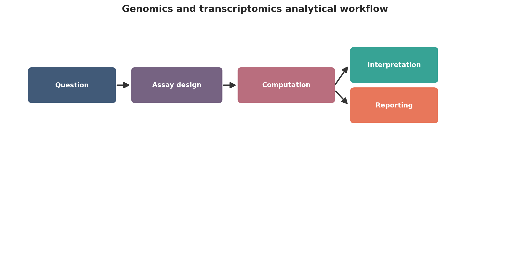
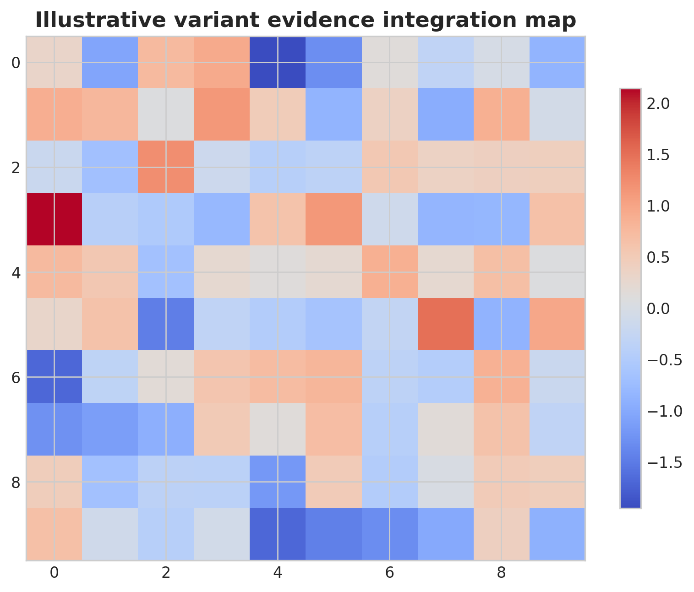
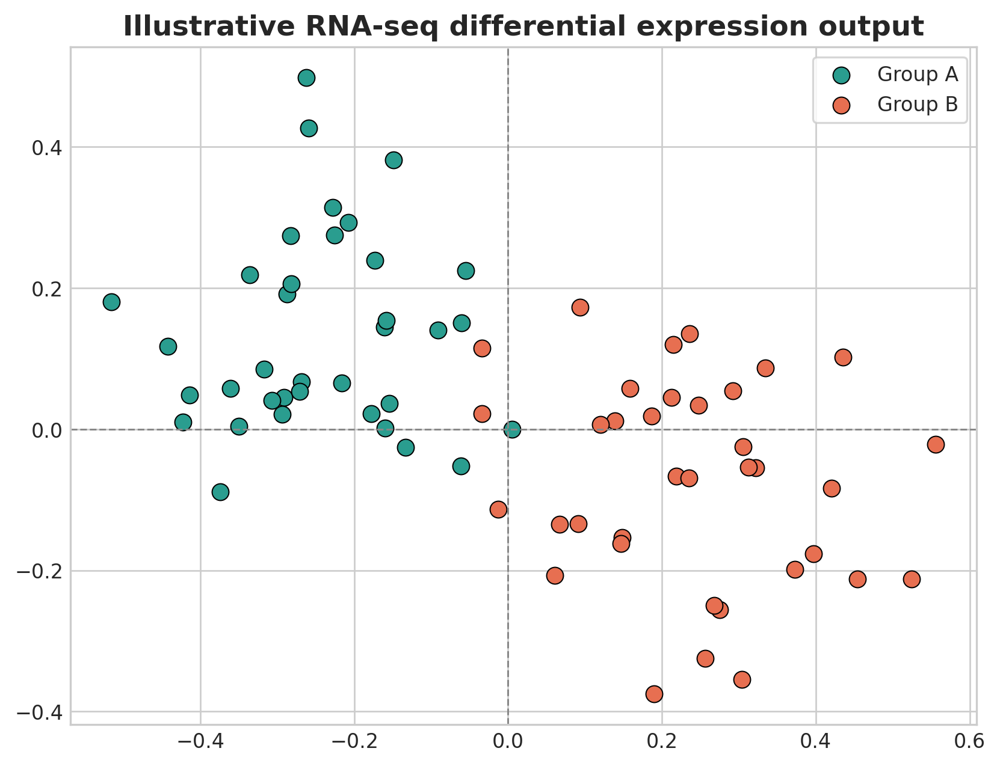
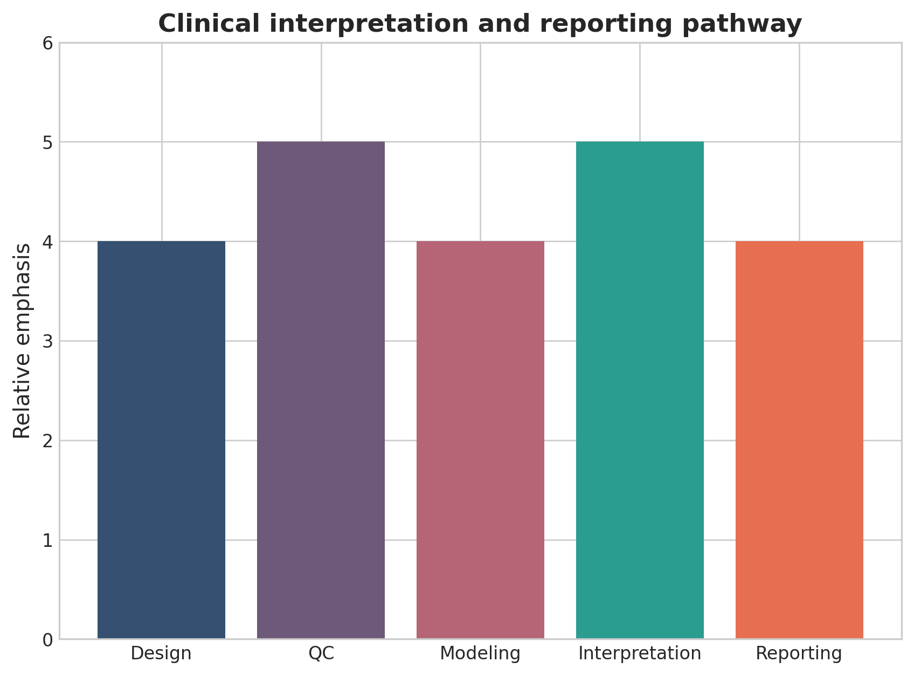

# Human Genomics and Transcriptomics in Practice: A Computational Roadmap from Sequence Data to Clinical Interpretation

## Abstract
Human genomics and transcriptomics now underpin rare disease diagnosis, hereditary risk assessment, tumor profiling, therapeutic stratification, and molecular epidemiology. This full-length tutorial review presents a practical computational roadmap from study design to publication-ready interpretation. The review covers assay selection, quality control, alignment, variant calling, annotation, RNA-seq quantification, differential expression, integrative interpretation, reproducibility, and clinical reporting logic.

## Keywords
Human genomics; transcriptomics; variant analysis; RNA sequencing; clinical bioinformatics; differential expression; rare disease; cancer genomics

## 1. Introduction
Human genomics and transcriptomics are mature analytical disciplines, but publication-quality work still depends more on design and interpretive discipline than on software novelty. A strong review in this area should connect sequencing, annotation, statistics, and clinical reasoning into one coherent workflow. Human sequencing studies are often described as mature, yet the path from FASTQ files to clinically credible interpretation remains full of judgment calls. Read mapping, variant calling, transcript quantification, annotation, phenotype linkage, and disease-specific evidence synthesis each introduce assumptions that can alter the final conclusion. A review in this domain therefore needs to connect laboratory output to clinical reasoning, not just describe software.

The genomics-transcriptomics combination is especially powerful because it links inherited or acquired sequence change with functional consequence. A rare coding variant may gain plausibility when expression or splicing is abnormal in a relevant tissue, while an RNA-seq outlier may become interpretable when anchored to a structural variant or copy-number event. The computational challenge is to integrate these lines of evidence without overstating causality.

This manuscript is strongest when it treats clinical interpretation as an endpoint of disciplined evidence handling. That means tracking reference genome choice, transcript models, ancestry-aware population frequency resources, somatic versus germline context, and the difference between research-grade prioritization and formal clinical classification.

It also helps to signal early what kinds of validation or external evidence will matter later, so readers understand from the outset which claims in introduction are meant to be descriptive and which are expected to support stronger inference.

The practical takeaway from introduction is that readers should finish the first section knowing exactly what problem the manuscript will solve and what kinds of conclusions it will deliberately avoid.

## 2. Study design and assay selection
The study question determines whether whole-genome sequencing, whole-exome sequencing, targeted sequencing, bulk RNA-seq, total RNA-seq, or long-read approaches are appropriate. Germline studies require ancestry-aware interpretation and segregation logic; somatic studies need purity, copy-number context, and matched normal design where feasible. Assay choice should follow the disease model and the expected class of genomic variation. Whole-genome sequencing is more appropriate when structural variants, noncoding regulation, repeat expansions, or complex rearrangements matter; exome sequencing remains efficient for coding rare disease studies; targeted panels may be sufficient for defined hereditary syndromes or hotspot-driven cancers. Bulk RNA-seq or total RNA-seq becomes most valuable when splicing, fusion detection, or expression outliers are central to the question.

Clinical context changes design requirements. Germline studies benefit from trios, extended pedigrees, or ancestry-matched controls because segregation and allele-frequency interpretation are central. Tumor studies introduce purity, ploidy, copy-number background, subclonality, and the availability of matched normal tissue. These design features should be explicit because they determine what classes of calls are interpretable later.

The study should also define whether the primary endpoint is diagnosis, gene discovery, biomarker development, therapeutic stratification, or mechanistic follow-up. That choice affects acceptable false-positive rates, the depth of validation needed, and whether the analysis prioritizes sensitivity, specificity, or interpretability.

Validation expectations should be tied directly to study design and assay selection, because cohort structure, reference choice, and assay pairing determine whether replication, orthogonal assays, or sensitivity analysis will be the decisive credibility check.

The practical takeaway from study design and assay selection is to choose the minimum analytical complexity that truly serves the biological question, then document the tradeoffs before downstream results make those compromises harder to see.

## 3. Core genomic preprocessing
A defensible genomic workflow includes quality assessment, read alignment, duplicate handling when appropriate, calibration or analogous correction, variant calling, filtering, and annotation against declared reference resources. Cancer analyses should clearly distinguish single-nucleotide variants, indels, structural alterations, copy-number changes, and fusions. The foundation of genomic analysis is still careful handling of raw reads, reference alignment, duplicate marking where appropriate, base-quality recalibration or analogous correction, and calibrated variant calling. Yet high-quality pipelines also need to state which reference build, decoy or alt-aware resources, and transcript annotations were used, because these choices affect comparability and downstream annotation.

In cancer sequencing, preprocessing must separate distinct signal types rather than collapsing everything into a single variant list. Single-nucleotide variants and indels are only one layer; copy-number alterations, structural variants, mutational signatures, and fusion events often drive the clinically relevant biology. A full-length review should therefore explain why these classes require different callers, quality filters, and evidentiary standards.

Quality control is not a clerical step. Coverage uniformity, contamination estimates, insert-size behavior, strand bias, mapping quality, and sample identity checks determine whether negative results are meaningful and whether apparent rare variants are believable. Publication-ready methods sections should state these metrics, not merely claim that standard QC was performed.

Robustness in core genomic preprocessing is best demonstrated through explicit quality metrics, versioned resources, and sensitivity to reasonable threshold changes rather than by asserting that standard pipelines were followed.

The practical takeaway from core genomic preprocessing is that reproducibility usually fails at the level of quiet preprocessing decisions, so explicit thresholds and references are more valuable than long software lists.

## 4. Variant annotation and prioritization
Annotation is not interpretation. Publication-ready studies separate computational consequence assignment from biological and clinical classification, and explain prioritization using allele frequency, predicted effect, conservation, phenotype match, transcript relevance, and external evidence. Annotation pipelines assign predicted consequence, gene context, transcript context, and population frequency, but interpretation begins only after those labels are connected to phenotype and disease mechanism. In rare disease, prioritization often depends on inheritance model, gene-disease validity, tissue relevance, and whether the candidate transcript is actually expressed in the affected organ. In oncology, therapeutic and prognostic interpretation depends on tumor type, clonality, co-mutation context, and evidence tiering.

Population resources such as gnomAD are powerful, but they are not neutral filters. Frequency thresholds must be calibrated to disease prevalence, penetrance, ancestry composition, and the expected inheritance model. Overly simple frequency cutoffs can eliminate real candidates in underrepresented populations or retain implausible variants when ancestry is mismatched.

Predictive scores and in silico tools should be presented as supporting evidence rather than adjudicators of truth. SIFT, PolyPhen, SpliceAI, CADD, conservation measures, and similar tools can help prioritize, but they are not substitutes for segregation, orthogonal assays, transcript evidence, or curated clinical databases.

Robustness in variant annotation and prioritization is best demonstrated through explicit quality metrics, versioned resources, and sensitivity to reasonable threshold changes rather than by asserting that standard pipelines were followed.

The practical takeaway from variant annotation and prioritization is that reproducibility usually fails at the level of quiet preprocessing decisions, so explicit thresholds and references are more valuable than long software lists.

## 5. Transcriptomic quantification and differential expression
RNA-seq analysis requires quality control, quantification, normalization, exploratory analysis, differential expression, and pathway interpretation. Strong manuscripts report filtering rules, normalization strategy, design formula, hidden-batch handling, and multiple-testing correction, with effect-size interpretation alongside significance. RNA-seq analysis begins with read quality control, alignment or pseudoalignment strategy, transcriptome reference choice, and expression summarization, but the inferential quality of the study depends on normalization and design specification. Low-count filtering, batch effects, tissue heterogeneity, repeated measures, and unwanted variation can all dominate the signal if ignored.

Differential expression tables are often overinterpreted because they are visually persuasive. A publication-quality manuscript should therefore pair statistical significance with effect size, mean expression context, and pathway-level synthesis. For clinically oriented studies, it is also important to distinguish broad expression shifts from interpretable outliers, aberrant splicing, fusion-driven signals, or allele-specific effects that directly inform mechanism.

RNA-seq contributes most when it is treated as evidence with structure, not as a generic list of upregulated and downregulated genes. Pathway analysis, gene-set enrichment, and network context can be useful, but they should be anchored to the study design and phenotype rather than used as after-the-fact narrative decoration.

A strong section on transcriptomic quantification and differential expression should also link method choice to downstream validation and reporting, stating which results are primarily descriptive and what additional evidence would be required for stronger claims.

The practical takeaway from transcriptomic quantification and differential expression is to state what should be done by default, what should be justified explicitly, and which shortcuts most often weaken the final claim.

## 6. Integrative interpretation
Genomics and transcriptomics are most powerful together when variant evidence is linked to expression change, aberrant splicing, allele-specific expression, pathway activity, or treatment response. Analysts should distinguish corroboration from causation and avoid overclaiming functional validation from a single molecular layer. Joint interpretation becomes powerful when different data types address different uncertainty. A putative pathogenic splice-site variant gains credibility if RNA-seq shows aberrant exon usage; a somatic amplification becomes more compelling when linked to increased transcript abundance; a candidate fusion is strengthened by matching structural and expression evidence. These are the kinds of cross-modal links that make genomics and transcriptomics complementary rather than redundant.

Even so, corroboration is not causation. Expression change may reflect treatment, inflammation, cell-type mixture, or a broad stress program rather than direct consequence of a specific variant. Analysts should therefore differentiate between evidence that supports plausibility, evidence that narrows alternatives, and evidence that functionally validates a mechanism.

The most defensible integrative studies are explicit about biological context. Tissue relevance, developmental timing, tumor purity, and the availability of matched controls all influence whether DNA-RNA concordance can be interpreted strongly. That context should be part of the main narrative, not hidden in supplementary material.

A strong section on integrative interpretation should also link method choice to downstream validation and reporting, stating which results are primarily descriptive and what additional evidence would be required for stronger claims.

The practical takeaway from integrative interpretation is to state what should be done by default, what should be justified explicitly, and which shortcuts most often weaken the final claim.

## 7. Common analytical failures
Frequent failures include outdated reference resources, weak ancestry-aware filtering, overuse of in silico prediction scores, unstable volcano-plot storytelling, and clinical overreach from variants of uncertain significance. These issues directly affect translational credibility. One recurrent failure is reference drift: using outdated genome builds, transcript models, or annotation databases that materially affect variant consequence and gene prioritization. Another is overreliance on generic pathogenicity scores without matching them to phenotype, inheritance model, or transcript relevance. These shortcuts often produce long candidate lists with weak clinical value.

In transcriptomics, a common failure is volcano-plot storytelling, where the visual prominence of a gene outruns the evidentiary basis for its interpretation. Hidden batch effects, sample swaps, tissue heterogeneity, and low replicate counts can all create persuasive but fragile findings. Studies should show how these risks were checked before major claims are made.

Clinical overreach remains the most important caution. Variants of uncertain significance, borderline expression signatures, and exploratory pathway enrichments should not be narrated as actionable findings without appropriate evidence tiers and validation. Review articles should be firm on that point because translational credibility depends on it.

A useful review does not only list problems in common analytical failures; it also shows what checks, controls, or external comparisons would reveal that those problems are distorting the result.

The practical takeaway from common analytical failures is to treat these errors as expected analytical hazards, not as rare exceptions, and to build manuscript structure around showing they were checked.

## 8. Translational applications
These workflows support rare disease diagnosis, hereditary cancer assessment, tumor classification, treatment-response stratification, pharmacogenomics, and biomarker discovery. The strongest studies connect computational outputs back to phenotype, orthogonal evidence, or disease mechanism. In rare disease, combined sequencing and transcript analysis can support molecular diagnosis, resolve variants that alter splicing, and reduce the search space when phenotype alone is nonspecific. In oncology, integrated DNA and RNA profiling can refine tumor classification, identify actionable fusions, characterize pathway activation, and inform resistance mechanisms. In pharmacogenomics and hereditary risk assessment, the value lies in connecting sequence findings to clinically interpretable evidence.

The strongest translational manuscripts do not stop at reporting hits. They show how computational outputs affect classification confidence, management decisions, or biological understanding relative to standard practice. Even when the work remains research-oriented, there should be a clear line between exploratory findings and those with near-term clinical implications.

Validation strategy should match the claim. Orthogonal sequencing, targeted assays, pathology correlation, family segregation, functional experiments, or external cohorts each serve different purposes. The manuscript should specify which type of validation is relevant rather than invoking validation as a generic aspiration.

The evidentiary bar in translational applications should rise with the ambition of the claim: exploratory biological framing may tolerate internal consistency, whereas biomarker or clinical language requires external validation and much tighter calibration.

The practical takeaway from translational applications is to match the language of impact to the strength of evidence, resisting clinical or mechanistic overstatement when the workflow is still best viewed as discovery-oriented.

## 9. Conclusion
The most defensible genomics and transcriptomics studies make every major decision, threshold, and inferential step transparent. That discipline is what turns sequencing output into credible publication-quality evidence. The most useful takeaway is that sequence analysis becomes clinically persuasive only when the computational chain is transparent from raw data to final interpretation. Reference choice, filtering, annotation, statistical modeling, and phenotype linkage are not background details; they are the basis of credibility.

A strong genomics-transcriptomics workflow also resists false certainty. Many findings will remain suggestive rather than definitive, and that is acceptable if the evidentiary status is stated clearly. Readers benefit more from a review that distinguishes plausible, likely, and clinically actionable findings than from one that implies all integrated signals are equally informative.

Future improvements in this area will come from better harmonized annotation resources, broader ancestry representation, richer transcript-level interpretation, and cleaner integration between research pipelines and clinical reporting frameworks. Those advances will matter more than small gains from swapping one caller or differential expression package for another.

A strong closing section should also remind readers that validation is not interchangeable across studies: the right confirmatory step depends on whether the manuscript’s main claim is descriptive, predictive, mechanistic, or translational.

The practical takeaway from conclusion is that a good manuscript leaves the reader with a usable decision framework, not just an impression that the field is complex.

{ width=90% }

{ width=82% }

Table: Practical decision matrix for computational study planning.

| Question type | Preferred analytical emphasis | Key reporting requirement |
| --- | --- | --- |
| Discovery-oriented | Broad exploratory analysis | Clear filtering and exploratory limits |
| Comparative cohort study | Statistical testing and covariate handling | Design formula and confounder reporting |
| Translational or clinical | Robust interpretation and validation | Explicit limitations and reproducibility |
| Atlas-building or systems analysis | Integration and uncertainty quantification | Transparent preprocessing and annotation logic |

Table: Minimum publication-ready computational reporting checklist.

| Domain | Minimum expectation |
| --- | --- |
| Study design | Primary question, inclusion logic, metadata plan |
| Data processing | Quality control, reference versions, filtering thresholds |
| Statistics | Normalization, model choice, covariates, multiple-testing approach |
| Validation | Sensitivity analysis, external support, or orthogonal evidence |
| Reproducibility | Software versions, code or workflow trace, figure provenance |

{ width=82% }

{ width=78% }

## Declarations

### Author contributions
Dr Siddalingaiah H S conceived the tutorial review, prepared the manuscript, and approved the final version.

### Funding
No external funding was declared for preparation of this manuscript.

### Competing interests
The author declares no competing interests.

### Ethics approval and consent to participate
Not applicable. This tutorial review does not report a new human-participant or animal experiment.

### Consent for publication
Not applicable.

### Availability of data and materials
No new dataset was generated or analyzed for this tutorial review. Figures are educational schematics and illustrative formatted examples created for explanatory purposes.

### Author information
Dr Siddalingaiah H S, Professor, Community Medicine, Shridevi Institute of Medical Sciences and Research Hospital, Tumkur, India. ORCID: 0000-0002-4771-8285.

## References
1. Van der Auwera GA, O'Connor BD. Genomics in the Cloud. O'Reilly Media; 2020.
2. DePristo MA, Banks E, Poplin R, et al. A framework for variation discovery and genotyping using next-generation DNA sequencing data. Nat Genet. 2011;43(5):491-498.
3. Li H. Aligning sequence reads, clone sequences and assembly contigs with BWA-MEM. arXiv. 2013;1303.3997.
4. Dobin A, Davis CA, Schlesinger F, et al. STAR: ultrafast universal RNA-seq aligner. Bioinformatics. 2013;29(1):15-21.
5. Love MI, Huber W, Anders S. Moderated estimation of fold change and dispersion for RNA-seq data with DESeq2. Genome Biol. 2014;15(12):550.
6. Conesa A, Madrigal P, Tarazona S, et al. A survey of best practices for RNA-seq data analysis. Genome Biol. 2016;17:13.
7. Karczewski KJ, Francioli LC, Tiao G, et al. The mutational constraint spectrum quantified from variation in 141,456 humans. Nature. 2020;581(7809):434-443.
8. Stark Z, Dolman L, Manolio TA, et al. Integrating genomics into healthcare: a global responsibility. Am J Hum Genet. 2019;104(1):13-20.
9. The GTEx Consortium. The GTEx Consortium atlas of genetic regulatory effects across human tissues. Science. 2020;369(6509):1318-1330.
10. Koboldt DC. Best practices for variant calling in clinical sequencing. Genome Med. 2020;12:91.
