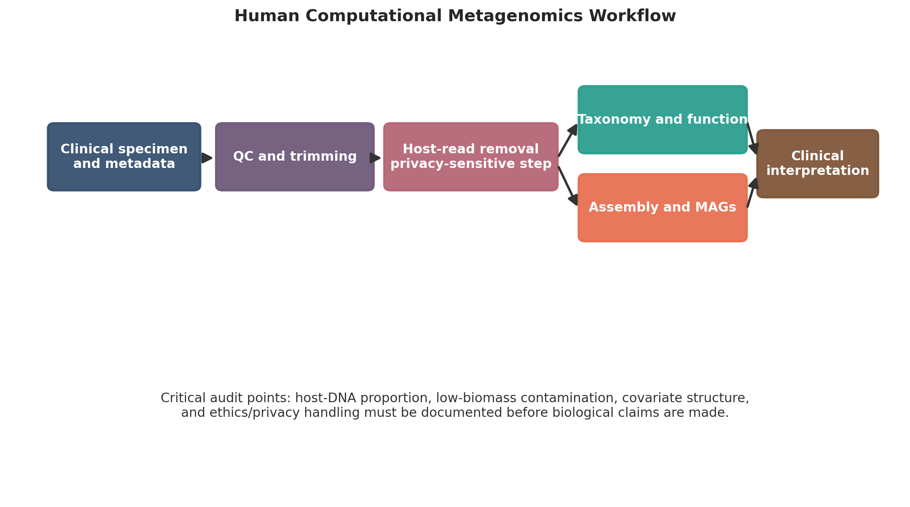
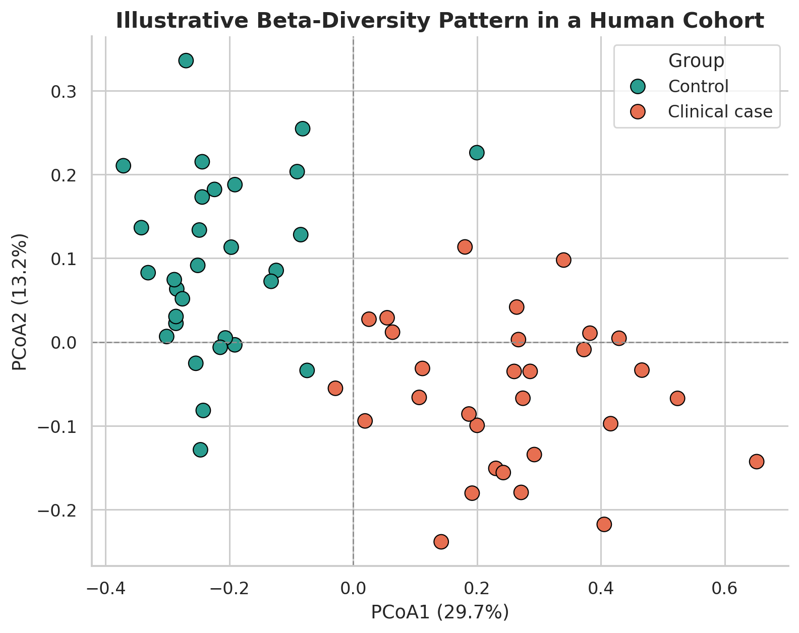
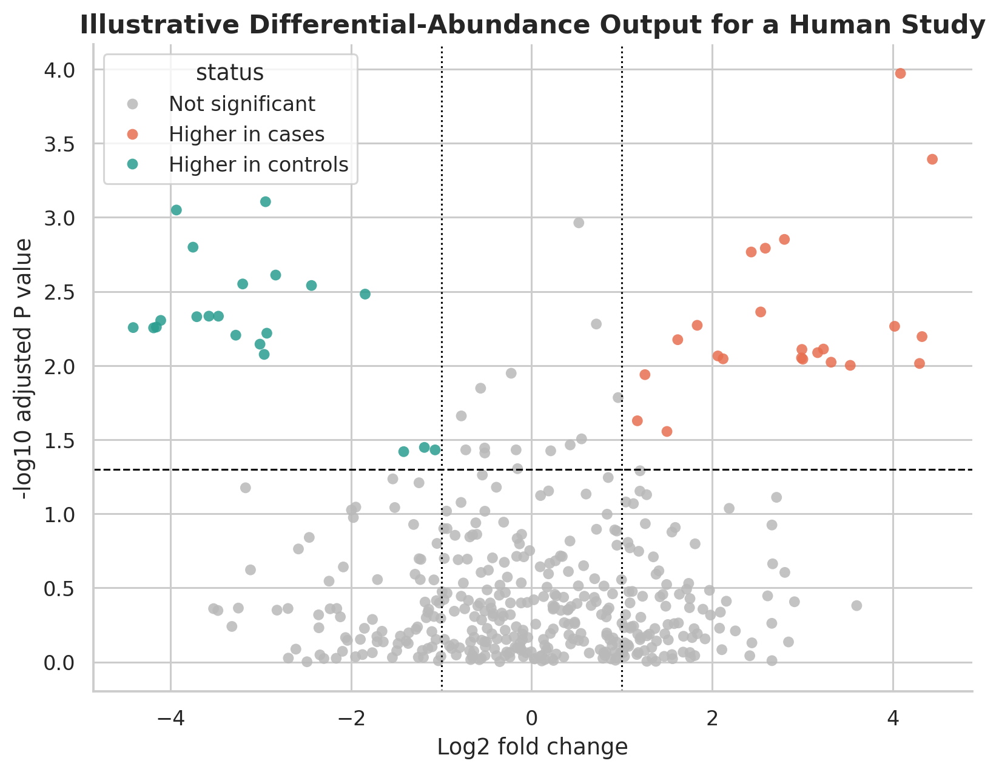

# Human Computational Metagenomics: A Practical Roadmap for Host-Associated Microbiome Analysis from Raw Reads to Clinical Interpretation

## Abstract
Human-associated metagenomics sits at the intersection of microbiome science, clinical research, and computational biology. Unlike many environmental metagenomics workflows, human metagenomic datasets must account not only for microbial diversity and functional potential, but also for heavy host DNA background, clinical metadata complexity, privacy concerns, contamination risk, and translational expectations. This tutorial review presents a practical roadmap for computational analysis of host-associated microbiome data, spanning study design, sequence preprocessing, host-read depletion, taxonomic and functional profiling, genome-resolved metagenomics, statistical analysis, and publication-quality reporting. We compare the role of 16S rRNA amplicon sequencing and shotgun metagenomics in human studies and emphasize that assay choice should follow the clinical or epidemiological question. For shotgun data, we discuss quality control, adapter trimming, human read subtraction, read-based classification, assembly, binning, metagenome-assembled genome evaluation, and functional annotation. We then address analytical issues that are especially important in human microbiome studies, including low-biomass contamination, repeated measures, confounding by medication and diet, compositionality, zero inflation, and covariate-aware differential abundance testing. Separate attention is given to ethical and governance issues created by incidental human sequence recovery, especially in host-rich samples. The article concludes with a best-practice framework intended to help clinicians, public health researchers, microbiome investigators, and trainees build defensible, reproducible, and clinically interpretable metagenomic workflows. The goal is to provide a publication-oriented guide that links computational rigor with the realities of host-associated microbiome research.

## Keywords
Human microbiome; computational metagenomics; host-associated metagenomics; host read removal; shotgun metagenomics; 16S rRNA; contamination control; clinical bioinformatics

## 1. Introduction
Human microbiome studies have expanded rapidly across gastroenterology, oncology, infectious disease, obstetrics, dermatology, respiratory medicine, and public health. Sequencing now makes it possible to characterize host-associated microbial communities in stool, oral rinse, saliva, skin swabs, vaginal specimens, bronchoalveolar fluid, tissue biopsies, and other clinical materials. However, the computational interpretation of these datasets is often substantially more difficult than the initial generation of sequence data.

The reason is straightforward: human-associated metagenomics is not merely environmental metagenomics applied to a different sample source. In host-associated samples, microbial signal is often mixed with host DNA, uneven biomass, medication effects, diet effects, clinical heterogeneity, and privacy-relevant sequence carryover. As a result, analytical decisions that are optional or secondary in other contexts become central here. Host-read depletion, contamination control, metadata audit, and clinically appropriate interpretation are not peripheral technical details; they directly determine whether conclusions are credible.

This tutorial review is designed as a practical roadmap for human computational metagenomics. It builds from the logic of general microbiome workflows, but gives specific emphasis to host-associated challenges: human read removal, low-biomass contamination, clinical covariates, repeated measurements, translational framing, and ethical governance. The manuscript is intended for clinicians, public health investigators, microbiome researchers, and trainees who need a coherent guide from raw reads to publication-ready inference.

## 2. What Makes Human Computational Metagenomics Distinct
The defining feature of human computational metagenomics is that the specimen is human-derived even when the biological target is microbial. That single fact changes both the bioinformatics and the interpretation.

Table: Distinguishing features of human-associated versus general metagenomics workflows.

| Dimension | General metagenomics | Human-associated metagenomics |
| --- | --- | --- |
| Sample source | Soil, water, industrial, animal, mixed environments | Human stool, saliva, oral swabs, skin, vaginal, respiratory, blood, tissue |
| Host DNA burden | Variable, often low or absent | Often high and sometimes dominant |
| Privacy implications | Usually limited | Potential incidental recovery of human genomic information |
| Metadata complexity | Environmental variables, site descriptors | Clinical phenotype, medication, diet, age, sex, disease stage, procedures, batch |
| Contamination sensitivity | Important | Especially critical in low-biomass samples |
| Interpretation goal | Ecological structure and function | Clinical association, biomarkers, mechanism, prognosis, intervention response |
| Common analytical pitfall | Overinterpreting relative abundance | Ignoring host background, confounding, and contamination |

Human-associated microbiome studies therefore require a more integrated pipeline. Read processing, host-read management, negative controls, statistical modeling, and reporting standards need to be specified in a way that is compatible with clinical research expectations rather than only bioinformatics convenience.

## 3. Study Design for Human Metagenomics
Many computational failures in human microbiome research originate in study design rather than software. The computational pipeline can only be as strong as the sampling framework and metadata structure behind it.

### 3.1 Choosing the right sample type
Different human body sites impose different constraints. Stool typically yields high microbial biomass and supports both amplicon and shotgun strategies well. Oral and vaginal samples can also produce strong microbial signal, although contamination and collection consistency matter. Skin, lung, blood, and tissue-associated samples often have lower biomass and higher host background, requiring more aggressive quality control and more cautious interpretation.

### 3.2 Control structure and metadata depth
Human cohort studies should include a metadata plan before sequencing begins. Important variables may include age, sex, body mass index, geography, smoking, antibiotic exposure, proton pump inhibitor use, immunosuppression, diet, bowel preparation, hospitalization, disease activity, menstrual phase, and collection-to-freezer time. In intervention studies, treatment timing and repeated sampling need to be explicit in the analysis plan.

At minimum, investigators should define:

1. the primary comparison and clinical endpoint;
2. key exclusion criteria;
3. expected confounders and effect modifiers;
4. positive and negative controls;
5. whether repeated measures or matched designs will be used.

### 3.3 Sequencing strategy by clinical question
Amplicon sequencing remains useful for cohort-scale screening and broad ecological comparison, particularly when budget limits sample size. Whole-metagenome shotgun sequencing is more appropriate when the goal involves species-level resolution, pathway analysis, antimicrobial resistance, virulence factors, strain inference, or genome recovery. The selection should be justified in the manuscript in relation to the clinical question rather than only cost or familiarity.

## 4. Pre-analytical Factors That Shape the Computational Signal
Computational metagenomics begins before the first command-line step. Collection method, storage conditions, extraction protocol, depletion strategy, and library preparation all influence what the sequencing platform records.

In human studies, variability in extraction chemistry can shift the balance between Gram-positive and Gram-negative organisms, and delayed freezing can alter community composition before sequencing. Host depletion protocols may improve microbial yield, but can also distort representation if they preferentially lose fragile organisms. These effects should be acknowledged when discussing limitations because they can resemble biological signal in downstream analyses.

## 5. Sequence Preprocessing and Human Read Removal
Human computational metagenomics requires a preprocessing stage that explicitly separates host and non-host sequence content.

### 5.1 Initial quality control
Raw FASTQ files should be checked for read quality decay, adapter contamination, low-complexity sequence, duplication patterns, and sample-to-sample irregularities. Tools such as FastQC and MultiQC remain appropriate for this stage. Read-retention summaries before and after trimming should be retained for publication reporting.

### 5.2 Host-read subtraction
In many human shotgun datasets, especially tissue, respiratory, and blood-adjacent samples, host-derived reads can account for a large majority of raw data. Alignment-based depletion against the appropriate human reference genome is therefore usually mandatory. Investigators should report:

1. the reference build used for host subtraction;
2. the aligner and filtering thresholds;
3. the proportion of reads removed per sample;
4. whether host-depleted reads alone were carried into taxonomic and functional analysis.

This step is not only computationally necessary but ethically relevant. Human reads may contain identifiable genomic information, which affects storage, sharing, and controlled-access decisions.

{ width=92% }

### 5.3 Special note on low-biomass samples
In low-biomass human samples, the proportion of host DNA can be so high that sequencing depth becomes a decisive analytical variable. A sample with apparently low microbial diversity may in reality represent poor microbial recovery rather than a true biological depletion. This is why read-level audit tables should accompany any interpretation of low-biomass cohorts.

## 6. Taxonomic and Functional Profiling in Human Microbiome Studies
Once high-quality non-host reads have been isolated, the analysis path depends on the scientific aim.

### 6.1 Amplicon-based human microbiome profiling
For 16S rRNA amplicon studies, modern practice favors ASV inference using denoising methods such as DADA2 within QIIME 2 workflows. The major outputs are feature tables, representative sequences, taxonomy assignments, denoising summaries, and diversity-ready objects. In human cohorts, common downstream analyses include case-control diversity comparison, body-site stratification, temporal response to treatment, and microbiome association with clinical endpoints.

Amplicon results should be interpreted carefully. Functional inference from 16S data is indirect, and species-level claims are often uncertain. These limitations should be explicit in manuscripts intended for clinical audiences.

### 6.2 Shotgun read-based profiling
Read-based taxonomic profiling is useful for rapid human cohort analysis. Kraken2 and Bracken remain widely used because they are scalable and straightforward to interpret when the reference database is appropriate. For human-associated analyses, taxonomic reports should be reviewed in the context of likely contaminants, impossible body-site assignments, and organisms that are common reagent or laboratory background taxa.

### 6.3 Functional profiling and clinical relevance
Human studies often seek not only community composition but also pathways related to metabolism, inflammation, colonization resistance, virulence, or antimicrobial resistance. Functional inference can be derived from read-based pathway tools or from assembly and annotation. The inferential level should remain clear: pathway abundance in a community does not imply pathway activity in vivo, and detection of a resistance gene does not by itself prove phenotypic resistance.

## 7. Genome-Resolved Human Metagenomics
Assembly-based analysis is often underused in human metagenomics because it is computationally demanding, but it can be highly informative when the microbial biomass is sufficient and the study question justifies it.

### 7.1 Assembly and binning
Assemblers such as MEGAHIT or metaSPAdes can reconstruct contigs from host-depleted reads. Coverage-informed binning with tools such as MetaBAT2 and MaxBin2 may then recover draft genomes, which can be refined with DAS Tool and evaluated with CheckM or CheckM2. Human stool samples often support this workflow better than low-biomass tissue or respiratory materials.

### 7.2 When MAG recovery is realistic
MAG recovery should not be presented as routine in all human studies. It is generally more realistic in high-biomass specimens, longitudinal studies with deep sequencing, or projects explicitly designed for genome-resolved analysis. In host-rich or low-biomass settings, read-based profiling may be more defensible and cost-effective.

Table: Practical decision points in human shotgun metagenomics.

| Analytical objective | Preferred strategy | Typical tools | Main caution |
| --- | --- | --- | --- |
| Broad cohort profiling | Read-based shotgun analysis | Kraken2, Bracken | Sensitive to database choice and contamination |
| Functional overview | Read-based or contig-based annotation | HUMAnN, eggNOG-mapper, KEGG or COG mapping | Pathway potential is not direct expression |
| Genome recovery | Assembly plus binning | MEGAHIT, MetaBAT2, MaxBin2, DAS Tool, CheckM | Often unrealistic in low-biomass samples |
| Strain-level comparison | Deep shotgun sequencing with specialized tools | Marker-based or SNP-based methods | Requires higher depth and stricter QC |

## 8. Statistical Analysis for Clinical and Epidemiological Microbiome Data
Statistical analysis in human microbiome studies must account for both the mathematical structure of sequencing counts and the design structure of clinical datasets.

### 8.1 Compositionality, zeros, and filtering
Human microbiome count tables are compositional: each sample contains relative information constrained by library size. Sparse features and excess zeros are common, particularly after body-site stratification or stringent host depletion. Filtering low-prevalence taxa before formal modeling can reduce noise, but the filtering rule should be predefined or at least transparently reported.

Centered log-ratio transformation remains a useful route for exploratory compositional analysis and Aitchison geometry. Rarefaction remains acceptable for alpha-diversity workflows when the aim is standardized depth comparison, although it should not be treated as a universal normalization method for every inferential task.

### 8.2 Alpha and beta diversity in human cohorts
Alpha diversity analysis is often used to compare disease and control groups, but the biological interpretation should be modest: diversity metrics are summaries, not diagnoses. Beta diversity is more informative for overall community difference, especially when combined with ordination and PERMANOVA.

{ width=80% }

PERMANOVA should be paired with a dispersion test because apparent group separation can arise from unequal heterogeneity rather than true centroid shift. In human datasets, multivariable models often need to include age, sex, medication, body site, sequencing batch, and other clinical covariates.

### 8.3 Differential abundance in clinical datasets
Differential abundance testing in human microbiome studies should be covariate-aware and matched to study design. DESeq2 remains common because it is familiar and flexible. ALDEx2 and ANCOM-BC offer composition-aware alternatives that may be preferable where false-positive control is a priority. Repeated-measures and matched case-control studies need formulas that reflect within-subject correlation rather than treating all samples as independent.

{ width=80% }

### 8.4 Integrating clinical metadata
A common weakness in human microbiome papers is separating sequence analysis from clinical metadata analysis. This leads to simplistic statements such as "the microbiome differed by disease state" when medication, procedure, or diet may explain the observed pattern. A publication-quality analysis should therefore describe the metadata audit, missingness assessment, variable coding, and the rationale for included covariates.

## 9. Contamination Control and Analytical Audit
Contamination is a general problem in microbiome studies, but it is disproportionately important in low-biomass human samples. Skin-associated, respiratory, placental, blood, and tissue studies have repeatedly shown how reagent signal and laboratory background can masquerade as biology when controls are insufficient.

Best practice in human metagenomics should therefore include:

1. extraction blanks and no-template controls where feasible;
2. sequencing of negative controls through the same workflow;
3. review of taxa enriched in controls;
4. documentation of kit lots, runs, and laboratory batches;
5. cautious interpretation of unexpected taxa in low-biomass specimens.

This audit step is not optional in clinically sensitive settings. Without it, highly visible but low-abundance findings can be misleading.

## 10. Ethics, Privacy, and Data Governance
Human computational metagenomics raises governance questions that do not arise in the same way for purely environmental microbiome studies. Host-derived reads may reveal personal genomic information, ancestry-related features, sex-chromosome content, or other potentially identifying information. Even after host depletion, residual human reads may persist in downstream files.

Researchers should therefore define:

1. whether raw data will be open, controlled-access, or partially filtered before deposition;
2. whether the consent process covers incidental human sequence recovery;
3. how host-containing intermediate files will be stored and who can access them;
4. whether institutional ethics review imposes additional handling restrictions.

These issues are especially important when human metagenomics intersects with clinical records, longitudinal surveillance, or public health reporting.

## 11. Translational Applications
Human computational metagenomics is increasingly used in settings where the output is expected to support biological explanation, prognosis, or intervention design. Common examples include inflammatory bowel disease, colorectal cancer, antibiotic-associated dysbiosis, intensive care infections, maternal-child microbiome studies, and antimicrobial resistance surveillance. The translational value of metagenomics is real, but the threshold for methodological rigor should rise with the strength of the clinical claim.

Table: Publication-oriented checklist for human computational metagenomics studies.

| Domain | Minimum reporting expectation |
| --- | --- |
| Study design | Body site, inclusion criteria, controls, metadata variables, timepoints |
| Sequencing | Assay type, depth target, platform, extraction protocol, depletion strategy |
| Preprocessing | Quality filters, host-read removal method, read-retention summaries |
| Taxonomy and function | Database version, taxonomic rank, annotation pipeline |
| Statistics | Filtering rules, transformations, covariates, multiple-testing method |
| Contamination audit | Negative controls, contaminant review strategy, low-biomass caution |
| Ethics and governance | Consent, ethics approval, data-sharing restrictions, host-read handling |
| Reproducibility | Software versions, code availability, workflow documentation |

## 12. Conclusion
Human computational metagenomics requires more than a standard microbiome pipeline with the word "human" added to the title. The core analytical logic must account for host-read burden, clinical confounding, contamination risk, privacy implications, and translational interpretation. When those elements are explicitly built into study design, preprocessing, statistical modeling, and reporting, host-associated microbiome studies become more reproducible and more credible. A strong human metagenomics workflow therefore combines microbiome bioinformatics with clinical research discipline.

## Declarations

### Author contributions
Dr Siddalingaiah H S conceived the tutorial review, developed the manuscript structure, and approved the final version.

### Funding
No external funding was declared for preparation of this manuscript.

### Competing interests
The author declares no competing interests.

### Ethics approval and consent to participate
Not applicable. This tutorial review does not report a new human-participant or animal experiment.

### Consent for publication
Not applicable.

### Availability of data and materials
No new dataset was generated or analyzed for this tutorial review. Figures are educational schematics and illustrative formatted examples created for explanatory purposes.

### Acknowledgements
The manuscript was prepared as a publication-oriented human-focused extension of broader training material in computational metagenomics.

### Author information
Dr Siddalingaiah H S, Professor, Community Medicine, Shridevi Institute of Medical Sciences and Research Hospital, Tumkur, India. ORCID: 0000-0002-4771-8285.

## References
1. Integrative HMP (iHMP) Research Network Consortium. The integrative human microbiome project. Nature. 2019;569(7758):641-648.
2. Gilbert JA, Blaser MJ, Caporaso JG, Jansson JK, Lynch SV, Knight R. Current understanding of the human microbiome. Nat Med. 2018;24(4):392-400.
3. Bolyen E, Rideout JR, Dillon MR, et al. Reproducible, interactive, scalable and extensible microbiome data science using QIIME 2. Nat Biotechnol. 2019;37(8):852-857.
4. Callahan BJ, McMurdie PJ, Rosen MJ, Han AW, Johnson AJA, Holmes SP. DADA2: high-resolution sample inference from Illumina amplicon data. Nat Methods. 2016;13(7):581-583.
5. Wood DE, Lu J, Langmead B. Improved metagenomic analysis with Kraken 2. Genome Biol. 2019;20:257.
6. Lu J, Breitwieser FP, Thielen P, Salzberg SL. Bracken: estimating species abundance in metagenomics data. PeerJ Comput Sci. 2017;3:e104.
7. Li D, Liu CM, Luo R, Sadakane K, Lam TW. MEGAHIT: an ultra-fast single-node solution for large and complex metagenomics assembly via succinct de Bruijn graph. Bioinformatics. 2015;31(10):1674-1676.
8. Kang DD, Li F, Kirton E, et al. MetaBAT 2: an adaptive binning algorithm for robust and efficient genome reconstruction from metagenome assemblies. PeerJ. 2019;7:e7359.
9. Wu YW, Simmons BA, Singer SW. MaxBin 2.0: an automated binning algorithm to recover genomes from multiple metagenomic datasets. Bioinformatics. 2016;32(4):605-607.
10. Parks DH, Imelfort M, Skennerton CT, Hugenholtz P, Tyson GW. CheckM: assessing the quality of microbial genomes recovered from isolates, single cells, and metagenomes. Genome Res. 2015;25(7):1043-1055.
11. Eisenhofer R, Minich JJ, Marotz C, et al. Contamination in low microbial biomass microbiome studies: issues and recommendations. Trends Microbiol. 2019;27(2):105-117.
12. Gloor GB, Macklaim JM, Pawlowsky-Glahn V, Egozcue JJ. Microbiome datasets are compositional: and this is not optional. Front Microbiol. 2017;8:2224.
13. Love MI, Huber W, Anders S. Moderated estimation of fold change and dispersion for RNA-seq data with DESeq2. Genome Biol. 2014;15(12):550.
14. Fernandes AD, Reid JNS, Macklaim JM, et al. Unifying the analysis of high-throughput sequencing datasets by compositional data analysis. Microbiome. 2014;2:15.
15. Lin H, Peddada SD. Analysis of compositions of microbiomes with bias correction. Nat Commun. 2020;11:3514.
