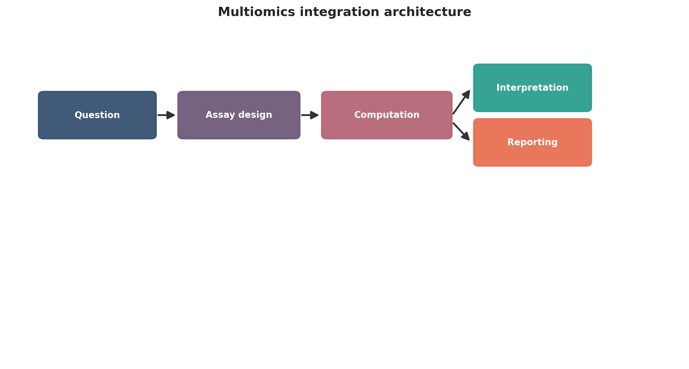
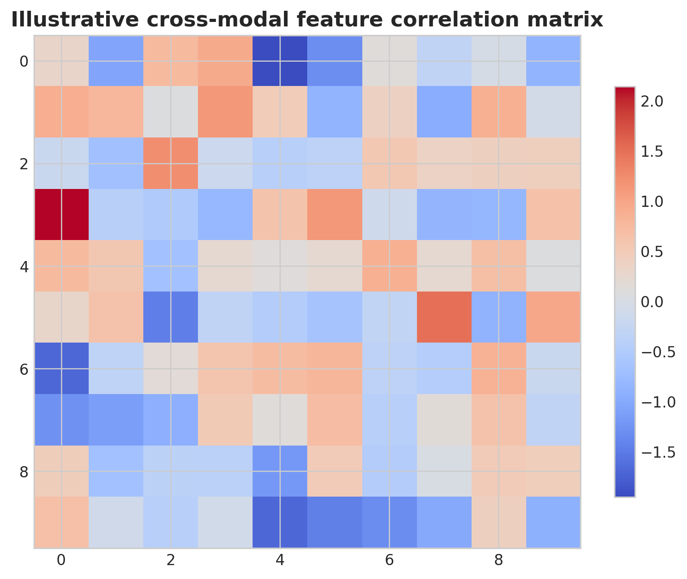
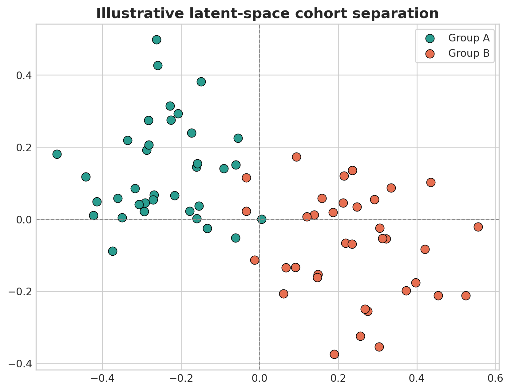
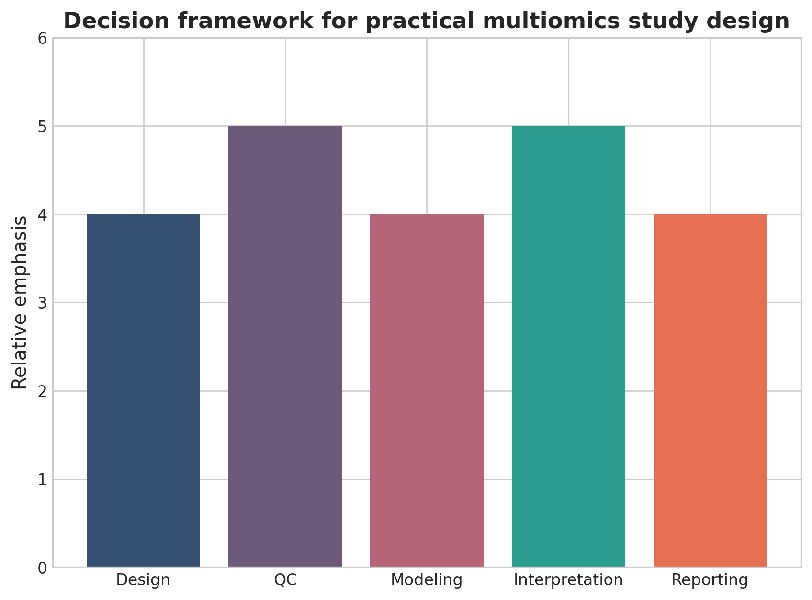

# Multiomics Integration in Biomedicine: A Practical Computational Guide from Study Design to Cross-Modal Interpretation

## Abstract
Multiomics integration promises a more complete view of biology than any single assay can provide, but the computational burden of combining heterogeneous molecular layers remains substantial. This review provides a practical roadmap for study design, modality-specific preprocessing, harmonization, integration strategies, machine learning, missing-data handling, interpretability, and publication-ready reporting.

## Keywords
Multiomics; systems biology; integrative bioinformatics; genomics; transcriptomics; proteomics; metabolomics; epigenomics; translational medicine

## 1. Introduction
Multiomics is attractive because biology is distributed across molecular layers, but collecting more assays does not automatically produce stronger insight. A publication-competitive multiomics study depends on careful sample matching, preprocessing, and interpretability rather than assay count alone. In practice, the attraction of multiomics is that no single molecular layer fully captures disease biology, treatment response, or host-environment interaction. Genomic variation may define predisposition, transcription may reflect active programs, methylation may encode regulatory state, and proteomic or metabolomic measurements may track nearer-term physiology. The promise of integration is therefore real, but it only materializes when these layers are measured on a coherent study backbone.

The main practical difficulty is that different assays do not fail in the same way. RNA-seq data are count-based and sensitive to library composition, proteomics data often contain missing values linked to detection limits, methylation arrays or sequencing generate platform-specific biases, and metabolomics features may remain only partially annotated. A strong tutorial review must therefore show readers how to respect modality-specific data structure before attempting any integrative model.

This review is most useful when it frames multiomics as a sequence of design and inference problems: selecting modalities, preserving biospecimen comparability, handling incomplete sample overlap, choosing an integration level, and deciding what kind of biological statement can be defended at the end. That framing is what separates a full-length manuscript from a catalog of integration software.

It also helps to signal early what kinds of validation or external evidence will matter later, so readers understand from the outset which claims in introduction are meant to be descriptive and which are expected to support stronger inference.

The practical takeaway from introduction is that readers should finish the first section knowing exactly what problem the manuscript will solve and what kinds of conclusions it will deliberately avoid.

## 2. Designing multiomics studies
The main design task is to choose the minimum set of modalities necessary to answer the biological question. Cohort overlap, temporal synchrony, storage compatibility, platform-specific batch variables, and expected missingness all determine whether integration will be robust or fragile. The first decision is whether the study really requires multiple layers or whether one well-powered assay would answer the question more cleanly. In oncology, for example, combining DNA, RNA, methylation, and proteomics may clarify subtype structure or treatment resistance, but only if the same biological specimens or tightly matched aliquots are available. If sample provenance diverges across layers, integration becomes a technical exercise rather than a biological one.

Design quality in multiomics depends heavily on synchrony. The interval between biopsy, preservation, extraction, and assay generation can introduce modal discordance that later appears as biology. Researchers therefore need explicit metadata on specimen handling, platform batches, repeated measures, and whether each modality was generated for all individuals or only a nested subset. Those choices determine if the analytic target is a fully paired cohort, a partially overlapping cohort, or a reference-plus-validation design.

Power considerations are also different from single-modality studies. A cohort that is adequate for differential expression may be weak for latent-factor learning across five assays. Investigators should therefore define the primary integration objective in advance: supervised prediction, subtype discovery, cross-modal association, mechanistic hypothesis generation, or patient stratification. The answer drives sample size expectations and the degree of acceptable missingness.

Validation expectations should be tied directly to designing multiomics studies, because cohort structure, reference choice, and assay pairing determine whether replication, orthogonal assays, or sensitivity analysis will be the decisive credibility check.

The practical takeaway from designing multiomics studies is to choose the minimum analytical complexity that truly serves the biological question, then document the tradeoffs before downstream results make those compromises harder to see.

## 3. Modality-specific preprocessing
Each layer has its own data model: variant calls, counts, intensities, peaks, methylation states, metabolic features, or compositional abundance tables. Strong studies preserve modality-specific preprocessing and only harmonize after quality control, identifier mapping, and explicit feature filtering. Good integration starts with disciplined preprocessing within each modality. Variant calls need reference-aware filtering and annotation; transcriptomic counts need normalization and low-count handling; proteomic intensities need missingness assessment, peptide-to-protein summarization, and batch correction; metabolomic features need peak alignment, drift correction, and annotation confidence tracking. Collapsing these steps into a generic 'preprocessed matrix' hides where the strongest biases arise.

Identifier harmonization is another underappreciated step. Genes, proteins, pathways, CpG sites, metabolites, and microbial features occupy different abstraction levels, and mapping them too early can destroy useful structure. Many strong studies keep the original feature space long enough to perform modality-native quality checks, then connect layers through curated identifiers, pathway databases, networks, or latent variables instead of forcing one-to-one feature equivalence.

The main reporting obligation here is to state exactly what was filtered, transformed, imputed, or batch-corrected in each assay. Without that clarity, downstream integration is difficult to interpret because observed concordance might reflect biology, common preprocessing artifacts, or information leakage from overly aggressive harmonization.

Robustness in modality-specific preprocessing is best demonstrated through explicit quality metrics, versioned resources, and sensitivity to reasonable threshold changes rather than by asserting that standard pipelines were followed.

The practical takeaway from modality-specific preprocessing is that reproducibility usually fails at the level of quiet preprocessing decisions, so explicit thresholds and references are more valuable than long software lists.

## 4. Integration strategies
Integration can be early, intermediate, or late. Early integration concatenates features, intermediate approaches learn latent factors or shared manifolds, and late integration combines modality-specific models or summary signals. The strategy should be justified by sample size, missingness, interpretability needs, and the inferential goal. Early integration by simple feature concatenation is tempting because it is easy to implement, but it usually works only when sample size is generous, feature selection is disciplined, and all layers are measured on the same individuals. Otherwise, high-dimensional noise from one modality can dominate the combined representation. This is why many multiomics studies now favor intermediate approaches that learn latent factors or shared embeddings while preserving modality-specific variance.

Intermediate integration can be attractive when the goal is subtype discovery or shared biological programs. Methods such as matrix factorization, variational latent models, or graph-based manifold learning can reveal cross-modal structure, but only if investigators assess factor stability and biological interpretability. An unstable factor that changes with modest preprocessing adjustments should not be narrated as a disease mechanism.

Late integration is often more defensible in translational settings. Separate models can be built within each layer and then combined at the prediction or evidence level, which makes performance attribution clearer and reduces pressure to force heterogeneous data into one space. The best choice therefore depends on whether the study emphasizes biological explanation, prediction, missing-data tolerance, or regulatory interpretability.

Results from integration strategies should therefore be accompanied by stability checks, alternative parameterizations, or orthogonal evidence whenever the output is being used to support mechanism, subtype definition, or clinical relevance.

The practical takeaway from integration strategies is to treat elegant models as aids to reasoning rather than substitutes for evidence, especially when interpretation begins to outrun what the data directly support.

## 5. Statistical learning and networks
Common approaches include correlation analysis, canonical correlation, matrix factorization, Bayesian integration, graph learning, network propagation, and multimodal machine learning. These tools are useful only when paired with strong validation logic and realistic claims about what the model actually learned. Cross-modal correlation maps and network analyses are common starting points because they provide intuitive summaries of coordinated biology. However, correlation alone is vulnerable to confounding by cell composition, tumor purity, inflammation, treatment exposure, and hidden batch structure. Network edges should therefore be interpreted as statistical associations unless supported by perturbational or orthogonal evidence.

More formal learning methods such as canonical correlation analysis, partial least squares, Bayesian integration, graph neural models, or multimodal classifiers can capture higher-order structure, but they substantially raise the bar for validation. Investigators need to show that performance or discovered factors persist across resampling, external cohorts, or modality dropout experiments. Otherwise, the model may be learning platform-specific artifacts rather than cross-modal biology.

Interpretability matters especially when the output is meant to guide clinical or mechanistic conclusions. Factor loadings, pathway enrichments, and feature-importance summaries should be linked back to recognizable biology, not treated as self-validating because the mathematics is sophisticated. A technically complex model that cannot support a transparent biological explanation often adds less value than a simpler integrative analysis.

Results from statistical learning and networks should therefore be accompanied by stability checks, alternative parameterizations, or orthogonal evidence whenever the output is being used to support mechanism, subtype definition, or clinical relevance.

The practical takeaway from statistical learning and networks is to treat elegant models as aids to reasoning rather than substitutes for evidence, especially when interpretation begins to outrun what the data directly support.

## 6. Missing data and confounding
Missingness is a defining feature of real multiomics cohorts. Samples may be absent from one or more layers, and batch structures may differ by modality. Publication-ready work should explain the anchoring sample set, missing-data strategy, and whether conclusions remain stable under sensitivity analysis. Multiomics cohorts almost never have complete data for every participant and every assay. Tissue may be exhausted, some analytes may fail quality control, and certain modalities may be generated only for a nested discovery set. Analysts should therefore define the anchoring cohort explicitly and distinguish complete-case analyses from analyses that tolerate partial overlap.

Imputation can be useful, but its meaning differs across layers. In proteomics, missingness may reflect abundance below detection; in methylation or transcriptomics, missingness may arise from technical failure or low-quality samples; in clinical metadata, absence may reflect workflow limitations. Treating all missing values as exchangeable can distort downstream integration. Sensitivity analyses that compare complete-case, imputed, and reduced-modality models are often more informative than a single optimized pipeline.

Confounding is equally important. Age, sex, ancestry, medication, sampling site, storage batch, and tissue composition can induce coordinated changes across modalities that look like elegant integrative biology. Publication-ready manuscripts therefore need to show how these variables were measured, where they entered the design or model, and whether the main conclusions remain after adjustment.

A strong section on missing data and confounding should also link method choice to downstream validation and reporting, stating which results are primarily descriptive and what additional evidence would be required for stronger claims.

The practical takeaway from missing data and confounding is to state what should be done by default, what should be justified explicitly, and which shortcuts most often weaken the final claim.

## 7. Translational applications
Multiomics integration is now used in oncology, immunology, cardiometabolic disease, systems epidemiology, and host-microbiome studies. The strongest manuscripts show what integration adds beyond the strongest single-layer analysis. In oncology, integration of DNA, RNA, methylation, proteomics, and immune features can refine subtype definitions and identify resistance mechanisms that are invisible within one assay alone. In immunology, combined transcriptomic, epigenomic, and proteomic readouts can distinguish activation state from lineage commitment. In cardiometabolic or inflammatory disease, integrative models may connect inherited risk with dynamic physiology and treatment response.

The key translational question is what the integrated analysis adds. A manuscript is stronger when it can show that multi-layer evidence changes classification confidence, narrows a candidate mechanism, or improves predictive performance in a way that is clinically meaningful. Simply demonstrating that several assays correlate with the same phenotype is not enough to justify the additional complexity and cost.

Clinical ambition should also determine evidentiary standards. If the study aims at biomarker development, external validation and calibration are essential. If the study aims at mechanistic interpretation, targeted experiments or independent cohorts are more important than marginal improvements in internal model fit.

The evidentiary bar in translational applications should rise with the ambition of the claim: exploratory biological framing may tolerate internal consistency, whereas biomarker or clinical language requires external validation and much tighter calibration.

The practical takeaway from translational applications is to match the language of impact to the strength of evidence, resisting clinical or mechanistic overstatement when the workflow is still best viewed as discovery-oriented.

## 8. Common overclaims
Frequent overclaims include asserting mechanism from correlation, presenting unstable clusters as biological subtypes, and overfitting small cohorts with high-dimensional models. These errors are common reasons why integrative studies fail to generalize. A common overclaim is to present concordant signals across assays as proof of causal mechanism. In reality, several layers can move together because of a shared confounder such as cell composition or treatment exposure. Another recurrent problem is narrating unstable clusters or factors as novel subtypes without showing reproducibility across preprocessing choices or cohorts.

Small-sample machine learning is another major source of inflated claims. Multiomics datasets are high dimensional, and aggressive feature selection performed before cross-validation can create misleadingly strong performance. Manuscripts should clarify where feature selection occurred, how leakage was prevented, and whether class imbalance or nested resampling was handled correctly.

Review articles in this field should also caution against novelty bias. A multiomics analysis is not automatically better because it is technologically ambitious. The decisive question is whether integration materially improves explanation, prediction, or intervention design beyond what the strongest single-modality analysis already achieved.

A useful review does not only list problems in common overclaims; it also shows what checks, controls, or external comparisons would reveal that those problems are distorting the result.

The practical takeaway from common overclaims is to treat these errors as expected analytical hazards, not as rare exceptions, and to build manuscript structure around showing they were checked.

## 9. Conclusion
The best multiomics studies are not those with the most assays, but those in which integration clarifies biology in a way simpler analyses could not. The main practical lesson from multiomics is that integration is a design problem before it is a machine-learning problem. Studies succeed when specimen matching, assay quality, missing-data logic, and inferential goals are coherent before modeling begins. Without that foundation, even elegant latent-factor methods produce fragile stories.

A strong conclusion should also leave the reader with a realistic standard for success. The goal is not to use every available assay, but to combine the minimum set of modalities that answer the biological question more convincingly than any single layer could. That is the threshold that makes integration defensible in publication and practice.

For future work, the most credible direction is not maximal complexity but better calibration: benchmark datasets with partial overlap, transparent reporting of preprocessing decisions, and clearer links between integrated signals and actionable biology. Those elements will matter more than any single new integration algorithm.

A strong closing section should also remind readers that validation is not interchangeable across studies: the right confirmatory step depends on whether the manuscript’s main claim is descriptive, predictive, mechanistic, or translational.

The practical takeaway from conclusion is that a good manuscript leaves the reader with a usable decision framework, not just an impression that the field is complex.

{ width=90% }

{ width=82% }

Table: Practical decision matrix for computational study planning.

| Question type | Preferred analytical emphasis | Key reporting requirement |
| --- | --- | --- |
| Discovery-oriented | Broad exploratory analysis | Clear filtering and exploratory limits |
| Comparative cohort study | Statistical testing and covariate handling | Design formula and confounder reporting |
| Translational or clinical | Robust interpretation and validation | Explicit limitations and reproducibility |
| Atlas-building or systems analysis | Integration and uncertainty quantification | Transparent preprocessing and annotation logic |

Table: Minimum publication-ready computational reporting checklist.

| Domain | Minimum expectation |
| --- | --- |
| Study design | Primary question, inclusion logic, metadata plan |
| Data processing | Quality control, reference versions, filtering thresholds |
| Statistics | Normalization, model choice, covariates, multiple-testing approach |
| Validation | Sensitivity analysis, external support, or orthogonal evidence |
| Reproducibility | Software versions, code or workflow trace, figure provenance |

{ width=82% }

{ width=78% }

## Declarations

### Author contributions
Dr Siddalingaiah H S conceived the tutorial review, prepared the manuscript, and approved the final version.

### Funding
No external funding was declared for preparation of this manuscript.

### Competing interests
The author declares no competing interests.

### Ethics approval and consent to participate
Not applicable. This tutorial review does not report a new human-participant or animal experiment.

### Consent for publication
Not applicable.

### Availability of data and materials
No new dataset was generated or analyzed for this tutorial review. Figures are educational schematics and illustrative formatted examples created for explanatory purposes.

### Author information
Dr Siddalingaiah H S, Professor, Community Medicine, Shridevi Institute of Medical Sciences and Research Hospital, Tumkur, India. ORCID: 0000-0002-4771-8285.

## References
1. Hasin Y, Seldin M, Lusis A. Multi-omics approaches to disease. Genome Biol. 2017;18:83.
2. Argelaguet R, Arnol D, Bredikhin D, et al. MOFA+: a statistical framework for comprehensive integration of multi-modal single-cell data. Genome Biol. 2020;21:111.
3. Subramanian I, Verma S, Kumar S, Jere A, Anamika K. Multi-omics data integration, interpretation, and its application. Bioinform Biol Insights. 2020;14:1177932219899051.
4. Misra BB, Langefeld C, Olivier M, Cox LA. Integrated omics: tools, advances and future approaches. J Mol Endocrinol. 2019;62(1):R21-R45.
5. Pinu FR, Beale DJ, Paten AM, et al. Systems biology and multi-omics integration: viewpoints from the metabolomics research community. Metabolites. 2019;9(4):76.
6. Huang S, Chaudhary K, Garmire LX. More is better: recent progress in multi-omics data integration methods. Front Genet. 2017;8:84.
7. Krassowski M, Das V, Sahu SK, Misra BB. State of the field in multi-omics research: from computational needs to data mining and sharing. Front Genet. 2020;11:610798.
8. Bersanelli M, Mosca E, Remondini D, et al. Methods for the integration of multi-omics data: mathematical aspects. BMC Bioinformatics. 2016;17(Suppl 2):15.
9. Meng C, Kuster B, Culhane AC, Gholami AM. A multivariate approach to the integration of multi-omics datasets. BMC Bioinformatics. 2014;15:162.
10. Alyass A, Turcotte M, Meyre D. From big data analysis to personalized medicine for all: challenges and opportunities. BMC Med Genomics. 2015;8:33.
