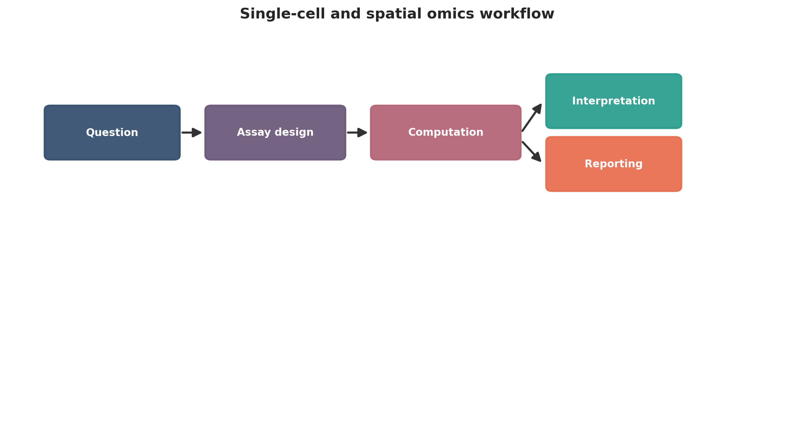
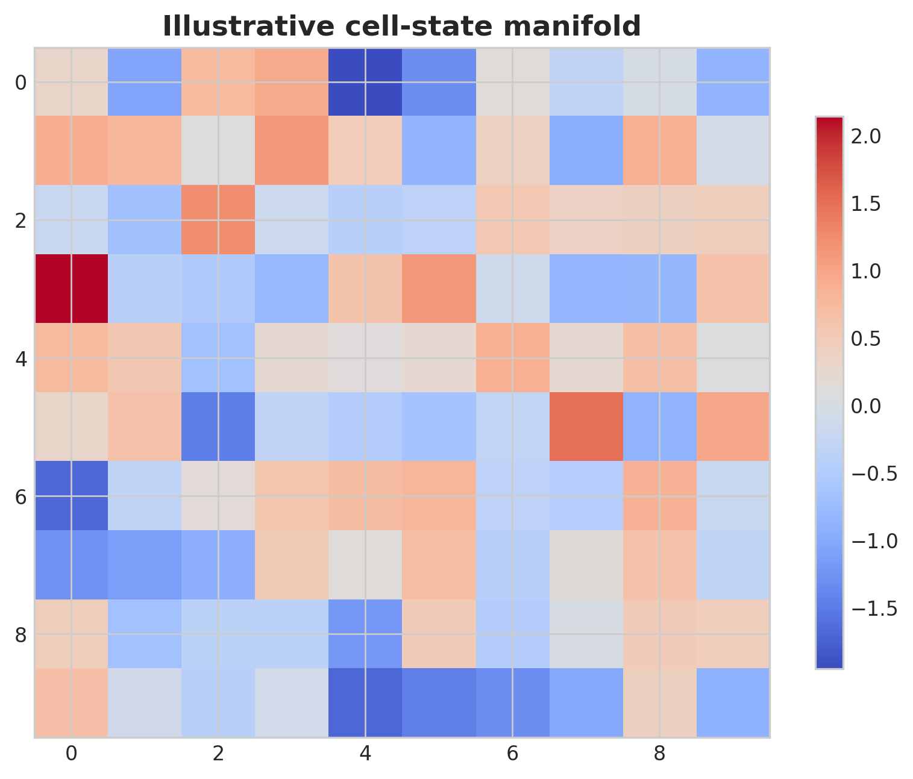
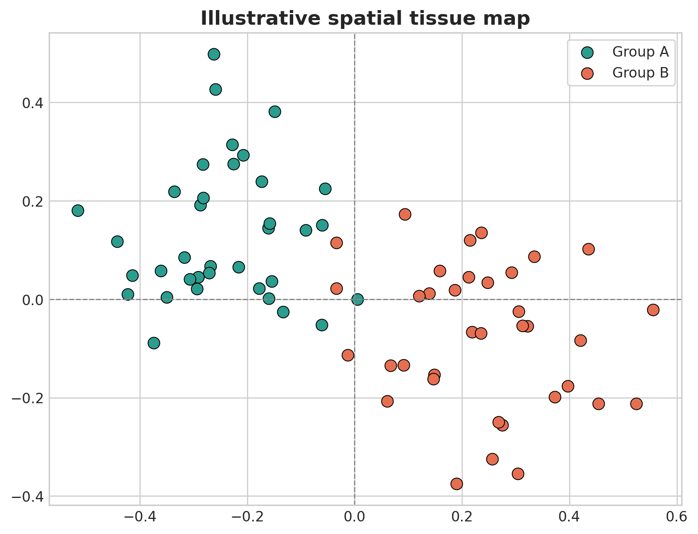
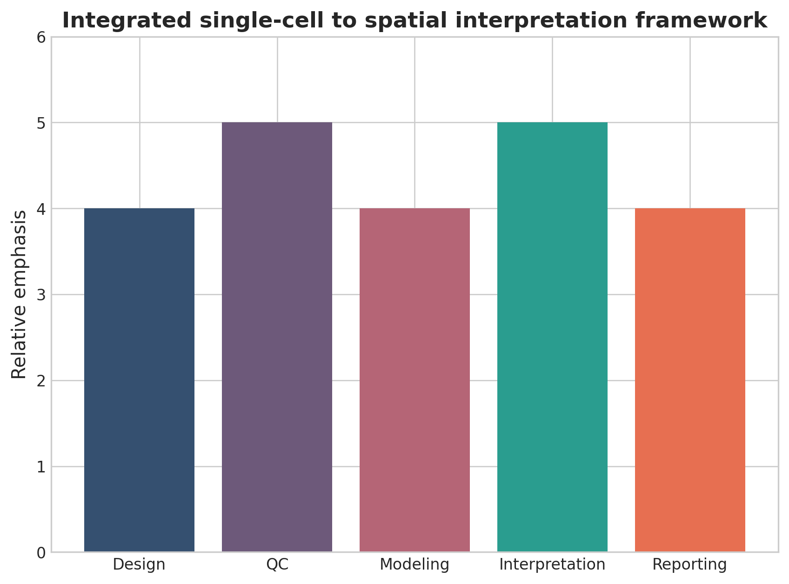

# Single-Cell and Spatial Omics in Practice: A Computational Roadmap for Cellular and Tissue-Resolved Biology

## Abstract
Single-cell and spatial omics have transformed biology by enabling cell-resolved and tissue-resolved analysis of molecular state. This full-length review presents a practical roadmap covering study design, preprocessing, quality filtering, annotation, trajectory inference, spatial analysis, integration, validation, and publication-ready reporting.

## Keywords
Single-cell omics; spatial omics; scRNA-seq; spatial transcriptomics; tissue biology; cell atlas; trajectory analysis; computational pathology

## 1. Introduction
Single-cell and spatial methods move biology beyond population averages toward cell states, neighborhoods, and tissue ecosystems. Their value lies not only in higher resolution, but in connecting molecular state to anatomy, microenvironment, and disease context. These technologies matter because tissue biology is organized at the level of cells, neighborhoods, and anatomical context, not only at the level of averaged molecular profiles. Single-cell assays resolve heterogeneity, while spatial assays preserve location and morphology. Together they allow investigators to ask which cells are present, where they sit, and how local environment reshapes state.

The computational difficulty is that cellular resolution does not guarantee interpretive clarity. Dissociation bias, ambient RNA, doublets, segmentation errors, sparse counts, and uncertain annotation all influence the final map. Attractive UMAPs or tissue overlays can conceal these issues unless the workflow is described with enough discipline.

A full-length review in this area should therefore connect wet-lab constraints, matrix-level preprocessing, image-aware spatial analysis, and the biological limits of inferred trajectories or communication networks. That integration is what readers need when moving from atlas generation to defensible inference.

It also helps to signal early what kinds of validation or external evidence will matter later, so readers understand from the outset which claims in introduction are meant to be descriptive and which are expected to support stronger inference.

The practical takeaway from introduction is that readers should finish the first section knowing exactly what problem the manuscript will solve and what kinds of conclusions it will deliberately avoid.

## 2. Technology choice and study design
Key decisions include whether the study requires dissociated cells, nuclei, intact tissue, targeted markers, transcriptome-wide profiling, chromatin accessibility, or multimodal measurement. Tissue handling, dissociation bias, fixation, throughput, and image compatibility strongly shape downstream analysis. Technology selection starts with the biological question and the specimen. Some studies need dissociated single cells to resolve immune or stromal diversity, others benefit from nuclei because frozen tissues or fragile cell types are involved, and others require intact sections because architecture itself is the primary signal. Throughput, panel size, transcriptome breadth, imaging compatibility, and tissue availability all influence the right choice.

Sample handling is particularly important. Dissociation can deplete fragile populations and induce stress-response transcription, while fixation and embedding strategies affect spatial signal preservation. If paired single-cell and spatial assays are planned, investigators should decide early whether one modality will serve as the reference and the other as the localization layer, because that choice shapes both sampling and downstream integration.

Study design should also specify whether the aim is discovery atlas building, group comparison, intervention response, developmental mapping, or pathology-linked interpretation. These goals impose different expectations for replicate structure, covariate modeling, and how much annotation uncertainty is acceptable.

Validation expectations should be tied directly to technology choice and study design, because cohort structure, reference choice, and assay pairing determine whether replication, orthogonal assays, or sensitivity analysis will be the decisive credibility check.

The practical takeaway from technology choice and study design is to choose the minimum analytical complexity that truly serves the biological question, then document the tradeoffs before downstream results make those compromises harder to see.

## 3. Single-cell workflow
A publication-ready single-cell pipeline includes matrix generation, quality filtering, doublet detection, ambient RNA assessment, normalization, dimensionality reduction, graph construction, clustering, marker-based annotation, and differential state analysis. The rationale for filtering and clustering resolution should be reported explicitly. The main single-cell pipeline begins with count matrix generation and proceeds through cell-level quality filtering, empty-droplet handling where relevant, doublet detection, normalization, variable feature selection, dimensionality reduction, graph construction, clustering, and marker-based annotation. Each of these steps is familiar, but each can materially change downstream biological labels.

Quality thresholds deserve explicit justification because they are tissue and platform dependent. Mitochondrial content, total counts, detected features, and ribosomal fraction can reflect true biology as well as poor-quality cells. Overly rigid filtering may remove activated or metabolically extreme states, whereas lax filtering can produce artifactual clusters driven by damaged cells or ambient RNA contamination.

Annotation is the most interpretively sensitive step. Marker panels, reference mapping, hierarchical labels, and manual curation should be aligned with tissue context and not treated as interchangeable. A publication-ready review should emphasize that cell types, cell states, and transient programs require different evidentiary standards.

Robustness in single-cell workflow is best demonstrated through explicit quality metrics, versioned resources, and sensitivity to reasonable threshold changes rather than by asserting that standard pipelines were followed.

The practical takeaway from single-cell workflow is that reproducibility usually fails at the level of quiet preprocessing decisions, so explicit thresholds and references are more valuable than long software lists.

## 4. Spatial workflow
Spatial omics adds image processing, segmentation or spot geometry, coordinate handling, neighborhood analysis, and spatially variable feature detection. Analysts should report image-processing logic and avoid letting visualization alone drive biological claims. Spatial analysis adds a second layer of complexity because expression must be interpreted together with coordinates, histology, and in many platforms imperfect spatial resolution. Depending on the technology, the analytical unit may be a segmented cell, a multi-cell spot, or a multiplexed imaging pixel neighborhood. Those units are not interchangeable and should be described explicitly.

Image preprocessing and segmentation are central. Tissue folds, staining variability, autofluorescence, nuclei segmentation errors, and misregistration between imaging channels can all produce false spatial patterns. Analysts should therefore document image QC, segmentation strategy, and any manual correction steps before presenting neighborhood maps or spatially variable features.

Statistical interpretation also needs restraint. Spatial autocorrelation, uneven tissue composition, and region-size imbalance can create convincing visual gradients that are not specific biological programs. Robust studies combine formal spatial testing with pathology-aware interpretation and sensitivity to segmentation or spot-resolution assumptions.

Robustness in spatial workflow is best demonstrated through explicit quality metrics, versioned resources, and sensitivity to reasonable threshold changes rather than by asserting that standard pipelines were followed.

The practical takeaway from spatial workflow is that reproducibility usually fails at the level of quiet preprocessing decisions, so explicit thresholds and references are more valuable than long software lists.

## 5. Integration of single-cell and spatial data
Single-cell references are often mapped back into spatial coordinates to estimate tissue composition and localize cell states. This is powerful but uncertain; different mapping algorithms and annotation schemes can change the conclusion materially. Integration typically treats single-cell profiles as the high-resolution reference and spatial data as the anatomical scaffold. Deconvolution, label transfer, and probabilistic mapping can estimate which cell states occupy each region, but the answer depends heavily on annotation quality, platform compatibility, and whether the reference captures all relevant states present in the tissue.

This becomes especially important in diseased tissues where dissociation bias may remove fragile populations or where treatment alters states not present in a healthy reference atlas. Analysts should therefore test alternative annotation granularities and, where possible, compare mapping results across methods rather than presenting one transferred label set as definitive.

The most convincing integrative studies use mapping to support focused biological questions, such as localizing an inflammatory program, explaining a tumor border niche, or relating neuronal states to cortical layers. Broad claims about complete tissue organization are much harder to support and require more extensive validation.

Results from integration of single-cell and spatial data should therefore be accompanied by stability checks, alternative parameterizations, or orthogonal evidence whenever the output is being used to support mechanism, subtype definition, or clinical relevance.

The practical takeaway from integration of single-cell and spatial data is to treat elegant models as aids to reasoning rather than substitutes for evidence, especially when interpretation begins to outrun what the data directly support.

## 6. Trajectories and interactions
Trajectory inference and ligand-receptor analyses can support biological narratives, but they are often inferential rather than directly observed. Manuscripts should explain these limits and avoid presenting inferred communication as proven signaling. Trajectory inference can be useful for developmental systems, regeneration, immune activation, or treatment response, but it often reconstructs plausible order rather than directly observed lineage history. Pseudotime should therefore be described as a computational ordering unless true temporal labels or lineage tracing are available.

Cell-cell communication analyses face similar limits. Ligand-receptor frameworks can highlight candidate interactions between neighboring or co-occurring states, yet transcript presence alone does not prove secretion, receptor occupancy, or functional signaling. Spatial context can narrow the hypothesis, but it does not automatically validate it.

The best manuscripts use trajectories and interaction analyses to generate mechanistic leads that are then compared with orthogonal data, perturbation experiments, or established biology. That stance is more credible than treating inferred arrows or communication networks as direct observations.

Results from trajectories and interactions should therefore be accompanied by stability checks, alternative parameterizations, or orthogonal evidence whenever the output is being used to support mechanism, subtype definition, or clinical relevance.

The practical takeaway from trajectories and interactions is to treat elegant models as aids to reasoning rather than substitutes for evidence, especially when interpretation begins to outrun what the data directly support.

## 7. Common pitfalls
Frequent errors include overclustering, assigning labels from too few markers, mistaking UMAP geometry for formal distance, ignoring dissociation artifacts, and treating poor-quality spatial spots as microenvironments. Overclustering is one of the most common errors because it converts gradual variation, cell cycle effects, or technical artifacts into apparently novel states. Another is assigning labels from a small number of familiar markers without considering alternative lineages, tissue context, or transitional programs.

Visual embeddings create additional traps. UMAP proximity is not a formal metric of lineage distance, and a visually distinct island may reflect parameter choice more than biology. In spatial datasets, low-quality spots or segmentation artifacts can likewise masquerade as microenvironments if image QC is weak.

Review articles should also warn about dissociation artifacts, batch-driven clusters, and the temptation to equate atlas scale with analytical quality. Bigger cell counts do not compensate for unclear design or unstable annotation.

A useful review does not only list problems in common pitfalls; it also shows what checks, controls, or external comparisons would reveal that those problems are distorting the result.

The practical takeaway from common pitfalls is to treat these errors as expected analytical hazards, not as rare exceptions, and to build manuscript structure around showing they were checked.

## 8. Translational applications
These methods are increasingly important in cancer, immunology, developmental biology, neuroscience, and pathology. Their strength lies in relating molecular state to location and context within tissue. In cancer, these methods can delineate tumor-immune neighborhoods, treatment-resistant compartments, and stromal programs that are invisible in bulk assays. In immunology and infection, they can map local activation states and tissue-specific immune organization. In neuroscience and developmental biology, they can relate molecular programs to anatomical layers and temporal progression.

Their translational value comes from contextual interpretation. A biomarker defined by a cell state may behave differently depending on spatial niche, surrounding immune composition, or tissue architecture. That is why these assays can be more informative than bulk profiles for pathology-linked questions, provided the study remains focused.

Still, translational use demands conservative claims. Small tissue cohorts, limited pathology diversity, and uncertain spatial label transfer can easily produce elegant but non-generalizable narratives. External cohorts, orthogonal staining, and pathology review remain critical.

The evidentiary bar in translational applications should rise with the ambition of the claim: exploratory biological framing may tolerate internal consistency, whereas biomarker or clinical language requires external validation and much tighter calibration.

The practical takeaway from translational applications is to match the language of impact to the strength of evidence, resisting clinical or mechanistic overstatement when the workflow is still best viewed as discovery-oriented.

## 9. Conclusion
Single-cell and spatial omics become publication-competitive when they address focused tissue questions with reproducible preprocessing, careful annotation, and controlled interpretation rather than only generating attractive atlases. The practical strength of single-cell and spatial omics is not resolution for its own sake, but the ability to connect molecular state, cellular identity, and tissue organization within the same study. That advantage becomes real only when preprocessing, annotation, and spatial interpretation are handled with unusual care.

A strong closing message is that these assays are most convincing when applied to focused tissue questions with replicate-aware design and pathology-grounded interpretation. They are least convincing when used only to produce large atlases with minimal control over uncertainty.

Future progress will depend on better benchmark tissues, improved segmentation and mapping standards, stronger integration with histopathology, and clearer reporting of annotation confidence. Those developments will make the field more useful than simply adding more cells or more colorful embeddings.

A strong closing section should also remind readers that validation is not interchangeable across studies: the right confirmatory step depends on whether the manuscript’s main claim is descriptive, predictive, mechanistic, or translational.

The practical takeaway from conclusion is that a good manuscript leaves the reader with a usable decision framework, not just an impression that the field is complex.

{ width=90% }

{ width=82% }

Table: Practical decision matrix for computational study planning.

| Question type | Preferred analytical emphasis | Key reporting requirement |
| --- | --- | --- |
| Discovery-oriented | Broad exploratory analysis | Clear filtering and exploratory limits |
| Comparative cohort study | Statistical testing and covariate handling | Design formula and confounder reporting |
| Translational or clinical | Robust interpretation and validation | Explicit limitations and reproducibility |
| Atlas-building or systems analysis | Integration and uncertainty quantification | Transparent preprocessing and annotation logic |

Table: Minimum publication-ready computational reporting checklist.

| Domain | Minimum expectation |
| --- | --- |
| Study design | Primary question, inclusion logic, metadata plan |
| Data processing | Quality control, reference versions, filtering thresholds |
| Statistics | Normalization, model choice, covariates, multiple-testing approach |
| Validation | Sensitivity analysis, external support, or orthogonal evidence |
| Reproducibility | Software versions, code or workflow trace, figure provenance |

{ width=82% }

{ width=78% }

## Declarations

### Author contributions
Dr Siddalingaiah H S conceived the tutorial review, prepared the manuscript, and approved the final version.

### Funding
No external funding was declared for preparation of this manuscript.

### Competing interests
The author declares no competing interests.

### Ethics approval and consent to participate
Not applicable. This tutorial review does not report a new human-participant or animal experiment.

### Consent for publication
Not applicable.

### Availability of data and materials
No new dataset was generated or analyzed for this tutorial review. Figures are educational schematics and illustrative formatted examples created for explanatory purposes.

### Author information
Dr Siddalingaiah H S, Professor, Community Medicine, Shridevi Institute of Medical Sciences and Research Hospital, Tumkur, India. ORCID: 0000-0002-4771-8285.

## References
1. Stuart T, Satija R. Integrative single-cell analysis. Nat Rev Genet. 2019;20(5):257-272.
2. Luecken MD, Theis FJ. Current best practices in single-cell RNA-seq analysis. Mol Syst Biol. 2019;15(6):e8746.
3. Vandereyken K, Sifrim A, Thienpont B, Voet T. Methods and applications for single-cell and spatial multi-omics. Nat Rev Genet. 2023;24(8):494-515.
4. Moses L, Pachter L. Museum of spatial transcriptomics. Nat Methods. 2022;19(5):534-546.
5. Rao A, Barkley D, Franca GS, Yanai I. Exploring tissue architecture using spatial transcriptomics. Nature. 2021;596(7871):211-220.
6. Palla G, Spitzer H, Klein M, et al. Squidpy: a scalable framework for spatial omics analysis. Nat Methods. 2022;19(2):171-178.
7. Marx V. Method of the Year: spatially resolved transcriptomics. Nat Methods. 2021;18:9-14.
8. Longo SK, Guo MG, Ji AL, Khavari PA. Integrating single-cell and spatial transcriptomics to elucidate intercellular tissue dynamics. Nat Rev Genet. 2021;22(10):627-644.
9. Williams CG, Lee HJ, Asatsuma T, et al. An introduction to spatial transcriptomics for biomedical research. Genome Med. 2022;14:68.
10. Lähnemann D, Köster J, Szczurek E, et al. Eleven grand challenges in single-cell data science. Genome Biol. 2020;21:31.
