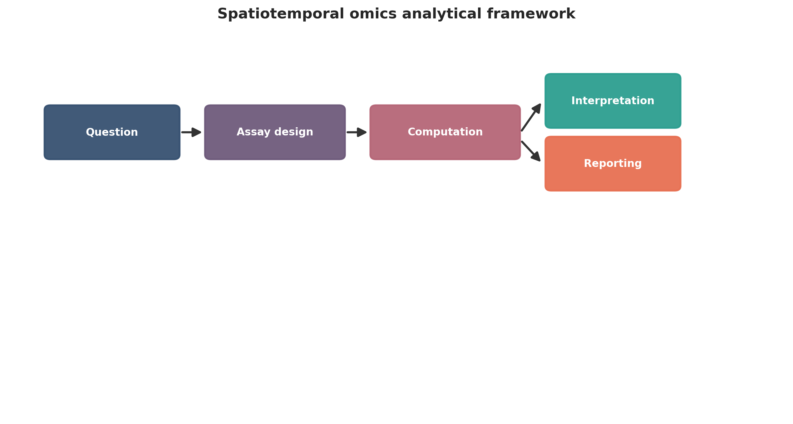
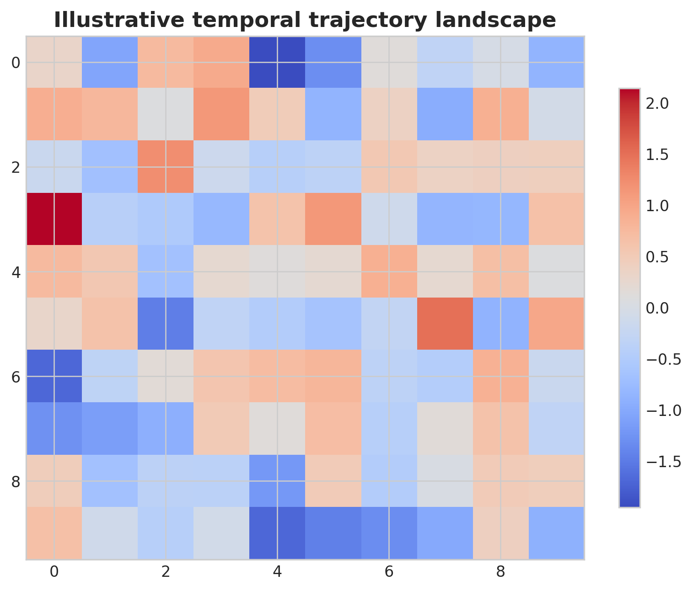
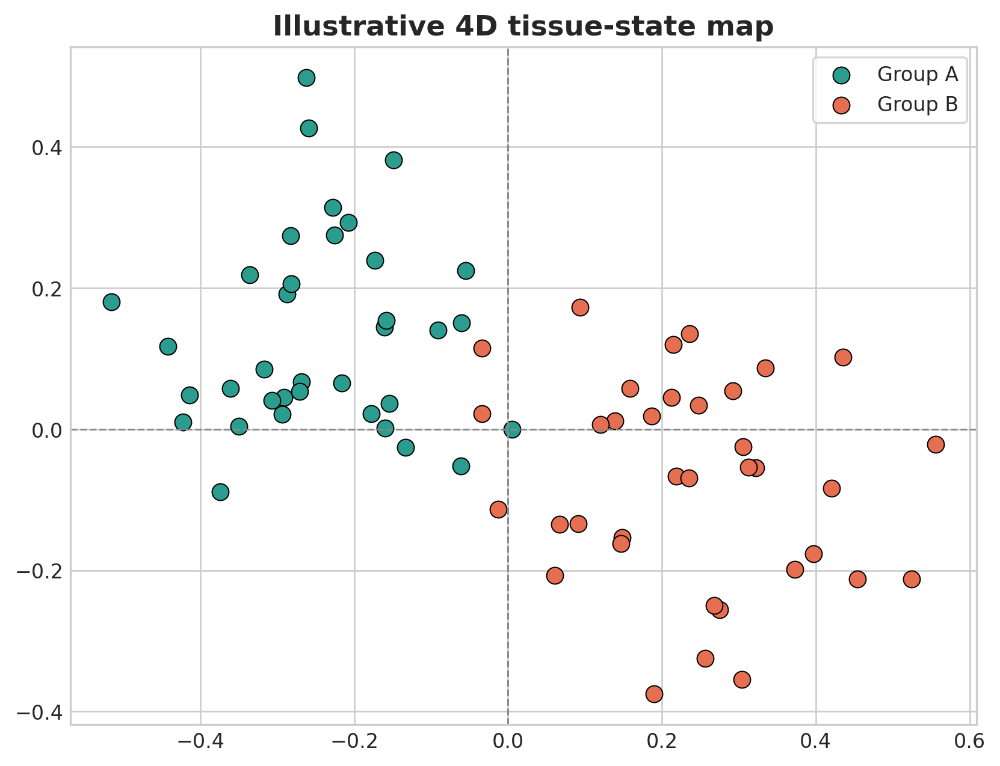
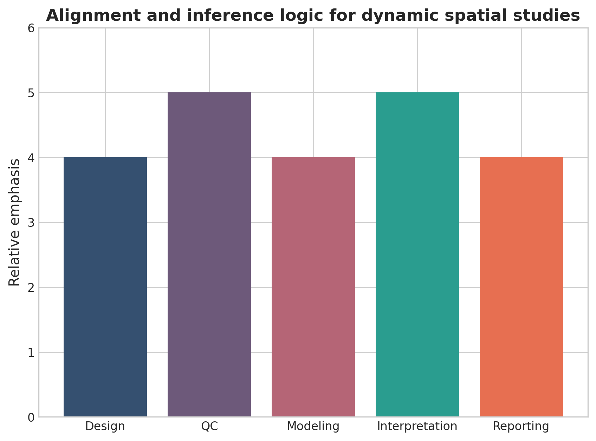

# Spatiotemporal Omics for Biology and Medicine: A Computational Framework for Dynamic Tissue-Resolved Analysis

## Abstract
Spatiotemporal omics extends molecular profiling beyond static snapshots by integrating tissue location with change over time. This review presents a computational framework for dynamic tissue-resolved studies, covering design, registration, temporal alignment, trajectory modeling, multimodal integration, uncertainty, and publication-ready reporting.

## Keywords
Spatiotemporal omics; spatial biology; longitudinal omics; tissue dynamics; developmental trajectories; disease progression; dynamic systems biology

## 1. Introduction
Many important biological questions concern change rather than static state: development, repair, progression, relapse, and treatment response. Spatiotemporal omics addresses these questions by combining molecular state, tissue location, and temporal structure in one analytical framework. Unlike static spatial biology, the aim is not only to describe tissue architecture at one moment, but to reconstruct how states emerge, move, and resolve across time. That shift from snapshot to process makes the computational problem fundamentally harder than describing a single well-annotated section.

Spatiotemporal studies combine at least three sources of complexity: spatial registration, temporal alignment, and molecular interpretation. Each can fail independently. A false correspondence between sections can create an apparent trajectory, and a strong pseudotime model can still be misleading if the spatial alignment or sampling scheme is weak.

A practical review must therefore emphasize what kind of time is actually available in the data. Some studies observe time directly through serial sampling, some reconstruct it from developmental stage collections, and others infer it computationally from state similarity. Those are not equivalent evidentiary situations, and they should not be written as though they support the same strength of claim. A strong introduction makes this boundary explicit before the methods section begins.

This distinction matters because the main scientific appeal of spatiotemporal omics is causal-looking narrative. Readers naturally want to see progression, transition, emergence, and response. Yet those interpretations become trustworthy only when the manuscript is explicit about where the temporal axis came from, how much of the ordering is empirical, and where biological plausibility is doing more work than direct observation. In other words, the field is powerful precisely because it invites dynamic explanation, and that is also why it requires unusually careful framing.

## 2. Study design for dynamic tissues
The key design question is whether time is observed directly, reconstructed from serial sections, inferred computationally, or integrated across cohorts. Sampling interval, intervention timing, section provenance, and longitudinal metadata determine what temporal claims are defensible. Repeated sampling from the same organism, aligned serial sections, synchronized perturbation experiments, and cross-sectional cohorts arranged by stage all support different kinds of claims, and the manuscript should make that distinction explicit because it determines how strongly progression can be interpreted.

Sampling interval is also central. Fast processes such as immune infiltration after therapy or wound healing may require dense timepoints, whereas developmental atlases may tolerate broader staging if morphology is stable and stage assignment is reliable. Sparse sampling can still be valuable, but only if the analysis avoids implying fine-grained kinetics that the data cannot actually resolve.

Metadata matters here more than in static studies. Intervention timing, tissue orientation, section depth, anatomical landmarks, and specimen-level covariates all influence alignment and interpretation. Without them, differences across timepoints can reflect collection artifacts rather than biology. Strong study-design sections therefore do more than justify assay choice; they define the observational backbone on which every later dynamic claim will rest.

Another design issue is whether the same biological unit is being followed through time or whether different specimens are being assembled into a common timeline. Longitudinal sampling from the same system usually supports stronger claims about progression, but it may be difficult or invasive. Cross-sectional reconstruction across staged specimens can still be valuable, especially in development, but it increases dependence on stage assignment and between-sample comparability. Manuscripts should say clearly which situation applies, because it changes how confidently one can talk about continuity, transition rates, and tissue reorganization.

## 3. Registration and temporal alignment
Reliable spatiotemporal inference depends on coordinate alignment across sections or timepoints. Registration error can create false gradients or false movement, so studies should describe their reference frame, alignment method, and uncertainty handling explicitly. Whether alignment is performed through image landmarks, morphology-informed warping, atlas-based coordinates, or molecular similarity, the chosen reference frame controls every later claim about movement, persistence, or regional transition.

Registration error is not merely a nuisance variable. Small misalignments can create artificial gradients, suggest migration that did not occur, or obscure true boundaries between compartments. Review articles should therefore discuss quality metrics for alignment, uncertainty visualization, and how conclusions change when the reference frame is perturbed.

Temporal alignment has its own hazards. When timepoints are unequally sampled or pooled across individuals, computational smoothing may imply continuity that is not directly observed. Analysts should clarify where interpolation was used and where the results remain anchored only to discrete observations. Publication-ready papers should also show how strongly the main spatial conclusions depend on the chosen registration strategy rather than implying that alignment is a solved preprocessing detail.

One practical issue is that registration quality is rarely uniform across an entire specimen. Border regions, damaged tissue, necrotic areas, and morphologically unstable compartments may align much less reliably than the core architecture. Manuscripts are therefore stronger when they distinguish globally aligned tissue from regions where dynamic inference is only weakly supported. That distinction helps readers see whether a striking spatial trend reflects broad biological structure or a fragile local correspondence.

## 4. Dynamic modeling strategies
Spatiotemporal datasets often use trajectory inference, pseudotime, graph methods, tensor approaches, or dynamical models. The manuscript should always clarify whether results reflect observed change or computationally inferred progression. Dynamic modeling in this field ranges from simple stage-wise comparisons to pseudotime reconstruction, graph diffusion, optimal transport, tensor decomposition, and mechanistic dynamical systems. The correct choice depends on whether the goal is descriptive ordering, transition probability estimation, lineage coupling, or explicit state dynamics.

Pseudotime is useful when direct temporal labels are incomplete, but it should not be narrated as measured time. Likewise, optimal transport or graph-based trajectory models can reveal plausible flows between states, yet they depend strongly on neighborhood construction, regularization, and how the state space was defined. These assumptions deserve main-text discussion because they shape the biological narrative.

Model outputs should also be linked back to tissue structure. A compelling dynamic result is one that explains where transitions occur, which compartments are stable, and how state change relates to morphology or intervention timing. Models that remain only in latent space are harder to interpret biologically. For that reason, strong manuscripts present these models as disciplined aids to reasoning, supported by stability checks and orthogonal evidence where possible, rather than as self-validating engines of discovery.

It is also useful to compare sophisticated dynamic models against simpler alternatives. In some datasets, a careful sequence of pairwise timepoint comparisons plus spatial neighborhood summaries may explain the biology almost as well as an elaborate trajectory framework. When that happens, the simpler representation may actually be preferable because the assumptions are easier to audit. Full-length reviews should make clear that model complexity is justified only when it adds explanatory value that simpler summaries cannot provide.

## 5. Integration with references
Many analyses depend on single-cell references to identify states and infer transitions. These references add value but also impose assumptions, so robust studies assess whether conclusions change under alternative annotations or reference sets. Reference datasets can substantially improve interpretability, especially when the spatiotemporal assay has limited feature depth, but they also import assumptions about annotation, stage definition, and the completeness of known cell states.

A strong analysis therefore tests whether conclusions persist under alternative references or coarser annotation schemes. This matters especially in regeneration and disease settings, where transitional or treatment-induced states may not exist in the canonical atlas. Overconfident label transfer can erase exactly the novel biology the study hopes to capture.

Reference integration works best when it is used to bound uncertainty rather than to eliminate it. The manuscript should describe how much of the signal is directly observed in the target data and how much is inferred by borrowing structure from external resources. Readers should be able to tell whether a claimed transition is supported primarily by the spatiotemporal dataset itself or by consistency with an external atlas.

## 6. Common inferential errors
The most common mistakes are treating pseudotime as literal time, ignoring section effects, failing to separate abundance change from rearrangement in space, and overinterpreting spatial gradients without robust alignment. Treating pseudotime as literal time is the most frequent conceptual error, but it is not the only one. Another is failing to distinguish changes in abundance from changes in location. A cell type may appear to move across tissue simply because one region expands or contracts, not because individual cells migrate.

Section effects are another major risk. Differences in section thickness, orientation, staining, or imaging quality can create temporal-looking patterns that disappear once alignment uncertainty is considered. Analysts should show that major trends are not driven by one problematic slice or one poorly matched timepoint.

Overinterpretation of gradients is also common. Spatially smooth trends can be visually compelling, yet they may reflect averaging, tissue composition, or registration artifacts. Review articles should encourage formal checks before assigning developmental or disease-progression meaning to these patterns. In practice, this means showing the negative controls, alternative alignments, and simpler competing explanations that were ruled out before a dynamic narrative was accepted.

## 7. Biological applications
This framework is relevant to embryology, tissue regeneration, neurodevelopment, wound healing, tumor evolution, and therapy response. Its practical strength lies in identifying where and when key transitions occur. Developmental systems are an obvious application because cell-state transitions unfold in defined anatomical space. Embryology, organogenesis, and neural patterning all benefit from models that link lineage progression to tissue compartments. Regeneration and wound healing pose similar questions, but with intervention timing and inflammatory context layered on top.

In cancer and chronic disease, spatiotemporal approaches can illuminate clonal expansion, immune remodeling, stromal adaptation, and therapy response. These settings are especially challenging because repeated sampling may be sparse and treatment itself changes tissue architecture, making alignment and interpretation more difficult than in developmental atlases.

The most compelling application papers answer focused questions about when and where key transitions occur. Broad claims about total tissue dynamics are harder to defend unless the sampling design, alignment quality, and validation burden are exceptionally strong. The language of application should therefore stay tightly matched to evidence: exploratory biological framing may be appropriate for internally coherent dynamic patterns, whereas biomarker or clinical claims require external validation and much tighter calibration.

Therapy-response studies illustrate this point especially well. A pre-treatment and post-treatment comparison may reveal dramatic tissue remodeling, but without dense intermediate sampling it can still be unclear whether the apparent transition was gradual, abrupt, or driven by selective survival of one compartment. Spatiotemporal analysis is most convincing when it acknowledges such ambiguity and states exactly which parts of the response were directly observed versus computationally reconstructed.

Similarly, developmental applications gain strength when temporal interpretation is anchored to anatomical landmarks or known lineage relationships rather than to trajectory geometry alone. A manuscript that links state progression to recognizable compartments, morphologic milestones, or experimentally defined stages will usually be more persuasive than one that relies mainly on an elegant but weakly grounded latent-time map.

## 8. Reporting standards
Publication-ready studies should report temporal logic, coordinate systems, registration strategy, modality integration assumptions, and sensitivity analysis for alternative alignments or trajectory settings. Reporting needs to be more explicit here than in static spatial studies because the reader must understand both the coordinate system and the temporal logic. Manuscripts should specify how time was observed or inferred, what anatomical reference was used, how sections were registered, and how uncertainty was represented.

It is also important to state which parts of the workflow are descriptive and which are model-based. Interpolated maps, smoothed trajectories, and borrowed annotations can be highly informative, but they should be labeled as such. Without that transparency, readers may mistake inferred continuity for direct observation.

Sensitivity analysis should be treated as standard rather than optional. Alternative alignments, trajectory parameters, stage definitions, or reference atlases can materially change conclusions. A publication-ready spatiotemporal paper should show at least the main robustness checks in the core manuscript. More generally, reporting should help readers separate what was directly observed, what was modeled, and what remains uncertain after modeling.

A practical reporting structure is to separate the study into four layers: observed sampling design, spatial preprocessing, dynamic inference, and biological interpretation. This makes it easier for reviewers and readers to locate where uncertainty enters the workflow and to decide whether the conclusions are limited mainly by sampling, by alignment, by modeling, or by interpretation. In a field this complex, structure itself becomes part of methodological rigor.

## 9. Conclusion
Dynamic spatial biology is a promising frontier, but it requires stronger computational discipline than static atlas generation because both spatial and temporal claims can fail if alignment and inference are weak. Spatiotemporal omics is valuable because it lets investigators ask dynamic questions in their anatomical setting, but that advantage comes with a much higher inferential burden than static atlas work. Claims about progression, movement, or response are only as strong as the registration, sampling design, and uncertainty handling that support them.

The strongest closing message is therefore one of disciplined ambition. These methods are worth using when the biological question genuinely concerns change over time in tissue context, not merely because four-dimensional plots look modern or comprehensive.

As the field matures, better alignment benchmarks, standardized uncertainty reporting, and richer multimodal reference atlases will likely matter more than incremental increases in modeling complexity. Those advances will make dynamic tissue biology more reproducible and more clinically credible. The main value of a strong spatiotemporal review is therefore not to make the field sound more futuristic, but to leave readers with a usable decision framework for when dynamic tissue-resolved analysis is warranted and how it should be reported when undertaken.

That decision framework should be conservative in one specific way: it should help researchers recognize when a simpler spatial or longitudinal design would answer the question well enough. Not every biological problem requires full spatiotemporal modeling, and not every dataset benefits from being narrated as a dynamic continuum. The strongest contribution of this field will come from studies that use its additional complexity only when it changes the biological conclusion in a meaningful and testable way.

{ width=90% }

{ width=82% }

Table: Practical decision matrix for computational study planning.

| Question type | Preferred analytical emphasis | Key reporting requirement |
| --- | --- | --- |
| Discovery-oriented | Broad exploratory analysis | Clear filtering and exploratory limits |
| Comparative cohort study | Statistical testing and covariate handling | Design formula and confounder reporting |
| Translational or clinical | Robust interpretation and validation | Explicit limitations and reproducibility |
| Atlas-building or systems analysis | Integration and uncertainty quantification | Transparent preprocessing and annotation logic |

Table: Minimum publication-ready computational reporting checklist.

| Domain | Minimum expectation |
| --- | --- |
| Study design | Primary question, inclusion logic, metadata plan |
| Data processing | Quality control, reference versions, filtering thresholds |
| Statistics | Normalization, model choice, covariates, multiple-testing approach |
| Validation | Sensitivity analysis, external support, or orthogonal evidence |
| Reproducibility | Software versions, code or workflow trace, figure provenance |

{ width=82% }

{ width=78% }

## Declarations

### Author contributions
Dr Siddalingaiah H S conceived the tutorial review, prepared the manuscript, and approved the final version.

### Funding
No external funding was declared for preparation of this manuscript.

### Competing interests
The author declares no competing interests.

### Ethics approval and consent to participate
Not applicable. This tutorial review does not report a new human-participant or animal experiment.

### Consent for publication
Not applicable.

### Availability of data and materials
No new dataset was generated or analyzed for this tutorial review. Figures are educational schematics and illustrative formatted examples created for explanatory purposes.

### Author information
Dr Siddalingaiah H S, Professor, Community Medicine, Shridevi Institute of Medical Sciences and Research Hospital, Tumkur, India. ORCID: 0000-0002-4771-8285.

## References
1. Rao A, Barkley D, Franca GS, Yanai I. Exploring tissue architecture using spatial transcriptomics. Nature. 2021;596(7871):211-220.
2. Palla G, Spitzer H, Klein M, et al. Squidpy: a scalable framework for spatial omics analysis. Nat Methods. 2022;19(2):171-178.
3. Vandereyken K, Sifrim A, Thienpont B, Voet T. Methods and applications for single-cell and spatial multi-omics. Nat Rev Genet. 2023;24(8):494-515.
4. Longo SK, Guo MG, Ji AL, Khavari PA. Integrating single-cell and spatial transcriptomics to elucidate intercellular tissue dynamics. Nat Rev Genet. 2021;22(10):627-644.
5. Marx V. Method of the Year: spatially resolved transcriptomics. Nat Methods. 2021;18:9-14.
6. Williams CG, Lee HJ, Asatsuma T, et al. An introduction to spatial transcriptomics for biomedical research. Genome Med. 2022;14:68.
7. Enablers and challenges of spatial omics, a melting pot of technologies. Mol Syst Biol. 2022;18:e10571.
8. Spatiotemporal omics for biology and medicine. Cell. 2024.
9. Spatial omics at the forefront: emerging technologies, analytical innovations, and clinical applications. Cancer Cell. 2025.
10. Moses L, Pachter L. Museum of spatial transcriptomics. Nat Methods. 2022;19(5):534-546.
