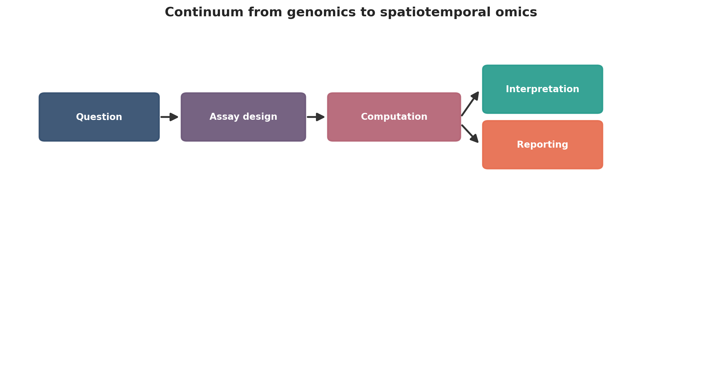
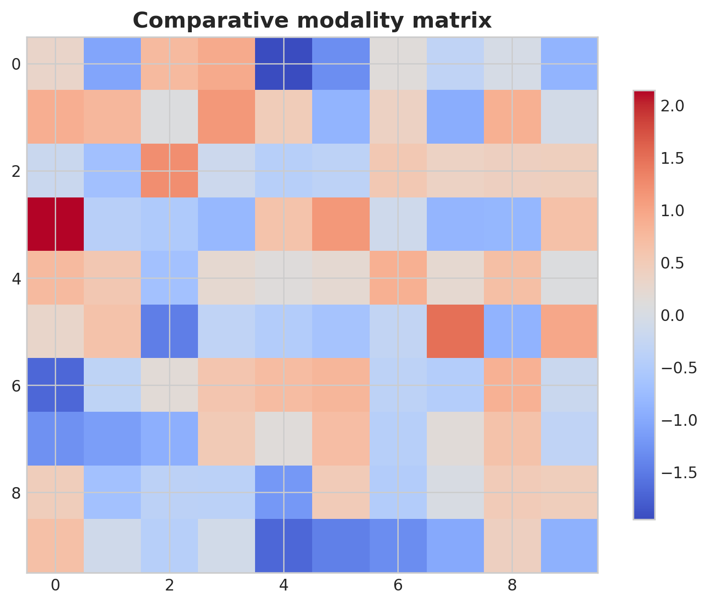
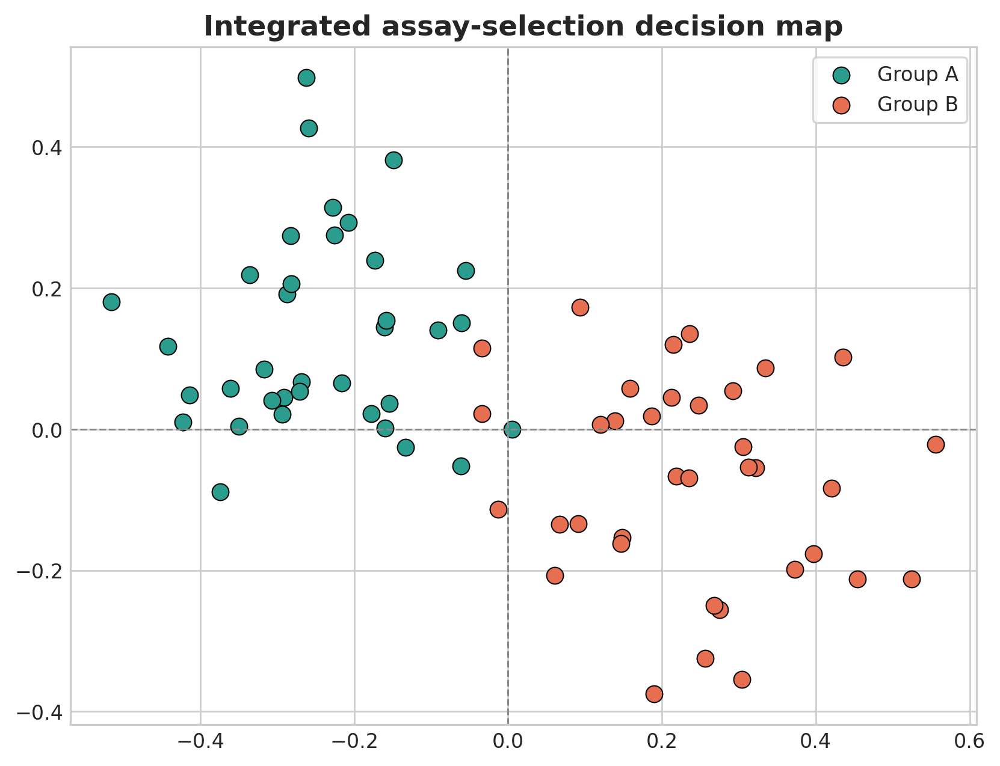
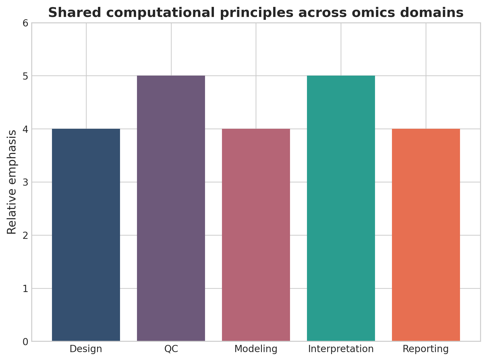

# From Genomics to Spatiotemporal Omics: An Integrated Computational Roadmap for Modern Biomedical Data Analysis

## Abstract
Biomedical data analysis now spans a continuum from genome-scale sequencing to transcriptomics, multiomics integration, single-cell profiling, spatial analysis, and spatiotemporal tissue modeling. This umbrella review synthesizes the computational logic connecting these domains and presents a unified roadmap for assay choice, analysis structure, integration, interpretation, and transparent reporting.

## Keywords
Genomics; transcriptomics; multiomics; single-cell omics; spatial omics; spatiotemporal omics; biomedical informatics; umbrella review

## 1. Introduction
Modern omics is no longer a set of isolated specialties. Genomics, transcriptomics, multiomics, single-cell, spatial, and spatiotemporal methods now form an analytical continuum in which each modality adds a different level of biological resolution and interpretive complexity. The practical challenge for modern investigators is no longer access to one omics workflow, but deciding how far along the resolution ladder a given question needs to go. Sequence variation, expression, multimodal coupling, single-cell heterogeneity, spatial structure, and time-resolved tissue dynamics all offer different kinds of evidence. More resolution can reveal more biology, but it also increases preprocessing burden, model complexity, and failure modes.

An umbrella review is useful only if it clarifies what each layer contributes and where the additional complexity becomes justified. That means comparing modalities not as a prestige hierarchy, but as a set of tools with different inferential targets. Readers should come away knowing when a bulk RNA-seq study is enough, when a multiomics design adds decisive value, and when single-cell or spatial resolution changes the biological answer.

The article is strongest when it treats modern omics as a continuum of decisions rather than a menu of technologies. Assay choice, preprocessing transparency, interpretation limits, and translational caution recur across all domains even though the data objects differ. By the end of the introduction, the reader should understand not only which modalities will be compared, but also what kinds of claims each modality can realistically support and where later sections will ask for restraint rather than escalation.

## 2. The resolution hierarchy
Genomics defines sequence variation, transcriptomics captures expression, multiomics links molecular layers, single-cell methods resolve heterogeneity, spatial methods preserve anatomy, and spatiotemporal methods add change across time. Each increase in resolution brings additional modeling burden and different failure modes. Genomics provides the most stable view of inherited or acquired sequence change, transcriptomics adds dynamic regulation, multiomics links layers, single-cell assays resolve cellular heterogeneity, spatial methods preserve tissue architecture, and spatiotemporal approaches attempt to model change within that architecture. Each step upward adds biological specificity, but also new uncertainty and greater dependence on preprocessing choices.

This hierarchy is useful because it exposes the tradeoff between breadth and interpretability. Bulk assays often support larger cohorts and cleaner statistical models, whereas high-resolution assays produce richer local insight but usually on smaller and more technically complex datasets. A strong umbrella review should make that tradeoff explicit rather than implying that later technologies automatically supersede earlier ones.

The hierarchy also helps separate inferential targets. Variant classification, differential expression, latent-factor discovery, cell-state annotation, neighborhood analysis, and dynamic trajectory modeling are fundamentally different outputs. Confusing them leads to overclaiming, especially when visually rich downstream methods are treated as stronger evidence than simpler upstream assays. A useful umbrella review should therefore keep asking the same question at each level: what exactly became more measurable, and what new uncertainty was introduced in exchange?

## 3. Shared design principles
Across all omics domains the same high-level discipline applies: start with the biological question, select the minimum assay complexity needed, preserve design metadata, define the inferential target clearly, and make preprocessing decisions transparent. Across all omics domains, the first principle is to define the biological question before choosing the assay. The second is to preserve the metadata needed to support that question: cohort structure, covariates, specimen handling, timing, anatomical context, and batch variables. The third is to define the inferential target clearly so that preprocessing and modeling decisions remain aligned with the objective.

These principles sound obvious, but they are where many studies fail. Investigators often inherit data generated for one purpose and then impose a more ambitious analytical story later. When design and question are mismatched, the resulting workflow may be technically sophisticated yet conceptually weak. That is true whether the assay is whole-genome sequencing or spatial transcriptomics.

An umbrella review should therefore emphasize decision discipline over tool novelty. Readers need to understand how to choose the minimum complexity necessary for the question, because unnecessary assay escalation usually increases uncertainty faster than it improves insight. Across modalities, the most credible studies are usually those in which design logic stays visible all the way into the results section rather than disappearing behind a technically impressive workflow.

This principle matters particularly in collaborative biomedical projects, where data are often generated before the analytical question is fully stabilized. Umbrella reviews are useful because they remind readers that not every available modality needs to be pushed into the final story. Sometimes the strongest paper is the one that explicitly centers one assay, uses a second modality only to contextualize it, and declines a broader integrative narrative that the dataset cannot support cleanly.

## 4. Data processing across modalities
Although each assay has modality-specific preprocessing, all rely on explicit reference resources, quality control, filtering logic, normalization or transformation, and careful treatment of metadata before inference. These steps should not be hidden in supplementary methods because they often determine the main story. Although each modality has its own specialized pipeline, they all depend on the same foundational tasks: quality control, reference management, filtering, normalization or transformation, and careful joining with metadata. What differs is the object being processed, whether it is reads, variant calls, count matrices, protein intensities, segmented cells, or aligned tissue sections.

This cross-domain view is valuable because it shows where failures recur under different names. A bad genome build, an outdated transcript annotation, an unstable integration reference, poor segmentation, or weak registration all play the same role: they distort the data before the interpretive step begins. Review articles should highlight those parallels because they help readers transfer good habits across domains.

The most publication-relevant message is that preprocessing choices deserve main-text visibility. In nearly every omics field, the dominant analytical errors arise before formal statistics. Hiding those decisions in supplementary methods weakens both reproducibility and trust. Across modalities, robustness is demonstrated less by claiming adherence to standard pipelines than by showing the concrete references, thresholds, and quality checks that made the processed data believable.

This cross-domain view also helps explain why manuscripts with very different technologies can fail in surprisingly similar ways. A poor genome build, an unstable spatial segmentation workflow, an overaggressive batch-correction strategy, or weak handling of missing multiomic data all produce the same downstream problem: a polished interpretive layer built on uncertain intermediate objects. Framing preprocessing as the common structural foundation across omics domains is therefore one of the main educational values of an umbrella review.

## 5. Interpretation and integration
The field now generates many different types of outputs: variant calls, differential expression lists, latent factors, clusters, spatial neighborhoods, and inferred trajectories. Publication-quality work makes clear what kind of evidence each output represents and what it does not prove. Modern omics studies increasingly combine outputs from different levels of resolution, but interpretation depends on knowing what each output actually represents. A variant call reflects sequence evidence, a differential expression list reflects modeled abundance change, a latent factor reflects shared statistical structure, and a spatial neighborhood reflects coordinate-informed association. These are not interchangeable kinds of biological proof.

Integration is most useful when it narrows uncertainty by combining complementary evidence. For example, genomics and transcriptomics may connect variant effect to expression or splicing, while single-cell and spatial data may connect state to anatomical niche. Problems arise when integration is used rhetorically, with each additional layer treated as automatic validation regardless of its own uncertainty.

A good umbrella review should therefore teach interpretive hierarchy. Some outputs are descriptive, some are inferential, and some are mechanistic only when supported by orthogonal validation. That distinction matters more than any specific software brand. When integration is central to the manuscript, readers should also be shown how stable the integrated signal remains under alternative parameterizations, because elegant multimodal summaries can become rhetorically stronger than the evidence that supports them.

This is especially important for readers moving between subfields. A researcher trained in bulk genomics may intuitively overvalue visually rich single-cell or spatial outputs, while a researcher trained in atlas-style methods may underappreciate how much stronger some lower-dimensional but well-controlled genomic signals can be. An integrated review should help recalibrate those instincts by making the hierarchy of evidence explicit rather than leaving readers to infer it from the sophistication of the graphics or the novelty of the assay.

## 6. Common cross-domain failures
Frequent problems include weak cohort design, underreported filtering, batch effects, visually persuasive but statistically weak plots, and confusion between association and mechanism. These errors recur because assay innovation often outpaces reporting discipline. Weak design, underreported filtering, unresolved batch effects, and association-mechanism confusion are not isolated problems of one field; they recur across nearly every omics domain. The forms differ, but the logic is the same: visually impressive outputs can outrun the quality of the underlying data and study design.

Another recurring failure is assay overreach. Investigators sometimes use a high-resolution modality simply because it is available, then make claims that the cohort size, annotation confidence, or preprocessing stability cannot sustain. In other cases, simpler assays are treated as inherently inferior even when they would have supported stronger statistical inference.

An umbrella review is useful when it names these patterns explicitly. Doing so helps readers recognize that many failures are structural rather than modality-specific, and that good analytical habits can transfer across very different datasets. The most useful papers in this category do not stop at warning about errors; they show what checks, controls, or competing explanations should be visible before readers accept a complex omics narrative as robust.

## 7. Clinical and translational outlook
Omics methods are increasingly linked to diagnosis, prognosis, therapy selection, and disease mechanism. The more clinically ambitious the claim, the more conservative the computational interpretation should be. Clinical translation is now a realistic goal across multiple omics domains, but the route to translation differs by assay. Genomics already supports diagnosis and therapeutic stratification in defined settings, transcriptomics contributes molecular classification and pathway interpretation, and higher-resolution modalities promise better tissue-contextualized biomarkers. The more complex the modality, the more rigorous the validation burden becomes.

This section should therefore compare not only technical capability but readiness for use. Some assays are already embedded in clinical workflows, while others remain strongest as discovery tools or trial-enrichment strategies. Translational writing is most persuasive when it separates those categories clearly instead of implying that all omics outputs are equally close to implementation.

Clinical ambition also sharpens the need for conservative interpretation. A finding that is acceptable as a hypothesis in exploratory biology may be inappropriate as a biomarker claim. That distinction should anchor any roadmap that spans multiple omics technologies, because translational language is often where methodological caution is lost first.

The comparison across modalities is especially useful here. Genomics can already support highly standardized diagnostic interpretations in certain contexts, whereas spatial, single-cell, or spatiotemporal assays may currently contribute richer mechanistic context than validated clinical endpoints. A clear umbrella review should say this plainly. Doing so does not diminish the newer methods; it simply places them at the right point on the translational maturity curve.

## 8. Future directions
The field is moving toward more integrated, more spatial, and more multimodal assays with closer links to imaging and clinical records. This direction is promising but will require better benchmarks, stronger reproducibility standards, and more realistic treatment of uncertainty. The field is moving toward multimodal, image-linked, and longitudinal designs in which previously separate assays are measured or modeled together. This trend is scientifically productive because biological systems are layered, contextual, and dynamic. It is also analytically demanding because each new layer adds preprocessing complexity and widens the space of plausible overclaims.

The most important future advances may therefore be infrastructural rather than glamorous: benchmark datasets spanning modalities, better shared ontologies, interoperable file formats, stronger provenance tracking, and clearer uncertainty reporting. These elements make it possible to compare methods and carry results across studies.

An umbrella review should also caution that the future is not automatically more complex. In many settings, smarter assay selection and better study design will yield more robust science than maximal multimodal measurement. Progress depends on choosing complexity where it is justified and resisting the tendency to describe every additional layer as a universal improvement.

The most plausible near-term future is therefore selective integration, not indiscriminate accumulation. Successful studies will increasingly combine assays that answer genuinely different parts of the same biological question, while leaving out modalities that add cost and interpretive burden without clarifying the result. That is a healthier direction for the field than treating every project as a race toward maximal dimensionality.

## 9. Conclusion
A unified computational roadmap helps researchers avoid modality-specific tunnel vision and choose when added analytical complexity is justified by the biological question. The central lesson across omics domains is that added analytical resolution is worthwhile only when it sharpens the answer to a real biological or clinical question. More layers, more cells, more spatial detail, or more timepoints are not goals in themselves; they are tools with specific evidentiary strengths and limits.

A useful integrated roadmap therefore teaches readers how to choose among modalities, how to recognize shared failure modes, and how to communicate uncertainty honestly. That perspective is more durable than any single pipeline because technologies will keep changing while the underlying logic of defensible analysis remains stable.

For future work, the best outcome is a field that becomes both more integrated and more disciplined. Better benchmarks, clearer reporting, and fit-for-purpose assay selection will make modern omics more reproducible and more useful than simply layering on additional technical complexity. A successful umbrella review should therefore leave the reader with a usable framework for choosing among modalities, recognizing when complexity is justified, and describing uncertainty before it becomes overclaiming.

In that sense, the real contribution of an integrated computational roadmap is not just comparative description. It is methodological triage. It helps investigators decide when a simple, well-powered assay is enough, when a second modality meaningfully sharpens interpretation, and when high-resolution multimodal designs are worth their analytical cost. A manuscript that makes those decisions clearer has practical value even for readers who never use every modality covered in the review.

{ width=90% }

{ width=82% }

Table: Practical decision matrix for computational study planning.

| Question type | Preferred analytical emphasis | Key reporting requirement |
| --- | --- | --- |
| Discovery-oriented | Broad exploratory analysis | Clear filtering and exploratory limits |
| Comparative cohort study | Statistical testing and covariate handling | Design formula and confounder reporting |
| Translational or clinical | Robust interpretation and validation | Explicit limitations and reproducibility |
| Atlas-building or systems analysis | Integration and uncertainty quantification | Transparent preprocessing and annotation logic |

Table: Minimum publication-ready computational reporting checklist.

| Domain | Minimum expectation |
| --- | --- |
| Study design | Primary question, inclusion logic, metadata plan |
| Data processing | Quality control, reference versions, filtering thresholds |
| Statistics | Normalization, model choice, covariates, multiple-testing approach |
| Validation | Sensitivity analysis, external support, or orthogonal evidence |
| Reproducibility | Software versions, code or workflow trace, figure provenance |

{ width=82% }

{ width=78% }

## Declarations

### Author contributions
Dr Siddalingaiah H S conceived the tutorial review, prepared the manuscript, and approved the final version.

### Funding
No external funding was declared for preparation of this manuscript.

### Competing interests
The author declares no competing interests.

### Ethics approval and consent to participate
Not applicable. This tutorial review does not report a new human-participant or animal experiment.

### Consent for publication
Not applicable.

### Availability of data and materials
No new dataset was generated or analyzed for this tutorial review. Figures are educational schematics and illustrative formatted examples created for explanatory purposes.

### Author information
Dr Siddalingaiah H S, Professor, Community Medicine, Shridevi Institute of Medical Sciences and Research Hospital, Tumkur, India. ORCID: 0000-0002-4771-8285.

## References
1. Hasin Y, Seldin M, Lusis A. Multi-omics approaches to disease. Genome Biol. 2017;18:83.
2. Stuart T, Satija R. Integrative single-cell analysis. Nat Rev Genet. 2019;20(5):257-272.
3. Conesa A, Madrigal P, Tarazona S, et al. A survey of best practices for RNA-seq data analysis. Genome Biol. 2016;17:13.
4. Vandereyken K, Sifrim A, Thienpont B, Voet T. Methods and applications for single-cell and spatial multi-omics. Nat Rev Genet. 2023;24(8):494-515.
5. Rao A, Barkley D, Franca GS, Yanai I. Exploring tissue architecture using spatial transcriptomics. Nature. 2021;596(7871):211-220.
6. Argelaguet R, Arnol D, Bredikhin D, et al. MOFA+: a statistical framework for comprehensive integration of multi-modal single-cell data. Genome Biol. 2020;21:111.
7. Spatiotemporal omics for biology and medicine. Cell. 2024.
8. Method of the Year 2024: spatial proteomics. Nat Methods. 2024;21:2195-2196.
9. Lähnemann D, Köster J, Szczurek E, et al. Eleven grand challenges in single-cell data science. Genome Biol. 2020;21:31.
10. Krassowski M, Das V, Sahu SK, Misra BB. State of the field in multi-omics research: from computational needs to data mining and sharing. Front Genet. 2020;11:610798.
