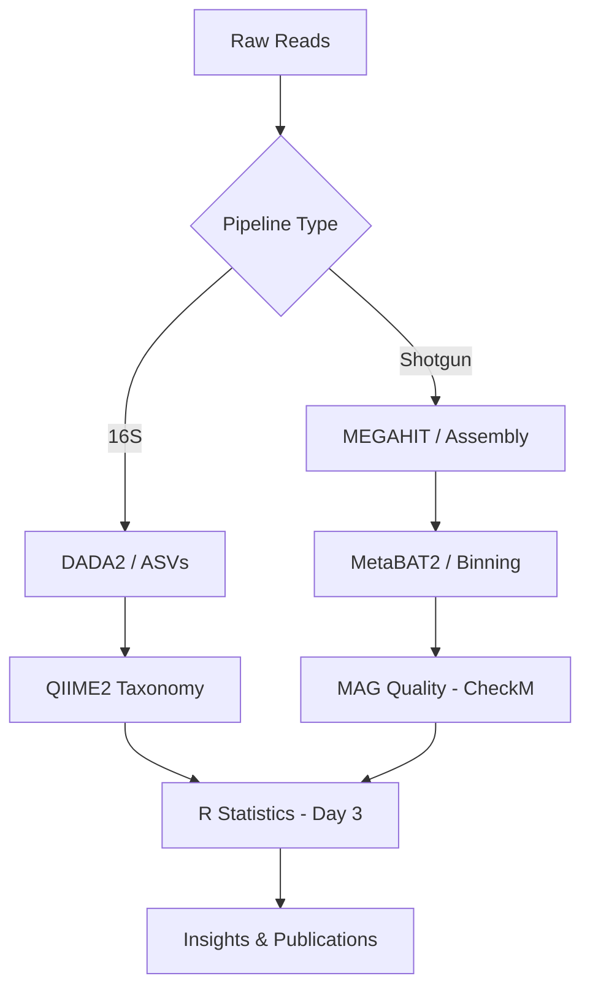

# National Workshop on Computational Metagenomics

Welcome to the unofficial repository for the **National Workshop on Computational Metagenomics: Methods and Applications**, hosted by **NPTEL+ | IIT Madras** (April 7th - 9th, 2026).

This repository contains all the instructional materials, pipelines, and statistical analysis workflows developed for the workshop.

## 📋 Table of Contents

- [Overview](#overview)
- [Workshop Schedule](#workshop-schedule)
- [Curriculum & Modules](#curriculum--modules)
- [Getting Started](#getting-started)
- [Key Technical Concepts](#key-technical-concepts)
- [Bioinformatics Pipeline](#bioinformatics-pipeline)
- [Contributing](#contributing)
- [License](#license)

## 🌟 Overview

This workshop provides a comprehensive introduction to metagenomics, covering both **16S Amplicon** and **Whole Genome Shotgun (WGS)** sequencing pipelines. The curriculum scales from basic Linux command-line operations to advanced binning of Metagenome-Assembled Genomes (MAGs) and complex statistical modeling.

**Instructors:**
- Prof. Karthik Raman
- Dr. Aarti Ravindran
- Dr. Pratyay Sengupta

## 🗓️ Workshop Schedule

| Day | Focus | Description |
|-----|-------|-------------|
| **Day 1** | Foundations & 16S | Linux basics, QIIME2, DADA2, and ASV-based pipelines. |
| **Day 2** | Shotgun Metagenomics | MEGAHIT assembly, MetaBAT2 binning, and MAG quality assessment. |
| **Day 3** | Statistical Analysis | Compositional data, Alpha/Beta diversity, and DESeq2 modeling. |

## 📚 Curriculum & Modules

- **[Master Guide & Setup](00_Workshop_Overview_and_Setup.md):** Detailed environment configuration (WSL2, Conda).
- **[Day 1: 16S Amplicon](Day1_Foundations_and_16S_Amplicon.md):** From raw reads to ASV tables and taxonomic profiling.
- **[Day 2: Shotgun Metagenomics](Day2_Shotgun_Metagenomics.md):** Assembly, binning, and functional annotation.
- **[Day 3: Statistics](Day3_Statistical_Analysis.md):** Advanced R-based statistical analysis and visualization.
- **[Commands CheatSheet](Commands_CheatSheet.md):** A library of one-liner commands for rapid workflow execution.
- **[Glossary & References](Glossary_and_References.md):** Key terms and landmark scientific literature.

## 🚀 Getting Started

### Prerequisites

- **OS:** Windows 10/11 with WSL2 (Ubuntu 22.04 recommended) or native Linux.
- **Environment Manager:** Conda or Mamba.

### Installation

1. Clone the repository:
   ```bash
   git clone https://github.com/[USER]/computational-metagenomics.git
   cd computational-metagenomics
   ```

2. Create the environment:
   ```bash
   conda env create -f tbdelay-environment.yml
   conda activate metagenomics-workshop
   ```

## 🛠️ Key Technical Concepts

- **Amplicon Sequencing:** Focus on **ASVs (Amplicon Sequence Variants)** using DADA2 for higher resolution compared to traditional OTUs.
- **MAG Recovery:** Integration of **MEGAHIT** for assembly and **MetaBAT2/MaxBin2** for binning, validated via **CheckM** and **GTDB-Tk**.
- **Compositional Statistics:** Addressing the "closed-sum" constraint in omics data using **Centered Log-Ratio (CLR)** transformations.

## 📊 Bioinformatics Pipeline



## 🤝 Contributing

Contributions to improve the tutorials or scripts are welcome. Please refer to [TODO.md](TODO.md) for current development priorities.

## 📄 License

This project is licensed under the MIT License - see the LICENSE file for details.

---

> [!NOTE]
> This content was specifically curated for the 2026 NPTEL+ Workshop. All scripts and commands are vetted for standard bioinformatics environments.
